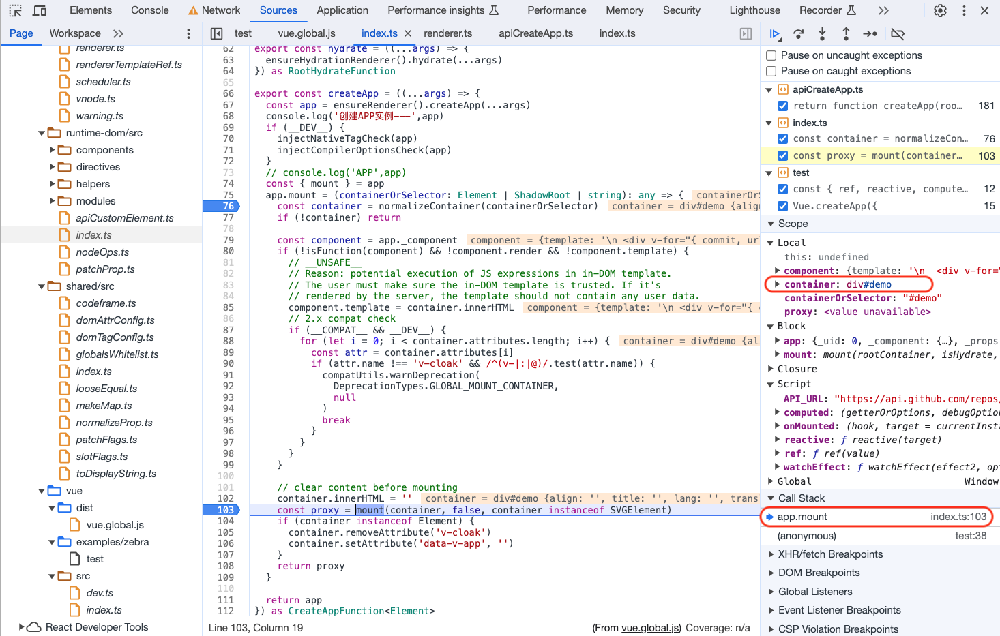
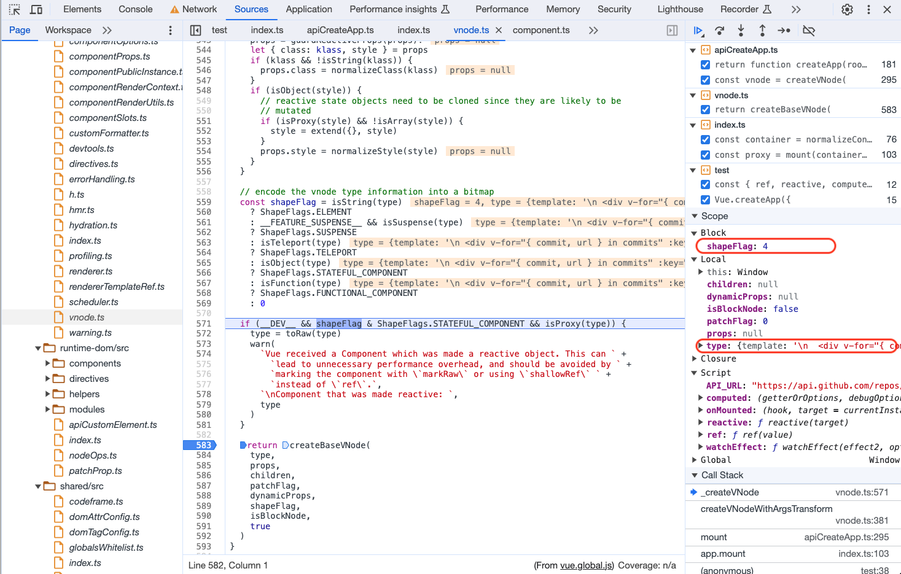
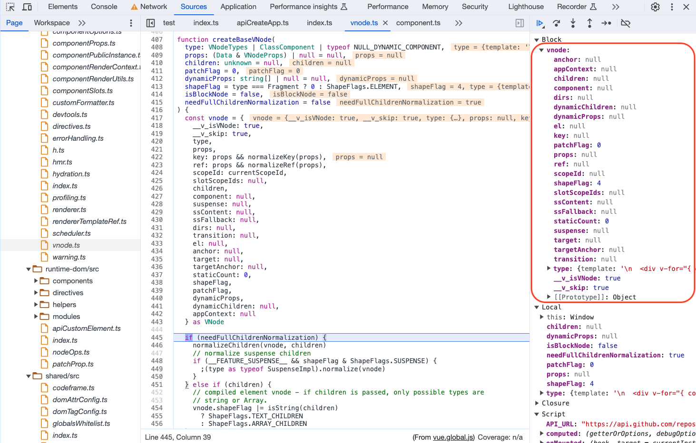
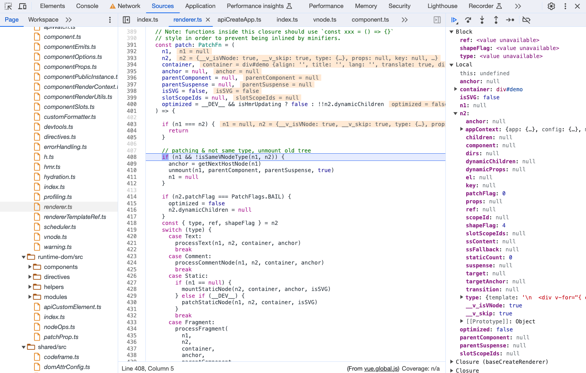
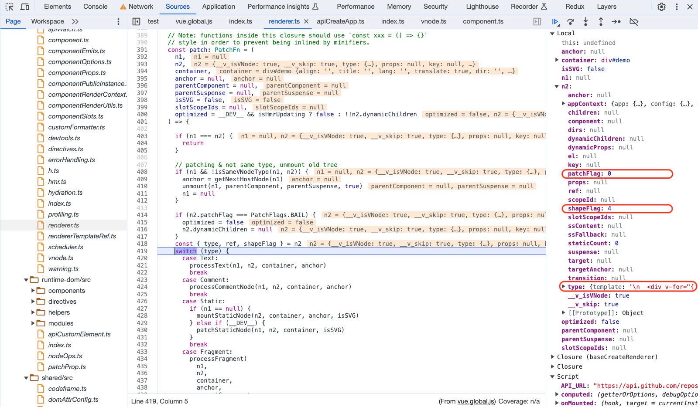
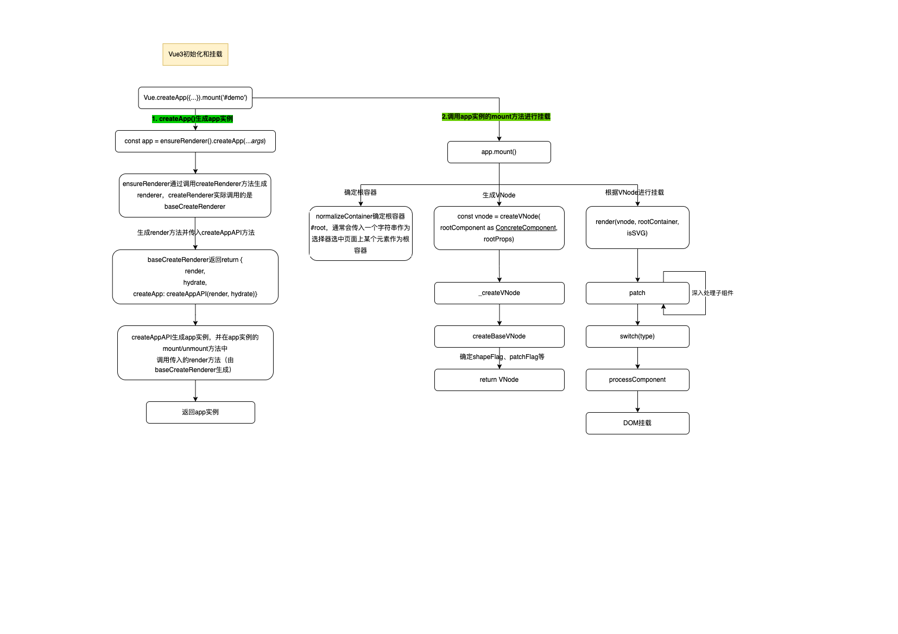

# `Vue3` 的初始化过程和挂载过程

## 关键方法

- `createApp`
- `ensureRenderer`
- `baseCreateRenderer`
- `createAppAPI`
- `mount`
- `render`
- `createBaseVNode`

## Vue 初始化

我们来分析一下首次渲染的过程，首先，在`Vue3`中，我们初始化`Vue`实例通常是调用 `Vue.createApp` 方法写出如下的代码：

```html
<div id="demo">
  <div v-for="{ commit, url } in commits" :key="commit">
    <span :id="commit.author">{{ commit.author.date }}</span>
    ---
    <span @click="handleClick()">{{ url }}</span>
  </div>
</div>
```

```js
const API_URL = `https://api.github.com/repos/vuejs/core/commits?per_page=3&sha=`

Vue.createApp({
  data: () => ({
    branches: ['main', 'v2-compat'],
    currentBranch: 'main',
    commits: null
  }),
  created() {
    this.fetchData()
  },
  watch: {
    currentBranch: 'fetchData'
  },
  methods: {
    fetchData() {
      fetch(`${API_URL}${this.currentBranch}`)
        .then(res => res.json())
        .then(data => {
          this.commits = data
        })
    },
    truncate(v) {
      const newline = v.indexOf('\n')
      return newline > 0 ? v.slice(0, newline) : v
    },
    formatDate(v) {
      return v.replace(/T|Z/g, ' ')
    }
  }
}).mount('#demo')
```

## 生成app实例过程

首先来看 `createApp` 方法，其中的关键在`ensureRenderer().createApp(...args)`，传入 `options` 会创建一个APP实例并调用 `mount` 方法，`app` 实例包含 `use`、`mixin`、`component`、`directive`、`mount`、`unmount`、`provide` 等方法，`mount` 方法的第一个参数作为根元素：

```ts
// 【/packages/runtime-core/src/apiCreateApp.ts】
export const createApp = ((...args) => {
  //【ensureRenderer返回render和createApp方法，生成app实例】
  const app = ensureRenderer().createApp(...args)

  if (__DEV__) {
    injectNativeTagCheck(app)
    injectCompilerOptionsCheck(app)
  }
  //【先把mount方法缓存下来，同vue2.0】
  const { mount } = app 
  // 【重写mount方法，针对浏览器渲染进行具体的处理，比如寻找根节点（根容器）然后再调用缓存的mount方法进行挂载】
  app.mount = (containerOrSelector: Element | ShadowRoot | string): any => {
    const container = normalizeContainer(containerOrSelector)
    if (!container) return

    const component = app._component
    if (!isFunction(component) && !component.render && !component.template) {
      // __UNSAFE__
      // Reason: potential execution of JS expressions in in-DOM template.
      // The user must make sure the in-DOM template is trusted. If it's
      // rendered by the server, the template should not contain any user data.
      component.template = container.innerHTML
      // 2.x compat check
      if (__COMPAT__ && __DEV__) {
        for (let i = 0; i < container.attributes.length; i++) {
          const attr = container.attributes[i]
          if (attr.name !== 'v-cloak' && /^(v-|:|@)/.test(attr.name)) {
            compatUtils.warnDeprecation(
              DeprecationTypes.GLOBAL_MOUNT_CONTAINER,
              null
            )
            break
          }
        }
      }
    }

    // clear content before mounting
    container.innerHTML = ''
    // 【调用缓存的mount方法】
    const proxy = mount(container, false, container instanceof SVGElement)
    if (container instanceof Element) {
      container.removeAttribute('v-cloak')
      container.setAttribute('data-v-app', '')
    }
    return proxy
  }

  return app
}) as CreateAppFunction<Element>
```

`mount` 方法中传入的 `container` 经过 `normalizeContainer` 方法处理如下：

```ts
function normalizeContainer(
  container: Element | ShadowRoot | string
): Element | null {
  //【如果是字符串，作为选择器获取到dom元素】
  if (isString(container)) {
    const res = document.querySelector(container)
    if (__DEV__ && !res) {
      warn(
        `Failed to mount app: mount target selector "${container}" returned null.`
      )
    }
    return res
  }
  if (
    __DEV__ &&
    window.ShadowRoot &&
    container instanceof window.ShadowRoot &&
    container.mode === 'closed'
  ) {
    warn(
      `mounting on a ShadowRoot with \`{mode: "closed"}\` may lead to unpredictable bugs`
    )
  }
  return container as any
}
```

**`ensureRenderer`** 其实最终调用的是 `baseCreateRenderer` 方法返回一个对象包含了 `render` 和 `createApp`方法，`createApp` 其实就是 `createAppAPI` 传入 `render` 方法，所以调用 `ensureRenderer().createApp(...args)` 最终返回的是一个`app`实例：

```ts
// 【packages/runtime-core/src/renderer.ts】
const render: RootRenderFunction = (vnode, container, isSVG) => {
  if (vnode == null) {
    if (container._vnode) {
      unmount(container._vnode, null, null, true)
    }
  } else {
    patch(container._vnode || null, vnode, container, null, null, null, isSVG)
  }
  flushPreFlushCbs()
  flushPostFlushCbs()
  container._vnode = vnode
}

return {
    render,
    hydrate,
    createApp: createAppAPI(render, hydrate)
}
```

**`createApp`** 其实就是 `createAppAPI` 传入 `render` 方法，这样我们继续来看一下 `createAppAPI` 方法定义如下，生成 `app` 实例包含 `use`、`mixin`、`component`、`directive`、`mount`、`unmount`、`provide` 等方法，传入的 `render` 方法会在 `mount` / `unmount` 方法中调用：

```ts
// 【packages/runtime-core/src/apiCreateApp.ts】
export function createAppAPI<HostElement>(
  render: RootRenderFunction<HostElement>,
  hydrate?: RootHydrateFunction
): CreateAppFunction<HostElement> {
  return function createApp(rootComponent, rootProps = null) {
    if (!isFunction(rootComponent)) {
      rootComponent = { ...rootComponent }
    }

    if (rootProps != null && !isObject(rootProps)) {
      __DEV__ && warn(`root props passed to app.mount() must be an object.`)
      rootProps = null
    }

    const context = createAppContext()
    const installedPlugins = new Set()

    let isMounted = false
    //【生成根app实例，包含_uid_component等属性还有use、mixin、component、directive、mount、unmount、provide方法】
    const app: App = (context.app = {
      _uid: uid++,//uid递增，由父到子
      _component: rootComponent as ConcreteComponent,
      _props: rootProps,
      _container: null,
      _context: context,
      _instance: null,

      version,

      //【应用实例获取config属性其实是获取context.config】
      get config() {
        return context.config
      },

      set config(v) {
        if (__DEV__) {
          warn(
            `app.config cannot be replaced. Modify individual options instead.`
          )
        }
      },

      use(plugin: Plugin, ...options: any[]) {
        if (installedPlugins.has(plugin)) {
          __DEV__ && warn(`Plugin has already been applied to target app.`)
        } else if (plugin && isFunction(plugin.install)) {
          installedPlugins.add(plugin)
          plugin.install(app, ...options)
        } else if (isFunction(plugin)) {
          installedPlugins.add(plugin)
          plugin(app, ...options)
        } else if (__DEV__) {
          warn(
            `A plugin must either be a function or an object with an "install" ` +
              `function.`
          )
        }
        return app
      },

      mixin(mixin: ComponentOptions) {
        if (__FEATURE_OPTIONS_API__) {
          if (!context.mixins.includes(mixin)) {
            context.mixins.push(mixin)
          } else if (__DEV__) {
            warn(
              'Mixin has already been applied to target app' +
                (mixin.name ? `: ${mixin.name}` : '')
            )
          }
        } else if (__DEV__) {
          warn('Mixins are only available in builds supporting Options API')
        }
        return app
      },

      component(name: string, component?: Component): any {
        if (__DEV__) {
          validateComponentName(name, context.config)
        }
        if (!component) {
          return context.components[name]
        }
        if (__DEV__ && context.components[name]) {
          warn(`Component "${name}" has already been registered in target app.`)
        }
        context.components[name] = component
        return app
      },

      directive(name: string, directive?: Directive) {
        if (__DEV__) {
          validateDirectiveName(name)
        }

        if (!directive) {
          return context.directives[name] as any
        }
        if (__DEV__ && context.directives[name]) {
          warn(`Directive "${name}" has already been registered in target app.`)
        }
        context.directives[name] = directive
        return app
      },

      mount(
        rootContainer: HostElement,
        isHydrate?: boolean,
        isSVG?: boolean
      ): any {
        if (!isMounted) {
          // #5571
          if (__DEV__ && (rootContainer as any).__vue_app__) {
            warn(
              `There is already an app instance mounted on the host container.\n` +
                ` If you want to mount another app on the same host container,` +
                ` you need to unmount the previous app by calling \`app.unmount()\` first.`
            )
          }
          //【1.创建VNode】
          const vnode = createVNode(
            rootComponent as ConcreteComponent,
            rootProps
          )
          // store app context on the root VNode.
          // this will be set on the root instance on initial mount.
          vnode.appContext = context

          // HMR root reload
          if (__DEV__) {
            context.reload = () => {
              render(cloneVNode(vnode), rootContainer, isSVG)
            }
          }

          if (isHydrate && hydrate) {
            hydrate(vnode as VNode<Node, Element>, rootContainer as any)
          } else {
            //【2.挂载DOM】
            render(vnode, rootContainer, isSVG)
          }
          isMounted = true
          app._container = rootContainer
          // for devtools and telemetry
          ;(rootContainer as any).__vue_app__ = app

          if (__DEV__ || __FEATURE_PROD_DEVTOOLS__) {
            app._instance = vnode.component
            devtoolsInitApp(app, version)
          }

          return getExposeProxy(vnode.component!) || vnode.component!.proxy
        } else if (__DEV__) {
          warn(
            `App has already been mounted.\n` +
              `If you want to remount the same app, move your app creation logic ` +
              `into a factory function and create fresh app instances for each ` +
              `mount - e.g. \`const createMyApp = () => createApp(App)\``
          )
        }
      },

      unmount() {
        if (isMounted) {
          //【卸载DOM】
          render(null, app._container)
          if (__DEV__ || __FEATURE_PROD_DEVTOOLS__) {
            app._instance = null
            devtoolsUnmountApp(app)
          }
          delete app._container.__vue_app__
        } else if (__DEV__) {
          warn(`Cannot unmount an app that is not mounted.`)
        }
      },

      provide(key, value) {
        if (__DEV__ && (key as string | symbol) in context.provides) {
          warn(
            `App already provides property with key "${String(key)}". ` +
              `It will be overwritten with the new value.`
          )
        }

        context.provides[key as string | symbol] = value

        return app
      }
    })

    if (__COMPAT__) {
      installAppCompatProperties(app, context, render)
    }

    return app
  }
}

export function createAppContext(): AppContext {
  return {
    app: null as any,
    config: {
      isNativeTag: NO,
      performance: false,
      globalProperties: {},
      optionMergeStrategies: {},
      errorHandler: undefined,
      warnHandler: undefined,
      compilerOptions: {}
    },
    mixins: [],
    components: {},
    directives: {},
    provides: Object.create(null),
    optionsCache: new WeakMap(),
    propsCache: new WeakMap(),
    emitsCache: new WeakMap()
  }
}
```

由以上分析可知：开发者写的`Vue.createApp({...}).mount('#demo')`实际上就是生成了一个`app`实例，并且调用`app`实例的`mount`方法进行挂载。




## 挂载过程 生成VNode调用render去操作DOM挂载

然后我们接着去看 `mount` 方法，在 `mount` 方法中会调用 `createVNode` 创建根实例的 `VNode`， `VNode` 传入 `render` 方法进行渲染解析挂载：

```ts
// 【/packages/runtime-core/src/apiCreateApp.ts】
//【先把mount方法缓存下来，同vue2.0】
const { mount } = app 
// 【重写mount方法，针对浏览器渲染进行具体的处理，比如寻找根节点（根容器）然后再调用缓存的mount方法进行挂载】
app.mount = (containerOrSelector: Element | ShadowRoot | string): any => {
  const container = normalizeContainer(containerOrSelector)
  if (!container) return

  const component = app._component
  if (!isFunction(component) && !component.render && !component.template) {
    // __UNSAFE__
    // Reason: potential execution of JS expressions in in-DOM template.
    // The user must make sure the in-DOM template is trusted. If it's
    // rendered by the server, the template should not contain any user data.
    component.template = container.innerHTML
    // 2.x compat check
    if (__COMPAT__ && __DEV__) {
      for (let i = 0; i < container.attributes.length; i++) {
        const attr = container.attributes[i]
        if (attr.name !== 'v-cloak' && /^(v-|:|@)/.test(attr.name)) {
          compatUtils.warnDeprecation(
            DeprecationTypes.GLOBAL_MOUNT_CONTAINER,
            null
          )
          break
        }
      }
    }
  }
  // 【挂载之前先清空根容器中的内容】
  // clear content before mounting
  container.innerHTML = ''
  // 【调用缓存的mount方法】
  const proxy = mount(container, false, container instanceof SVGElement)
  if (container instanceof Element) {
    container.removeAttribute('v-cloak')
    container.setAttribute('data-v-app', '')
  }
  return proxy
}

// 【缓存的mount方法如下】
mount(
    rootContainer: HostElement,
    isHydrate?: boolean,
    isSVG?: boolean
): any {
    if (!isMounted) {
        // #5571
        if (__DEV__ && (rootContainer as any).__vue_app__) {
            warn(
                `There is already an app instance mounted on the host container.\n` +
                ` If you want to mount another app on the same host container,` +
                ` you need to unmount the previous app by calling \`app.unmount()\` first.`
            )
        }
        //【1. 生成VNode】
        const vnode = createVNode(
            rootComponent as ConcreteComponent,
            rootProps
        )
        // store app context on the root VNode.
        // this will be set on the root instance on initial mount.
        vnode.appContext = context

        // HMR root reload
        if (__DEV__) {
            context.reload = () => {
                render(cloneVNode(vnode), rootContainer, isSVG)
            }
        }

        if (isHydrate && hydrate) {
            hydrate(vnode as VNode<Node, Element>, rootContainer as any)
        } else {
            // 【2. 根据VNode和根容器进行DOM挂载】
            render(vnode, rootContainer, isSVG)
        }
        // 【render调用完毕，已经完成挂载，isMounted设为true】
        isMounted = true
        app._container = rootContainer  //根元素
        // for devtools and telemetry
        ;(rootContainer as any).__vue_app__ = app

        if (__DEV__ || __FEATURE_PROD_DEVTOOLS__) {
            app._instance = vnode.component
            devtoolsInitApp(app, version)
        }

        return getExposeProxy(vnode.component!) || vnode.component!.proxy
    } else if (__DEV__) {
        warn(
        `App has already been mounted.\n` +
            `If you want to remount the same app, move your app creation logic ` +
            `into a factory function and create fresh app instances for each ` +
            `mount - e.g. \`const createMyApp = () => createApp(App)\``
        )
    }
},
```

### 生成VNode过程

首先为根容器生成`VNode`，`patchFlag`为0，`shapeFlag`为4：

```ts
//【1. 生成VNode】
const vnode = createVNode(
    rootComponent as ConcreteComponent,
    rootProps
)
```

`createVNode` 方法具体实现是调用 `_createVNode` 方法，这一步确定 `shapeFlag`、`patchFlag` 等，如果有 `children` 则 `normailize`：

```ts
// 【packages/runtime-core/src/vnode.ts】
function _createVNode(
  type: VNodeTypes | ClassComponent | typeof NULL_DYNAMIC_COMPONENT,
  props: (Data & VNodeProps) | null = null,
  children: unknown = null,
  patchFlag: number = 0,
  dynamicProps: string[] | null = null,
  isBlockNode = false
): VNode {
  if (!type || type === NULL_DYNAMIC_COMPONENT) {
    if (__DEV__ && !type) {
      warn(`Invalid vnode type when creating vnode: ${type}.`)
    }
    type = Comment
  }
  // 【type分情况】
  if (isVNode(type)) {
    // createVNode receiving an existing vnode. This happens in cases like
    // <component :is="vnode"/>
    // #2078 make sure to merge refs during the clone instead of overwriting it
    const cloned = cloneVNode(type, props, true /* mergeRef: true */)
    if (children) {
      normalizeChildren(cloned, children)
    }
    if (isBlockTreeEnabled > 0 && !isBlockNode && currentBlock) {
      if (cloned.shapeFlag & ShapeFlags.COMPONENT) {
        currentBlock[currentBlock.indexOf(type)] = cloned
      } else {
        currentBlock.push(cloned)
      }
    }
    cloned.patchFlag |= PatchFlags.BAIL
    return cloned
  }

  // class component normalization.
  if (isClassComponent(type)) {
    type = type.__vccOpts
  }

  // 2.x async/functional component compat
  if (__COMPAT__) {
    type = convertLegacyComponent(type, currentRenderingInstance)
  }

  // class & style normalization.
  if (props) {
    // for reactive or proxy objects, we need to clone it to enable mutation.
    props = guardReactiveProps(props)!
    let { class: klass, style } = props
    if (klass && !isString(klass)) {
      props.class = normalizeClass(klass)
    }
    if (isObject(style)) {
      // reactive state objects need to be cloned since they are likely to be
      // mutated
      if (isProxy(style) && !isArray(style)) {
        style = extend({}, style)
      }
      props.style = normalizeStyle(style)
    }
  }
  // 【判断当前内容是何shapeFlag，我们的例子中传的是type:{template:'...'}，所以shapeFlag是4也就是STATEFUL_COMPONENT】
  // 【type可能性其实有很多种，可能是DOM可能是对象可能是函数，从而分为不同的shapeFlag】
  // encode the vnode type information into a bitmap
  const shapeFlag = isString(type)
    ? ShapeFlags.ELEMENT
    : __FEATURE_SUSPENSE__ && isSuspense(type)
    ? ShapeFlags.SUSPENSE
    : isTeleport(type)
    ? ShapeFlags.TELEPORT
    : isObject(type)
    ? ShapeFlags.STATEFUL_COMPONENT
    : isFunction(type)
    ? ShapeFlags.FUNCTIONAL_COMPONENT
    : 0

  if (__DEV__ && shapeFlag & ShapeFlags.STATEFUL_COMPONENT && isProxy(type)) {
    type = toRaw(type)
    warn(
      `Vue received a Component which was made a reactive object. This can ` +
        `lead to unnecessary performance overhead, and should be avoided by ` +
        `marking the component with \`markRaw\` or using \`shallowRef\` ` +
        `instead of \`ref\`.`,
      `\nComponent that was made reactive: `,
      type
    )
  }

  return createBaseVNode(
    type,
    props,
    children,
    patchFlag,
    dynamicProps,
    shapeFlag,
    isBlockNode,
    true
  )
}
```



可以看到最后返回的是 `createBaseVNode` 如下，`Vue3`构造`VNode` 和`Vue2`并不太一样，增加了 `type`、`patchFlag`、`shapeFlag` 等字段用于后续的`patch`方法优化，同样也会规范化子节点，然后我们可以在源码中看到这样一段注释 presence of a patch flag indicates this node needs patching on updates，说明`patchFlag`用于判断这个 `VNode` 在后续的 `update` 过程中是否需要 `patch` 或者如何去 `patch`，这是`Vue3`在`Vue2`基础上的一个优化点，这是我们首次渲染根实例，`patchFlag` 使用的是默认值0，`shapeFlag` 是 `ShapeFlags.ELEMENT`：

```ts
// 【packages/runtime-core/src/vnode.ts】
function createBaseVNode(
  type: VNodeTypes | ClassComponent | typeof NULL_DYNAMIC_COMPONENT,
  props: (Data & VNodeProps) | null = null,
  children: unknown = null,
  patchFlag = 0,
  dynamicProps: string[] | null = null,
  shapeFlag = type === Fragment ? 0 : ShapeFlags.ELEMENT,
  isBlockNode = false,
  needFullChildrenNormalization = false
) {
  const vnode = {
    __v_isVNode: true,
    __v_skip: true,
    type,
    props,
    key: props && normalizeKey(props),
    ref: props && normalizeRef(props),
    scopeId: currentScopeId,
    slotScopeIds: null,
    children,
    component: null,
    suspense: null,
    ssContent: null,
    ssFallback: null,
    dirs: null,
    transition: null,
    el: null,
    anchor: null,
    target: null,
    targetAnchor: null,
    staticCount: 0,
    shapeFlag,
    patchFlag,
    dynamicProps,
    dynamicChildren: null,
    appContext: null
  } as VNode

  if (needFullChildrenNormalization) {
    normalizeChildren(vnode, children)
    // normalize suspense children
    if (__FEATURE_SUSPENSE__ && shapeFlag & ShapeFlags.SUSPENSE) {
      ;(type as typeof SuspenseImpl).normalize(vnode)
    }
  } else if (children) {
    // compiled element vnode - if children is passed, only possible types are
    // string or Array.
    vnode.shapeFlag |= isString(children)
      ? ShapeFlags.TEXT_CHILDREN
      : ShapeFlags.ARRAY_CHILDREN
  }

  // validate key
  if (__DEV__ && vnode.key !== vnode.key) {
    warn(`VNode created with invalid key (NaN). VNode type:`, vnode.type)
  }

  // track vnode for block tree
  if (
    isBlockTreeEnabled > 0 &&
    // avoid a block node from tracking itself
    !isBlockNode &&
    // has current parent block
    currentBlock &&
    // presence of a patch flag indicates this node needs patching on updates.
    // component nodes also should always be patched, because even if the
    // component doesn't need to update, it needs to persist the instance on to
    // the next vnode so that it can be properly unmounted later.
    (vnode.patchFlag > 0 || shapeFlag & ShapeFlags.COMPONENT) &&
    // the EVENTS flag is only for hydration and if it is the only flag, the
    // vnode should not be considered dynamic due to handler caching.
    vnode.patchFlag !== PatchFlags.HYDRATE_EVENTS
  ) {
    currentBlock.push(vnode)
  }

  if (__COMPAT__) {
    convertLegacyVModelProps(vnode)
    defineLegacyVNodeProperties(vnode)
  }

  return vnode
}
```

<!-- 【TODO：看一下normalizeChildren方法】 -->

这一步通过最终调用`createBaseVNode`方法返回根实例对应的`VNode`，以供后续挂载使用。



### 挂载到根元素过程

下一步就是调用`render`方法进行内容的`VNode`挂载：

```ts
// 【2. 根据VNode和根容器进行DOM挂载】
render(vnode, rootContainer, isSVG)
```

然后我们接着去看 `render` 方法，可以看到入参有3个参数，分别是`VNode`、根元素、isSvg，可以看到其中还有一个判断条件`VNode`是否为null，是的话调用 `unmount` 方法卸载掉内容，否则就执行 `patch` 方法：

```ts
// 【packages/runtime-core/src/renderer.ts】
const render: RootRenderFunction = (vnode, container, isSVG) => {
  if (vnode == null) {
    if (container._vnode) {
      unmount(container._vnode, null, null, true)
    }
  } else {
    patch(container._vnode || null, vnode, container, null, null, null, isSVG)
  }
  flushPreFlushCbs()
  flushPostFlushCbs()
  container._vnode = vnode
}
```



其实`render`方法的核心就是`patch`方法，下一步我们走进 `patch` 方法：

1. 首先n1存在的情况下`isSameVNodeType`判断两个`VNode`节点是否相同，不同直接把`old VNode`的内容给`unmount`；
2. `n2.patchFlag === PatchFlags.BAIL`判断`new VNode`的`patchFlag`是否为`BAIL`类型，是则`optimize`设为`false`，后续要进行`full patch`；
3. 可以看到根据`n2`的`type`不同`switch`语句走了不同的分支，调用了不同的方法；

可以看一下其中一个比较简单的例子，在`case 'Static'`，再根据`old VNode`是否存在，如果不存在，直接调用`mountStaticNode`插入`n2`的静态内容，如果存在则调用`patchStaticNode`对比新旧静态节点。

可以看到在 `patch` 这块`Vue3`和`Vue2`并不太一样，在构造`VNode`时候的 `type`、`patchFlag`、`shapeFlag` 都是用于优化 `patch` 过程的，不同类型的`VNode`有不同的对比方法。`patch` 方法如下：

```ts
// 【packages/runtime-core/src/renderer.ts】
const patch: PatchFn = (
    n1,
    n2,
    container,
    anchor = null,
    parentComponent = null,
    parentSuspense = null,
    isSVG = false,
    slotScopeIds = null,
    optimized = __DEV__ && isHmrUpdating ? false : !!n2.dynamicChildren
  ) => {
    if (n1 === n2) {
      return
    }

    // patching & not same type, unmount old tree
    // 【n1，n2的type不同直接卸载旧节点挂载新节点】
    if (n1 && !isSameVNodeType(n1, n2)) {
      anchor = getNextHostNode(n1)
      unmount(n1, parentComponent, parentSuspense, true)
      n1 = null
    }

    // 【n2的patchFlag若是BAIL则后续进行full patch不走优化流程】
    if (n2.patchFlag === PatchFlags.BAIL) {
      optimized = false
      n2.dynamicChildren = null
    }

    const { type, ref, shapeFlag } = n2
    // 【根据新VNode也就是n2的type走进不同的分支进行处理】
    switch (type) {
      case Text:
        processText(n1, n2, container, anchor)
        break
      case Comment:
        processCommentNode(n1, n2, container, anchor)
        break
      case Static:
        if (n1 == null) {
          mountStaticNode(n2, container, anchor, isSVG)
        } else if (__DEV__) {
          patchStaticNode(n1, n2, container, isSVG)
        }
        break
      case Fragment:
        processFragment(
          n1,
          n2,
          container,
          anchor,
          parentComponent,
          parentSuspense,
          isSVG,
          slotScopeIds,
          optimized
        )
        break
      default:
        if (shapeFlag & ShapeFlags.ELEMENT) {
          processElement(
            n1,
            n2,
            container,
            anchor,
            parentComponent,
            parentSuspense,
            isSVG,
            slotScopeIds,
            optimized
          )
        } else if (shapeFlag & ShapeFlags.COMPONENT) {
          processComponent(
            n1,
            n2,
            container,
            anchor,
            parentComponent,
            parentSuspense,
            isSVG,
            slotScopeIds,
            optimized
          )
        } else if (shapeFlag & ShapeFlags.TELEPORT) {
          ;(type as typeof TeleportImpl).process(
            n1 as TeleportVNode,
            n2 as TeleportVNode,
            container,
            anchor,
            parentComponent,
            parentSuspense,
            isSVG,
            slotScopeIds,
            optimized,
            internals
          )
        } else if (__FEATURE_SUSPENSE__ && shapeFlag & ShapeFlags.SUSPENSE) {
          ;(type as typeof SuspenseImpl).process(
            n1,
            n2,
            container,
            anchor,
            parentComponent,
            parentSuspense,
            isSVG,
            slotScopeIds,
            optimized,
            internals
          )
        } else if (__DEV__) {
          warn('Invalid VNode type:', type, `(${typeof type})`)
        }
    }

    // set ref
    if (ref != null && parentComponent) {
      setRef(ref, n1 && n1.ref, parentSuspense, n2 || n1, !n2)
    }
}
// export const PatchFlagNames = {
//   [PatchFlags.TEXT]: `TEXT`,
//   [PatchFlags.CLASS]: `CLASS`,
//   [PatchFlags.STYLE]: `STYLE`,
//   [PatchFlags.PROPS]: `PROPS`,
//   [PatchFlags.FULL_PROPS]: `FULL_PROPS`,
//   [PatchFlags.HYDRATE_EVENTS]: `HYDRATE_EVENTS`,
//   [PatchFlags.STABLE_FRAGMENT]: `STABLE_FRAGMENT`,
//   [PatchFlags.KEYED_FRAGMENT]: `KEYED_FRAGMENT`,
//   [PatchFlags.UNKEYED_FRAGMENT]: `UNKEYED_FRAGMENT`,
//   [PatchFlags.NEED_PATCH]: `NEED_PATCH`,
//   [PatchFlags.DYNAMIC_SLOTS]: `DYNAMIC_SLOTS`,
//   [PatchFlags.DEV_ROOT_FRAGMENT]: `DEV_ROOT_FRAGMENT`,
//   [PatchFlags.HOISTED]: `HOISTED`,
//   [PatchFlags.BAIL]: `BAIL`
// }

```



然后根据前文我们知道当前`app`实例对应`VNode`的`shapeFlag`是4也就是`STATEFUL_COMPONENT`。当前挂载根组件我们走进的是`processComponent`方法，这个分支，由于是首次渲染所以`n1`为null，所以直接进入`mountComponent`方法，最终会进一步解析包裹的内容生成DOM并渲染：

```ts
// 【packages/runtime-core/src/renderer.ts】
// 【组件首次挂载or更新走 mountComponent or updateComponent】
const processComponent = (
  n1: VNode | null,
  n2: VNode,
  container: RendererElement,
  anchor: RendererNode | null,
  parentComponent: ComponentInternalInstance | null,
  parentSuspense: SuspenseBoundary | null,
  isSVG: boolean,
  slotScopeIds: string[] | null,
  optimized: boolean
) => {
  n2.slotScopeIds = slotScopeIds
  if (n1 == null) {
    if (n2.shapeFlag & ShapeFlags.COMPONENT_KEPT_ALIVE) {
      ;(parentComponent!.ctx as KeepAliveContext).activate(
        n2,
        container,
        anchor,
        isSVG,
        optimized
      )
    } else {
      mountComponent(
        n2,
        container,
        anchor,
        parentComponent,
        parentSuspense,
        isSVG,
        optimized
      )
    }
  } else {
    updateComponent(n1, n2, optimized)
  }
}


const mountComponent: MountComponentFn = (
    initialVNode,
    container,
    anchor,
    parentComponent,
    parentSuspense,
    isSVG,
    optimized
  ) => {
    // 【1.创建组件实例instance】
    // 2.x compat may pre-create the component instance before actually
    // mounting
    const compatMountInstance =
      __COMPAT__ && initialVNode.isCompatRoot && initialVNode.component
    const instance: ComponentInternalInstance =
      compatMountInstance ||
      (initialVNode.component = createComponentInstance(
        initialVNode,
        parentComponent,
        parentSuspense
      ))

    if (__DEV__ && instance.type.__hmrId) {
      registerHMR(instance)
    }

    if (__DEV__) {
      pushWarningContext(initialVNode)
      startMeasure(instance, `mount`)
    }

    // inject renderer internals for keepAlive
    if (isKeepAlive(initialVNode)) {
      ;(instance.ctx as KeepAliveContext).renderer = internals
    }

    // 【2.调用setupComponent进行一些初始化工作】
    // resolve props and slots for setup context
    if (!(__COMPAT__ && compatMountInstance)) {
      if (__DEV__) {
        startMeasure(instance, `init`)
      }
      setupComponent(instance)
      if (__DEV__) {
        endMeasure(instance, `init`)
      }
    }

    // setup() is async. This component relies on async logic to be resolved
    // before proceeding
    if (__FEATURE_SUSPENSE__ && instance.asyncDep) {
      parentSuspense && parentSuspense.registerDep(instance, setupRenderEffect)

      // Give it a placeholder if this is not hydration
      // TODO handle self-defined fallback
      if (!initialVNode.el) {
        const placeholder = (instance.subTree = createVNode(Comment))
        processCommentNode(null, placeholder, container!, anchor)
      }
      return
    }

    // 【3.构造组件对应的renderEffect】
    setupRenderEffect(
      instance,
      initialVNode,
      container,
      anchor,
      parentSuspense,
      isSVG,
      optimized
    )

    if (__DEV__) {
      popWarningContext()
      endMeasure(instance, `mount`)
    }
  }
```

`patch`的过程是由上到下递进的过程，由`createApp()`生成的`app`实例本身可以理解为“根组件”，其余内容都包裹其中，`app`实例会包裹有开发人员写的子组件，一步步通过`patch`解析生成`VNode`并生成`DOM`去渲染。

## 总结


