# Vue3 组件化

编写一个组件实际上是编写一个 `JavaScript` 对象，对象的描述就是各种配置。

```js
// 注册一个选项对象
app.component('my-component', {
  /* ... */
})

// 得到一个已注册的组件
const MyComponent = app.component('my-component')
```

## 关键方法

- `createVNode`
- `_createVNode`
- `createBaseVNode`
- `render`
- `patch`
- `mountComponent`
- `updateComponent`
- `createComponentInstance`
- `setupComponent`
- `setupRenderEffect`
- `renderComponentRoot`
- `new ReactiveEffect`
- `effect.run()`

## 组件的构建过程

前文我们讲到，`const app = ensureRenderer().createApp(...args)`会创建app实例，app实例再调用`mount`方法，`mount`方法中关键的步骤如下：

```ts
// 【/packages/runtime-core/src/apiCreateApp.ts】
// 【1.生成应用根VNode】
const vnode = createVNode(
    rootComponent as ConcreteComponent,
    rootProps
)
// 【2.调用render挂载】
if (isHydrate && hydrate) {
    hydrate(vnode as VNode<Node, Element>, rootContainer as any)
} else {
    render(vnode, rootContainer, isSVG)
}
isMounted = true
```

### 创建组件根VNode

```ts
export type VNodeTypes =
  | string
  | VNode
  | Component
  | typeof Text
  | typeof Static
  | typeof Comment
  | typeof Fragment
  | typeof Teleport
  | typeof TeleportImpl
  | typeof Suspense
  | typeof SuspenseImpl


// 【packages/runtime-core/src/vnode.ts】
function _createVNode(
  type: VNodeTypes | ClassComponent | typeof NULL_DYNAMIC_COMPONENT,
  props: (Data & VNodeProps) | null = null,
  children: unknown = null,
  patchFlag: number = 0,
  dynamicProps: string[] | null = null,
  isBlockNode = false
): VNode {
  if (!type || type === NULL_DYNAMIC_COMPONENT) {
    if (__DEV__ && !type) {
      warn(`Invalid vnode type when creating vnode: ${type}.`)
    }
    type = Comment
  }
  // 【type分情况】
  if (isVNode(type)) {
    // createVNode receiving an existing vnode. This happens in cases like
    // <component :is="vnode"/>
    // #2078 make sure to merge refs during the clone instead of overwriting it
    const cloned = cloneVNode(type, props, true /* mergeRef: true */)
    if (children) {
      normalizeChildren(cloned, children)
    }
    if (isBlockTreeEnabled > 0 && !isBlockNode && currentBlock) {
      if (cloned.shapeFlag & ShapeFlags.COMPONENT) {
        currentBlock[currentBlock.indexOf(type)] = cloned
      } else {
        currentBlock.push(cloned)
      }
    }
    cloned.patchFlag |= PatchFlags.BAIL
    return cloned
  }

  // class component normalization.
  if (isClassComponent(type)) {
    type = type.__vccOpts
  }

  // 2.x async/functional component compat
  if (__COMPAT__) {
    type = convertLegacyComponent(type, currentRenderingInstance)
  }

  // class & style normalization.
  if (props) {
    // for reactive or proxy objects, we need to clone it to enable mutation.
    props = guardReactiveProps(props)!
    let { class: klass, style } = props
    if (klass && !isString(klass)) {
      props.class = normalizeClass(klass)
    }
    if (isObject(style)) {
      // reactive state objects need to be cloned since they are likely to be
      // mutated
      if (isProxy(style) && !isArray(style)) {
        style = extend({}, style)
      }
      props.style = normalizeStyle(style)
    }
  }
  // 【判断当前内容是何shapeFlag，我们的例子中传的是type:{template:'...'}，所以shapeFlag是4也就是STATEFUL_COMPONENT】
  // 【type可能性其实有很多种，可能是DOM可能是对象可能是函数，从而分为不同的shapeFlag】
  // encode the vnode type information into a bitmap
  const shapeFlag = isString(type)
    ? ShapeFlags.ELEMENT
    : __FEATURE_SUSPENSE__ && isSuspense(type)
    ? ShapeFlags.SUSPENSE
    : isTeleport(type)
    ? ShapeFlags.TELEPORT
    : isObject(type)
    ? ShapeFlags.STATEFUL_COMPONENT
    : isFunction(type)
    ? ShapeFlags.FUNCTIONAL_COMPONENT
    : 0

  if (__DEV__ && shapeFlag & ShapeFlags.STATEFUL_COMPONENT && isProxy(type)) {
    type = toRaw(type)
    warn(
      `Vue received a Component which was made a reactive object. This can ` +
        `lead to unnecessary performance overhead, and should be avoided by ` +
        `marking the component with \`markRaw\` or using \`shallowRef\` ` +
        `instead of \`ref\`.`,
      `\nComponent that was made reactive: `,
      type
    )
  }

  return createBaseVNode(
    type,
    props,
    children,
    patchFlag,
    dynamicProps,
    shapeFlag,
    isBlockNode,
    true
  )
}

// 【packages/runtime-core/src/vnode.ts】
function createBaseVNode(
  type: VNodeTypes | ClassComponent | typeof NULL_DYNAMIC_COMPONENT,
  props: (Data & VNodeProps) | null = null,
  children: unknown = null,
  patchFlag = 0,
  dynamicProps: string[] | null = null,
  shapeFlag = type === Fragment ? 0 : ShapeFlags.ELEMENT,
  isBlockNode = false,
  needFullChildrenNormalization = false
) {
  const vnode = {
    __v_isVNode: true,
    __v_skip: true,
    type,
    props,
    key: props && normalizeKey(props),
    ref: props && normalizeRef(props),
    scopeId: currentScopeId,
    slotScopeIds: null,
    children,
    component: null,
    suspense: null,
    ssContent: null,
    ssFallback: null,
    dirs: null,
    transition: null,
    el: null,
    anchor: null,
    target: null,
    targetAnchor: null,
    staticCount: 0,
    shapeFlag,
    patchFlag,
    dynamicProps,
    dynamicChildren: null,
    appContext: null
  } as VNode

  if (needFullChildrenNormalization) {
    normalizeChildren(vnode, children)
    // normalize suspense children
    if (__FEATURE_SUSPENSE__ && shapeFlag & ShapeFlags.SUSPENSE) {
      ;(type as typeof SuspenseImpl).normalize(vnode)
    }
  } else if (children) {
    // compiled element vnode - if children is passed, only possible types are
    // string or Array.
    vnode.shapeFlag |= isString(children)
      ? ShapeFlags.TEXT_CHILDREN
      : ShapeFlags.ARRAY_CHILDREN
  }

  // validate key
  if (__DEV__ && vnode.key !== vnode.key) {
    warn(`VNode created with invalid key (NaN). VNode type:`, vnode.type)
  }

  // track vnode for block tree
  if (
    isBlockTreeEnabled > 0 &&
    // avoid a block node from tracking itself
    !isBlockNode &&
    // has current parent block
    currentBlock &&
    // presence of a patch flag indicates this node needs patching on updates.
    // component nodes also should always be patched, because even if the
    // component doesn't need to update, it needs to persist the instance on to
    // the next vnode so that it can be properly unmounted later.
    (vnode.patchFlag > 0 || shapeFlag & ShapeFlags.COMPONENT) &&
    // the EVENTS flag is only for hydration and if it is the only flag, the
    // vnode should not be considered dynamic due to handler caching.
    vnode.patchFlag !== PatchFlags.HYDRATE_EVENTS
  ) {
    currentBlock.push(vnode)
  }

  if (__COMPAT__) {
    convertLegacyVModelProps(vnode)
    defineLegacyVNodeProperties(vnode)
  }

  return vnode
}
```

官方示例tree.html中我们可以看到生成的组件VNode如下：

```ts
{
  __v_isVNode: true,
  __v_skip: true,
  type: {
    name: "TreeItem",
    template: "#item-template",
    props: {
      model: function Object() { [native code] },
    },
    setup: function(props) {
      const state = reactive({
        open: false,
        isFolder: computed(() => {
          return props.model.children && props.model.children.length
        })
      })
      
      function toggle() {
        state.open = !state.open
      }
      
      function changeType() {
        if (!state.isFolder) {
          props.model.children = []
          addChild()
          state.open = true
        }
      }
      
      function addChild() {
        props.model.children.push({ name: 'new stuff' })
      }
      
      return {
        ...toRefs(state),
        toggle,
        changeType,
        addChild
      }
    },
  },
  props: {
    class: "item",
    model: {
      name: "My Tree",
      children: [
        {
          name: "hello",
        },
        {
          name: "wat",
        },
        {
          name: "child folder",
          children: [
            {
              name: "child folder",
              children: [
                {
                  name: "hello",
                },
                {
                  name: "wat",
                },
              ],
            },
            {
              name: "hello",
            },
            {
              name: "wat",
            },
            {
              name: "child folder",
              children: [
                {
                  name: "hello",
                },
                {
                  name: "wat",
                },
              ],
            },
          ],
        },
      ],
    },
  },
  key: null,
  ref: null,
  scopeId: null,
  slotScopeIds: null,
  children: null,
  component: null,
  suspense: null,
  ssContent: null,
  ssFallback: null,
  dirs: null,
  transition: null,
  el: null,
  anchor: null,
  target: null,
  targetAnchor: null,
  staticCount: 0,
  shapeFlag: 4,
  patchFlag: 8,
  dynamicProps: [
    "model",
  ],
  dynamicChildren: null,
  appContext: null,
}
```

### 组件挂载(首次)

首先来看`render`方法如下，然后会走到`patch`方法，然后我们去看`patch`方法里，根据`type`不同，进行不同处理，我们要看的是如何处理组件，也就是`processComponent`方法，下一步根据是首次挂载或者是更新调用`mountComponent`或者`updateComponent`方法：

**【1】createVNode  【2】render(vnode) -> patch -> processComponent -> mountComponent/updateComponent**

```ts
// 【packages/runtime-core/src/renderer.ts】
const render: RootRenderFunction = (vnode, container, isSVG) => {
    if (vnode == null) {
      if (container._vnode) {
        unmount(container._vnode, null, null, true)
      }
    } else {
      // 【核心是调用patch】
      patch(container._vnode || null, vnode, container, null, null, null, isSVG)
    }
    flushPreFlushCbs()
    flushPostFlushCbs()
    container._vnode = vnode
}

// 【packages/runtime-core/src/renderer.ts】
// 【patch根据type有很多处理分支】
const patch: PatchFn = (
    n1,
    n2,
    container,
    anchor = null,
    parentComponent = null,
    parentSuspense = null,
    isSVG = false,
    slotScopeIds = null,
    optimized = __DEV__ && isHmrUpdating ? false : !!n2.dynamicChildren
  ) => {
  if (n1 === n2) {
    return
  }

  // patching & not same type, unmount old tree
  if (n1 && !isSameVNodeType(n1, n2)) {
    anchor = getNextHostNode(n1)
    unmount(n1, parentComponent, parentSuspense, true)
    n1 = null
  }

  if (n2.patchFlag === PatchFlags.BAIL) {
    optimized = false
    n2.dynamicChildren = null
  }

  const { type, ref, shapeFlag } = n2
  switch (type) {
    case Text:
      processText(n1, n2, container, anchor)
      break
    case Comment:
      processCommentNode(n1, n2, container, anchor)
      break
    case Static:
      if (n1 == null) {
        mountStaticNode(n2, container, anchor, isSVG)
      } else if (__DEV__) {
        patchStaticNode(n1, n2, container, isSVG)
      }
      break
    case Fragment:
      processFragment(
        n1,
        n2,
        container,
        anchor,
        parentComponent,
        parentSuspense,
        isSVG,
        slotScopeIds,
        optimized
      )
      break
    default:
      if (shapeFlag & ShapeFlags.ELEMENT) {
        processElement(
          n1,
          n2,
          container,
          anchor,
          parentComponent,
          parentSuspense,
          isSVG,
          slotScopeIds,
          optimized
        )
      } else if (shapeFlag & ShapeFlags.COMPONENT) {
        processComponent(
          n1,
          n2,
          container,
          anchor,
          parentComponent,
          parentSuspense,
          isSVG,
          slotScopeIds,
          optimized
        )
      } else if (shapeFlag & ShapeFlags.TELEPORT) {
        ;(type as typeof TeleportImpl).process(
          n1 as TeleportVNode,
          n2 as TeleportVNode,
          container,
          anchor,
          parentComponent,
          parentSuspense,
          isSVG,
          slotScopeIds,
          optimized,
          internals
        )
      } else if (__FEATURE_SUSPENSE__ && shapeFlag & ShapeFlags.SUSPENSE) {
        ;(type as typeof SuspenseImpl).process(
          n1,
          n2,
          container,
          anchor,
          parentComponent,
          parentSuspense,
          isSVG,
          slotScopeIds,
          optimized,
          internals
        )
      } else if (__DEV__) {
        warn('Invalid VNode type:', type, `(${typeof type})`)
      }
  }

  // set ref
  if (ref != null && parentComponent) {
    setRef(ref, n1 && n1.ref, parentSuspense, n2 || n1, !n2)
  }
}
// 【根据是否存在旧节点走mountComponent或updateComponent】
const processComponent = (
  n1: VNode | null,
  n2: VNode,
  container: RendererElement,
  anchor: RendererNode | null,
  parentComponent: ComponentInternalInstance | null,
  parentSuspense: SuspenseBoundary | null,
  isSVG: boolean,
  slotScopeIds: string[] | null,
  optimized: boolean
) => {
  n2.slotScopeIds = slotScopeIds
  if (n1 == null) {
    if (n2.shapeFlag & ShapeFlags.COMPONENT_KEPT_ALIVE) {
      ;(parentComponent!.ctx as KeepAliveContext).activate(
        n2,
        container,
        anchor,
        isSVG,
        optimized
      )
    } else {
      mountComponent(
        n2,
        container,
        anchor,
        parentComponent,
        parentSuspense,
        isSVG,
        optimized
      )
    }
  } else {
    updateComponent(n1, n2, optimized)
  }
}
```

组件的首次挂载调用`mountComponent`方法又分为几个步骤：

```ts
// 【packages/runtime-core/src/renderer.ts】
const mountComponent: MountComponentFn = (
    initialVNode,
    container,
    anchor,
    parentComponent,
    parentSuspense,
    isSVG,
    optimized
  ) => {
    // 2.x compat may pre-create the component instance before actually
    // mounting
    const compatMountInstance =
      __COMPAT__ && initialVNode.isCompatRoot && initialVNode.component
    // 【1.创建组件实例】
    const instance: ComponentInternalInstance =
      compatMountInstance ||
      (initialVNode.component = createComponentInstance(
        initialVNode,
        parentComponent,
        parentSuspense
      ))

    if (__DEV__ && instance.type.__hmrId) {
      registerHMR(instance)
    }

    if (__DEV__) {
      pushWarningContext(initialVNode)
      startMeasure(instance, `mount`)
    }

    // inject renderer internals for keepAlive
    if (isKeepAlive(initialVNode)) {
      ;(instance.ctx as KeepAliveContext).renderer = internals
    }

    // resolve props and slots for setup context
    if (!(__COMPAT__ && compatMountInstance)) {
      if (__DEV__) {
        startMeasure(instance, `init`)
      }
      // 【2.初始化props、slots，调用setup()】
      setupComponent(instance)
      if (__DEV__) {
        endMeasure(instance, `init`)
      }
    }

    // setup() is async. This component relies on async logic to be resolved
    // before proceeding
    if (__FEATURE_SUSPENSE__ && instance.asyncDep) {
      parentSuspense && parentSuspense.registerDep(instance, setupRenderEffect)

      // Give it a placeholder if this is not hydration
      // TODO handle self-defined fallback
      if (!initialVNode.el) {
        const placeholder = (instance.subTree = createVNode(Comment))
        processCommentNode(null, placeholder, container!, anchor)
      }
      return
    }

    // 【3.构建render effect】
    setupRenderEffect(
      instance,
      initialVNode,
      container,
      anchor,
      parentSuspense,
      isSVG,
      optimized
    )

    if (__DEV__) {
      popWarningContext()
      endMeasure(instance, `mount`)
    }
}
```

1. 【第一步】：调用 **`createComponentInstance`** 创建组件实例
   - 创建组件实例包含各类属性，例如：`uid`/`type`/`parent`/`subTree`/`effect`/生命周期`hooks`/`vnode` 等等
   - 缕清父子组件上下文关系

```ts
// 【mountComponent的第一步】
const compatMountInstance =
  __COMPAT__ && initialVNode.isCompatRoot && initialVNode.component
const instance: ComponentInternalInstance =
  compatMountInstance ||
  (initialVNode.component = createComponentInstance(
    initialVNode,
    parentComponent,
    parentSuspense
  ))

// 【packages/runtime-core/src/component.ts】
// 【1.createComponentInstance】
export function createComponentInstance(
  vnode: VNode,
  parent: ComponentInternalInstance | null,
  suspense: SuspenseBoundary | null
) {
  const type = vnode.type as ConcreteComponent
  // inherit parent app context - or - if root, adopt from root vnode
  // 【appContext存储父组件的appContext，如果没有parent也就是根组件的话直接用根组件自身的appContext也就是app实例的appContext】
  const appContext =
    (parent ? parent.appContext : vnode.appContext) || emptyAppContext

  // 【创建组件实例instance，包含各种后续需要的属性】
  const instance: ComponentInternalInstance = {
    uid: uid++,
    vnode,
    type,
    parent,//【父子组件关系】
    appContext,
    root: null!, // to be immediately set
    next: null,
    subTree: null!, // will be set synchronously right after creation
    effect: null!,
    update: null!, // will be set synchronously right after creation
    scope: new EffectScope(true /* detached */),
    render: null,
    proxy: null,
    exposed: null,
    exposeProxy: null,
    withProxy: null,
    provides: parent ? parent.provides : Object.create(appContext.provides),
    accessCache: null!,
    renderCache: [],

    // local resolved assets
    components: null,
    directives: null,

    // resolved props and emits options
    propsOptions: normalizePropsOptions(type, appContext),
    emitsOptions: normalizeEmitsOptions(type, appContext),

    // emit
    emit: null!, // to be set immediately
    emitted: null,

    // props default value
    propsDefaults: EMPTY_OBJ,

    // inheritAttrs
    inheritAttrs: type.inheritAttrs,

    // state
    ctx: EMPTY_OBJ,
    data: EMPTY_OBJ,
    props: EMPTY_OBJ,
    attrs: EMPTY_OBJ,
    slots: EMPTY_OBJ,
    refs: EMPTY_OBJ,
    setupState: EMPTY_OBJ,
    setupContext: null,

    // suspense related
    suspense,
    suspenseId: suspense ? suspense.pendingId : 0,
    asyncDep: null,
    asyncResolved: false,

    // lifecycle hooks
    // not using enums here because it results in computed properties
    isMounted: false,
    isUnmounted: false,
    isDeactivated: false,
    bc: null,
    c: null,
    bm: null,
    m: null,
    bu: null,
    u: null,
    um: null,
    bum: null,
    da: null,
    a: null,
    rtg: null,
    rtc: null,
    ec: null,
    sp: null
  }
  if (__DEV__) {
    instance.ctx = createDevRenderContext(instance)
  } else {
    instance.ctx = { _: instance }
  }
  // 【根组件】
  instance.root = parent ? parent.root : instance
  instance.emit = emit.bind(null, instance)

  // apply custom element special handling
  if (vnode.ce) {
    vnode.ce(instance)
  }

  return instance
}
```

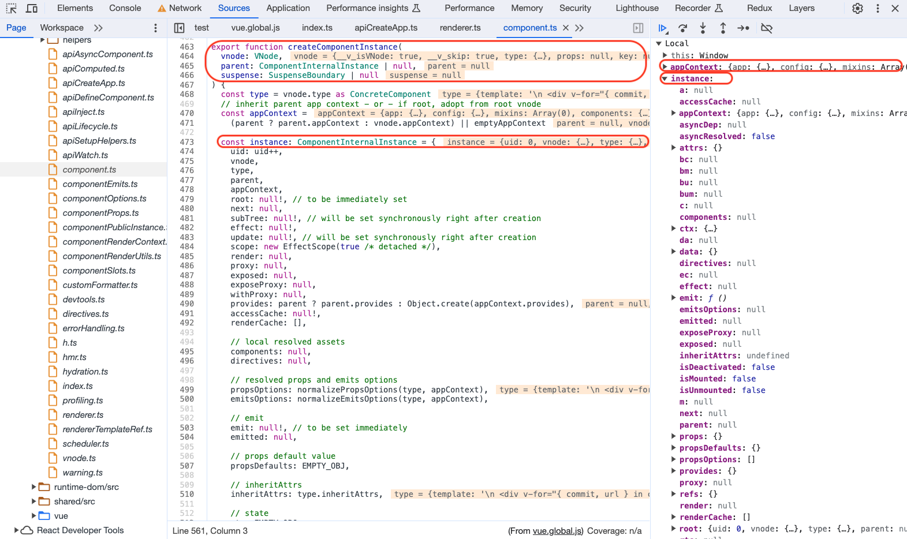
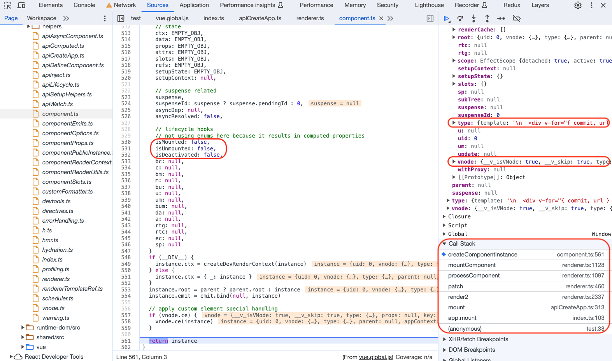

2. 【第二步】：调用 **`setupComponent`** 确定组件的`render`函数
   - 初始化`props`、`slots`
   - 如果是`STATEFUL_COMPONENT`组件调用`setupStatefulComponent`
   - 如果`setup`存在，调用`setup`得到`setupResult`，调用`setup`过程中会注册生命周期钩子的回调函数、创建响应式对象等
   - 返回`setup`的内容`setupResult`，可以是对象或渲染函数，如果是渲染函数直接赋值给当前实例的`render`属性(`instance.render`)，如果是对象，将对象处理成响应式对象并赋予实例的`setupState`属性
   - 最后如果当前组件实例没有`render`方法通过将`template`编译`compile`成`render`方法并返回，此处所说的`render`方法用于构造组件内部内容的`VNode`

```ts
// 【mountComponent的第二步】
// resolve props and slots for setup context
if (!(__COMPAT__ && compatMountInstance)) {
  if (__DEV__) {
    startMeasure(instance, `init`)
  }
  setupComponent(instance)
  if (__DEV__) {
    endMeasure(instance, `init`)
  }
}

// 【packages/runtime-core/src/component.ts】
// 【2.setupComponent】
//【setupComponent入参是当前组件实例instance，初始化有状态组件、props、slots，确定组件render函数】
export function setupComponent(
  instance: ComponentInternalInstance,
  isSSR = false
) {
  isInSSRComponentSetup = isSSR

  const { props, children } = instance.vnode
  // 【判断组件ShapeFlags是否是STATEFUL_COMPONENT】
  const isStateful = isStatefulComponent(instance)
  // 【处理props和slots】
  initProps(instance, props, isStateful, isSSR)
  initSlots(instance, children)

  // 【STATEFUL_COMPONENT组件调用setupStatefulComponent初始化】
  const setupResult = isStateful
    ? setupStatefulComponent(instance, isSSR)
    : undefined
  isInSSRComponentSetup = false
  return setupResult
}

// 【初始化STATEFUL_COMPONENT组件】
function setupStatefulComponent(
  instance: ComponentInternalInstance,
  isSSR: boolean
) {
  const Component = instance.type as ComponentOptions

  if (__DEV__) {
    if (Component.name) {
      validateComponentName(Component.name, instance.appContext.config)
    }
    if (Component.components) {
      const names = Object.keys(Component.components)
      for (let i = 0; i < names.length; i++) {
        validateComponentName(names[i], instance.appContext.config)
      }
    }
    if (Component.directives) {
      const names = Object.keys(Component.directives)
      for (let i = 0; i < names.length; i++) {
        validateDirectiveName(names[i])
      }
    }
    if (Component.compilerOptions && isRuntimeOnly()) {
      warn(
        `"compilerOptions" is only supported when using a build of Vue that ` +
          `includes the runtime compiler. Since you are using a runtime-only ` +
          `build, the options should be passed via your build tool config instead.`
      )
    }
  }
  // 0. create render proxy property access cache
  instance.accessCache = Object.create(null)
  // 1. create public instance / render proxy
  // also mark it raw so it's never observed
  //【将一个对象标记为不可被转为代理，返回该对象本身】
  instance.proxy = markRaw(new Proxy(instance.ctx, PublicInstanceProxyHandlers))
  if (__DEV__) {
    exposePropsOnRenderContext(instance)
  }
  // 2. call setup()
  // 【提取setup并通过callWithErrorHandling调用setup】
  const { setup } = Component
  if (setup) {
    const setupContext = (instance.setupContext =
      setup.length > 1 ? createSetupContext(instance) : null)
    // 【currentInstance设置当前正在处理的实例，停止依赖收集，调用setup回调返回setupResult】
    setCurrentInstance(instance)
    pauseTracking()
    const setupResult = callWithErrorHandling(
      setup,
      instance,
      ErrorCodes.SETUP_FUNCTION,
      [__DEV__ ? shallowReadonly(instance.props) : instance.props, setupContext]
    )
    // 【恢复依赖收集，currentInstance去除当前正在处理的实例】
    resetTracking()
    unsetCurrentInstance()

    // 【若setupResult是promise，用then方法回调unsetCurrentInstance】
    // 【否则调用handleSetupResult处理setupResult】
    if (isPromise(setupResult)) {
      setupResult.then(unsetCurrentInstance, unsetCurrentInstance)
      if (isSSR) {
        // return the promise so server-renderer can wait on it
        return setupResult
          .then((resolvedResult: unknown) => {
            handleSetupResult(instance, resolvedResult, isSSR)
          })
          .catch(e => {
            handleError(e, instance, ErrorCodes.SETUP_FUNCTION)
          })
      } else if (__FEATURE_SUSPENSE__) {
        // async setup returned Promise.
        // bail here and wait for re-entry.
        instance.asyncDep = setupResult
        if (__DEV__ && !instance.suspense) {
          const name = Component.name ?? 'Anonymous'
          warn(
            `Component <${name}>: setup function returned a promise, but no ` +
              `<Suspense> boundary was found in the parent component tree. ` +
              `A component with async setup() must be nested in a <Suspense> ` +
              `in order to be rendered.`
          )
        }
      } else if (__DEV__) {
        warn(
          `setup() returned a Promise, but the version of Vue you are using ` +
            `does not support it yet.`
        )
      }
    } else {
      handleSetupResult(instance, setupResult, isSSR)
    }
  } else {
    finishComponentSetup(instance, isSSR)
  }
}

// 【setup返回可以是对象或者渲染函数】
// 【如果返回的是渲染函数，直接作为实例的render方法】
// 【如果返回的是对象，调用proxyRefs将对象变为响应式对象，并赋值给实例的setupState属性】
export function handleSetupResult(
  instance: ComponentInternalInstance,
  setupResult: unknown,
  isSSR: boolean
) {
  if (isFunction(setupResult)) {
    // setup returned an inline render function
    if (__SSR__ && (instance.type as ComponentOptions).__ssrInlineRender) {
      // when the function's name is `ssrRender` (compiled by SFC inline mode),
      // set it as ssrRender instead.
      instance.ssrRender = setupResult
    } else {
      instance.render = setupResult as InternalRenderFunction
    }
  } else if (isObject(setupResult)) {
    if (__DEV__ && isVNode(setupResult)) {
      warn(
        `setup() should not return VNodes directly - ` +
          `return a render function instead.`
      )
    }
    // setup returned bindings.
    // assuming a render function compiled from template is present.
    if (__DEV__ || __FEATURE_PROD_DEVTOOLS__) {
      instance.devtoolsRawSetupState = setupResult
    }
    instance.setupState = proxyRefs(setupResult)
    if (__DEV__) {
      exposeSetupStateOnRenderContext(instance)
    }
  } else if (__DEV__ && setupResult !== undefined) {
    warn(
      `setup() should return an object. Received: ${
        setupResult === null ? 'null' : typeof setupResult
      }`
    )
  }
  finishComponentSetup(instance, isSSR)
}

// 【当前实例的render如果还不存在，通过template编译成render方法】
// 【Component.render = compile(template, finalCompilerOptions)】
// 【instance.render = (Component.render || NOOP) as InternalRenderFunction】
export function finishComponentSetup(
  instance: ComponentInternalInstance,
  isSSR: boolean,
  skipOptions?: boolean
) {
  const Component = instance.type as ComponentOptions

  if (__COMPAT__) {
    convertLegacyRenderFn(instance)

    if (__DEV__ && Component.compatConfig) {
      validateCompatConfig(Component.compatConfig)
    }
  }

  // template / render function normalization
  // could be already set when returned from setup()
  if (!instance.render) {
    // only do on-the-fly compile if not in SSR - SSR on-the-fly compilation
    // is done by server-renderer
    if (!isSSR && compile && !Component.render) {
      const template =
        (__COMPAT__ &&
          instance.vnode.props &&
          instance.vnode.props['inline-template']) ||
        Component.template ||
        resolveMergedOptions(instance).template
      if (template) {
        if (__DEV__) {
          startMeasure(instance, `compile`)
        }
        const { isCustomElement, compilerOptions } = instance.appContext.config
        const { delimiters, compilerOptions: componentCompilerOptions } =
          Component
        const finalCompilerOptions: CompilerOptions = extend(
          extend(
            {
              isCustomElement,
              delimiters
            },
            compilerOptions
          ),
          componentCompilerOptions
        )
        if (__COMPAT__) {
          // pass runtime compat config into the compiler
          finalCompilerOptions.compatConfig = Object.create(globalCompatConfig)
          if (Component.compatConfig) {
            // @ts-expect-error types are not compatible
            extend(finalCompilerOptions.compatConfig, Component.compatConfig)
          }
        }
        // 【如果setup()返回的并非render函数，那就调用compile编译template生成render函数】
        Component.render = compile(template, finalCompilerOptions)
        if (__DEV__) {
          endMeasure(instance, `compile`)
        }
      }
    }

    instance.render = (Component.render || NOOP) as InternalRenderFunction

    // for runtime-compiled render functions using `with` blocks, the render
    // proxy used needs a different `has` handler which is more performant and
    // also only allows a whitelist of globals to fallthrough.
    if (installWithProxy) {
      installWithProxy(instance)
    }
  }

  // support for 2.x options
  if (__FEATURE_OPTIONS_API__ && !(__COMPAT__ && skipOptions)) {
    setCurrentInstance(instance)
    pauseTracking()
    applyOptions(instance)
    resetTracking()
    unsetCurrentInstance()
  }

  // warn missing template/render
  // the runtime compilation of template in SSR is done by server-render
  if (__DEV__ && !Component.render && instance.render === NOOP && !isSSR) {
    /* istanbul ignore if */
    if (!compile && Component.template) {
      warn(
        `Component provided template option but ` +
          `runtime compilation is not supported in this build of Vue.` +
          (__ESM_BUNDLER__
            ? ` Configure your bundler to alias "vue" to "vue/dist/vue.esm-bundler.js".`
            : __ESM_BROWSER__
            ? ` Use "vue.esm-browser.js" instead.`
            : __GLOBAL__
            ? ` Use "vue.global.js" instead.`
            : ``) /* should not happen */
      )
    } else {
      warn(`Component is missing template or render function.`)
    }
  }
}
```

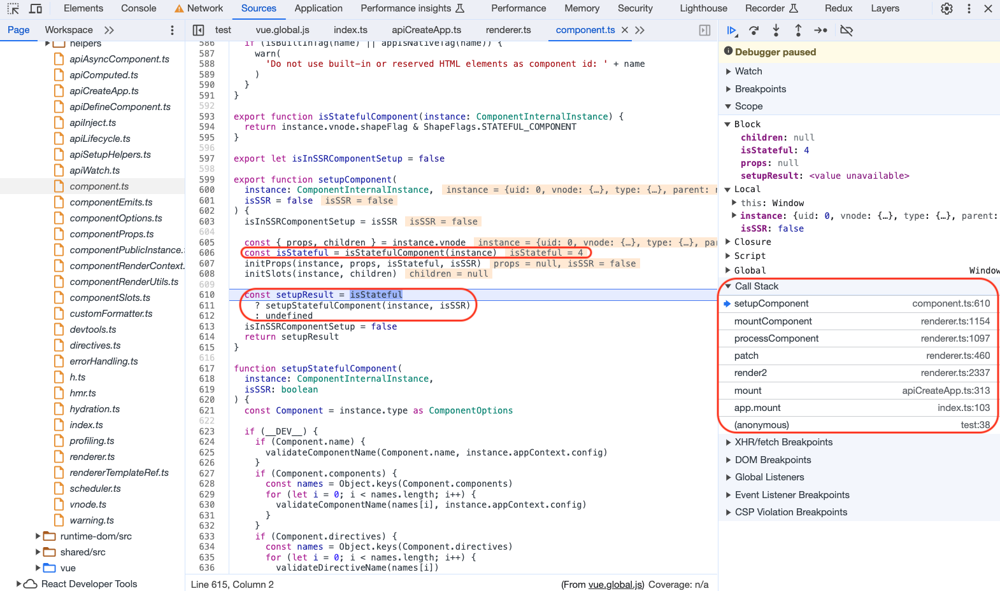
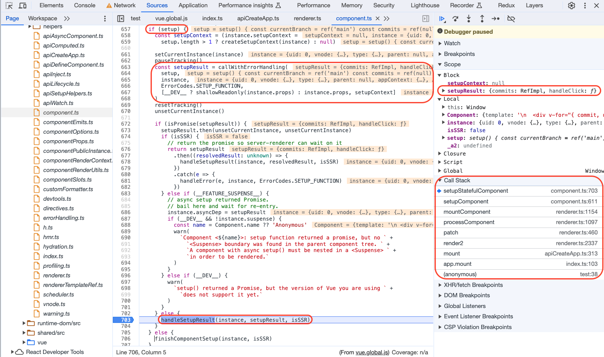
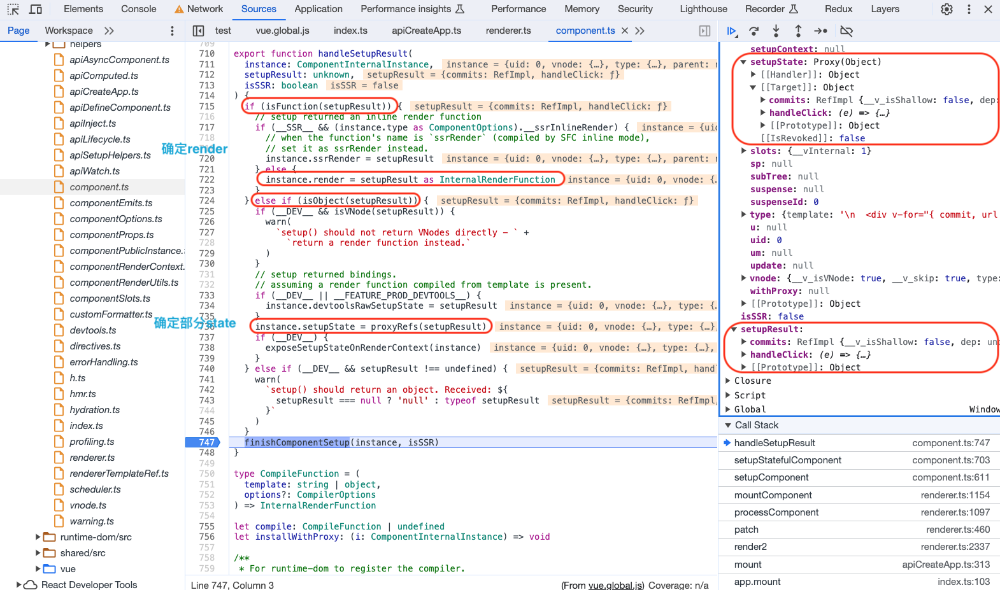
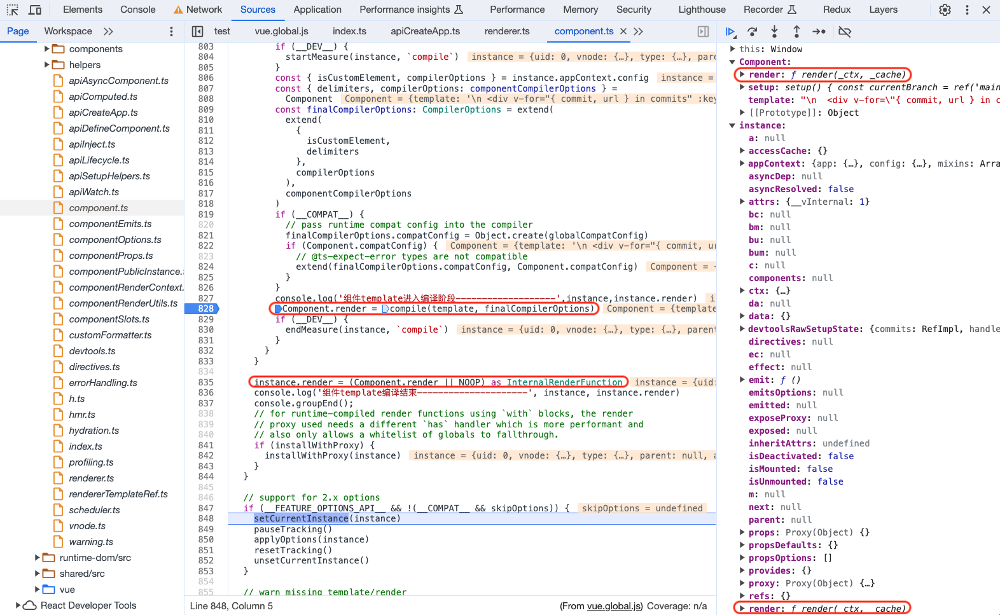

3. 【第三步】：调用 **`setupRenderEffect`** 设置组件渲染逻辑
   - 构造`componentUpdateFn`方法，这期间`renderComponentRoot`生成组件内容的VNode，`patch`循环遍历进行DOM挂载，这两个方法执行之前会执行`beforeMount`/`beforeUpdate`生命周期钩子，这两个方法执行完成之后会执行`mounted`/`updated`生命周期钩子
   - 调用`new ReactiveEffect`生成本组件对应的`render effect`，`componentUpdateFn`方法作为回调函数传入，响应式数据变化就会引起该`render effect`调用`run`方法继而调用`componentUpdateFn`方法，`componentUpdateFn`方法会根据实例上的`isMounted`是否为true，进入首次挂载分支，否则进入更新分支
   - 定义`update`方法为`effect.run()`并调用`update`方法，继而调用`componentUpdateFn`回调
   - `componentUpdateFn`回调会调用`renderComponentRoot(instance)`生成组件内容的`VNode`，继而调用`patch`方法进行新旧`VNode`对比和DOM挂载

```ts
// 【mountComponent的第三步】
setupRenderEffect(
  instance,
  initialVNode,
  container,
  anchor,
  parentSuspense,
  isSVG,
  optimized
)

// 【packages/runtime-core/src/renderer.ts】
// 【3.setupRenderEffect】
const setupRenderEffect: SetupRenderEffectFn = (
  instance,
  initialVNode,
  container,
  anchor,
  parentSuspense,
  isSVG,
  optimized
) => {
  // 【定义一个组件挂载or更新时调用的方法】
  // 【挂载/更新 永远有两步，第一步生成vnode，第二步patch进行dom挂载/更新】
  const componentUpdateFn = () => {
    // 【首次挂载-组件实例还未挂载 isMounted是false】
    if (!instance.isMounted) {
      let vnodeHook: VNodeHook | null | undefined
      const { el, props } = initialVNode
      const { bm, m, parent } = instance
      const isAsyncWrapperVNode = isAsyncWrapper(initialVNode)

      toggleRecurse(instance, false)
      // 【调用beforeMount生命周期回调】
      // beforeMount hook
      if (bm) {
        invokeArrayFns(bm)
      }
      // onVnodeBeforeMount
      if (
        !isAsyncWrapperVNode &&
        (vnodeHook = props && props.onVnodeBeforeMount)
      ) {
        invokeVNodeHook(vnodeHook, parent, initialVNode)
      }
      if (
        __COMPAT__ &&
        isCompatEnabled(DeprecationTypes.INSTANCE_EVENT_HOOKS, instance)
      ) {
        instance.emit('hook:beforeMount')
      }
      toggleRecurse(instance, true)


      if (el && hydrateNode) {
        // vnode has adopted host node - perform hydration instead of mount.
        const hydrateSubTree = () => {
          if (__DEV__) {
            startMeasure(instance, `render`)
          }
          instance.subTree = renderComponentRoot(instance)
          if (__DEV__) {
            endMeasure(instance, `render`)
          }
          if (__DEV__) {
            startMeasure(instance, `hydrate`)
          }
          hydrateNode!(
            el as Node,
            instance.subTree,
            instance,
            parentSuspense,
            null
          )
          if (__DEV__) {
            endMeasure(instance, `hydrate`)
          }
        }

        if (isAsyncWrapperVNode) {
          ;(initialVNode.type as ComponentOptions).__asyncLoader!().then(
            // note: we are moving the render call into an async callback,
            // which means it won't track dependencies - but it's ok because
            // a server-rendered async wrapper is already in resolved state
            // and it will never need to change.
            () => !instance.isUnmounted && hydrateSubTree()
          )
        } else {
          hydrateSubTree()
        }
      } else {
        if (__DEV__) {
          startMeasure(instance, `render`)
        }
        //【1.renderComponentRoot生成VNode赋值给subTree】
        const subTree = (instance.subTree = renderComponentRoot(instance))
        if (__DEV__) {
          endMeasure(instance, `render`)
        }
        if (__DEV__) {
          startMeasure(instance, `patch`)
        }
        //【2.递归调用patch进行VNode对比然后挂载】
        patch(
          null,
          subTree,
          container,
          anchor,
          instance,
          parentSuspense,
          isSVG
        )
        if (__DEV__) {
          endMeasure(instance, `patch`)
        }
        initialVNode.el = subTree.el
      }

      //【执行onMounted生命周期回调】
      // mounted hook
      if (m) {
        queuePostRenderEffect(m, parentSuspense)
      }
      // onVnodeMounted
      if (
        !isAsyncWrapperVNode &&
        (vnodeHook = props && props.onVnodeMounted)
      ) {
        const scopedInitialVNode = initialVNode
        queuePostRenderEffect(
          () => invokeVNodeHook(vnodeHook!, parent, scopedInitialVNode),
          parentSuspense
        )
      }
      if (
        __COMPAT__ &&
        isCompatEnabled(DeprecationTypes.INSTANCE_EVENT_HOOKS, instance)
      ) {
        queuePostRenderEffect(
          () => instance.emit('hook:mounted'),
          parentSuspense
        )
      }

      // 【如果是keep-alive组件执行activated生命周期回调】
      // activated hook for keep-alive roots.
      // #1742 activated hook must be accessed after first render
      // since the hook may be injected by a child keep-alive
      if (
        initialVNode.shapeFlag & ShapeFlags.COMPONENT_SHOULD_KEEP_ALIVE ||
        (parent &&
          isAsyncWrapper(parent.vnode) &&
          parent.vnode.shapeFlag & ShapeFlags.COMPONENT_SHOULD_KEEP_ALIVE)
      ) {
        instance.a && queuePostRenderEffect(instance.a, parentSuspense)
        if (
          __COMPAT__ &&
          isCompatEnabled(DeprecationTypes.INSTANCE_EVENT_HOOKS, instance)
        ) {
          queuePostRenderEffect(
            () => instance.emit('hook:activated'),
            parentSuspense
          )
        }
      }
      // 【实例上的isMounted标志设为true，代表挂载完成】
      instance.isMounted = true

      if (__DEV__ || __FEATURE_PROD_DEVTOOLS__) {
        devtoolsComponentAdded(instance)
      }

      // #2458: deference mount-only object parameters to prevent memleaks
      initialVNode = container = anchor = null as any
    } else {
      // 【更新组件-组件实例已经挂载 isMounted是true 说明是更新】
      // updateComponent
      // This is triggered by mutation of component's own state (next: null)
      // OR parent calling processComponent (next: VNode)
      let { next, bu, u, parent, vnode } = instance
      let originNext = next
      let vnodeHook: VNodeHook | null | undefined
      if (__DEV__) {
        pushWarningContext(next || instance.vnode)
      }

      // Disallow component effect recursion during pre-lifecycle hooks.
      toggleRecurse(instance, false)
      if (next) {
        next.el = vnode.el
        updateComponentPreRender(instance, next, optimized)
      } else {
        next = vnode
      }
      //【执行beforeUpdate生命周期的回调】
      // beforeUpdate hook
      if (bu) {
        invokeArrayFns(bu)
      }
      // onVnodeBeforeUpdate
      if ((vnodeHook = next.props && next.props.onVnodeBeforeUpdate)) {
        invokeVNodeHook(vnodeHook, parent, next, vnode)
      }
      if (
        __COMPAT__ &&
        isCompatEnabled(DeprecationTypes.INSTANCE_EVENT_HOOKS, instance)
      ) {
        instance.emit('hook:beforeUpdate')
      }
      toggleRecurse(instance, true)

      
      
      // render
      if (__DEV__) {
        startMeasure(instance, `render`)
      }
      //【1.const nextTree = renderComponentRoot(instance)构造VNode】
      const nextTree = renderComponentRoot(instance)
      if (__DEV__) {
        endMeasure(instance, `render`)
      }
      const prevTree = instance.subTree//【旧VNode】
      instance.subTree = nextTree//【新VNode】

      if (__DEV__) {
        startMeasure(instance, `patch`)
      }
      //【2.递归执行patch进行挂载更新DOM】
      patch(
        prevTree,
        nextTree,
        // parent may have changed if it's in a teleport
        hostParentNode(prevTree.el!)!,
        // anchor may have changed if it's in a fragment
        getNextHostNode(prevTree),
        instance,
        parentSuspense,
        isSVG
      )
      if (__DEV__) {
        endMeasure(instance, `patch`)
      }
      next.el = nextTree.el
      if (originNext === null) {
        // self-triggered update. In case of HOC, update parent component
        // vnode el. HOC is indicated by parent instance's subTree pointing
        // to child component's vnode
        updateHOCHostEl(instance, nextTree.el)
      }

      //【执行update生命周期的回调】
      // updated hook
      if (u) {
        queuePostRenderEffect(u, parentSuspense)
      }
      // onVnodeUpdated
      if ((vnodeHook = next.props && next.props.onVnodeUpdated)) {
        queuePostRenderEffect(
          () => invokeVNodeHook(vnodeHook!, parent, next!, vnode),
          parentSuspense
        )
      }
      if (
        __COMPAT__ &&
        isCompatEnabled(DeprecationTypes.INSTANCE_EVENT_HOOKS, instance)
      ) {
        queuePostRenderEffect(
          () => instance.emit('hook:updated'),
          parentSuspense
        )
      }

      if (__DEV__ || __FEATURE_PROD_DEVTOOLS__) {
        devtoolsComponentUpdated(instance)
      }

      if (__DEV__) {
        popWarningContext()
      }
    }
  }

  // 【创建一个render effect，可以类比vue2中的render watcher】
  // 【componentUpdateFn作为挂载/更新后的回调调用】
  // create reactive effect for rendering
  // 【queueJob将组件渲染任务加入主任务队列】
  const effect = (instance.effect = new ReactiveEffect(
    componentUpdateFn,
    () => queueJob(update),
    instance.scope // track it in component's effect scope
  ))

  // 【创建一个组件挂载/更新的任务函数挂在在实例的update属性上并调用】
  // 【effect.run()方法里会执行componentUpdateFn】
  const update: SchedulerJob = (instance.update = () => effect.run())
  update.id = instance.uid
  // allowRecurse
  // #1801, #2043 component render effects should allow recursive updates
  toggleRecurse(instance, true)

  if (__DEV__) {
    effect.onTrack = instance.rtc
      ? e => invokeArrayFns(instance.rtc!, e)
      : void 0
    effect.onTrigger = instance.rtg
      ? e => invokeArrayFns(instance.rtg!, e)
      : void 0
    update.ownerInstance = instance
  }
  
  //【update实际调用的是当前实例对应的render effect的run方法，最终会调用componentUpdateFn】
  update()
}
```

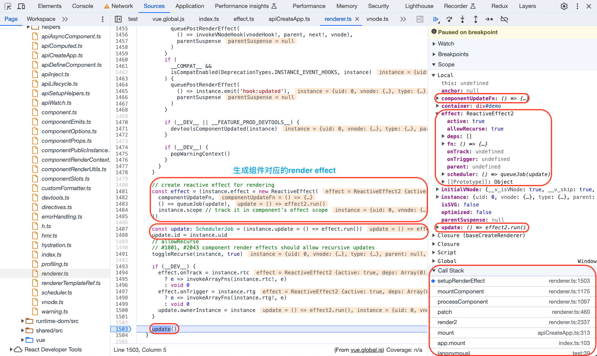
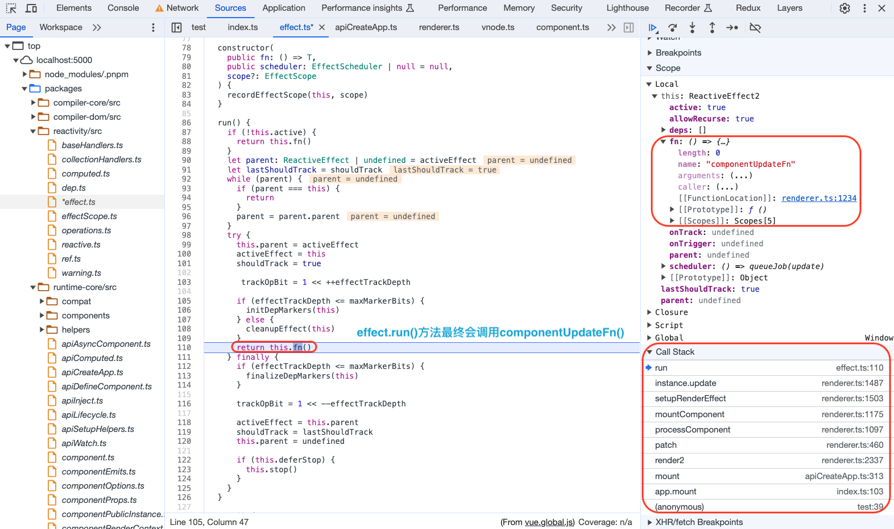
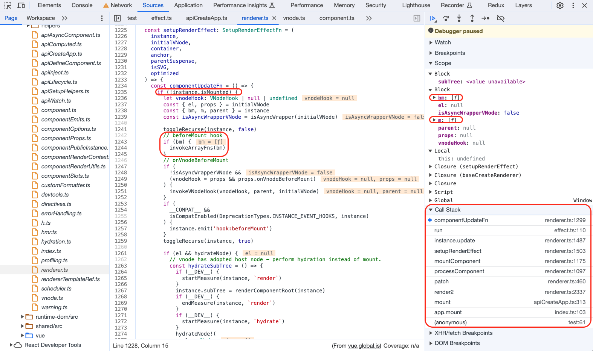
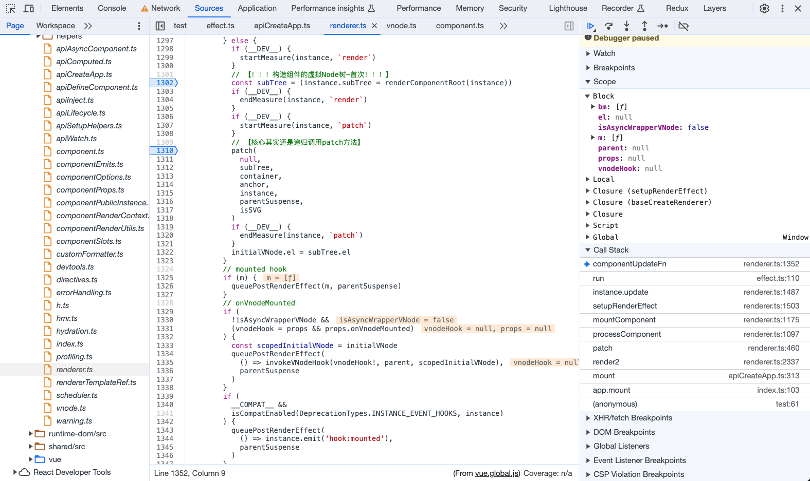
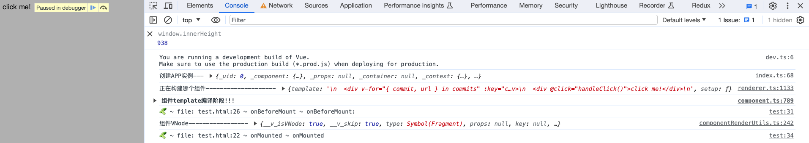

### 组件更新

**【1】createVNode  【2】render(vnode) -> patch -> processComponent -> updateComponent**

组件更新显然就走向`updateComponent`方法，如果是需要更新的情况，最终调用的其实就是`instance.update()`：

- `shouldUpdateComponent()`方法根据`patchFlag`等判断是否需要更新组件
- 核心是执行`instance.update()`方法也就是对应`render effect`的`run()`方法继而调用`componentUpdateFn()`方法，进入更新分支

```ts
// 【packages/runtime-core/src/renderer.ts】
const updateComponent = (n1: VNode, n2: VNode, optimized: boolean) => {
  const instance = (n2.component = n1.component)!
  // 【需要更新组件的情况】
  if (shouldUpdateComponent(n1, n2, optimized)) {
    if (
      __FEATURE_SUSPENSE__ &&
      instance.asyncDep &&
      !instance.asyncResolved
    ) {
      // async & still pending - just update props and slots
      // since the component's reactive effect for render isn't set-up yet
      if (__DEV__) {
        pushWarningContext(n2)
      }
      updateComponentPreRender(instance, n2, optimized)
      if (__DEV__) {
        popWarningContext()
      }
      return
    } else {
      // 【实例的update方法已经在mountComponent方法中创建好，直接调用】
      // normal update
      instance.next = n2
      // in case the child component is also queued, remove it to avoid
      // double updating the same child component in the same flush.
      invalidateJob(instance.update)
      // instance.update is the reactive effect.
      // 【这一步在首次挂载的时候已经把update定义成当前effect的run方法，run方法执行后会回调componentUpdateFn，然后进入更新分支】
      instance.update()
    }
  } else {
    // 【不需要更新的情况直接拷贝新组件内容】
    // no update needed. just copy over properties
    n2.el = n1.el
    instance.vnode = n2
  }
}

const componentUpdateFn = () => {
  // 【首次挂载-组件实例还未挂载 isMounted是false】
  if (!instance.isMounted) {
    // 【...省略】
  } else {
    // 【更新组件-组件实例已经挂载 isMounted是true 说明是更新】
    // updateComponent
    // This is triggered by mutation of component's own state (next: null)
    // OR parent calling processComponent (next: VNode)
    let { next, bu, u, parent, vnode } = instance
    let originNext = next
    let vnodeHook: VNodeHook | null | undefined
    if (__DEV__) {
      pushWarningContext(next || instance.vnode)
    }

    // Disallow component effect recursion during pre-lifecycle hooks.
    toggleRecurse(instance, false)
    if (next) {
      next.el = vnode.el
      updateComponentPreRender(instance, next, optimized)
    } else {
      next = vnode
    }
    //【执行beforeUpdate生命周期的回调】
    // beforeUpdate hook
    if (bu) {
      invokeArrayFns(bu)
    }
    // onVnodeBeforeUpdate
    if ((vnodeHook = next.props && next.props.onVnodeBeforeUpdate)) {
      invokeVNodeHook(vnodeHook, parent, next, vnode)
    }
    if (
      __COMPAT__ &&
      isCompatEnabled(DeprecationTypes.INSTANCE_EVENT_HOOKS, instance)
    ) {
      instance.emit('hook:beforeUpdate')
    }
    toggleRecurse(instance, true)

    
    
    // render
    if (__DEV__) {
      startMeasure(instance, `render`)
    }
    //【1.const nextTree = renderComponentRoot(instance)构造最新的VNode】
    const nextTree = renderComponentRoot(instance)
    if (__DEV__) {
      endMeasure(instance, `render`)
    }
    const prevTree = instance.subTree//【旧VNode】
    instance.subTree = nextTree//【新VNode】

    if (__DEV__) {
      startMeasure(instance, `patch`)
    }
    //【2.递归执行patch进行挂载更新DOM】
    patch(
      prevTree,
      nextTree,
      // parent may have changed if it's in a teleport
      hostParentNode(prevTree.el!)!,
      // anchor may have changed if it's in a fragment
      getNextHostNode(prevTree),
      instance,
      parentSuspense,
      isSVG
    )
    if (__DEV__) {
      endMeasure(instance, `patch`)
    }
    next.el = nextTree.el
    if (originNext === null) {
      // self-triggered update. In case of HOC, update parent component
      // vnode el. HOC is indicated by parent instance's subTree pointing
      // to child component's vnode
      updateHOCHostEl(instance, nextTree.el)
    }

    //【执行update生命周期的回调】
    // updated hook
    if (u) {
      queuePostRenderEffect(u, parentSuspense)
    }
    // onVnodeUpdated
    if ((vnodeHook = next.props && next.props.onVnodeUpdated)) {
      queuePostRenderEffect(
        () => invokeVNodeHook(vnodeHook!, parent, next!, vnode),
        parentSuspense
      )
    }
    if (
      __COMPAT__ &&
      isCompatEnabled(DeprecationTypes.INSTANCE_EVENT_HOOKS, instance)
    ) {
      queuePostRenderEffect(
        () => instance.emit('hook:updated'),
        parentSuspense
      )
    }

    if (__DEV__ || __FEATURE_PROD_DEVTOOLS__) {
      devtoolsComponentUpdated(instance)
    }

    if (__DEV__) {
      popWarningContext()
    }
  }
}
```

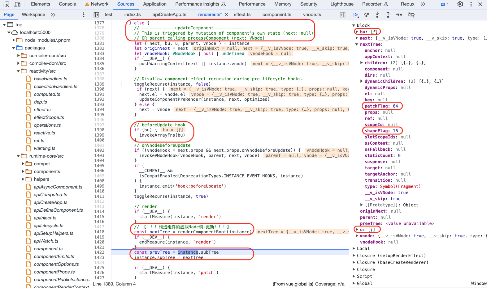
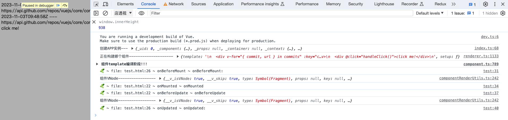

## 组件注册

- 全局注册

`createAppAPI`方法生成的app实例有`component`方法用于注册全局组件如下：

```ts
import { createApp } from 'vue'

const app = createApp({})

// register an options object
app.component('my-component', {
  /* ... */
})

// retrieve a registered component
const MyComponent = app.component('my-component')
```

```ts
// 【packages/runtime-core/src/apiCreateApp.ts】
component(name: string, component?: Component): any {
    if (__DEV__) {
        validateComponentName(name, context.config)
    }
    if (!component) {
        return context.components[name]
    }
    if (__DEV__ && context.components[name]) {
        warn(`Component "${name}" has already been registered in target app.`)
    }
    // 【全局注册的组件都挂在components属性中】
    context.components[name] = component
    return app
}
```

- 局部注册

局部组件注册如下：

<!-- 【TODO：看一下这块的细节】 -->

```ts
// 方式一
<script setup>
import ComponentA from './ComponentA.vue'
</script>

<template>
  <ComponentA />
</template>

// 方式二
Vue.createApp({
  components: {
    TreeItem
  },
  data: () => ({
    treeData
  })
}).mount('#demo')
```

## 总结

组件构建的完整流程如下：

1. `Vue`应用实例`app`调用`mount`方法，首先创建应用的根`VNode`然后进入`render`方法，`render`方法的核心是`patch`，`patch`会根据`type`进入不同的处理方法，遇到组件就会进入`processComponent`方法；
2. 根据是否首次挂载`processComponent`会进入`mountComponent`或者`updateComponent`分支；
3. `mountComponent`分为三个重要步骤如下：
     - 创建组件实例`instance`
     - 有`setup`就调用`setup`函数，然后确定组件的`render`函数，可能是`setup`函数返回的函数，否则就通过`compile`解析`template`生成
     - 设置组件的渲染逻辑，构造`componentUpdateFn`方法，构造组件对应的`render effect`，构造`update = effect.run()`并调用
4. `updateComponent`无需前面几个步骤，最终会调用`instance.update()`也就是`effect.run()`方法继而进入`componentUpdateFn`方法；
5. `componentUpdateFn`方法根据是否首次渲染进入不同分支，核心都是两个步骤，第一步调用`renderComponentRoot(instance)`生成组件内容的`VNode`，第二步调用`patch`方法进行`VNode`对比和DOM挂载；


