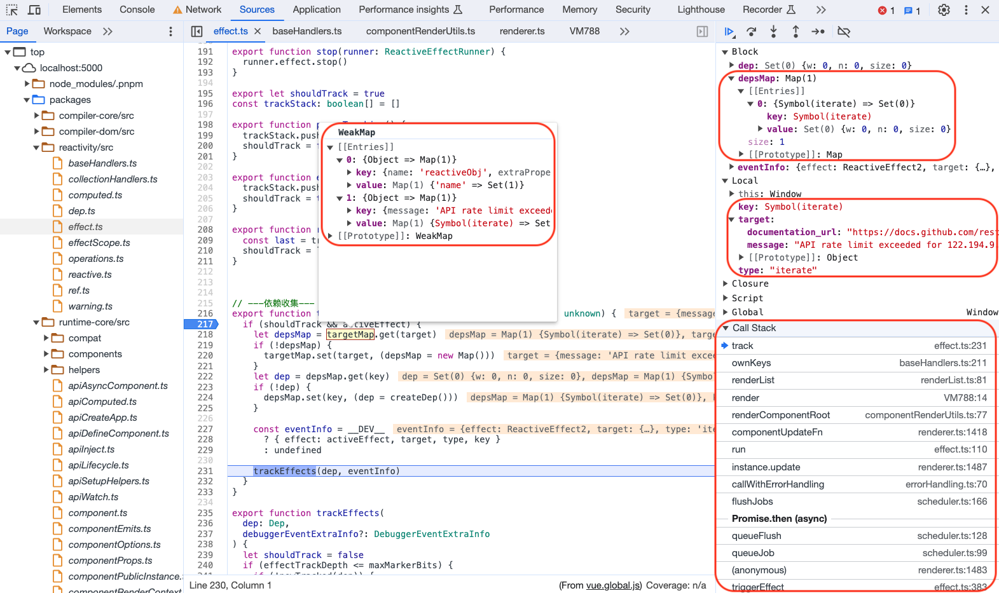

# Vue3 的响应式原理

在分析 Vue2 的响应式的时候我们经常接触的几个概念：`render watcher`、 `user watcher`、 `computed watcher`等，在 Vue3 中使用副作用`effect`的概念同样监测响应式对象并进行相应的操作或更新。

- 在 Vue2 中的响应式关键：`Observer`、`Dep`、`Watcher`。
- 在 Vue3 中的响应式关键：`Dep`、`ReactiveEffect`。

响应式核心的 API 有：

- `ref()`
- `reactive()`
- `readonly()`
- `computed()`
- `watchEffect()`
- `watchPostEffect()`
- `watchSyncEffect()`
- `watch()`

## 关键方法

- `createRef`
- `RefImpl`
- `createReactiveObject`
- `Dep`
- `ReactiveEffect`
- `trackRefValue`
- `triggerRefValue`
- `trackEffects`
- `triggerEffects`
- `triggerEffect`

## ref()

**new RefImpl() -> get value/set value -> trackRefValue()/triggerRefValue() -> trackEffects()/triggerEffects()**

- 关键词`<RefImpl>`、`<Dep>`、`<ReactiveEffect>`

官方文档提供的关于响应式 API 包含`ref()`函数，定义如下：接受一个**内部值**，返回一个响应式的、可更改的 `ref` 对象，此对象只有一个指向其内部值的属性 `.value`。

可以先来看一下`ref()`函数的实现，首先`ref()`函数实际调用`createRef()`传入两个参数，第一个是值，第二个根据是`ref`还是`shallowRef`传入 boolean 值，然后实例化一个`RefImpl`对象，`<RefImpl>`类的实现如下：

```ts
// 【packages/reactivity/src/ref.ts】
// 【深度响应式】
export function ref(value?: unknown) {
  return createRef(value, false)
}
// 【浅响应式】
export function shallowRef(value?: unknown) {
  return createRef(value, true)
}

//【入参：原始值，是否浅作用】
function createRef(rawValue: unknown, shallow: boolean) {
  // 【已经是ref响应式值直接返回】
  if (isRef(rawValue)) {
    return rawValue
  }
  // 【实例化一个RefImpl对象】
  return new RefImpl(rawValue, shallow)
}

class RefImpl<T> {
  private _value: T
  private _rawValue: T

  public dep?: Dep = undefined
  public readonly __v_isRef = true

  constructor(value: T, public readonly __v_isShallow: boolean) {
    this._rawValue = __v_isShallow ? value : toRaw(value)
    this._value = __v_isShallow ? value : toReactive(value)
  }

  // 【value属性的读取和改写】
  get value() {
    // 【依赖收集trackRefValue】
    trackRefValue(this)
    return this._value
  }

  set value(newVal) {
    // 【旧值是浅响应的、新值只读、新值是浅响应的那么value直接赋值为新值即可，否则调用toReactive处理新值再复制给value】
    // 【和 ref() 不同，shallowRef() 的内部值将会原样存储和暴露，并且不会被深层递归地转为响应式。只有对 .value 的访问是响应式的。】
    const useDirectValue =
      this.__v_isShallow || isShallow(newVal) || isReadonly(newVal)
    newVal = useDirectValue ? newVal : toRaw(newVal)

    //【使用Object.is判断断新值是否变化】
    if (hasChanged(newVal, this._rawValue)) {
      this._rawValue = newVal
      this._value = useDirectValue ? newVal : toReactive(newVal)
      // 【派发更新triggerRefValue】
      triggerRefValue(this, newVal)
    }
  }
}

// 【根据一个Vue创建的代理返回其原始对象。】
export function toRaw<T>(observed: T): T {
  const raw = observed && (observed as Target)[ReactiveFlags.RAW]
  return raw ? toRaw(raw) : observed
}

// 【如果是对象调用reactive进行proxy代理】
export const toReactive = <T extends unknown>(value: T): T =>
  isObject(value) ? reactive(value) : value

// 【对比两个值是否变化】
// compare whether a value has changed, accounting for NaN.
export const hasChanged = (value: any, oldValue: any): boolean =>
  !Object.is(value, oldValue)
```

一个`ref`操作过的响应式对象如下，可以看到如果是基础类型值，那么`_rawValue`和`_value`的值是一样的，如果是一个对象，那么`_value`则是通过`proxy`改造后的值(调用`reactive()`)，`_rawValue`是原始值：


经过`ref`改造的数据，`__v_isRef`属性为`true`，如果是`shallowRef`改造的则`__v_isShallow`也为`true`，`shallowRef`如果改造的是对象不会对对象内部的内容进行深层拦截，也就是不会通过`Proxy`去改造这个对象，这个时候如果更改对象内部属性值也就不会引发响应式改变。

然后继续看改写`value`属性的`get`和`set`部分的逻辑，在“类”的内部可以使用`get`和`set`关键字，对某个属性设置存值函数和取值函数，拦截该属性的存取行为。这部分就涉及到**依赖收集**和**派发更新**的内容了，在`get`中调用了`trackRefValue()`函数继而调用`trackEffects`进行依赖收集，在`set`中调用了`triggerRefValue()`函数继而调用`triggerEffects`进行派发更新。

<!-- 【TODO：3.4.27版本对这块有更新】 -->

和之前不同的是在设置新值时派发更新进入`triggerRefValue()`方法时入参增加了`dirtyLevel`，并且直接指定为 4(Dirty)。

```ts
// 【packages/reactivity/src/ref.ts】---v3.4.27
class RefImpl<T> {
  private _value: T
  private _rawValue: T

  public dep?: Dep = undefined
  public readonly __v_isRef = true

  constructor(value: T, public readonly __v_isShallow: boolean) {
    this._rawValue = __v_isShallow ? value : toRaw(value)
    this._value = __v_isShallow ? value : toReactive(value)
  }

  get value() {
    trackRefValue(this)
    return this._value
  }

  set value(newVal) {
    const useDirectValue =
      this.__v_isShallow || isShallow(newVal) || isReadonly(newVal)
    newVal = useDirectValue ? newVal : toRaw(newVal)
    if (hasChanged(newVal, this._rawValue)) {
      this._rawValue = newVal
      this._value = useDirectValue ? newVal : toReactive(newVal)
      triggerRefValue(this, DirtyLevels.Dirty, newVal)
    }
  }
}
```

## reactive()

**new Proxy() ->track(target, TrackOpTypes.GET, key)/trigger(target, TriggerOpTypes.ADD, key, value) -> trackEffects()/triggerEffects()**

- 关键词`Proxy()`、`<Dep>`、`<ReactiveEffect>`

官方文档提供的关于响应式 API 包含`reactive()`函数，定义如下：返回一个**对象**的响应式代理。

`reactive`方法实际调用`createReactiveObject()`方法，可以看到经过一系列判断，最终会用 ES6 特性`Proxy`改造`target`对象，对`target`进行代理，最终返回一个响应式对象，并且用一个名为`reactiveMap`的`WeakMap`来存储`target`和对应的`proxy`用于后续的判断（代理过了也就无需再次处理了）：

- 对象已经是`Proxy`代理对象就直接返回
- `reactiveMap`已经有此`Proxy`代理对象直接返回
- 不符合转换条件的对象不予处理
- 以`target`作为入参实例化一个对应的`Proxy`代理对象
  - `Map`、`Set`、`WeakMap`、`WeakSet`数据类型使用`collectionHandlers`代理，`Object`、`Array`数据类型使用`baseHandlers`代理
- 将当前`Proxy`代理对象加入`reactiveMap`中

```ts
// 【packages/reactivity/src/reactive.ts】
export const reactiveMap = new WeakMap<Target, any>() //【已有的reactive对象】
export const shallowReactiveMap = new WeakMap<Target, any>()
export const readonlyMap = new WeakMap<Target, any>()
export const shallowReadonlyMap = new WeakMap<Target, any>()

export function reactive(target: object) {
  // if trying to observe a readonly proxy, return the readonly version.
  if (isReadonly(target)) {
    return target
  }
  // 【mutableHandlers，mutableCollectionHandlers对target进行代理】
  return createReactiveObject(
    target,
    false,
    mutableHandlers,
    mutableCollectionHandlers,
    reactiveMap
  )
}

function createReactiveObject(
  target: Target,
  isReadonly: boolean,
  baseHandlers: ProxyHandler<any>,
  collectionHandlers: ProxyHandler<any>,
  proxyMap: WeakMap<Target, any>
) {
  //【非对象，warn提示】
  if (!isObject(target)) {
    if (__DEV__) {
      console.warn(`value cannot be made reactive: ${String(target)}`)
    }
    return target
  }

  //【对象已经是Proxy直接返回】
  // target is already a Proxy, return it.
  // exception: calling readonly() on a reactive object
  if (
    target[ReactiveFlags.RAW] &&
    !(isReadonly && target[ReactiveFlags.IS_REACTIVE])
  ) {
    return target
  }

  //【reactiveMap已经有此Proxy对象直接返回】
  //【为保证访问代理的一致性，对同一个原始对象调用 reactive() 会总是返回同样的代理对象，而对一个已存在的代理对象调用 reactive() 会返回其本身】
  // target already has corresponding Proxy
  const existingProxy = proxyMap.get(target)
  if (existingProxy) {
    return existingProxy
  }

  //【不符合转换的对象不予处理】
  // only specific value types can be observed.
  const targetType = getTargetType(target)
  if (targetType === TargetType.INVALID) {
    return target
  }

  //【实例化Proxy对象，'Map'、'Set'、'WeakMap'、'WeakSet'类型使用collectionHandlers->mutableCollectionHandlers代理，'Object'、'Array'类型使用baseHandlers->mutableHandlers代理】
  // 【const p = new Proxy(target, handler)】
  const proxy = new Proxy(
    target,
    targetType === TargetType.COLLECTION ? collectionHandlers : baseHandlers
  )
  //【将当前Proxy对象加入reactiveMap中】
  proxyMap.set(target, proxy)
  return proxy
}
```

通常`reactive`处理的都是引用类型对象，所以针对不同类型的引用类型也会有不同的处理方式，所以需要进行判断，对`target`的`targetType`的判断内容如下，除列出的几个类型数据可以用`reactive`处理外其余数据均划为`INVALID`类不予处理，可以用`Date`类型数据尝试会发现不会进行响应式改造：

```ts
//【判断target类型】
export interface Target {
  [ReactiveFlags.SKIP]?: boolean
  [ReactiveFlags.IS_REACTIVE]?: boolean
  [ReactiveFlags.IS_READONLY]?: boolean
  [ReactiveFlags.IS_SHALLOW]?: boolean
  [ReactiveFlags.RAW]?: any
}
//【分为三类】
const enum TargetType {
  INVALID = 0,
  COMMON = 1,
  COLLECTION = 2,
}
// 【Object、Array是COMMON类型-用baseHandlers代理】
// 【Map、Set、WeakMap、WeakSet是COLLECTION类型-用collectionHandlers代理】
// 【其余是INVALID】不予处理响应式
function targetTypeMap(rawType: string) {
  switch (rawType) {
    case "Object":
    case "Array":
      return TargetType.COMMON
    case "Map":
    case "Set":
    case "WeakMap":
    case "WeakSet":
      return TargetType.COLLECTION
    default:
      return TargetType.INVALID
  }
}
function getTargetType(value: Target) {
  return value[ReactiveFlags.SKIP] || !Object.isExtensible(value)
    ? TargetType.INVALID
    : targetTypeMap(toRawType(value))
}

export const objectToString = Object.prototype.toString
export const toTypeString = (value: unknown): string =>
  objectToString.call(value)

export const toRawType = (value: unknown): string => {
  // extract "RawType" from strings like "[object RawType]"
  return toTypeString(value).slice(8, -1)
}
```

对`target`对象拦截的具体操作分别在`reactivity/src/baseHandlers.ts`和`reactivity/src/collectionHandlers.ts`文件中。

### baseHandlers -> mutableHandlers - 处理 Object/Array 类型

我们先来研究常规的处理`Object`和`Array`的`baseHandlers`，代理了五个方法`get`,`set`,`deleteProperty`,`has`,`ownKeys`具体如下：

- `get(target, propKey, receiver)`：拦截对象属性的读取，比如`proxy.foo`和`proxy['foo']`。
- `set(target, propKey, value, receiver)`：拦截对象属性的设置，比如`proxy.foo = v`或`proxy['foo'] = v`，返回一个布尔值。
- `has(target, propKey)`：拦截`propKey in proxy`的操作，返回一个布尔值。
- `deleteProperty(target, propKey)`：拦截`delete proxy[propKey]`的操作，返回一个布尔值。
- `ownKeys(target)`：拦截`Object.getOwnPropertyNames(proxy)`、`Object.getOwnPropertySymbols(proxy)`、`Object.keys(proxy)`、`for...in`循环，返回一个数组。该方法返回目标对象所有自身的属性的属性名，而`Object.keys()`的返回结果仅包括目标对象自身的可遍历属性。

```ts
// 【packages/reactivity/src/baseHandlers.ts】
//【不同API的代理handler不同】
import {
  mutableHandlers,
  readonlyHandlers,
  shallowReactiveHandlers,
  shallowReadonlyHandlers,
} from "./baseHandlers"

// 【数据不同的响应式标志】
export const enum ReactiveFlags {
  SKIP = "__v_skip",
  IS_REACTIVE = "__v_isReactive",
  IS_READONLY = "__v_isReadonly",
  IS_SHALLOW = "__v_isShallow",
  RAW = "__v_raw",
}
// 【-----mutableHandlers代理了5种方法-----】
// 【get: proxy.foo  proxy['foo']
//   set: proxy.foo = v  proxy['foo'] = v
//   deleteProperty: delete proxy[propKey]
//   has: propKey in proxy
//   ownKeys: Object.getOwnPropertyNames(proxy)  Object.getOwnPropertySymbols(proxy)  Object.keys(proxy)  for...in】
export const mutableHandlers: ProxyHandler<object> = {
  get,
  set,
  deleteProperty,
  has,
  ownKeys,
}
const get = /*#__PURE__*/ createGetter()
const shallowGet = /*#__PURE__*/ createGetter(false, true)
const readonlyGet = /*#__PURE__*/ createGetter(true)
const shallowReadonlyGet = /*#__PURE__*/ createGetter(true, true)

const set = /*#__PURE__*/ createSetter()
const shallowSet = /*#__PURE__*/ createSetter(true)

//【代理对象getter的方法，依赖收集操作类型是TrackOpTypes.GET】
function createGetter(isReadonly = false, shallow = false) {
  return function get(target: Target, key: string | symbol, receiver: object) {
    if (key === ReactiveFlags.IS_REACTIVE) {
      return !isReadonly
    } else if (key === ReactiveFlags.IS_READONLY) {
      return isReadonly
    } else if (key === ReactiveFlags.IS_SHALLOW) {
      return shallow
    } else if (
      key === ReactiveFlags.RAW &&
      receiver ===
        (isReadonly
          ? shallow
            ? shallowReadonlyMap
            : readonlyMap
          : shallow
          ? shallowReactiveMap
          : reactiveMap
        ).get(target)
    ) {
      return target
    }

    //【数组单独处理】
    const targetIsArray = isArray(target)

    // 【数组中例如pop、push、splice、map、indexOf等等操作都进行了改写，用Reflect.get调用】
    // 【arrayInstrumentations是改造过的类数组对象】
    if (!isReadonly && targetIsArray && hasOwn(arrayInstrumentations, key)) {
      return Reflect.get(arrayInstrumentations, key, receiver)
    }

    const res = Reflect.get(target, key, receiver)

    if (isSymbol(key) ? builtInSymbols.has(key) : isNonTrackableKeys(key)) {
      return res
    }
    //【非只读情况就进行依赖收集，操作类型为TrackOpTypes.GET】
    //【track(target, TrackOpTypes.GET, key)】
    if (!isReadonly) {
      track(target, TrackOpTypes.GET, key)
    }

    if (shallow) {
      return res
    }

    if (isRef(res)) {
      // ref unwrapping - skip unwrap for Array + integer key.
      return targetIsArray && isIntegerKey(key) ? res : res.value
    }

    if (isObject(res)) {
      // Convert returned value into a proxy as well. we do the isObject check
      // here to avoid invalid value warning. Also need to lazy access readonly
      // and reactive here to avoid circular dependency.
      return isReadonly ? readonly(res) : reactive(res)
    }

    return res
  }
}

//【代理对象setter的方法，派发更新操作类型是TriggerOpTypes.ADD或TriggerOpTypes.SET】
function createSetter(shallow = false) {
  return function set(
    target: object,
    key: string | symbol,
    value: unknown,
    receiver: object
  ): boolean {
    let oldValue = (target as any)[key]
    // 【旧值是只读的ref，而新值非ref，直接返回false】
    if (isReadonly(oldValue) && isRef(oldValue) && !isRef(value)) {
      return false
    }
    // 【非浅响应的情况】
    if (!shallow) {
      // 【新值非浅响应，新值非只读，新值和旧值都读取原始值】
      if (!isShallow(value) && !isReadonly(value)) {
        oldValue = toRaw(oldValue)
        value = toRaw(value)
      }
      // 【目标对象是数组的情况，旧值是ref，新值非ref，直接将新值赋值给旧值】
      if (!isArray(target) && isRef(oldValue) && !isRef(value)) {
        oldValue.value = value
        return true
      }
    } else {
      // in shallow mode, objects are set as-is regardless of reactive or not
    }

    //【数组的情况：修改target[key]，若key<target.length，操作类型是TriggerOpTypes.SET；修改target[key]，若key>target.length，操作类型是TriggerOpTypes.ADD】
    //【非数组的情况：判断target是否hasOwnProperty(key)，含有的话操作类型是TriggerOpTypes.SET，不含的话操作类型是TriggerOpTypes.ADD】
    const hadKey =
      isArray(target) && isIntegerKey(key)
        ? Number(key) < target.length
        : hasOwn(target, key)
    const result = Reflect.set(target, key, value, receiver)

    // don't trigger if target is something up in the prototype chain of original
    //【仅在此target上的key才会触发派发更新，原型链上的不会】
    if (target === toRaw(receiver)) {
      if (!hadKey) {
        //【target无此key，操作类型是TriggerOpTypes.ADD】
        //【trigger(target, TriggerOpTypes.ADD, key, value)】
        trigger(target, TriggerOpTypes.ADD, key, value)
      } else if (hasChanged(value, oldValue)) {
        //【target有key，操作类型是TriggerOpTypes.SET】
        //【trigger(target, TriggerOpTypes.SET, key, value, oldValue)】
        trigger(target, TriggerOpTypes.SET, key, value, oldValue)
      }
    }
    return result
  }
}

//【代理对象delete属性的方法，派发更新操作类型是TriggerOpTypes.DELETE】
function deleteProperty(target: object, key: string | symbol): boolean {
  const hadKey = hasOwn(target, key)
  const oldValue = (target as any)[key]
  const result = Reflect.deleteProperty(target, key)
  if (result && hadKey) {
    // 【删除的是目标对象自己本身的属性时】
    trigger(target, TriggerOpTypes.DELETE, key, undefined, oldValue)
  }
  return result
}

//【代理对象的in操作符，依赖收集操作类型是TrackOpTypes.HAS】
function has(target: object, key: string | symbol): boolean {
  const result = Reflect.has(target, key)
  if (!isSymbol(key) || !builtInSymbols.has(key)) {
    track(target, TrackOpTypes.HAS, key)
  }
  return result
}

//【代理对象遍历key的方法，依赖收集操作类型是TrackOpTypes.ITERATE】
function ownKeys(target: object): (string | symbol)[] {
  track(target, TrackOpTypes.ITERATE, isArray(target) ? "length" : ITERATE_KEY)
  return Reflect.ownKeys(target)
}

// 【packages/reactivity/src/arrayInstrumentations.ts】
export const arrayInstrumentations: Record<string | symbol, Function> = <any>{
  __proto__: null,

  [Symbol.iterator]() {
    return iterator(this, Symbol.iterator, toReactive)
  },

  concat(...args: unknown[]) {
    return reactiveReadArray(this).concat(
      ...args.map((x) => (isArray(x) ? reactiveReadArray(x) : x))
    )
  },

  entries() {
    return iterator(this, "entries", (value: [number, unknown]) => {
      value[1] = toReactive(value[1])
      return value
    })
  },

  every(
    fn: (item: unknown, index: number, array: unknown[]) => unknown,
    thisArg?: unknown
  ) {
    return apply(this, "every", fn, thisArg, undefined, arguments)
  },

  filter(
    fn: (item: unknown, index: number, array: unknown[]) => unknown,
    thisArg?: unknown
  ) {
    return apply(
      this,
      "filter",
      fn,
      thisArg,
      (v) => v.map(toReactive),
      arguments
    )
  },

  find(
    fn: (item: unknown, index: number, array: unknown[]) => boolean,
    thisArg?: unknown
  ) {
    return apply(this, "find", fn, thisArg, toReactive, arguments)
  },

  findIndex(
    fn: (item: unknown, index: number, array: unknown[]) => boolean,
    thisArg?: unknown
  ) {
    return apply(this, "findIndex", fn, thisArg, undefined, arguments)
  },

  findLast(
    fn: (item: unknown, index: number, array: unknown[]) => boolean,
    thisArg?: unknown
  ) {
    return apply(this, "findLast", fn, thisArg, toReactive, arguments)
  },

  findLastIndex(
    fn: (item: unknown, index: number, array: unknown[]) => boolean,
    thisArg?: unknown
  ) {
    return apply(this, "findLastIndex", fn, thisArg, undefined, arguments)
  },

  // flat, flatMap could benefit from ARRAY_ITERATE but are not straight-forward to implement

  forEach(
    fn: (item: unknown, index: number, array: unknown[]) => unknown,
    thisArg?: unknown
  ) {
    return apply(this, "forEach", fn, thisArg, undefined, arguments)
  },

  includes(...args: unknown[]) {
    return searchProxy(this, "includes", args)
  },

  indexOf(...args: unknown[]) {
    return searchProxy(this, "indexOf", args)
  },

  join(separator?: string) {
    return reactiveReadArray(this).join(separator)
  },

  // keys() iterator only reads `length`, no optimisation required

  lastIndexOf(...args: unknown[]) {
    return searchProxy(this, "lastIndexOf", args)
  },

  map(
    fn: (item: unknown, index: number, array: unknown[]) => unknown,
    thisArg?: unknown
  ) {
    return apply(this, "map", fn, thisArg, undefined, arguments)
  },

  pop() {
    return noTracking(this, "pop")
  },

  push(...args: unknown[]) {
    return noTracking(this, "push", args)
  },

  reduce(
    fn: (
      acc: unknown,
      item: unknown,
      index: number,
      array: unknown[]
    ) => unknown,
    ...args: unknown[]
  ) {
    return reduce(this, "reduce", fn, args)
  },

  reduceRight(
    fn: (
      acc: unknown,
      item: unknown,
      index: number,
      array: unknown[]
    ) => unknown,
    ...args: unknown[]
  ) {
    return reduce(this, "reduceRight", fn, args)
  },

  shift() {
    return noTracking(this, "shift")
  },

  // slice could use ARRAY_ITERATE but also seems to beg for range tracking

  some(
    fn: (item: unknown, index: number, array: unknown[]) => unknown,
    thisArg?: unknown
  ) {
    return apply(this, "some", fn, thisArg, undefined, arguments)
  },

  splice(...args: unknown[]) {
    return noTracking(this, "splice", args)
  },

  toReversed() {
    // @ts-expect-error user code may run in es2016+
    return reactiveReadArray(this).toReversed()
  },

  toSorted(comparer?: (a: unknown, b: unknown) => number) {
    // @ts-expect-error user code may run in es2016+
    return reactiveReadArray(this).toSorted(comparer)
  },

  toSpliced(...args: unknown[]) {
    // @ts-expect-error user code may run in es2016+
    return (reactiveReadArray(this).toSpliced as any)(...args)
  },

  unshift(...args: unknown[]) {
    return noTracking(this, "unshift", args)
  },

  values() {
    return iterator(this, "values", toReactive)
  },
}
```

可以看到在代理对象的`get`、`set`、`deleteProperty`、`has`、`ownKeys`等方法中分别调用了`track(target, TrackOpTypes.GET, key)`、`trigger(target, TriggerOpTypes.SET, key, value, oldValue)`进入到**依赖收集**`trackEffects`、**派发更新**`triggerEffects`的过程。后续在使用这些响应式对象时就会进入拦截操作中从而实现响应式。

### collectionHandlers -> mutableCollectionHandlers - 处理 Map/Set/WeakMap/WeakSet 类型

对于`Map`、`Set`、`WeakMap`、`WeakSet`类型的数据用实则用`mutableCollectionHandlers`代理，代理的是`get`方法，本质上`add`、`set`、`has`、`delete`、`clear`等方法属于调用 `Proxy` 实例的 `get` 方法，但是是取不同的操作，所以需要对这些数据本身的方法例如`add`、`set`、`has`、`delete`、`clear`等进行改造，改造后读取、删除、遍历成员时就会进行依赖收集，修改成员时会进行派发更新。然后在调用这些方法的时候一定会触发`get`方法，调取对象上的方法也是一种 `get`：

```ts
// 【packages/reactivity/src/collectionHandlers.ts】
import {
  mutableCollectionHandlers,
  readonlyCollectionHandlers,
  shallowCollectionHandlers,
  shallowReadonlyCollectionHandlers,
} from "./collectionHandlers"

export const mutableCollectionHandlers: ProxyHandler<CollectionTypes> = {
  get: /*#__PURE__*/ createInstrumentationGetter(false, false),
}

function createInstrumentationGetter(isReadonly: boolean, shallow: boolean) {
  const instrumentations = shallow
    ? isReadonly
      ? shallowReadonlyInstrumentations
      : shallowInstrumentations
    : isReadonly
    ? readonlyInstrumentations
    : mutableInstrumentations

  return (
    target: CollectionTypes,
    key: string | symbol,
    receiver: CollectionTypes
  ) => {
    if (key === ReactiveFlags.IS_REACTIVE) {
      return !isReadonly
    } else if (key === ReactiveFlags.IS_READONLY) {
      return isReadonly
    } else if (key === ReactiveFlags.RAW) {
      return target
    }
    // 【Reflect.get方法查找并返回target对象的name属性，调用map.size/set.add()等方法时，实质上可以通过Reflect.get(map,size,receiver)/Reflect.get(set,add,receiver)来调用，因此调用改造过的instrumentations对象可以对map、set的操作进行拦截】
    // 【如果调用的是数据上原有方法，就用instrumentations作为target，instrumentations里的方法都是经过改造的】
    return Reflect.get(
      hasOwn(instrumentations, key) && key in target
        ? instrumentations
        : target,
      key,
      receiver
    )
  }
}

// 【改造了如下这些方法，主要是获取或者删除或者遍历属性时进行依赖收集】
// 【get: `collectionObj.foo`  `collectionObj['foo']`
//   get size(): `collectionObj.size`  `collectionObj['size']`
//   has: `propKey in collectionObj`
//   add: collectionObj.add(value)
//   set: collectionObj.set(key,value)
//   delete: `delete collectionObj[propKey]`
//   clear: collectionObj.clear()
//   forEach: collectionObj.forEach()】
const mutableInstrumentations: Record<string, Function> = {
  get(this: MapTypes, key: unknown) {
    return get(this, key)
  },
  get size() {
    return size(this as unknown as IterableCollections)
  },
  has,
  add,
  set,
  delete: deleteEntry,
  clear,
  forEach: createForEach(false, false),
}

function get(
  target: MapTypes,
  key: unknown,
  isReadonly = false,
  isShallow = false
) {
  // #1772: readonly(reactive(Map)) should return readonly + reactive version
  // of the value
  target = (target as any)[ReactiveFlags.RAW]
  const rawTarget = toRaw(target)
  const rawKey = toRaw(key)
  if (!isReadonly) {
    if (key !== rawKey) {
      track(rawTarget, TrackOpTypes.GET, key)
    }
    track(rawTarget, TrackOpTypes.GET, rawKey)
  }
  const { has } = getProto(rawTarget)
  const wrap = isShallow ? toShallow : isReadonly ? toReadonly : toReactive
  if (has.call(rawTarget, key)) {
    return wrap(target.get(key))
  } else if (has.call(rawTarget, rawKey)) {
    return wrap(target.get(rawKey))
  } else if (target !== rawTarget) {
    // #3602 readonly(reactive(Map))
    // ensure that the nested reactive `Map` can do tracking for itself
    target.get(key)
  }
}

function has(this: CollectionTypes, key: unknown, isReadonly = false): boolean {
  const target = (this as any)[ReactiveFlags.RAW]
  const rawTarget = toRaw(target)
  const rawKey = toRaw(key)
  if (!isReadonly) {
    if (key !== rawKey) {
      track(rawTarget, TrackOpTypes.HAS, key)
    }
    track(rawTarget, TrackOpTypes.HAS, rawKey)
  }
  return key === rawKey
    ? target.has(key)
    : target.has(key) || target.has(rawKey)
}

function size(target: IterableCollections, isReadonly = false) {
  target = (target as any)[ReactiveFlags.RAW]
  !isReadonly && track(toRaw(target), TrackOpTypes.ITERATE, ITERATE_KEY)
  return Reflect.get(target, "size", target)
}

function add(this: SetTypes, value: unknown) {
  value = toRaw(value)
  const target = toRaw(this)
  const proto = getProto(target)
  const hadKey = proto.has.call(target, value)
  if (!hadKey) {
    target.add(value)
    trigger(target, TriggerOpTypes.ADD, value, value)
  }
  return this
}

function set(this: MapTypes, key: unknown, value: unknown) {
  value = toRaw(value)
  const target = toRaw(this)
  const { has, get } = getProto(target)

  let hadKey = has.call(target, key)
  if (!hadKey) {
    key = toRaw(key)
    hadKey = has.call(target, key)
  } else if (__DEV__) {
    checkIdentityKeys(target, has, key)
  }

  const oldValue = get.call(target, key)
  target.set(key, value)
  if (!hadKey) {
    trigger(target, TriggerOpTypes.ADD, key, value)
  } else if (hasChanged(value, oldValue)) {
    trigger(target, TriggerOpTypes.SET, key, value, oldValue)
  }
  return this
}

function deleteEntry(this: CollectionTypes, key: unknown) {
  const target = toRaw(this)
  const { has, get } = getProto(target)
  let hadKey = has.call(target, key)
  if (!hadKey) {
    key = toRaw(key)
    hadKey = has.call(target, key)
  } else if (__DEV__) {
    checkIdentityKeys(target, has, key)
  }

  const oldValue = get ? get.call(target, key) : undefined
  // forward the operation before queueing reactions
  const result = target.delete(key)
  if (hadKey) {
    trigger(target, TriggerOpTypes.DELETE, key, undefined, oldValue)
  }
  return result
}

function clear(this: IterableCollections) {
  const target = toRaw(this)
  const hadItems = target.size !== 0
  const oldTarget = __DEV__
    ? isMap(target)
      ? new Map(target)
      : new Set(target)
    : undefined
  // forward the operation before queueing reactions
  const result = target.clear()
  if (hadItems) {
    trigger(target, TriggerOpTypes.CLEAR, undefined, undefined, oldTarget)
  }
  return result
}

function createForEach(isReadonly: boolean, isShallow: boolean) {
  return function forEach(
    this: IterableCollections,
    callback: Function,
    thisArg?: unknown
  ) {
    const observed = this as any
    const target = observed[ReactiveFlags.RAW]
    const rawTarget = toRaw(target)
    const wrap = isShallow ? toShallow : isReadonly ? toReadonly : toReactive
    !isReadonly && track(rawTarget, TrackOpTypes.ITERATE, ITERATE_KEY)
    return target.forEach((value: unknown, key: unknown) => {
      // important: make sure the callback is
      // 1. invoked with the reactive map as `this` and 3rd arg
      // 2. the value received should be a corresponding reactive/readonly.
      return callback.call(thisArg, wrap(value), wrap(key), observed)
    })
  }
}
```

### reactive 总结

`reactive()` 用于返回一个**对象**的响应式代理。源码中使用 `Proxy` 对对象进行代理，对象被分为两大类 `Object`/`Array` 类型由`baseHandlers`进行处理、 `Map`/`Set`/`WeakMap`/`WeakSet` 类型由`collectionHandlers`进行处理。

```ts
// 【packages/reactivity/src/constants.ts】
// 【会引起依赖收集的操作类型分为三类】
export enum TrackOpTypes {
  GET = "get",
  HAS = "has",
  ITERATE = "iterate",
}

// 【会引起派发更新的操作类型分为三类】
export enum TriggerOpTypes {
  SET = "set",
  ADD = "add",
  DELETE = "delete",
  CLEAR = "clear",
}
```

- `Object`/`Array`

`get` 代理：数组和对象分别处理，数组会创建一个有改造过的 `push`、`pop`、`splice`、`map`、`every` 等方法的对象，经过 `Proxy` 代理其 `get` 方法从而通过通过 `Reflect.get(target, name, target)` 触发前面这些方法，使其都会进行依赖收集、派发更新过程。普通对象则直接调用 `Reflect.get(target, key, receiver)`。

`set` 代理：数组修改 `target[key]` 的情况，`key` 如果是下标值又分为大于 `length` 和小于等于 `length` 的情况分别进行处理，`key` 如果是 `length` 单独进行处理。对象修改 `target[key]` 的情况，要区分是原型对象上的属性还是自身属性，如果是修改原型对象上的属性不触发派发更新，否则就要触发派发更新。

- `Map`/`Set`/`WeakMap`/`WeakSet`

通过 `Proxy` 代理其 `get` 方法，所有`Map`/`Set`/`WeakMap`/`WeakSet`实例调用方法去进行数据的改造都可以通过 `Reflect.get(target, name, target)` 触发，那么对 `target` 进行改造，使其 `has`,`add`,`set` 等方法都会进行依赖收集、派发更新从而达成对所有`Map`/`Set`/`WeakMap`/`WeakSet`实例进行响应式改造的目的。

```js
// 正常调用
map.size
// 通过 Reflect 调用
Reflect.get(map, "size", receiver)

// 正常调用
set.add(value)
// 通过 Reflect 调用
const addMethod = Reflect.get(set, "add", receiver)

// 【简易实现如下：代理map对象，用mutableCollectionHandlers处理get方法，实质调用Reflect.get(instrumentations, key, receiver)】
// 【instrumentations是改造后的对象，对map和set的各个方法进行改造，在数据读取或写入之前进行依赖收集或派发更新】
const Proxy = new Proxy(map, mutableCollectionHandlers)

export const mutableCollectionHandlers: ProxyHandler<CollectionTypes> = {
  get: /*#__PURE__*/ createInstrumentationGetter()
}

const mutableInstrumentations = {
  get(this, key) {
    return get(this, key)
  },
  get size() {
    return size(this)
  },
  has,
  add,
  set,
  delete: deleteEntry,
  clear,
  forEach: createForEach(false, false),
}

// 【改造size属性，读取时调用track触发依赖收集】
function size(target) {
  track(...)
  return Reflect.get(target, "size", receiver)
}

function createInstrumentationGetter() {
  const instrumentations = mutableInstrumentations

  return (target, key, receiver) => {
    return Reflect.get(instrumentations, key, receiver)
  }
}
```

## ref() / reactive()实践

通过上面的研究，可以看出，`ref`通过实例化一个`RefImpl`对象，改写此对象的`value`属性的`get`和`set`去进行响应式改造，而`reactive`通过`Proxy`拦截对象属性的`get`和`set`等方法进行响应式改造，可以看出，`ref`更适合单个的、基本数据类型的，如果给引用类型数据使用`ref`最终其实还是调用了`reactive`进行响应式改造，而`reactive`适用于引用类型的对象。

## Dep / ReactiveEffect

### Dep

在依赖收集的方法`trackRefValue()`、`track()`、`trackEffects()`中我们会调用`createDep()`方法创建`dep`实例（代表当前数据对应的一个“依赖”），它和`ReactiveEffect`实例（代表一个“更新”）是多对多关系。

然后我们再来看`createDep()`函数看一下`dep`的结构，可以看到`dep`是`Set`类型，收集的是`<ReactiveEffect>`实例`effects`，`<Dep>`类的实现如下，`dep`实例其实就是一个`ReactiveEffect`实例数组构造的`Set`，还有`w`、`n`两个属性：

```ts
// 【packages/reactivity/src/dep.ts】
export const createDep = (effects?: ReactiveEffect[]): Dep => {
  const dep = new Set<ReactiveEffect>(effects) as Dep
  //【effect.run执行前收集过-was】
  dep.w = 0
  //【effect.run执行后收集过-new】
  dep.n = 0
  return dep
}
```

<!-- 【TODO：3.4.27版本对这块有更新】 -->

可以看到最新版的`Dep`类中，`dep`实例的数据结构改成了`Map`，不再有`w`、`n`属性，而是添加了`cleanup`、`computed`属性。

```ts
// 【packages/reactivity/src/dep.ts】
export type Dep = Map<ReactiveEffect, number> & {
  cleanup: () => void
  computed?: ComputedRefImpl<any>
}

export const createDep = (
  cleanup: () => void,
  computed?: ComputedRefImpl<any>
): Dep => {
  const dep = new Map() as Dep
  dep.cleanup = cleanup
  dep.computed = computed
  return dep
}
```

### ReactiveEffect

`<ReactiveEffect>`类的实现如下，`ReactiveEffect`实例主要保存有`deps`数组、`parent`父副作用实例、`run()`方法、`stop()`方法等。

那么`<ReactiveEffect>`类型的`effects`会在何时实例化呢，可以看到如下，在`effect`、`watch`、`computed`、`render`等 api 的实现中会实例化`ReactiveEffect`用于依赖收集和派发更新，并且收集所有用到的数据对应的`dep`实例：


根据组件化的特性可以知道，`effect`实例是存在嵌套关系的，所以 Vue 规定了一个最大的嵌套深度 30，通过位运算的每一位去对应当前`effect`实例。`run()`方法根据`effectTrackDepth <= maxMarkerBits`判断执行`initDepMarkers(this)`和`finalizeDepMarkers(this)`或`cleanupEffect(this)`。前文中提到过组件构建时会在组件实例上定义 update 方法实际上就是对应 effect 的 run 方法，最后会执行`fn()`回调进行具体的创建或者更新组件等，这个`fn()`在组件创建过程中就是`componentUpdateFn()`方法。

`run()` 方法的调用时机有如下几种情况：

- 组件创建时会调用一次`update`方法
- `watch`相关响应式数据改变
- `computed`相关响应式数据改变
- 组件内的响应式数据改变引起派发更新会调用`instance.update`方法

`run()` 方法在回调`fn()`之前调用`initDepMarkers(this)`把当前`effect`对应的`dep.w`全都设置为 1，然后在执行完`fn()`也就是更新完数据以后，执行`finalizeDepMarkers(this)`，首先判断如果`w`是 1 而`n`是 0 代表这个数据不再被依赖可以从`deps`数组中剔除，只有`w`和`n`都为 1 表示数据仍然被依赖。然后把当前`effect`对应的`dep.w`和`dep.n`全部清 0，等待下一次配置，此举主要是因为在派发更新完数据后当前`effect`依赖的`dep`可能已经变化。(此处的 0 和 1 指的都是对应位运算当前`effect`所在位的数值)

```ts
// 【packages/reactivity/src/effect.ts】
// 【全局唯一的activeEffect，存储当前创建/运行的组件ReactiveEffect实例】
export let activeEffect: ReactiveEffect | undefined
// 【默认需要依赖收集】
export let shouldTrack = true
/**
JavaScript 将数字存储为 64 位浮点数，但所有按位运算都以 32 位二进制数执行。
在执行位运算之前，JavaScript 将数字转换为 32 位有符号整数。
执行按位操作后，结果将转换回 64 位 JavaScript 数。 
**/
// 【深度最大为30，超过30，则需要降级方案，使用全部清除再全部重新收集依赖的方案】
/**
 * The bitwise track markers support at most 30 levels of recursion.
 * This value is chosen to enable modern JS engines to use a SMI on all platforms.
 * When recursion depth is greater, fall back to using a full cleanup.
 */
const maxMarkerBits = 30
// The number of effects currently being tracked recursively.
// 【依赖收集深度】
let effectTrackDepth = 0
// 【当前操作哪一位对应哪个effect实例】
export let trackOpBit = 1

export class ReactiveEffect<T = any> {
  active = true
  deps: Dep[] = []
  parent: ReactiveEffect | undefined = undefined

  /**
   * Can be attached after creation
   * @internal
   */
  computed?: ComputedRefImpl<T>
  /**
   * @internal
   */
  allowRecurse?: boolean
  /**
   * @internal
   */
  private deferStop?: boolean

  onStop?: () => void
  // dev only
  onTrack?: (event: DebuggerEvent) => void
  // dev only
  onTrigger?: (event: DebuggerEvent) => void

  constructor(
    public fn: () => T,
    public scheduler: EffectScheduler | null = null,
    scope?: EffectScope
  ) {
    recordEffectScope(this, scope)
  }

  run() {
    if (!this.active) {
      return this.fn()
    }
    let parent: ReactiveEffect | undefined = activeEffect
    let lastShouldTrack = shouldTrack
    while (parent) {
      if (parent === this) {
        return
      }
      parent = parent.parent
    }
    try {
      this.parent = activeEffect
      // 【当前正在工作的ReactiveEffect实例赋值给activeEffect，shouldTrack先调整为true】
      activeEffect = this
      shouldTrack = true

      //【trackOpBit 是代表当前操作的位，它是由effect实例已经收集的依赖深度effectTrackDepth决定】
      //【初始值...000010】
      trackOpBit = 1 << ++effectTrackDepth

      //【如果依赖收集嵌套深度比最大限制30还大，就用兜底方案也就是清除所有依赖，否则给当前effect实例对应的所有deps标记w已经收集过】
      if (effectTrackDepth <= maxMarkerBits) {
        initDepMarkers(this)
      } else {
        cleanupEffect(this)
      }
      //【this.fn()调用会进行新的依赖收集过程，fn()是组件化中提到的在组件生成过程中构造的componentUpdateFn方法】
      return this.fn()
    } finally {
      if (effectTrackDepth <= maxMarkerBits) {
        finalizeDepMarkers(this)
      }

      trackOpBit = 1 << --effectTrackDepth

      // 【当前组件处理完，正在工作的ReactiveEffect实例交还给父组件】
      activeEffect = this.parent
      shouldTrack = lastShouldTrack
      this.parent = undefined

      if (this.deferStop) {
        this.stop()
      }
    }
  }

  stop() {
    // stopped while running itself - defer the cleanup
    if (activeEffect === this) {
      this.deferStop = true
    } else if (this.active) {
      cleanupEffect(this)
      if (this.onStop) {
        this.onStop()
      }
      this.active = false
    }
  }
}

// 【遍历当前ReactiveEffect实例的deps然后对每一个dep实例w属性进行标记收集过，trackOpBit就是当前effect实例所在位】
export const initDepMarkers = ({ deps }: ReactiveEffect) => {
  if (deps.length) {
    for (let i = 0; i < deps.length; i++) {
      deps[i].w |= trackOpBit // set was tracked
    }
  }
}

// 【遍历当前ReactiveEffect实例的deps根据是否收集过以及是否重新收集的，如果原来收集过但没有被重新收集则当前dep实例删除当前effect实例并且不会再次加入deps，也就是从当前effect实例的deps数组中剔除，相当于解除了这种依赖收集关系】
export const finalizeDepMarkers = (effect: ReactiveEffect) => {
  const { deps } = effect
  if (deps.length) {
    let ptr = 0
    for (let i = 0; i < deps.length; i++) {
      const dep = deps[i]
      // 【dep.n在依赖收集阶段会设置为1表示是新收集的】
      // 【遍历deps，如果收集过但最新收集的却没有代表这个effect实例不再依赖这个dep对应的数据了，所以就从dep中删除当前effect实例，这是对依赖收集的优化，因为当派发更新之后依赖的内容可能有变化】
      if (wasTracked(dep) && !newTracked(dep)) {
        dep.delete(effect)
      } else {
        deps[ptr++] = dep
      }
      // 【~反转所有位】
      // clear bits
      dep.w &= ~trackOpBit
      dep.n &= ~trackOpBit
    }
    // 【ptr是进行过删除动作以后最终的索引最大值也就是最终长度】
    deps.length = ptr
  }
}

//【effect深度超限的时候需要清空所有依赖】
function cleanupEffect(effect: ReactiveEffect) {
  const { deps } = effect
  if (deps.length) {
    for (let i = 0; i < deps.length; i++) {
      deps[i].delete(effect)
    }
    deps.length = 0
  }
}
```

<!-- 【TODO：3.4.27版本对这块有更新】 -->

`ReactiveEffect`类也与之前版本不同，添加了`_dirtyLevel`、`_trackId`、`_runnings`、`_shouldSchedule`、`_depsLength`等属性。在组件更新构造的`ComponentUpdateFn`和侦听器构造的`job`两种回调任务中都会有对`effect`实例的`dirty`属性的获取，所以会调用`effect.run()`。

```ts
// 【packages/reactivity/src/constants.ts】
export enum DirtyLevels {
  NotDirty = 0,
  QueryingDirty = 1,
  MaybeDirty_ComputedSideEffect = 2,
  MaybeDirty = 3,
  Dirty = 4,
}

// 【packages/reactivity/src/effect.ts】
export class ReactiveEffect<T = any> {
  active = true
  deps: Dep[] = []

  /**
   * Can be attached after creation
   * @internal
   */
  computed?: ComputedRefImpl<T>
  /**
   * @internal
   */
  allowRecurse?: boolean

  onStop?: () => void
  // dev only
  onTrack?: (event: DebuggerEvent) => void
  // dev only
  onTrigger?: (event: DebuggerEvent) => void

  /**
   * @internal
   */
  _dirtyLevel = DirtyLevels.Dirty
  /**
   * @internal
   */
  _trackId = 0
  /**
   * @internal
   */
  _runnings = 0 //【正在执行的更新任务】
  /**
   * @internal
   */
  _shouldSchedule = false
  /**
   * @internal
   */
  _depsLength = 0

  constructor(
    public fn: () => T,
    public trigger: () => void,
    public scheduler?: EffectScheduler,
    scope?: EffectScope
  ) {
    recordEffectScope(this, scope)
  }

  // ComponentUpdateFn
  // const update: SchedulerJob = (instance.update = () => {
  //   if (effect.dirty) {
  //     effect.run()
  //   }
  // })

  // doWatch
  // if (cb) {
  //   // watch(source, cb)
  //   const newValue = effect.run()
  //   // 【...省略】
  // } else {
  //   // watchEffect
  //   effect.run()
  // }

  // 【组件更新时/watch监听的响应式数据变化时会读取dirty属性】
  public get dirty() {
    if (
      this._dirtyLevel === DirtyLevels.MaybeDirty_ComputedSideEffect ||
      this._dirtyLevel === DirtyLevels.MaybeDirty
    ) {
      this._dirtyLevel = DirtyLevels.QueryingDirty
      pauseTracking()
      for (let i = 0; i < this._depsLength; i++) {
        const dep = this.deps[i]
        if (dep.computed) {
          triggerComputed(dep.computed)
          if (this._dirtyLevel >= DirtyLevels.Dirty) {
            break
          }
        }
      }
      if (this._dirtyLevel === DirtyLevels.QueryingDirty) {
        this._dirtyLevel = DirtyLevels.NotDirty
      }
      resetTracking()
    }
    return this._dirtyLevel >= DirtyLevels.Dirty
  }

  public set dirty(v) {
    this._dirtyLevel = v ? DirtyLevels.Dirty : DirtyLevels.NotDirty
  }

  // 【组件更新任务】
  run() {
    // 【更新任务第一步把dirtyLevel重置回0】
    this._dirtyLevel = DirtyLevels.NotDirty
    if (!this.active) {
      return this.fn()
    }
    let lastShouldTrack = shouldTrack
    let lastEffect = activeEffect
    try {
      shouldTrack = true
      activeEffect = this
      this._runnings++
      preCleanupEffect(this)
      return this.fn()
    } finally {
      postCleanupEffect(this)
      this._runnings--
      activeEffect = lastEffect
      shouldTrack = lastShouldTrack
    }
  }

  stop() {
    if (this.active) {
      preCleanupEffect(this)
      postCleanupEffect(this)
      this.onStop && this.onStop()
      this.active = false
    }
  }
}
```

有如下几种情况会构造`ReactiveEffect`实例：

**重点看构造`ReactiveEffect`实例的三个入参`fn`、`trigger`、`scheduler`**

派发更新时会先执行 `trigger` 函数，如果有 `scheduler` 函数的话再执行 `scheduler` 函数，组件 `render` 和侦听器的 `trigger` 都是 `NOOP` 空函数，所以会进入 `scheduler` 函数，某种程度来说就是异步去调度 `effect.run()` 任务，而计算属性会直接执行 `trigger` 函数进入派发更新过程某种程度来说就是同步完成的。

- 组件构造

```ts
// 【fn是componentUpdateFn、trigger为空函数、scheduler异步调度update任务加入任务队列】
// 【update中会去执行effect.run()】
const update: SchedulerJob = (instance.update = () => {
  if (effect.dirty) {
    effect.run()
  }
})

const effect = (instance.effect = new ReactiveEffect(
  componentUpdateFn,
  NOOP,
  () => queueJob(update),
  instance.scope
  // track it in component's effect scope
))
```

- 侦听器

```ts
// 【fn是getter、trigger为空函数、scheduler根据用户入参安排不同时机将job加入任务队列】
// 【job中会去执行effect.run()】
let scheduler
if (flush === "sync") {
  scheduler = job
} else if (flush === "post") {
  // 【queuePostRenderEffect会调用queuePostFlushCb进入后置任务队列】
  scheduler = () => queuePostRenderEffect(job, instance && instance.suspense)
} else {
  job.pre = true
  if (instance) job.id = instance.uid
  // 【queueJob进入前置任务队列】
  scheduler = () => queueJob(job)
}

const effect = new ReactiveEffect(getter, NOOP, scheduler)
```

- 计算属性

```ts
// 【fn为getter、trigger为派发更新(同步进行)、scheduler为空】
this.effect = new ReactiveEffect(
  () => getter(this._value),
  () => triggerRefValue(this, this.effect._dirtyLevel === 2 ? 2 : 3)
)
```

根据`ReactiveEffect`构造函数可以知道：

- 第一个入参是`effect.run()`回调的内容，组件是`componentUpdateFn`、计算属性和侦听器都是对应的`getter`；
- 第二个入参是`trigger`函数，计算属性是匿名函数进入`triggerRefValue`派发更新、组件和侦听器都是空函数，`trigger`函数是”同步“执行的；
- 第三个入参是`scheduler`函数，组件是`queueJob`入队、侦听器则根据用户的`flush`参数安排不同的入队方式、计算属性是空；
- 组件构造和`watch`相关 api 都会在首次构造`ReactiveEffect`实例之后立即执行`effect.run()`一次，对应的就是组件首次挂载、侦听器首次执行；
- 组件构造和`watch`相关 api 的`scheduler`函数都是在**适时**将“更新”任务入队(这个“更新”任务本质都会调用`effect.run()`)，而计算属性的`trigger`函数是直接在派发更新时直接执行，非严格意义来说，计算属性的更新是”同步“的，`watch` 回调和组件更新是”异步“的；
- 在派发更新的`triggerEffects`方法中会先”同步“执行`effect.trigger()`，然后根据情况`queueEffectSchedulers.push(effect.scheduler)`，等到下一个 ”tick“ 执行`effect.scheduler`；

## 响应式过程

前文我们讲到在调用`ref()`/`reactive()`等`API`时，在改写对象属性的`get`/`set`时会调用`trackRefValue()`/`triggerRefValue()`/`track()`/`trigger()`方法。而这些响应式对象的属性读取`get`和改写`set`通常是在`watch()`、`computed()`、`template`渲染等时机触发，此时就会调用`trackRefValue()`/`triggerRefValue()`/`track()`/`trigger()`等方法进入依赖收集和派发更新过程，也就是俗称的响应式。在组件的`render`方法生成`VNode`的过程中，我们可以看到对响应式对象的引用，在组件挂载、更新过程中都会依赖收集和派发更新，下面是一个`template`编译成的`render`方法例子：

```js
;(function anonymous() {
  const _Vue = Vue
  const {
    createElementVNode: _createElementVNode,
    createTextVNode: _createTextVNode,
  } = _Vue

  const _hoisted_1 = ["id"]
  const _hoisted_2 = { style: { color: "red" } }
  const _hoisted_3 = ["onClick"]

  return function render(_ctx, _cache) {
    with (_ctx) {
      const {
        renderList: _renderList,
        Fragment: _Fragment,
        openBlock: _openBlock,
        createElementBlock: _createElementBlock,
        toDisplayString: _toDisplayString,
        createElementVNode: _createElementVNode,
        createTextVNode: _createTextVNode,
      } = _Vue

      return (
        _openBlock(),
        _createElementBlock(
          _Fragment,
          null,
          [
            (_openBlock(true),
            _createElementBlock(
              _Fragment,
              null,
              _renderList(commits, ({ commit }) => {
                return (
                  _openBlock(),
                  _createElementBlock("div", { key: commit }, [
                    _createElementVNode(
                      "span",
                      { id: commit.author },
                      _toDisplayString(commit.author.name),
                      9 /* TEXT, PROPS */,
                      _hoisted_1
                    ),
                    _createTextVNode(" --- "),
                    _createElementVNode(
                      "span",
                      null,
                      _toDisplayString(commit.author.date),
                      1 /* TEXT */
                    ),
                  ])
                )
              }),
              128 /* KEYED_FRAGMENT */
            )),
            _createElementVNode(
              "div",
              _hoisted_2,
              _toDisplayString(currentBranchPlus),
              1 /* TEXT */
            ),
            _createElementVNode(
              "div",
              {
                style: { color: "aquamarine" },
                onClick: ($event) => clickToChangeBranch(),
              },
              " click me!" + _toDisplayString(reactiveObj.name),
              9 /* TEXT, PROPS */,
              _hoisted_3
            ),
          ],
          64 /* STABLE_FRAGMENT */
        )
      )
    }
  }
})
```

除此之外`watch()`、`computed()`等 API 中同样也会进入依赖收集和派发更新过程。

### `trackRefValue()`/`triggerRefValue()`

- 依赖收集`trackRefValue()`/派发更新`triggerRefValue()`
- 在`ref()`实例化`RefImpl`然后改写`value`属性的`getter`/`setter`中使用
- 最终会调用`trackEffects()`/`triggerEffects()`
- 当前`ref`对象有无对应`dep`实例，若无则调用`createDep()`创建一个，并挂在当前`ref`对象的`dep`属性上

`trackRefValue()`过程：

1. 获取`ref`实例的原始对象
2. `ref.dep`若不存在就调用`createDep()`创建对应的`dep`实例
3. 调用`trackEffects(dep)`进入依赖收集过程

`triggerRefValue()`过程：

1. 获取`ref`实例的原始值
2. 此时`ref`实例必然有对应的`dep`实例，直接调用`triggerEffects(dep)`

```ts
// 【packages/reactivity/src/ref.ts】
//【基础ref包含dep（可选）和value属性】
type RefBase<T> = {
  dep?: Dep
  value: T
}

//【依赖收集的操作类型】
export const enum TrackOpTypes {
  GET = "get",
  HAS = "has",
  ITERATE = "iterate",
}

export function trackRefValue(ref: RefBase<any>) {
  if (shouldTrack && activeEffect) {
    // 【获取ref对象的原始对象】
    // 【这是一个可以用于临时读取而不引起代理访问/跟踪开销，或是写入而不触发更改的特殊方法。不建议保存对原始对象的持久引用，请谨慎使用。】
    ref = toRaw(ref)
    // 【ref.dep若不存在，调用createDep()生成对应dep】
    if (__DEV__) {
      trackEffects(ref.dep || (ref.dep = createDep()), {
        target: ref,
        type: TrackOpTypes.GET,
        key: "value",
      })
    } else {
      trackEffects(ref.dep || (ref.dep = createDep()))
    }
  }
}

//【派发更新的操作类型】
export const enum TriggerOpTypes {
  SET = "set",
  ADD = "add",
  DELETE = "delete",
  CLEAR = "clear",
}
export function triggerRefValue(ref: RefBase<any>, newVal?: any) {
  // 【获取ref对象的原始值】
  ref = toRaw(ref)
  if (ref.dep) {
    if (__DEV__) {
      triggerEffects(ref.dep, {
        target: ref,
        type: TriggerOpTypes.SET,
        key: "value",
        newValue: newVal,
      })
    } else {
      triggerEffects(ref.dep)
    }
  }
}
```


<!-- 【TODO：3.4.27版本对这块有更新】 -->

这块和之前的逻辑类似，依赖收集时如果数据没有对应`dep`实例就创建一个然后进入`trackEffect`方法，派发更新时进入`triggerEffects`方法，默认入参`dirtyLevel`为 4。

```ts
// 【packages/reactivity/src/ref.ts】
export function trackRefValue(ref: RefBase<any>) {
  if (shouldTrack && activeEffect) {
    ref = toRaw(ref)
    trackEffect(
      activeEffect,
      (ref.dep ??= createDep(
        () => (ref.dep = undefined),
        ref instanceof ComputedRefImpl ? ref : undefined
      )),
      __DEV__
        ? {
            target: ref,
            type: TrackOpTypes.GET,
            key: "value",
          }
        : void 0
    )
  }
}

export function triggerRefValue(
  ref: RefBase<any>,
  dirtyLevel: DirtyLevels = DirtyLevels.Dirty,
  // 【默认dirtyLevel是4也就是Dirty】
  newVal?: any
) {
  ref = toRaw(ref)
  const dep = ref.dep
  if (dep) {
    triggerEffects(
      dep,
      dirtyLevel,
      __DEV__
        ? {
            target: ref,
            type: TriggerOpTypes.SET,
            key: "value",
            newValue: newVal,
          }
        : void 0
    )
  }
}
```

### `track`/`trigger`

- 依赖收集`track()`/派发更新`trigger()`
- 在`reactive()`的用`Proxy`代理的`get()`/`set()`/`deleteProperty()`/`has()`/`ownKeys()`方法中调用
- 最终会调用`trackEffects()`/`triggerEffects()`
- `targetMap`是一个全局`WeakMap`对象，用来存储`<响应式对象，响应式对象对应的deps map>`，`响应式对象对应的deps map`存储的是`<属性，属性对应的dep map>`，在依赖收集和派发更新的过程中会对这个全局对象进行操作

`track()`过程：

1. 首先在全局对象`targetMap`中查找是否存在`target`对象的`depsMap`，有就获取没有就创建
2. 然后在`target`对象对应的`depsMap`中查找是否存在`key`属性对应的`dep`实例，在对象中每个属性都会有一个对应`dep`实例，有就获取没有就创建
3. 上面两步其实就是找到某个`reactive`对象的某个属性对应的所有`dep`过程，然后调用`trackEffects(dep)`进入依赖收集过程





`trigger()`过程：

1. 从全局对象`targetMap`中找到`target`对象的`depsMap`，找不到说明根本没经过依赖收集直接退出
2. 然后根据操作类型在`target`对象对应的`depsMap`中找到`key`属性对应的`dep`实例们，比如`clear`操作那就是所有属性对应的`dep`实例，再比如修改数组的 length 操作那就要判断如果 length 小于原来长度，那么超出来的部分都是需要从依赖中剔除等等情况，最终确定到底是哪些`dep`实例要派发更新
3. 上面两步其实就是找到某个`reactive`对象改动之后需要去触发更新的所有`dep`实例们形成`deps`数组，然后调用`triggerEffects(dep)`进入派发更新过程，如果是多个`dep`就需要遍历一一去回调更新


```ts
// 【packages/reactivity/src/effect.ts】
//【-----依赖收集的操作类型-----】
export const enum TrackOpTypes {
  GET = "get",
  HAS = "has",
  ITERATE = "iterate",
}
export let shouldTrack = true
const trackStack: boolean[] = []
export let activeEffect: ReactiveEffect | undefined
// The main WeakMap that stores {target -> key -> dep} connections.
// Conceptually, it's easier to think of a dependency as a Dep class
// which maintains a Set of subscribers, but we simply store them as
// raw Sets to reduce memory overhead.
type KeyToDepMap = Map<any, Dep>
//【用来存储<reactive对象，该对象的dep Map>，dep Map存储了此reactive对象所有key的dep Set】
const targetMap = new WeakMap<any, KeyToDepMap>()

//【依赖收集-reactive是对象，要对对象里每一个属性进行操作】
export function track(target: object, type: TrackOpTypes, key: unknown) {
  if (shouldTrack && activeEffect) {
    // 【第一步：targetMap：{target -> key -> dep}，首先找到目标对象target对应的map数据，没有就新建一个空map】
    let depsMap = targetMap.get(target)
    if (!depsMap) {
      targetMap.set(target, (depsMap = new Map()))
    }

    // 【第二步：获取目标对象target的key属性对应的dep set，没有获取到就创建一个空dep set并加入】
    let dep = depsMap.get(key)
    if (!dep) {
      depsMap.set(key, (dep = createDep()))
    }

    const eventInfo = __DEV__
      ? { effect: activeEffect, target, type, key }
      : undefined

    // 【第三步：进入真正的依赖收集过程】
    trackEffects(dep, eventInfo)
  }
}

//【-----派发更新的操作类型-----】
export const enum TriggerOpTypes {
  SET = "set",
  ADD = "add",
  DELETE = "delete",
  CLEAR = "clear",
}
export const ITERATE_KEY = Symbol(__DEV__ ? "iterate" : "")
export const MAP_KEY_ITERATE_KEY = Symbol(__DEV__ ? "Map key iterate" : "")

// 派发更新
export function trigger(
  target: object,
  type: TriggerOpTypes,
  key?: unknown,
  newValue?: unknown,
  oldValue?: unknown,
  oldTarget?: Map<unknown, unknown> | Set<unknown>
) {
  //【targetMap：{target -> key -> dep}，首先找到目标对象target对应的depsMap，所有属性对应的dep都在这个map中，没有说明该目标对象未被依赖收集也就无从派发更新所以返回】
  const depsMap = targetMap.get(target)
  if (!depsMap) {
    // never been tracked
    return
  }

  //【寻找target的某个key属性的deps set，并将deps set转化成数组】
  let deps: (Dep | undefined)[] = []
  // 【---TriggerOpTypes.CLEAR---】
  if (type === TriggerOpTypes.CLEAR) {
    //【Map/Set的clear方法，所有项的更新都要触发】
    // collection being cleared
    // trigger all effects for target
    deps = [...depsMap.values()]
  } else if (key === "length" && isArray(target)) {
    //【数组的length改变，如果改大，触发length属性对应的更新即可，如果改小，那么数组后面舍弃的部分要触发更新】
    // 【key >= toNumber(newValue)代表原索引比新长度大的情况，也就是说通过改小length抛弃了数组后面一部分的值，因此需要去引发这部分数据的派发更新】
    depsMap.forEach((dep, key) => {
      if (key === "length" || key >= toNumber(newValue)) {
        deps.push(dep)
      }
    })
  } else {
    // schedule runs for SET | ADD | DELETE
    // 【key存在的情况，从depsMap获取key对应的dep map】
    if (key !== void 0) {
      deps.push(depsMap.get(key))
    }

    // also run for iteration key on ADD | DELETE | Map.SET
    switch (type) {
      //【---TriggerOpTypes.ADD---】
      case TriggerOpTypes.ADD:
        if (!isArray(target)) {
          //【SET使用了add方法添加内容的情况】
          deps.push(depsMap.get(ITERATE_KEY))
          if (isMap(target)) {
            //【Map使用了set方法添加内容的情况】
            deps.push(depsMap.get(MAP_KEY_ITERATE_KEY))
          }
        } else if (isIntegerKey(key)) {
          //【数组通过索引新增元素的情况：会触发length属性的变化】
          // new index added to array -> length changes
          deps.push(depsMap.get("length"))
        }
        break

      //【---TriggerOpTypes.DELETE---】
      case TriggerOpTypes.DELETE:
        if (!isArray(target)) {
          //【SET使用了delete方法的情况】
          deps.push(depsMap.get(ITERATE_KEY))
          if (isMap(target)) {
            //【MAP使用了delete方法的情况】
            deps.push(depsMap.get(MAP_KEY_ITERATE_KEY))
          }
        }
        break

      //【---TriggerOpTypes.SET---】
      case TriggerOpTypes.SET:
        //【MAP使用了set方法修改内容的情况】
        if (isMap(target)) {
          deps.push(depsMap.get(ITERATE_KEY))
        }
        break
    }
  }

  const eventInfo = __DEV__
    ? { target, type, key, newValue, oldValue, oldTarget }
    : undefined

  //【循环遍历deps数组的每一个effect并调用triggerEffects去派发更新】
  if (deps.length === 1) {
    if (deps[0]) {
      if (__DEV__) {
        triggerEffects(deps[0], eventInfo)
      } else {
        triggerEffects(deps[0])
      }
    }
  } else {
    const effects: ReactiveEffect[] = []
    for (const dep of deps) {
      if (dep) {
        effects.push(...dep)
      }
    }
    if (__DEV__) {
      triggerEffects(createDep(effects), eventInfo)
    } else {
      triggerEffects(createDep(effects))
    }
  }
}
```

<!-- 【TODO：3.4.27版本对这块有更新】 -->

`track`方法中`targetMap`仍旧是这样的结构`{target -> key -> dep}`，存储了响应式对象的每一个属性对应`dep`实例，同样也是先检查是否有对应`dep`，没有就创建，然后进入`trackEffect`方法。

`trigger`方法和之前的逻辑类似，根据对响应式对象的具体操作`TriggerOpTypes`类型筛选出具体需要处理的属性对应的`deps`数组，然后遍历`deps`数组对每一个`dep`实例进入`triggerEffects`派发更新处理。

```ts
// 【packages/reactivity/src/reactiveEffect.ts】
// The main WeakMap that stores {target -> key -> dep} connections.
// Conceptually, it's easier to think of a dependency as a Dep class
// which maintains a Set of subscribers, but we simply store them as
// raw Maps to reduce memory overhead.
type KeyToDepMap = Map<any, Dep>
const targetMap = new WeakMap<object, KeyToDepMap>()

/**
 * Tracks access to a reactive property.
 *
 * This will check which effect is running at the moment and record it as dep
 * which records all effects that depend on the reactive property.
 *
 * @param target - Object holding the reactive property.
 * @param type - Defines the type of access to the reactive property.
 * @param key - Identifier of the reactive property to track.
 */
export function track(target: object, type: TrackOpTypes, key: unknown) {
  if (shouldTrack && activeEffect) {
    let depsMap = targetMap.get(target)
    if (!depsMap) {
      targetMap.set(target, (depsMap = new Map()))
    }
    let dep = depsMap.get(key)
    if (!dep) {
      depsMap.set(key, (dep = createDep(() => depsMap!.delete(key))))
    }
    trackEffect(
      activeEffect,
      dep,
      __DEV__
        ? {
            target,
            type,
            key,
          }
        : void 0
    )
  }
}

/**
 * Finds all deps associated with the target (or a specific property) and
 * triggers the effects stored within.
 *
 * @param target - The reactive object.
 * @param type - Defines the type of the operation that needs to trigger effects.
 * @param key - Can be used to target a specific reactive property in the target object.
 */
export function trigger(
  target: object,
  type: TriggerOpTypes,
  key?: unknown,
  newValue?: unknown,
  oldValue?: unknown,
  oldTarget?: Map<unknown, unknown> | Set<unknown>
) {
  // 【找到指定响应式对象的depsMap】
  const depsMap = targetMap.get(target)
  if (!depsMap) {
    // never been tracked
    return
  }

  // 【根据具体操作类型找到具体属性对应的deps数组】
  let deps: (Dep | undefined)[] = []
  if (type === TriggerOpTypes.CLEAR) {
    // collection being cleared
    // trigger all effects for target
    deps = [...depsMap.values()]
  } else if (key === "length" && isArray(target)) {
    const newLength = Number(newValue)
    depsMap.forEach((dep, key) => {
      if (key === "length" || (!isSymbol(key) && key >= newLength)) {
        deps.push(dep)
      }
    })
  } else {
    // schedule runs for SET | ADD | DELETE
    if (key !== void 0) {
      deps.push(depsMap.get(key))
    }

    // also run for iteration key on ADD | DELETE | Map.SET
    switch (type) {
      case TriggerOpTypes.ADD:
        if (!isArray(target)) {
          deps.push(depsMap.get(ITERATE_KEY))
          if (isMap(target)) {
            deps.push(depsMap.get(MAP_KEY_ITERATE_KEY))
          }
        } else if (isIntegerKey(key)) {
          // new index added to array -> length changes
          deps.push(depsMap.get("length"))
        }
        break
      case TriggerOpTypes.DELETE:
        if (!isArray(target)) {
          deps.push(depsMap.get(ITERATE_KEY))
          if (isMap(target)) {
            deps.push(depsMap.get(MAP_KEY_ITERATE_KEY))
          }
        }
        break
      case TriggerOpTypes.SET:
        if (isMap(target)) {
          deps.push(depsMap.get(ITERATE_KEY))
        }
        break
    }
  }

  pauseScheduling()
  // 【遍历deps数组一一触发每个dep的派发更新流程,dirtyLevel也是默认4】
  for (const dep of deps) {
    if (dep) {
      triggerEffects(
        dep,
        DirtyLevels.Dirty,
        __DEV__
          ? {
              target,
              type,
              key,
              newValue,
              oldValue,
              oldTarget,
            }
          : void 0
      )
    }
  }
  resetScheduling()
}
```

### `trackEffects`/`triggerEffects`

- 依赖收集`trackEffects()`/派发更新`triggerEffects()`
- `effect.run()`方法中确定全局唯一的`activeEffect`是当前正在处理的`effect`实例

我们来分析一下**依赖收集**和**派发更新**的具体过程，`activeEffect`用于收集全局唯一的当前正在收集的这个`effect`实例，`dep`实例有两个属性`w`和`n`用于判断是否需要将当前`effect`加入`dep Set`进行收集，`w`用来表示以前是否被收集过，`n`表示是否是这一轮新收集的，这两标记用二进制表示，用于与`trackOpBit`做位运算，先看`trackEffects()`函数经过一系列判断，最关键的是在`dep.add(activeEffect!);activeEffect!.deps.push(dep);`语句就是完成依赖收集的过程，再看`triggerEffects`函数，将`dep`转化为数组并且遍历调用`triggerEffect`函数，然后调用每一个`effect`实例的`scheduler()`或`run()`方法，进行派发更新。`scheduler()`和`run()`的主要区别是前者可以把任务放在任务队列的队头队中或者队尾由用户自行控制，后者则是默认的方式执行，同样的是两者都是派发更新去执行最终的回调`fn()`(实例化`ReactiveEffect`的第一个参数，比如组件更新是`componentUpdateFn`、侦听器或者计算属性就是一个`getter`)。

`trackEffects()`过程：

1. 判断是否需要进行依赖收集，需要的话进行下一步
2. 把当前`effect`实例加入当前`dep Set`中
3. 把当前`dep`实例加入当前`effect`实例的`deps`数组中


`triggerEffects()`过程：

1. 遍历`dep`中收集的所有`effect`实例并调用`triggerEffect()`
2. `triggerEffect()`中去调用`effect`实例的`scheduler()`或`run()`方法，继而真正的去更新视图或者其他回调


```ts
// 【packages/reactivity/src/effect.ts】
//【-----依赖收集嵌套深度-----】
// The number of effects currently being tracked recursively.
let effectTrackDepth = 0
export let trackOpBit = 1
/**
 * The bitwise track markers support at most 30 levels of recursion.
 * This value is chosen to enable modern JS engines to use a SMI on all platforms.
 * When recursion depth is greater, fall back to using a full cleanup.
 */
//【依赖收集的最大数量】
const maxMarkerBits = 30
export let activeEffect: ReactiveEffect | undefined
export type Dep = Set<ReactiveEffect> & TrackedMarkers

export function trackEffects(
  dep: Dep,
  debuggerEventExtraInfo?: DebuggerEventExtraInfo
) {
  let shouldTrack = false
  //【判断是否需要track】
  if (effectTrackDepth <= maxMarkerBits) {
    if (!newTracked(dep)) {
      // 【将当前dep对应的effect实例所在位设置为1，代表是新收集的】
      dep.n |= trackOpBit // set newly tracked
      // 【w为0，n为1，表示需要收集】
      shouldTrack = !wasTracked(dep)
    }
  } else {
    // Full cleanup mode.
    shouldTrack = !dep.has(activeEffect!)
  }

  // 【需要track的话，将activeEffect加入dep set，将当前dep推入activeEffect对应的deps数组中】
  if (shouldTrack) {
    //【dep收集当前副作用activeEffect，当前副作用activeEffect的deps收集当前dep】
    dep.add(activeEffect!)
    activeEffect!.deps.push(dep)
    if (__DEV__ && activeEffect!.onTrack) {
      activeEffect!.onTrack({
        effect: activeEffect!,
        ...debuggerEventExtraInfo!,
      })
    }
  }
}

// 【-----派发更新-----】
export function triggerEffects(
  dep: Dep | ReactiveEffect[],
  debuggerEventExtraInfo?: DebuggerEventExtraInfo
) {
  //【TODO：这块为什么循环两遍】
  // spread into array for stabilization
  const effects = isArray(dep) ? dep : [...dep]
  for (const effect of effects) {
    if (effect.computed) {
      triggerEffect(effect, debuggerEventExtraInfo)
    }
  }
  for (const effect of effects) {
    if (!effect.computed) {
      triggerEffect(effect, debuggerEventExtraInfo)
    }
  }
}

function triggerEffect(
  effect: ReactiveEffect,
  debuggerEventExtraInfo?: DebuggerEventExtraInfo
) {
  if (effect !== activeEffect || effect.allowRecurse) {
    if (__DEV__ && effect.onTrigger) {
      effect.onTrigger(extend({ effect }, debuggerEventExtraInfo))
    }
    //【执行scheduler或run方法，run是默认的派发更新的方法，scheduler通常根据用户的配置等进行不同时机的派发更新调度】
    if (effect.scheduler) {
      effect.scheduler()
    } else {
      effect.run()
    }
  }
}

// 【按位&大于0说明是wasTracked或newTracked】
export const wasTracked = (dep: Dep): boolean => (dep.w & trackOpBit) > 0
export const newTracked = (dep: Dep): boolean => (dep.n & trackOpBit) > 0
```

<!-- 【TODO：3.4.27版本对这块有更新】 -->

原先的`trackEffects`方法改造了，现在通过`trackEffect`进行依赖收集过程，构造`dep`实例和`ReactiveEffect`实例的对应关系。

`triggerEffects`派发更新过程，遍历`dep`实例对应的所有`ReactiveEffect`实例并根据`_dirtyLevel`进行判断是否执行`effect.trigger()`。

```ts
// 【packages/reactivity/src/effect.ts】
export function trackEffect(
  effect: ReactiveEffect,
  dep: Dep,
  debuggerEventExtraInfo?: DebuggerEventExtraInfo
) {
  // 【没收集过当前effect，进入依赖收集】
  if (dep.get(effect) !== effect._trackId) {
    dep.set(effect, effect._trackId)
    // 【ReactiveEffect类新增_depsLength属性，标志着effect实例收集的dep数量】
    const oldDep = effect.deps[effect._depsLength]
    if (oldDep !== dep) {
      if (oldDep) {
        cleanupDepEffect(oldDep, effect)
      }
      effect.deps[effect._depsLength++] = dep
    } else {
      effect._depsLength++
    }
    if (__DEV__) {
      // eslint-disable-next-line no-restricted-syntax
      effect.onTrack?.(extend({ effect }, debuggerEventExtraInfo!))
    }
  }
}

export function triggerEffects(
  dep: Dep,
  dirtyLevel: DirtyLevels,
  debuggerEventExtraInfo?: DebuggerEventExtraInfo
) {
  pauseScheduling()
  // 【遍历当前dep实例收集的所有effect实例】
  for (const effect of dep.keys()) {
    // dep.get(effect) is very expensive, we need to calculate it lazily and reuse the result
    let tracking: boolean | undefined
    // 逻辑或赋值（x ||= y）运算仅在 x 为假值时为其赋值。
    // 逻辑与赋值（x &&= y）运算仅在 x 为真值时为其赋值。
    // 逻辑空赋值运算符（x ??= y）仅在 x 是空值（null 或 undefined）时对其赋值。
    // 【这一部分的判断，如果effect在之前的派发更新流程中已经将_dirtyLevel已经设为2/3/4，说明此时这个effect对应的“更新”任务已经入队就可以无需重复入队了(_shouldSchedule为false)】
    if (
      effect._dirtyLevel < dirtyLevel &&
      (tracking ??= dep.get(effect) === effect._trackId)
    ) {
      effect._shouldSchedule ||= effect._dirtyLevel === DirtyLevels.NotDirty
      effect._dirtyLevel = dirtyLevel
    }

    if (
      effect._shouldSchedule &&
      (tracking ??= dep.get(effect) === effect._trackId)
    ) {
      if (__DEV__) {
        // eslint-disable-next-line no-restricted-syntax
        effect.onTrigger?.(extend({ effect }, debuggerEventExtraInfo))
      }
      // 【ReactiveEffect实例的trigger方法调用，例如计算属性就是进入triggerRefValue方法】
      effect.trigger()
      if (
        (!effect._runnings || effect.allowRecurse) &&
        effect._dirtyLevel !== DirtyLevels.MaybeDirty_ComputedSideEffect
      ) {
        effect._shouldSchedule = false
        // 【若是响应式数据引起组件视图内容变化，此处effect.scheduler是() => queueJob(update)任务，也就是effect.run()=>componentUpdateFn】
        if (effect.scheduler) {
          queueEffectSchedulers.push(effect.scheduler)
        }
      }
    }
  }
  resetScheduling()
}
```

## 响应式的辅助方法

响应式除了`ref()`/`reactive()`以外，还暴露了一些辅助的 API 如下：

```ts
// 【检查某个值是否为 ref】
export function isRef(r: any): r is Ref {
  return !!(r && r.__v_isRef === true)
}
// 【如果参数是 ref，则返回内部值，否则返回参数本身。这是 val = isRef(val) ? val.value : val 计算的一个语法糖。】
export function unref<T>(ref: T | Ref<T>): T {
  return isRef(ref) ? (ref.value as any) : ref
}
// 【基于响应式对象上的一个属性，创建一个对应的 ref。这样创建的 ref 与其源属性保持同步：改变源属性的值将更新 ref 的值，反之亦然。】
export function toRef<T extends object, K extends keyof T>(
  object: T,
  key: K,
  defaultValue?: T[K]
): ToRef<T[K]> {
  const val = object[key]
  return isRef(val)
    ? val
    : (new ObjectRefImpl(object, key, defaultValue) as any)
}
// 【将一个响应式对象转换为一个普通对象，这个普通对象的每个属性都是指向源对象相应属性的 ref。每个单独的 ref 都是使用 toRef() 创建的。】
export function toRefs<T extends object>(object: T): ToRefs<T> {
  if (__DEV__ && !isProxy(object)) {
    console.warn(`toRefs() expects a reactive object but received a plain one.`)
  }
  const ret: any = isArray(object) ? new Array(object.length) : {}
  for (const key in object) {
    ret[key] = toRef(object, key)
  }
  return ret
}
// 【检查一个对象是否是由 reactive()、readonly()、shallowReactive() 或 shallowReadonly() 创建的代理。】
export function isProxy(value: unknown): boolean {
  return isReactive(value) || isReadonly(value)
}
// 【检查一个对象是否是由 reactive() 或 shallowReactive() 创建的代理。】
export function isReactive(value: unknown): boolean {
  if (isReadonly(value)) {
    return isReactive((value as Target)[ReactiveFlags.RAW])
  }
  return !!(value && (value as Target)[ReactiveFlags.IS_REACTIVE])
}
// 【检查传入的值是否为只读对象。只读对象的属性可以更改，但他们不能通过传入的对象直接赋值。通过 readonly() 和 shallowReadonly() 创建的代理都是只读的，因为他们是没有 set 函数的 computed() ref。】
export function isReadonly(value: unknown): boolean {
  return !!(value && (value as Target)[ReactiveFlags.IS_READONLY])
}
// 【ref() 的浅层作用形式。】
export function shallowRef(value?: unknown) {
  return createRef(value, true)
}
// 【强制触发依赖于一个浅层 ref 的副作用，这通常在对浅引用的内部值进行深度变更后使用。】
export function triggerRef(ref: Ref) {
  triggerRefValue(ref, __DEV__ ? ref.value : void 0)
}
// 【创建一个自定义的 ref，显式声明对其依赖追踪和更新触发的控制方式。】
export function customRef<T>(factory: CustomRefFactory<T>): Ref<T> {
  return new CustomRefImpl(factory) as any
}
// 【reactive() 的浅层作用形式。】
export function shallowReactive<T extends object>(
  target: T
): ShallowReactive<T> {
  return createReactiveObject(
    target,
    false,
    shallowReactiveHandlers,
    shallowCollectionHandlers,
    shallowReactiveMap
  )
}
// 【readonly() 的浅层作用形式】
export function shallowReadonly<T extends object>(target: T): Readonly<T> {
  return createReactiveObject(
    target,
    true,
    shallowReadonlyHandlers,
    shallowReadonlyCollectionHandlers,
    shallowReadonlyMap
  )
}
// 【根据一个 Vue 创建的代理返回其原始对象。】
export function toRaw<T>(observed: T): T {
  const raw = observed && (observed as Target)[ReactiveFlags.RAW]
  return raw ? toRaw(raw) : observed
}
// 【将一个对象标记为不可被转为代理。返回该对象本身。】
export function markRaw<T extends object>(
  value: T
): T & { [RawSymbol]?: true } {
  def(value, ReactiveFlags.SKIP, true)
  return value
}
// 【创建一个 effect 作用域，可以捕获其中所创建的响应式副作用 (即计算属性和侦听器)，这样捕获到的副作用可以一起处理。】
export function effectScope(detached?: boolean) {
  return new EffectScope(detached)
}
// 【如果有的话，返回当前活跃的 effect 作用域。】
export function getCurrentScope() {
  return activeEffectScope
}
// 【在当前活跃的 effect 作用域上注册一个处理回调函数。当相关的 effect 作用域停止时会调用这个回调函数。这个方法可以作为可复用的组合式函数中 onUnmounted 的替代品，它并不与组件耦合，因为每一个 Vue 组件的 setup() 函数也是在一个 effect 作用域中调用的。】
export function onScopeDispose(fn: () => void) {
  if (activeEffectScope) {
    activeEffectScope.cleanups.push(fn)
  } else if (__DEV__) {
    warn(
      `onScopeDispose() is called when there is no active effect scope` +
        ` to be associated with.`
    )
  }
}

export function isShallow(value: unknown): boolean {
  return !!(value && (value as Target)[ReactiveFlags.IS_SHALLOW])
}

export const toReactive = <T extends unknown>(value: T): T =>
  isObject(value) ? reactive(value) : value

export const toReadonly = <T extends unknown>(value: T): T =>
  isObject(value) ? readonly(value as Record<any, any>) : value
```

## 总结

响应式的核心思想还是**依赖收集**和**派发更新**，但和 Vue2 的实现方式大不相同。Vue2 中核心方法是`Object.defineProperty()`，因此只能做到监听对象的已有属性，还有对数组要进行特殊处理，针对数组的一部分方法进行改写，手动去监听，因此 Vue2 中的响应式有一定的局限性。而在 Vue3 中应用 ES6 的`Proxy`进行响应式改造使得`Array`、`Map`、`Set`都能变成响应式对象，并且将响应式的内容进行单独模块划分。

<!-- 【TODO：3.4.27版本更新】 -->

**3.4.27** 版本更新：`Dep` 和 `ReactiveEffect` 数据结构更新，不再使用位运算标记，而是用`_dirtyLevel` 标记


