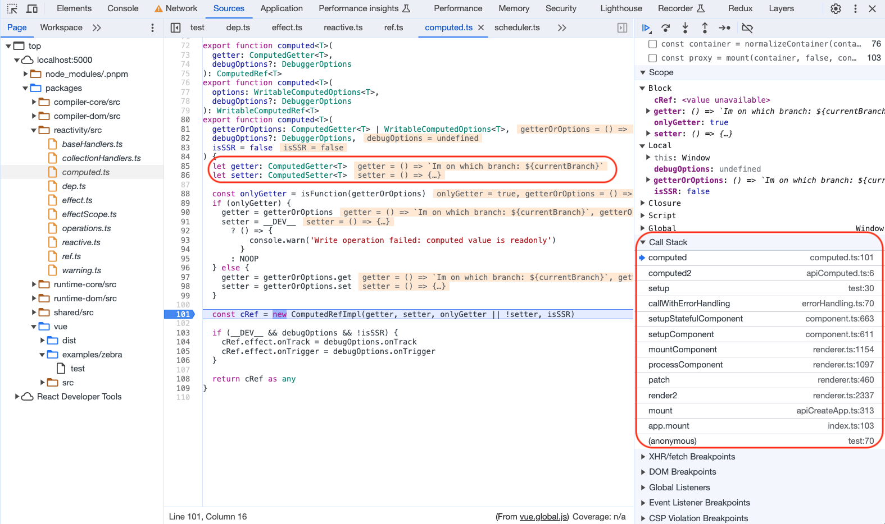
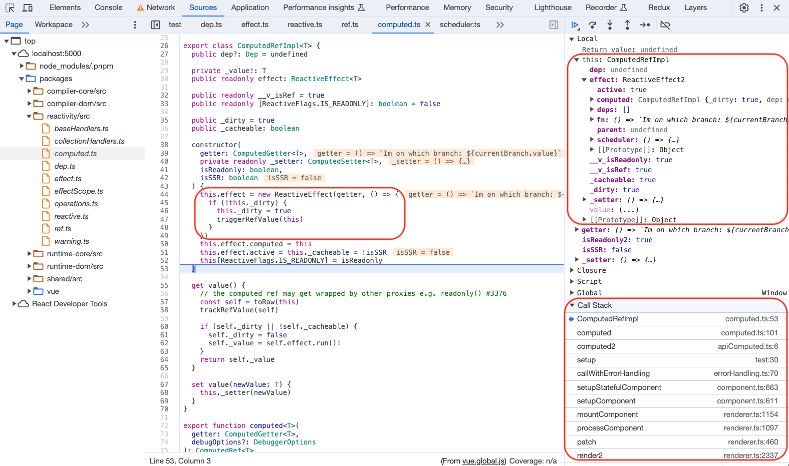
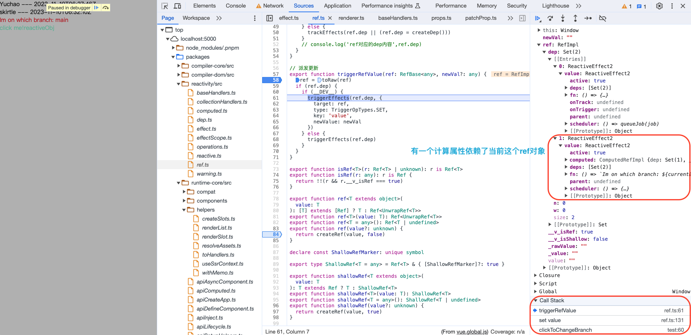
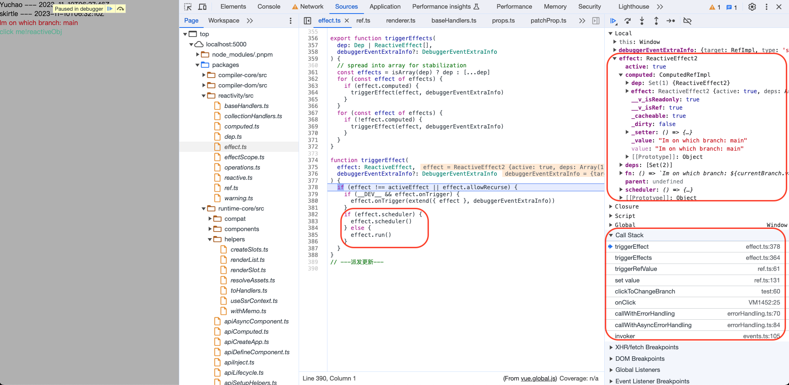
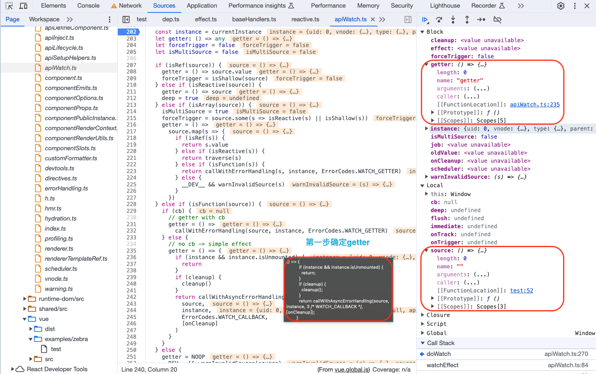
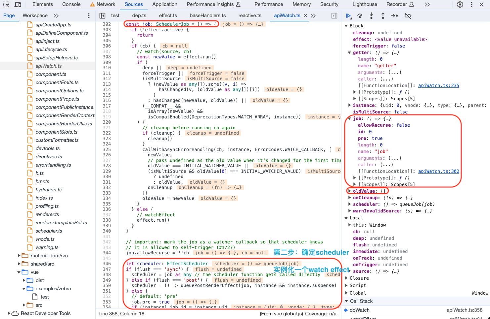
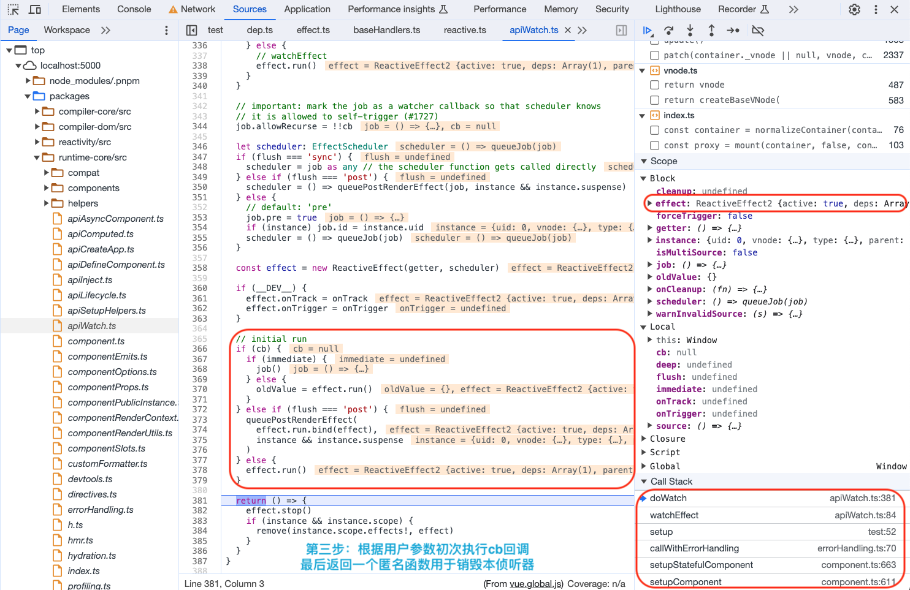
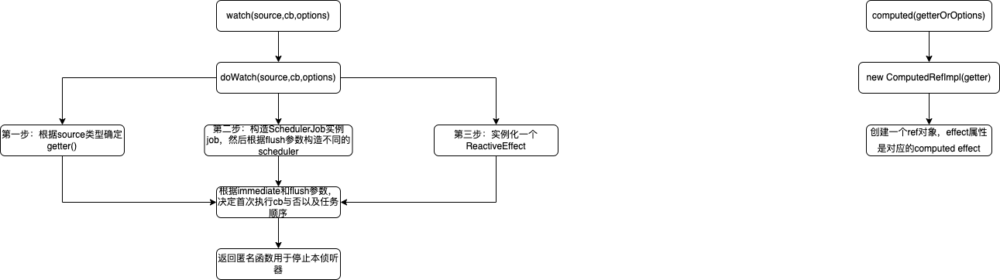

# Vue3 中的 computed 和 watch

除了模板渲染的时候会实例化`<ReactiveEffect>`，用户声明的 `computed()` 和 `watch()` 方法也一样会实例化`<ReactiveEffect>`，用于依赖收集、派发更新，这些也是响应式中的重要内容。

## computed()

### computed API

接受一个 `getter` 函数，返回一个只读的响应式 `ref` 对象。该 `ref` 通过 `.value` 暴露 `getter` 函数的返回值。它也可以接受一个带有 `get` 和 `set` 函数的对象来创建一个可写的 `ref` 对象。

```js
const count = ref(1)
const plusOne = computed(() => count.value + 1)

console.log(plusOne.value) // 2
plusOne.value++ // 错误
```

### computed 实现

- 关键词`<getter>`、`<ComputedRefImpl>`

1. 获取`computed()`参数中的`getter`/`setter`
2. 实例化一个`ComputedRefImp`l对象

```ts
// 【packages/runtime-core/src/apiComputed.ts】
import { computed as _computed } from '@vue/reactivity'
import { isInSSRComponentSetup } from './component'

export const computed = ((getterOrOptions: any, debugOptions?: any) => {
  // @ts-ignore
  return _computed(getterOrOptions, debugOptions, isInSSRComponentSetup)
}) as typeof _computed

// 【packages/reactivity/src/computed.ts】
export function computed<T>(
  getterOrOptions: ComputedGetter<T> | WritableComputedOptions<T>,
  debugOptions?: DebuggerOptions,
  isSSR = false
) {
  // 【第一步获取getter/setter】
  let getter: ComputedGetter<T>
  let setter: ComputedSetter<T>
  //【如果是函数，说明是单一的getter】
  const onlyGetter = isFunction(getterOrOptions)
  if (onlyGetter) {
    getter = getterOrOptions
    setter = __DEV__
      ? () => {
          console.warn('Write operation failed: computed value is readonly')
        }
      : NOOP
  } else {
    //【否则，getter、setter都有传】
    getter = getterOrOptions.get
    setter = getterOrOptions.set
  }

  //【第二步生成一个ComputedRefImpl实例】
  const cRef = new ComputedRefImpl(getter, setter, onlyGetter || !setter, isSSR)

  // 【onTrack、onTrigger用于调试】
  if (__DEV__ && debugOptions && !isSSR) {
    cRef.effect.onTrack = debugOptions.onTrack
    cRef.effect.onTrigger = debugOptions.onTrigger
  }

  return cRef as any
}
```

`ComputedRefImpl`类如下：

```ts
// 【packages/reactivity/src/computed.ts】
export class ComputedRefImpl<T> {
  public dep?: Dep = undefined

  private _value!: T
  public readonly effect: ReactiveEffect<T>

  public readonly __v_isRef = true
  public readonly [ReactiveFlags.IS_READONLY]: boolean = false

  public _dirty = true
  public _cacheable: boolean

  constructor(
    getter: ComputedGetter<T>,
    private readonly _setter: ComputedSetter<T>,
    isReadonly: boolean,
    isSSR: boolean
  ) {
    // 【实例化一个computed effect，并把用户传入的getter作为回调传入】
    // 【_dirty控制着是否需要重新计算也就是执行effect.run()】
    // 【triggerEffect中会根据是否存在scheduler函数调用scheduler或者run方法】
    this.effect = new ReactiveEffect(getter, () => {
      // 【派发更新triggerEffect方法中会调用effect.scheduler()也就是本方法】
      if (!this._dirty) {
        this._dirty = true
        triggerRefValue(this)
      }
    })
    this.effect.computed = this
    this.effect.active = this._cacheable = !isSSR
    this[ReactiveFlags.IS_READONLY] = isReadonly
  }

  get value() {
    // the computed ref may get wrapped by other proxies e.g. readonly() #3376
    //【依赖收集】
    const self = toRaw(this)
    trackRefValue(self)
    //【非ssr的情况下_cacheable始终为true，此时，若_dirty为true的情况，调用computed effect的run()方法，继而回调getter。】
    if (self._dirty || !self._cacheable) {
      self._dirty = false
      self._value = self.effect.run()!
    }
    return self._value
  }

  set value(newValue: T) {
    //【若有传setter调用，否则调用的空函数】
    this._setter(newValue)
  }
}
```






可以看到调用`computed`方法通常传入一个`getter`函数，然后生成一个`ComputedRefImpl`实例，并且创建一个`computed effect`副作用然后`_dirty`设置为true且非SSR时才执行`effect.run()`获取最新值。这个`_dirty`变量是`computed`实现缓存的一个关键内容，默认是true因此`computed`默认第一遍会执行（比如`template`模板中使用了`computed`值会计算一遍），如果`_dirty`为false就不会进行重新计算也就是所谓的缓存。那么什么时候`_dirty`变量会进行改变呢？流程是这样的：

1. 依赖值改变
2. 引起派发更新
3. 调用`effect.scheduler()`
4. `_dirty`改变

因此我们推荐使用计算属性来描述依赖响应式状态的复杂逻辑，计算属性值会基于其响应式依赖被缓存，一个计算属性仅会在其响应式依赖更新时才重新计算。计算属性的 `getter` 应只做计算而没有任何其他的副作用，这一点非常重要，请务必牢记。举例来说，不要在 `getter` 中做异步请求或者更改 `DOM`！一个计算属性的声明中描述的是如何根据其他值派生一个值。因此 `getter` 的职责应该仅为计算和返回该值。

为什么需要缓存呢？想象一下我们有一个非常耗性能的计算属性 `list`，需要循环一个巨大的数组并做许多计算逻辑，并且可能也有其他计算属性依赖于 `list`。没有缓存的话，我们会重复执行非常多次 `list` 的 `getter`，然而这实际上没有必要！如果你确定不需要缓存，那么也可以使用方法调用。从计算属性返回的值是派生状态。可以把它看作是一个“临时快照”，每当源状态发生变化时，就会创建一个新的快照。更改快照是没有意义的，因此计算属性的返回值应该被视为只读的，并且永远不应该被更改——应该更新它所依赖的源状态以触发新的计算。

<!-- 【TODO：3.4.27版本对这块有更新】 -->

构造`ComputedRefImpl`实例的入参`trigger`函数实际调用了`triggerRefValue`方法，和`ref`走的是一个派发更新的方法。然后在进入`triggerRefValue`方法时，`_dirtyLevel`可能是2或3。而入参`fn`回调函数则是调用`getter`也就是用户传入的`getter`函数。

比如计算属性依赖一个ref值，ref值改变引起派发更新，就会引起这个计算属性的trigger函数调用，从而进入这个计算属性的派发更新过程。ref引起计算属性改变(dirtyLevel为4)，计算属性引起它对应的后续改变(比如视图改变，dirtyLevel为3)。如果ref和影响到的计算属性都会引起同一个视图的改变，一旦`dirtyLevel`非0，不会再安排`scheduler`入队，所以不会有重复性的任务入队。

```ts
// 【packages/reactivity/src/computed.ts】
export class ComputedRefImpl<T> {
  public dep?: Dep = undefined

  private _value!: T
  public readonly effect: ReactiveEffect<T>

  public readonly __v_isRef = true
  public readonly [ReactiveFlags.IS_READONLY]: boolean = false

  public _cacheable: boolean

  /**
   * Dev only
   */
  _warnRecursive?: boolean

  constructor(
    private getter: ComputedGetter<T>,
    private readonly _setter: ComputedSetter<T>,
    isReadonly: boolean,
    isSSR: boolean,
  ) {
    this.effect = new ReactiveEffect(
      () => getter(this._value),
      () =>
        triggerRefValue(
          this,
          this.effect._dirtyLevel === DirtyLevels.MaybeDirty_ComputedSideEffect
            ? DirtyLevels.MaybeDirty_ComputedSideEffect
            : DirtyLevels.MaybeDirty,
        ),
    )
    this.effect.computed = this
    this.effect.active = this._cacheable = !isSSR
    this[ReactiveFlags.IS_READONLY] = isReadonly
  }

  get value() {
    // the computed ref may get wrapped by other proxies e.g. readonly() #3376
    const self = toRaw(this)
    if (
      (!self._cacheable || self.effect.dirty) &&
      hasChanged(self._value, (self._value = self.effect.run()!))
    ) {
      triggerRefValue(self, DirtyLevels.Dirty)
    }
    trackRefValue(self)
    if (self.effect._dirtyLevel >= DirtyLevels.MaybeDirty_ComputedSideEffect) {
      if (__DEV__ && (__TEST__ || this._warnRecursive)) {
        warn(COMPUTED_SIDE_EFFECT_WARN, `\n\ngetter: `, this.getter)
      }
      triggerRefValue(self, DirtyLevels.MaybeDirty_ComputedSideEffect)
    }
    return self._value
  }

  set value(newValue: T) {
    this._setter(newValue)
  }

  // #region polyfill _dirty for backward compatibility third party code for Vue <= 3.3.x
  get _dirty() {
    return this.effect.dirty
  }

  set _dirty(v) {
    this.effect.dirty = v
  }
  // #endregion
}
```

## watch()

### watch API

1. **watch()**
`watch()` 默认是懒侦听的，即仅在侦听源发生变化时才执行回调函数。
   1. 第一个参数是侦听器的源。这个来源可以是以下几种：
      - 一个函数，返回一个值
      - 一个 ref
      - 一个响应式对象
      - ...或是由以上类型的值组成的数组

   2. 第二个参数是在发生变化时要调用的回调函数。这个回调函数接受三个参数：新值、旧值，以及一个用于注册副作用清理的回调函数。该回调函数会在副作用下一次重新执行前调用，可以用来清除无效的副作用，例如等待中的异步请求。当侦听多个来源时，回调函数接受两个数组，分别对应来源数组中的新值和旧值。

   3. 第三个可选的参数是一个对象，支持以下这些选项：
      - `immediate`：在侦听器创建时立即触发回调。第一次调用时旧值是 undefined。
      - `deep`：如果源是对象，强制深度遍历，以便在深层级变更时触发回调。参考深层侦听器。
      - `flush`：调整回调函数的刷新时机。参考回调的刷新时机及 `watchEffect()`。
      - `onTrack` / `onTrigger`：调试侦听器的依赖。参考调试侦听器。

   4. 与 `watchEffect()` 相比，`watch()` 使我们可以：
      - 懒执行副作用；
      - 更加明确是应该由哪个状态触发侦听器重新执行；
      - 可以访问所侦听状态的前一个值和当前值。

2. **watchEffect()**
立即运行一个函数，同时响应式地追踪其依赖，并在依赖更改时重新执行。

3. **watchPostEffect()**
`watchEffect()` 使用 `flush: 'post'` 选项时的别名。设置 `flush: 'post'` 将会使侦听器延迟到组件渲染之后再执行。当你更改了响应式状态，它可能会同时触发 `Vue` 组件更新和侦听器回调。默认情况下，用户创建的侦听器回调，都会在 `Vue` 组件更新之前被调用。这意味着你在侦听器回调中访问的 DOM 将是被 `Vue` 更新之前的状态。如果想在侦听器回调中能访问被 `Vue` 更新之后的 DOM，你需要指明 `flush: 'post'` 选项

4. **watchSyncEffect()**
`watchEffect()` 使用 `flush: 'sync'` 选项时的别名。在某些特殊情况下 (例如要使缓存失效)，可能有必要在响应式依赖发生改变时立即触发侦听器。这可以通过设置 `flush: 'sync'` 来实现。然而，该设置应谨慎使用，因为如果有多个属性同时更新，这将导致一些性能和数据一致性的问题。

```js
const count = ref(0)
watch(count, (count, prevCount) => {
  /* ... */
})
```

在 `setup()` 或 `<script setup>` 中用同步语句创建的侦听器，会自动绑定到宿主组件实例上，并且会在宿主组件卸载时自动停止。因此，在大多数情况下，你无需关心怎么停止一个侦听器。

一个关键点是，侦听器必须用同步语句创建：如果用异步回调创建一个侦听器，那么它不会绑定到当前组件上，你必须手动停止它，以防内存泄漏。如下方这个例子：

```vue
<script setup>
import { watchEffect } from 'vue'

// 它会自动停止
watchEffect(() => {})

// ...这个则不会！
setTimeout(() => {
  watchEffect(() => {})
}, 100)
</script>
```

要手动停止一个侦听器，请调用 `watch` 或 `watchEffect` 返回的函数：

```js
const unwatch = watchEffect(() => {})

// ...当该侦听器不再需要时
unwatch()
```

注意，需要异步创建侦听器的情况很少，请尽可能选择同步创建。如果需要等待一些异步数据，你可以使用条件式的侦听逻辑：

```js
// 需要异步请求得到的数据
const data = ref(null)

watchEffect(() => {
  if (data.value) {
    // 数据加载后执行某些操作...
  }
})
```

### watch 实现

调用`watch`方法可以传入`source`、`cb`回调、`options`，然后创建一个对应的`watch effect`副作用，有`cb`回调执行回调，否则执行`effect.run()`。

`watch()`/`watchEffect()`/`watchPostEffect()`/`watchSyncEffect()`四个API的区别在于调用`doWatch()`方法时入参：

- `watch()`: `doWatch(source as any, cb, options)`
- `watchEffect()`: `doWatch(effect, null, options)`
- `watchPostEffect()`: `doWatch(effect,null,(__DEV__ ? { ...options, flush: 'post' } : { flush: 'post' }) as WatchOptionsBase)`
- `watchSyncEffect()`: `doWatch(effect,null,(__DEV__? { ...options, flush: 'sync' } : { flush: 'sync' }) as WatchOptionsBase)`

```ts
// 【packages/runtime-core/src/apiWatch.ts】
// overload: array of multiple sources + cb
export function watch<
  T extends MultiWatchSources,
  Immediate extends Readonly<boolean> = false
>(
  sources: [...T],
  cb: WatchCallback<MapSources<T, false>, MapSources<T, Immediate>>,
  options?: WatchOptions<Immediate>
): WatchStopHandle

// overload: multiple sources w/ `as const`
// watch([foo, bar] as const, () => {})
// somehow [...T] breaks when the type is readonly
export function watch<
  T extends Readonly<MultiWatchSources>,
  Immediate extends Readonly<boolean> = false
>(
  source: T,
  cb: WatchCallback<MapSources<T, false>, MapSources<T, Immediate>>,
  options?: WatchOptions<Immediate>
): WatchStopHandle

// overload: single source + cb
export function watch<T, Immediate extends Readonly<boolean> = false>(
  source: WatchSource<T>,
  cb: WatchCallback<T, Immediate extends true ? T | undefined : T>,
  options?: WatchOptions<Immediate>
): WatchStopHandle

// overload: watching reactive object w/ cb
export function watch<
  T extends object,
  Immediate extends Readonly<boolean> = false
>(
  source: T,
  cb: WatchCallback<T, Immediate extends true ? T | undefined : T>,
  options?: WatchOptions<Immediate>
): WatchStopHandle

// implementation
export function watch<T = any, Immediate extends Readonly<boolean> = false>(
  source: T | WatchSource<T>,
  cb: any,
  options?: WatchOptions<Immediate>
): WatchStopHandle {
  if (__DEV__ && !isFunction(cb)) {
    warn(
      `\`watch(fn, options?)\` signature has been moved to a separate API. ` +
        `Use \`watchEffect(fn, options?)\` instead. \`watch\` now only ` +
        `supports \`watch(source, cb, options?) signature.`
    )
  }
  return doWatch(source as any, cb, options)
}

// Simple effect.
export function watchEffect(
  effect: WatchEffect,
  options?: WatchOptionsBase
): WatchStopHandle {
  return doWatch(effect, null, options)
}

export function watchPostEffect(
  effect: WatchEffect,
  options?: DebuggerOptions
) {
  return doWatch(
    effect,
    null,
    (__DEV__
      ? { ...options, flush: 'post' }
      : { flush: 'post' }) as WatchOptionsBase
  )
}

export function watchSyncEffect(
  effect: WatchEffect,
  options?: DebuggerOptions
) {
  return doWatch(
    effect,
    null,
    (__DEV__
      ? { ...options, flush: 'sync' }
      : { flush: 'sync' }) as WatchOptionsBase
  )
}
```

接下来看`doWatch`的实现分为以下几个步骤：

- 根据用户传入的不同类型数据，构造`getter()`方法用于后续实例化`watch effect`，监听响应式数据，进行依赖收集
- 实例化一个`SchedulerJob`，如果有`cb`回调函数，除了执行对应`watch effect`的`run()`方法得到`newValue`之外还要执行`cb`回调函数，然后根据`options`里的`flush`参数确定执行时机，这个`scheduler`也用于后续实例化`watch effect`
- 实例化一个`ReactiveEffect`，用于依赖收集、派发更新，并且根据`flush`参数确认`scheduler`任务到底加入哪个任务队列
- 初始操作，根据`immediate`等参数判断是否立即执行一次回调

```ts
// 【packages/runtime-core/src/apiWatch.ts】
// initial value for watchers to trigger on undefined initial values
const INITIAL_WATCHER_VALUE = {}

export type WatchEffect = (onCleanup: OnCleanup) => void

export type WatchSource<T = any> = Ref<T> | ComputedRef<T> | (() => T)

export type WatchCallback<V = any, OV = any> = (
  value: V,
  oldValue: OV,
  onCleanup: OnCleanup
) => any

type MultiWatchSources = (WatchSource<unknown> | object)[]

// 【source观察对象，cb回调，{ immediate, deep, flush, onTrack, onTrigger }可选参数】
function doWatch(
  source: WatchSource | WatchSource[] | WatchEffect | object,
  cb: WatchCallback | null,
  { immediate, deep, flush, onTrack, onTrigger }: WatchOptions = EMPTY_OBJ
): WatchStopHandle {
  if (__DEV__ && !cb) {
    if (immediate !== undefined) {
      warn(
        `watch() "immediate" option is only respected when using the ` +
          `watch(source, callback, options?) signature.`
      )
    }
    if (deep !== undefined) {
      warn(
        `watch() "deep" option is only respected when using the ` +
          `watch(source, callback, options?) signature.`
      )
    }
  }

  const warnInvalidSource = (s: unknown) => {
    warn(
      `Invalid watch source: `,
      s,
      `A watch source can only be a getter/effect function, a ref, ` +
        `a reactive object, or an array of these types.`
    )
  }

  //【根据用户传入的source包装getter函数，本质就是根据用户传递的内容确定到底监听什么内容】
  const instance = currentInstance
  let getter: () => any
  let forceTrigger = false
  let isMultiSource = false

  if (isRef(source)) {
    // 【source是ref】
    getter = () => source.value
    forceTrigger = isShallow(source)
  } else if (isReactive(source)) {
    // 【source是reactive，deep选项默认true，进行深层级监听】
    getter = () => source
    deep = true
  } else if (isArray(source)) {
    // 【source是array，遍历处理，每一项再去判断isRef、isReactive、isFunction】
    isMultiSource = true
    forceTrigger = source.some(s => isReactive(s) || isShallow(s))
    getter = () =>
      source.map(s => {
        if (isRef(s)) {
          return s.value
        } else if (isReactive(s)) {
          return traverse(s)
        } else if (isFunction(s)) {
          return callWithErrorHandling(s, instance, ErrorCodes.WATCH_GETTER)
        } else {
          __DEV__ && warnInvalidSource(s)
        }
      })
  } else if (isFunction(source)) {
    // 【source是getter函数】
    if (cb) {
      // getter with cb
      //【有cb回调，执行source方法】
      getter = () =>
        callWithErrorHandling(source, instance, ErrorCodes.WATCH_GETTER)
    } else {
      //【未传cb回调，执行source方法】
      // no cb -> simple effect
      getter = () => {
        //【如果还没挂载则返回，此时还取不到响应式数据】
        if (instance && instance.isUnmounted) {
          return
        }
        if (cleanup) {
          cleanup()
        }
        return callWithAsyncErrorHandling(
          source,
          instance,
          ErrorCodes.WATCH_CALLBACK,
          [onCleanup]
        )
      }
    }
  } else {
    getter = NOOP
    __DEV__ && warnInvalidSource(source)
  }

  // 2.x array mutation watch compat
  if (__COMPAT__ && cb && !deep) {
    const baseGetter = getter
    getter = () => {
      const val = baseGetter()
      if (
        isArray(val) &&
        checkCompatEnabled(DeprecationTypes.WATCH_ARRAY, instance)
      ) {
        traverse(val)
      }
      return val
    }
  }

  //【deep为true，则深度遍历getter返回的响应式对象】
  if (cb && deep) {
    const baseGetter = getter
    getter = () => traverse(baseGetter())
  }

  let cleanup: () => void
  let onCleanup: OnCleanup = (fn: () => void) => {
    cleanup = effect.onStop = () => {
      callWithErrorHandling(fn, instance, ErrorCodes.WATCH_CLEANUP)
    }
  }

  // in SSR there is no need to setup an actual effect, and it should be noop
  // unless it's eager
  if (__SSR__ && isInSSRComponentSetup) {
    // we will also not call the invalidate callback (+ runner is not set up)
    onCleanup = NOOP
    if (!cb) {
      getter()
    } else if (immediate) {
      callWithAsyncErrorHandling(cb, instance, ErrorCodes.WATCH_CALLBACK, [
        getter(),
        isMultiSource ? [] : undefined,
        onCleanup
      ])
    }
    return NOOP
  }

  //【根据是否多项source获取旧值】
  let oldValue: any = isMultiSource
    ? new Array((source as []).length).fill(INITIAL_WATCHER_VALUE)
    : INITIAL_WATCHER_VALUE

  // 【新建一个SchedulerJob类型的job】
  const job: SchedulerJob = () => {
    if (!effect.active) {
      return
    }
    // 有回调函数
    if (cb) {
      // watch(source, cb)
      const newValue = effect.run()
      //【deep为true，监听的是reactive对象，新旧值有变化等情况下，执行callback回调】
      //【将oldValue,newValue,onCleanup都作为callback的入参】
      if (
        deep ||
        forceTrigger ||
        (isMultiSource
          ? (newValue as any[]).some((v, i) =>
              hasChanged(v, (oldValue as any[])[i])
            )
          : hasChanged(newValue, oldValue)) ||
        (__COMPAT__ &&
          isArray(newValue) &&
          isCompatEnabled(DeprecationTypes.WATCH_ARRAY, instance))
      ) {
        // cleanup before running cb again
        if (cleanup) {
          cleanup()
        }
        //【执行回调函数，并传入新旧值】
        callWithAsyncErrorHandling(cb, instance, ErrorCodes.WATCH_CALLBACK, [
          newValue,
          // pass undefined as the old value when it's changed for the first time
          oldValue === INITIAL_WATCHER_VALUE ||
          (isMultiSource && oldValue[0] === INITIAL_WATCHER_VALUE)
            ? undefined
            : oldValue,
          onCleanup
        ])
        // 用新值将旧值覆盖
        oldValue = newValue
      }
    } else {
      //【没有cb回调函数，直接执行对应副作用的run()方法】
      // watchEffect
      effect.run()
    }
  }

  // important: mark the job as a watcher callback so that scheduler knows
  // it is allowed to self-trigger (#1727)
  job.allowRecurse = !!cb

  // 【根据用户传入的flush值定义scheduler调度函数，sync->pre->post，加入job队列】
  let scheduler: EffectScheduler
  if (flush === 'sync') {
    scheduler = job as any // the scheduler function gets called directly
  } else if (flush === 'post') {
    scheduler = () => queuePostRenderEffect(job, instance && instance.suspense)
  } else {
    // default: 'pre'
    job.pre = true
    if (instance) job.id = instance.uid
    scheduler = () => queueJob(job)
  }

  // 【实例化一个watch effect,run方法里会回调getter，scheduler方法根据用户配置插入不同时机的任务队列】
  const effect = new ReactiveEffect(getter, scheduler)

  if (__DEV__) {
    effect.onTrack = onTrack
    effect.onTrigger = onTrigger
  }

  //【首次执行】
  // initial run
  if (cb) {
    //【有回调函数】
    if (immediate) {//【immediate为true，watch创建时立即执行回调】
      job()
    } else {//【不立即执行回调，仅获取初始值】
      oldValue = effect.run()
    }
  } else if (flush === 'post') {
    queuePostRenderEffect(
      effect.run.bind(effect),
      instance && instance.suspense
    )
  } else {
    effect.run()
  }

  // 【当已不再需要该侦听器时，直接调用本侦听器】
  return () => {
    // 【返回一个匿名函数，停止本侦听器】
    effect.stop()
    if (instance && instance.scope) {
      remove(instance.scope.effects!, effect)
    }
  }
}
```





<!-- 【TODO：3.4.27版本对这块有更新】 -->
`watch`和之前版本类似，仍旧是构造`job`并根据入参`flush`到底是加入前置任务队列还是后置，`job`根据是否有回调函数cb进行不同处理。还有构造对应`watch effect`。

```ts
// 【packages/runtime-core/src/apiWatch.ts】
function doWatch(
  source: WatchSource | WatchSource[] | WatchEffect | object,
  cb: WatchCallback | null,
  {
    immediate,
    deep,
    flush,
    once,
    onTrack,
    onTrigger,
  }: WatchOptions = EMPTY_OBJ,
): WatchStopHandle {
  if (cb && once) {
    const _cb = cb
    cb = (...args) => {
      _cb(...args)
      unwatch()
    }
  }

  // TODO remove in 3.5
  if (__DEV__ && deep !== void 0 && typeof deep === 'number') {
    warn(
      `watch() "deep" option with number value will be used as watch depth in future versions. ` +
        `Please use a boolean instead to avoid potential breakage.`,
    )
  }

  if (__DEV__ && !cb) {
    if (immediate !== undefined) {
      warn(
        `watch() "immediate" option is only respected when using the ` +
          `watch(source, callback, options?) signature.`,
      )
    }
    if (deep !== undefined) {
      warn(
        `watch() "deep" option is only respected when using the ` +
          `watch(source, callback, options?) signature.`,
      )
    }
    if (once !== undefined) {
      warn(
        `watch() "once" option is only respected when using the ` +
          `watch(source, callback, options?) signature.`,
      )
    }
  }

  const warnInvalidSource = (s: unknown) => {
    warn(
      `Invalid watch source: `,
      s,
      `A watch source can only be a getter/effect function, a ref, ` +
        `a reactive object, or an array of these types.`,
    )
  }

  const instance = currentInstance
  const reactiveGetter = (source: object) =>
    deep === true
      ? source // traverse will happen in wrapped getter below
      : // for deep: false, only traverse root-level properties
        traverse(source, deep === false ? 1 : undefined)

  let getter: () => any
  let forceTrigger = false
  let isMultiSource = false

  if (isRef(source)) {
    getter = () => source.value
    forceTrigger = isShallow(source)
  } else if (isReactive(source)) {
    getter = () => reactiveGetter(source)
    forceTrigger = true
  } else if (isArray(source)) {
    isMultiSource = true
    forceTrigger = source.some(s => isReactive(s) || isShallow(s))
    getter = () =>
      source.map(s => {
        if (isRef(s)) {
          return s.value
        } else if (isReactive(s)) {
          return reactiveGetter(s)
        } else if (isFunction(s)) {
          return callWithErrorHandling(s, instance, ErrorCodes.WATCH_GETTER)
        } else {
          __DEV__ && warnInvalidSource(s)
        }
      })
  } else if (isFunction(source)) {
    if (cb) {
      // getter with cb
      getter = () =>
        callWithErrorHandling(source, instance, ErrorCodes.WATCH_GETTER)
    } else {
      // no cb -> simple effect
      getter = () => {
        if (cleanup) {
          cleanup()
        }
        return callWithAsyncErrorHandling(
          source,
          instance,
          ErrorCodes.WATCH_CALLBACK,
          [onCleanup],
        )
      }
    }
  } else {
    getter = NOOP
    __DEV__ && warnInvalidSource(source)
  }

  // 2.x array mutation watch compat
  if (__COMPAT__ && cb && !deep) {
    const baseGetter = getter
    getter = () => {
      const val = baseGetter()
      if (
        isArray(val) &&
        checkCompatEnabled(DeprecationTypes.WATCH_ARRAY, instance)
      ) {
        traverse(val)
      }
      return val
    }
  }

  if (cb && deep) {
    const baseGetter = getter
    getter = () => traverse(baseGetter())
  }

  let cleanup: (() => void) | undefined
  let onCleanup: OnCleanup = (fn: () => void) => {
    cleanup = effect.onStop = () => {
      callWithErrorHandling(fn, instance, ErrorCodes.WATCH_CLEANUP)
      cleanup = effect.onStop = undefined
    }
  }

  // in SSR there is no need to setup an actual effect, and it should be noop
  // unless it's eager or sync flush
  let ssrCleanup: (() => void)[] | undefined
  if (__SSR__ && isInSSRComponentSetup) {
    // we will also not call the invalidate callback (+ runner is not set up)
    onCleanup = NOOP
    if (!cb) {
      getter()
    } else if (immediate) {
      callWithAsyncErrorHandling(cb, instance, ErrorCodes.WATCH_CALLBACK, [
        getter(),
        isMultiSource ? [] : undefined,
        onCleanup,
      ])
    }
    if (flush === 'sync') {
      const ctx = useSSRContext()!
      ssrCleanup = ctx.__watcherHandles || (ctx.__watcherHandles = [])
    } else {
      return NOOP
    }
  }

  let oldValue: any = isMultiSource
    ? new Array((source as []).length).fill(INITIAL_WATCHER_VALUE)
    : INITIAL_WATCHER_VALUE
  const job: SchedulerJob = () => {
    if (!effect.active || !effect.dirty) {
      return
    }
    if (cb) {
      // watch(source, cb)
      const newValue = effect.run()
      if (
        deep ||
        forceTrigger ||
        (isMultiSource
          ? (newValue as any[]).some((v, i) => hasChanged(v, oldValue[i]))
          : hasChanged(newValue, oldValue)) ||
        (__COMPAT__ &&
          isArray(newValue) &&
          isCompatEnabled(DeprecationTypes.WATCH_ARRAY, instance))
      ) {
        // cleanup before running cb again
        if (cleanup) {
          cleanup()
        }
        callWithAsyncErrorHandling(cb, instance, ErrorCodes.WATCH_CALLBACK, [
          newValue,
          // pass undefined as the old value when it's changed for the first time
          oldValue === INITIAL_WATCHER_VALUE
            ? undefined
            : isMultiSource && oldValue[0] === INITIAL_WATCHER_VALUE
              ? []
              : oldValue,
          onCleanup,
        ])
        oldValue = newValue
      }
    } else {
      // watchEffect
      effect.run()
    }
  }

  // important: mark the job as a watcher callback so that scheduler knows
  // it is allowed to self-trigger (#1727)
  job.allowRecurse = !!cb

  let scheduler: EffectScheduler
  if (flush === 'sync') {
    scheduler = job as any // the scheduler function gets called directly
  } else if (flush === 'post') {
    scheduler = () => queuePostRenderEffect(job, instance && instance.suspense)
  } else {
    // default: 'pre'
    job.pre = true
    if (instance) job.id = instance.uid
    scheduler = () => queueJob(job)
  }

  const effect = new ReactiveEffect(getter, NOOP, scheduler)

  const scope = getCurrentScope()
  const unwatch = () => {
    effect.stop()
    if (scope) {
      remove(scope.effects, effect)
    }
  }

  if (__DEV__) {
    effect.onTrack = onTrack
    effect.onTrigger = onTrigger
  }

  // initial run
  if (cb) {
    if (immediate) {
      job()
    } else {
      oldValue = effect.run()
    }
  } else if (flush === 'post') {
    queuePostRenderEffect(
      effect.run.bind(effect),
      instance && instance.suspense,
    )
  } else {
    effect.run()
  }

  if (__SSR__ && ssrCleanup) ssrCleanup.push(unwatch)
  return unwatch
}
```

## computed() 和 watch() 异同

1. 实例化 `ReactiveEffect` 时，`watch`会根据用户的配置去构造 `scheduler` 方法然后放入合适的任务队列，而 `computed` 则是相当于构造一个类`ref`对象直接包装 `triggerRefValue` 这个依赖收集方法。
2. `computed`用`_dirty`参数（默认true）判断是否需要执行对应`effect`实例的`run`方法去获取最新值，而`watch`默认懒执行，除非用户指定`immediate`配置。


