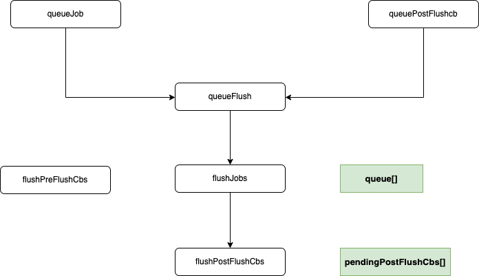

# 任务队列和nextTick

## nextTick 定义

等待下一次 `DOM` 更新刷新的工具方法。

当你在 `Vue` 中更改响应式状态时，最终的 `DOM` 更新并不是同步生效的，而是由 `Vue` 将任务缓存在一个队列中，直到下一个`tick`才一起执行。这样是为了确保每个组件无论发生多少状态改变，都仅执行一次更新。`nextTick()` 可以在状态改变后立即使用，以等待 `DOM` 更新完成。你可以传递一个回调函数作为参数，或者 `await` 返回的 `Promise`。

## nextTick 实现

`nextTick()`实现在`runtime-core/scheduler.ts`，可以看到Vue3中使用的是`Promise`方法微任务回调用户的内容，Vue2中则是判断当前环境是否能使用几种方法，最差就降级到`setTimeout`方法：

```ts
// 【packages/runtime-core/src/scheduler.ts】
const resolvedPromise = /*#__PURE__*/ Promise.resolve() as Promise<any>
let currentFlushPromise: Promise<void> | null = null
// 【如果当前正在执行Flush更新，则在currentFlushPromise执行resolve以后再执行用户Fn】
// 【如果当前没有正在执行的内容，直接用Promise.resolve()执行then操作调用用户Fn】
export function nextTick<T = void>(
  this: T,
  fn?: (this: T) => void
): Promise<void> {
  const p = currentFlushPromise || resolvedPromise
  return fn ? p.then(this ? fn.bind(this) : fn) : p
}
```

## Vue3中的任务队列执行机制

前文中可以知道在实例化`ReactiveEffect`对象时，有两个至关重要的参数，第一个是`fn`回调，第二个是`scheduler`，这个`scheduler`通常是一个匿名函数，内部会调用`queueJob`、`queuePostRenderEffect`(其实也就是`queuePostFlushCb`)等方法去安排job在哪个阶段执行。

Vue3中有三个任务队列：

- `Pre`队列：组件更新前置任务队列（但没有单独的数据结构，而是把按序执行`queue`任务队列当作执行前置任务队列）
- `Queue`队列：组件更新时的任务队列`queue[]`，允许插队，按任务id从小大排列执行
- `Post`队列：组件更新后置任务队列`pendingPostFlushCbs[]`，允许插队，按任务id从小大排列执行

从加入job队列到执行完整个过程如下：**queueJob/queuePostFlushCb -> queueFlush -> flushJobs -> flushPostFlushCbs -> nextTick的fn回调**，每个队列中的任务有两种状态：等待执行任务、执行任务中。

- `queueJob()`/`queuePostFlushCb()`方法把任务加进任务队列
- `queueFlush`是任务队列开始执行前的准备工作会把任务队列的执行放入`promise.then()`中
- `flushJobs()`/`flushPostFlushCbs()`则是遍历执行`queue`/`pendingPostFlushCbs`任务队列

相关的数据定义如下，可以看到定义了一个主任务队列和后置任务队列，前置任务也用了主任务队列，只不过放在最前面：

```ts
// 【一个任务】
export interface SchedulerJob extends Function {
  id?: number
  pre?: boolean
  active?: boolean
  computed?: boolean
  /**
   * Indicates whether the effect is allowed to recursively trigger itself
   * when managed by the scheduler.
   *
   * By default, a job cannot trigger itself because some built-in method calls,
   * e.g. Array.prototype.push actually performs reads as well (#1740) which
   * can lead to confusing infinite loops.
   * The allowed cases are component update functions and watch callbacks.
   * Component update functions may update child component props, which in turn
   * trigger flush: "pre" watch callbacks that mutates state that the parent
   * relies on (#1801). Watch callbacks doesn't track its dependencies so if it
   * triggers itself again, it's likely intentional and it is the user's
   * responsibility to perform recursive state mutation that eventually
   * stabilizes (#1727).
   */
  allowRecurse?: boolean
  /**
   * Attached by renderer.ts when setting up a component's render effect
   * Used to obtain component information when reporting max recursive updates.
   * dev only.
   */
  ownerInstance?: ComponentInternalInstance
}
// 【一些任务】
export type SchedulerJobs = SchedulerJob | SchedulerJob[]

let isFlushing = false
let isFlushPending = false

//【核心-主任务队列】
const queue: SchedulerJob[] = []
let flushIndex = 0

// 【后置任务队列】
const pendingPostFlushCbs: SchedulerJob[] = []
let activePostFlushCbs: SchedulerJob[] | null = null
let postFlushIndex = 0

// 【用于执行任务队列的Promise实例】
const resolvedPromise = /*#__PURE__*/ Promise.resolve() as Promise<any>
let currentFlushPromise: Promise<void> | null = null

const RECURSION_LIMIT = 100
type CountMap = Map<SchedulerJob, number>
```

### 任务 `EffectScheduler`

`EffectScheduler` 其实就是一个匿名函数类型，通常用来包装`SchedulerJob`任务实例，为其安排合适的任务队列位置。

在实例化`ReactiveEffect`的构造函数中我们可以看到，第一个参数是用于`effect.run()`里回调用的`fn`，第二个`scheduler`是在派发更新的时候如果有`scheduler`函数会调用`scheduler`函数否则调用`run`函数。

```ts
export type EffectScheduler = (...args: any[]) => any

constructor(
  public fn: () => T,
  public scheduler: EffectScheduler | null = null,
  scope?: EffectScope
) {
  recordEffectScope(this, scope)
}

function triggerEffect(
  effect: ReactiveEffect,
  debuggerEventExtraInfo?: DebuggerEventExtraInfo
) {
  if (effect !== activeEffect || effect.allowRecurse) {
    if (__DEV__ && effect.onTrigger) {
      effect.onTrigger(extend({ effect }, debuggerEventExtraInfo))
    }
    if (effect.scheduler) {
      effect.scheduler()
    } else {
      effect.run()
    }
  }
}
```

对`EffectScheduler`实例的使用有如下场景：

- 可以看到在`mountComponent`组件挂载/更新过程中调用的`setupRenderEffect`方法里这样一段构造了一个`scheduler`，调用`queueJob`把当前任务加入主任务队列：

```ts
// 【定义一个名叫update的SchedulerJob类型job】
const update: SchedulerJob = (instance.update = () => effect.run())
update.id = instance.uid //组件实例的uid作为job的id，用于后序排序，按先父后子顺序执行（父先建uid更小）

// create reactive effect for rendering
const effect = (instance.effect = new ReactiveEffect(
  componentUpdateFn,
  () => queueJob(update),
  instance.scope // track it in component's effect scope
))
```

- 在`watch`中也构造了一个`scheduler`，根据用户传入的参数是`post`/`pre`(默认`pre`)调用`queuePostRenderEffect`/`queueJob`把当前任务加入任务队列，若是`sync`则`scheduler`直接为当前`EffectScheduler`实例直接同步执行：

```ts
const job: SchedulerJob = () => {
  if (!effect.active) {
    return
  }
  // 有回调函数
  if (cb) {
    // watch(source, cb)
    const newValue = effect.run()
    //【deep为true，监听的是reactive对象，新旧值有变化等情况下，执行callback回调】
    //【将oldValue,newValue,onCleanup都作为callback的入参】
    if (
      deep ||
      forceTrigger ||
      (isMultiSource
        ? (newValue as any[]).some((v, i) =>
            hasChanged(v, (oldValue as any[])[i])
          )
        : hasChanged(newValue, oldValue)) ||
      (__COMPAT__ &&
        isArray(newValue) &&
        isCompatEnabled(DeprecationTypes.WATCH_ARRAY, instance))
    ) {
      // cleanup before running cb again
      if (cleanup) {
        cleanup()
      }
      //【执行回调函数，并传入新旧值】
      callWithAsyncErrorHandling(cb, instance, ErrorCodes.WATCH_CALLBACK, [
        newValue,
        // pass undefined as the old value when it's changed for the first time
        oldValue === INITIAL_WATCHER_VALUE ||
        (isMultiSource && oldValue[0] === INITIAL_WATCHER_VALUE)
          ? undefined
          : oldValue,
        onCleanup
      ])
      // 用新值将旧值覆盖
      oldValue = newValue
    }
  } else {
    //【没有cb回调函数，直接执行对应副作用的run()方法】
    // watchEffect
    effect.run()
  }
}
// important: mark the job as a watcher callback so that scheduler knows
// it is allowed to self-trigger (#1727)
job.allowRecurse = !!cb

let scheduler: EffectScheduler
if (flush === 'sync') {
  scheduler = job as any // the scheduler function gets called directly
} else if (flush === 'post') {
  scheduler = () => queuePostRenderEffect(job, instance && instance.suspense)
} else {
  // default: 'pre'
  job.pre = true
  if (instance) job.id = instance.uid
  scheduler = () => queueJob(job)
}

const effect = new ReactiveEffect(getter, scheduler)
```

### 入队 `queueJob()` => `queueFlush()`

该方法负责维护**主任务队列**，接受一个函数作为参数，为待入队任务，会将任务 `push` 到 `queue` 队列中，会判断是否唯一。会在当前宏任务执行结束后，清空队列。

```ts
// 【packages/runtime-core/src/scheduler.ts】
// 【加入主任务队列-queue】
const queue: SchedulerJob[] = []//任务队列
let flushIndex = 0

export function queueJob(job: SchedulerJob) {
  // the dedupe search uses the startIndex argument of Array.includes()
  // by default the search index includes the current job that is being run
  // so it cannot recursively trigger itself again.
  // if the job is a watch() callback, the search will start with a +1 index to
  // allow it recursively trigger itself - it is the user's responsibility to
  // ensure it doesn't end up in an infinite loop.
  // 【当queue队列中没有job时（队长为0）或者queue队列中不包含当前job时】
  // 【当前job没有id直接加入队列，当前job有id则用splice方法替换相同id的job(更新这个job)】
  if (
    !queue.length ||
    !queue.includes(
      job,
      isFlushing && job.allowRecurse ? flushIndex + 1 : flushIndex
    )
  ) {
    if (job.id == null) {
      queue.push(job)
    } else {
      queue.splice(findInsertionIndex(job.id), 0, job)//【二分查找某id的job】
    }
    queueFlush()
  }
}

```

### 入队 `queuePostFlushCb()` => `queueFlush()`

该方法负责维护**后置任务队列**，会将任务 `push` 到 `pendingPostFlushCbs` 队列中。会紧接着主任务队列执行结束后，清空队列。

```ts
const pendingPostFlushCbs: SchedulerJob[] = []
let activePostFlushCbs: SchedulerJob[] | null = null
let postFlushIndex = 0

//【加入后置任务队列-pendingPostFlushCbs】
export function queuePostFlushCb(cb: SchedulerJobs) {
  // 【不是数组的情况】
  if (!isArray(cb)) {
    if (
      !activePostFlushCbs ||
      !activePostFlushCbs.includes(
        cb,
        cb.allowRecurse ? postFlushIndex + 1 : postFlushIndex
      )
    ) {
      pendingPostFlushCbs.push(cb)
    }
  } else {
    // 【TODO】
    // 【是数组】
    // if cb is an array, it is a component lifecycle hook which can only be
    // triggered by a job, which is already deduped in the main queue, so
    // we can skip duplicate check here to improve perf
    pendingPostFlushCbs.push(...cb)
  }
  queueFlush()
}
```

### 执行准备阶段 `queueFlush()` => `flushJobs()`

该方法负责进行准备工作，尝试创建`Promise`微任务，将`flushJobs`作为`promise.then()`的微任务包装，等待主、后置两个任务队列的执行。

```ts
let isFlushing = false //【是否正在执行任务队列】
let isFlushPending = false //【任务队列执行准备阶段ing】

const resolvedPromise = /*#__PURE__*/ Promise.resolve() as Promise<any>
let currentFlushPromise: Promise<void> | null = null

function queueFlush() {
  if (!isFlushing && !isFlushPending) {
    isFlushPending = true
    // 【flushJobs作为微任务加入事件循环队列】
    currentFlushPromise = resolvedPromise.then(flushJobs)
  }
}
```

### 执行前置任务队列 `flushPreFlushCbs()`

该方法负责处理执行前置队列任务，因为它按入`queue`任务队列的顺序进行遍历执行的，可以看到该方法在`render`/`updateComponentPreRender`中有调用。

```ts
// 【packages/runtime-core/src/scheduler.ts】
// 【执行前置任务队列-queue】
export function flushPreFlushCbs(
  seen?: CountMap,
  // if currently flushing, skip the current job itself
  // 【当前正在执行任务队列的话，从正在执行的那个之后开始，否则从0开始】
  i = isFlushing ? flushIndex + 1 : 0
) {
  if (__DEV__) {
    seen = seen || new Map()
  }
  for (; i < queue.length; i++) {
    const cb = queue[i]
    if (cb && cb.pre) {
      if (__DEV__ && checkRecursiveUpdates(seen!, cb)) {
        continue
      }
      // 【从queue队列中删除第i个job并执行】
      queue.splice(i, 1)
      i--
      cb()
    }
  }
}
```

### 执行当前任务队列 `flushJobs()`

该方法负责处理执行队列任务，主要逻辑如下：

1. 根据`id`给主队列中的任务进行排序
2. 遍历执行主队列任务
3. 执行完毕后清空并重置队列
4. 调用`flushPostFlushCbs`去执行后置队列任务
5. 检查是否有在执行过程中加入主任务队列的任务，继续全部执行掉

```ts
// 【packages/runtime-core/src/scheduler.ts】
let isFlushing = false //flushJobs中
let isFlushPending = false //queueFlush中

function flushJobs(seen?: CountMap) {
  isFlushPending = false
  isFlushing = true
  if (__DEV__) {
    seen = seen || new Map()
  }

  // Sort queue before flush.
  // This ensures that:
  // 1. Components are updated from parent to child. (because parent is always
  //    created before the child so its render effect will have smaller
  //    priority number)
  // 2. If a component is unmounted during a parent component's update,
  //    its update can be skipped.
  //【任务队列进行排序保证了：1.组件更新先父后子(父组件的id小于子组件因为父组件先创建)；2.如果子组件在父组件的更新过程中unmount了话就无需执行这个子组件的update任务】
  queue.sort(comparator)

  // conditional usage of checkRecursiveUpdate must be determined out of
  // try ... catch block since Rollup by default de-optimizes treeshaking
  // inside try-catch. This can leave all warning code unshaked. Although
  // they would get eventually shaken by a minifier like terser, some minifiers
  // would fail to do that (e.g. https://github.com/evanw/esbuild/issues/1610)
  const check = __DEV__
    ? (job: SchedulerJob) => checkRecursiveUpdates(seen!, job)
    : NOOP

  //【遍历执行job，放在try、catch中执行】
  try {
    for (flushIndex = 0; flushIndex < queue.length; flushIndex++) {
      const job = queue[flushIndex]
      if (job && job.active !== false) {
        if (__DEV__ && check(job)) {
          continue
        }
        callWithErrorHandling(job, null, ErrorCodes.SCHEDULER)
      }
    }
  } finally {
    //【清空任务队列】
    flushIndex = 0
    queue.length = 0

    //【主任务队列执行完了，执行后置任务队列】
    flushPostFlushCbs(seen)

    isFlushing = false
    currentFlushPromise = null
    // some postFlushCb queued jobs!
    // keep flushing until it drains.
    //【如果中途又有jobs进入队列仍要继续执行清空掉】
    if (queue.length || pendingPostFlushCbs.length) {
      flushJobs(seen)
    }
  }
}
```

### 执行后置任务队列 `flushPostFlushCbs()`

该方法负责处理执行后置队列任务。

```ts
// 【packages/runtime-core/src/scheduler.ts】
// 【执行后置任务队列-pendingPostFlushCbs】
export function flushPostFlushCbs(seen?: CountMap) {
  if (pendingPostFlushCbs.length) {
    // 【给pendingPostFlushCbs去重】
    const deduped = [...new Set(pendingPostFlushCbs)]
    pendingPostFlushCbs.length = 0

    //【获取当前需要执行的后置任务队列并赋值给activePostFlushCbs，这一步是因为pendingPostFlushCbs可能还会动态增加】
    // #1947 already has active queue, nested flushPostFlushCbs call
    if (activePostFlushCbs) {
      activePostFlushCbs.push(...deduped)
      return
    }

    activePostFlushCbs = deduped
    if (__DEV__) {
      seen = seen || new Map()
    }

    //【对后置任务队列进行排序】
    activePostFlushCbs.sort((a, b) => getId(a) - getId(b))

    //【遍历执行job】
    for (
      postFlushIndex = 0;
      postFlushIndex < activePostFlushCbs.length;
      postFlushIndex++
    ) {
      if (
        __DEV__ &&
        checkRecursiveUpdates(seen!, activePostFlushCbs[postFlushIndex])
      ) {
        continue
      }
      activePostFlushCbs[postFlushIndex]()
    }
    //【执行完毕后回复初始状态】
    activePostFlushCbs = null
    postFlushIndex = 0
  }
}
```

## 总结


