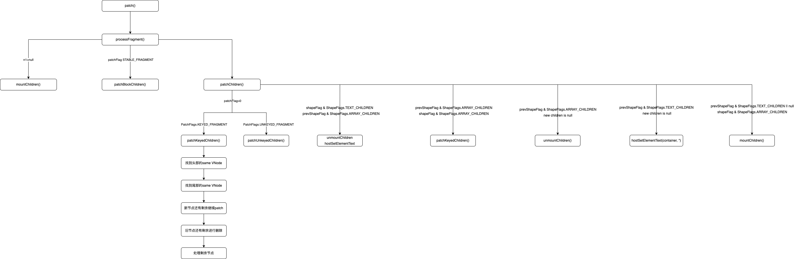

# Vue3中的patch方法

## DOM操作

`DOM`操作相关的两个文件分别在`runtime-dom/src/nodeOps`、`runtime-dom/src/patchProps`，前者进行具体的`DOM`增删操作等，后者为`DOM`元素上的属性进行增删等。

DOM增删相关操作：

```ts
// 【packages/runtime-dom/src/nodeOps.ts】
const doc = (typeof document !== 'undefined' ? document : null) as Document

const templateContainer = doc && /*#__PURE__*/ doc.createElement('template')

export const nodeOps: Omit<RendererOptions<Node, Element>, 'patchProp'> = {
  //【插入节点】
  insert: (child, parent, anchor) => {
    parent.insertBefore(child, anchor || null)
  },
  //【移除节点】
  remove: child => {
    const parent = child.parentNode
    if (parent) {
      parent.removeChild(child)
    }
  },
  //【创建DOM节点】
  createElement: (tag, isSVG, is, props): Element => {
    const el = isSVG
      ? doc.createElementNS(svgNS, tag)
      : doc.createElement(tag, is ? { is } : undefined)

    if (tag === 'select' && props && props.multiple != null) {
      ;(el as HTMLSelectElement).setAttribute('multiple', props.multiple)
    }

    return el
  },
  //【创建文本节点】
  createText: text => doc.createTextNode(text),
  //【创建注释节点】
  createComment: text => doc.createComment(text),
  //【插入节点值】
  // 【对于文档节点来说，nodeValue返回null. 对于 text, comment，和 CDATA 节点来说，nodeValue 返回该节点的文本内容. 对于 attribute 节点来说，返回该属性的属性值。】
  setText: (node, text) => {
    node.nodeValue = text
  },
  //【插入文本】
  //【Node 接口的 textContent 属性表示一个节点及其后代的文本内容。】
  setElementText: (el, text) => {
    el.textContent = text
  },
  //【返回指定的节点在 DOM 树中的父节点。】
  parentNode: node => node.parentNode as Element | null,
  //【Node.nextSibling 是一个只读属性，返回其父节点的 childNodes 列表中紧跟在其后面的节点，如果指定的节点为最后一个节点，则返回 null。】
  nextSibling: node => node.nextSibling,
  //【文档对象模型Document引用的 querySelector() 方法返回文档中与指定选择器或选择器组匹配的第一个 Element对象。如果找不到匹配项，则返回null。】
  querySelector: selector => doc.querySelector(selector),

  setScopeId(el, id) {
    el.setAttribute(id, '')
  },

  // __UNSAFE__
  // Reason: innerHTML.
  // Static content here can only come from compiled templates.
  // As long as the user only uses trusted templates, this is safe.
  insertStaticContent(content, parent, anchor, isSVG, start, end) {
    // <parent> before | first ... last | anchor </parent>
    const before = anchor ? anchor.previousSibling : parent.lastChild
    // #5308 can only take cached path if:
    // - has a single root node
    // - nextSibling info is still available
    if (start && (start === end || start.nextSibling)) {
      // cached
      while (true) {
        parent.insertBefore(start!.cloneNode(true), anchor)
        if (start === end || !(start = start!.nextSibling)) break
      }
    } else {
      // fresh insert
      templateContainer.innerHTML = isSVG ? `<svg>${content}</svg>` : content
      const template = templateContainer.content
      if (isSVG) {
        // remove outer svg wrapper
        const wrapper = template.firstChild!
        while (wrapper.firstChild) {
          template.appendChild(wrapper.firstChild)
        }
        template.removeChild(wrapper)
      }
      parent.insertBefore(template, anchor)
    }
    return [
      // first
      before ? before.nextSibling! : parent.firstChild!,
      // last
      anchor ? anchor.previousSibling! : parent.lastChild!
    ]
  }
}
```

属性相关操作：

```ts
// 【packages/runtime-dom/src/patchProp.ts】
const nativeOnRE = /^on[a-z]/

type DOMRendererOptions = RendererOptions<Node, Element>

export const patchProp: DOMRendererOptions['patchProp'] = (
  el,
  key,
  prevValue,
  nextValue,
  isSVG = false,
  prevChildren,
  parentComponent,
  parentSuspense,
  unmountChildren
) => {
  if (key === 'class') {
    patchClass(el, nextValue, isSVG)
  } else if (key === 'style') {
    patchStyle(el, prevValue, nextValue)
  } else if (isOn(key)) {
    // ignore v-model listeners
    if (!isModelListener(key)) {
      patchEvent(el, key, prevValue, nextValue, parentComponent)
    }
  } else if (
    key[0] === '.'
      ? ((key = key.slice(1)), true)
      : key[0] === '^'
      ? ((key = key.slice(1)), false)
      : shouldSetAsProp(el, key, nextValue, isSVG)
  ) {
    patchDOMProp(
      el,
      key,
      nextValue,
      prevChildren,
      parentComponent,
      parentSuspense,
      unmountChildren
    )
  } else {
    // special case for <input v-model type="checkbox"> with
    // :true-value & :false-value
    // store value as dom properties since non-string values will be
    // stringified.
    if (key === 'true-value') {
      ;(el as any)._trueValue = nextValue
    } else if (key === 'false-value') {
      ;(el as any)._falseValue = nextValue
    }
    patchAttr(el, key, nextValue, isSVG, parentComponent)
  }
}

function shouldSetAsProp(
  el: Element,
  key: string,
  value: unknown,
  isSVG: boolean
) {
  if (isSVG) {
    // most keys must be set as attribute on svg elements to work
    // ...except innerHTML & textContent
    if (key === 'innerHTML' || key === 'textContent') {
      return true
    }
    // or native onclick with function values
    if (key in el && nativeOnRE.test(key) && isFunction(value)) {
      return true
    }
    return false
  }

  // these are enumerated attrs, however their corresponding DOM properties
  // are actually booleans - this leads to setting it with a string "false"
  // value leading it to be coerced to `true`, so we need to always treat
  // them as attributes.
  // Note that `contentEditable` doesn't have this problem: its DOM
  // property is also enumerated string values.
  if (key === 'spellcheck' || key === 'draggable' || key === 'translate') {
    return false
  }

  // #1787, #2840 form property on form elements is readonly and must be set as
  // attribute.
  if (key === 'form') {
    return false
  }

  // #1526 <input list> must be set as attribute
  if (key === 'list' && el.tagName === 'INPUT') {
    return false
  }

  // #2766 <textarea type> must be set as attribute
  if (key === 'type' && el.tagName === 'TEXTAREA') {
    return false
  }

  // native onclick with string value, must be set as attribute
  if (nativeOnRE.test(key) && isString(value)) {
    return false
  }

  return key in el
}
```

## patch方法入口

### 挂载过程，由mount到render方法再到patch方法

之前分析到，用户调用`createApp`生成app实例：

```ts
const app = ensureRenderer().createApp(...args)
```

`createApp`由`createAppAPI`传入根`render`方法（平台相关）生成，根`render`由`createRenderer`生成：

```ts
return {
    render,
    hydrate,
    createApp: createAppAPI(render, hydrate)
}
```

接着就可以调用app实例的`mount`方法：

```ts
mount(
    rootContainer: HostElement,
    isHydrate?: boolean,
    isSVG?: boolean
): any {
  //【...省略】
  const vnode = createVNode(
    rootComponent as ConcreteComponent,
    rootProps
  )
  render(vnode, rootContainer, isSVG)
  //【...省略】
}
```

`createVNode`生成VNode，`render(vnode, rootContainer, isSVG)`将`VNode`渲染成真实`DOM`：

```ts
const render: RootRenderFunction = (vnode, container, isSVG) => {
    if (vnode == null) {
      if (container._vnode) {
        unmount(container._vnode, null, null, true)
      }
    } else {
      patch(container._vnode || null, vnode, container, null, null, null, isSVG)
    }
    flushPreFlushCbs()
    flushPostFlushCbs()
    container._vnode = vnode
}
```

当`VNode`存在时，就会进入`patch`方法，以上是根组件app实例的生成过程，然后会深入进行内部内容的`patch`生成。

### 组件挂载、更新的回调componentUpdateFn

前文中讲到在 `componentUpdateFn` 方法中无论是首次挂载组件还是更新组件，两个最关键的步骤：

1. `renderComponentRoot`生成最新的`VNode`(subTree/nextTree)
2. `patch`对比新旧`VNode`然后进行`diff`流程去更新`DOM`

```ts
// 【packages/runtime-core/src/renderer.ts】
const componentUpdateFn = () => {
  // 【首次挂载-组件实例还未挂载 isMounted是false】
  if (!instance.isMounted) {
    let vnodeHook: VNodeHook | null | undefined
    const { el, props } = initialVNode
    const { bm, m, parent } = instance
    const isAsyncWrapperVNode = isAsyncWrapper(initialVNode)

    //【...省略】

    if (el && hydrateNode) {
      //【...省略】
    } else {
      //【...省略】

      //【1.renderComponentRoot生成VNode赋值给subTree】
      const subTree = (instance.subTree = renderComponentRoot(instance))

      //【...省略】

      //【2.深度调用patch进行VNode对比然后挂载】
      patch(
        null,
        subTree,
        container,
        anchor,
        instance,
        parentSuspense,
        isSVG
      )

      //【...省略】

      initialVNode.el = subTree.el
    }

    //【...省略】

    // 【实例上的isMounted标志设为true，代表挂载完成】
    instance.isMounted = true

    //【...省略】

    // #2458: deference mount-only object parameters to prevent memleaks
    initialVNode = container = anchor = null as any
  } else {
    // 【更新组件-组件实例已经挂载 isMounted是true 说明是更新】
    // updateComponent
    // This is triggered by mutation of component's own state (next: null)
    // OR parent calling processComponent (next: VNode)
    let { next, bu, u, parent, vnode } = instance
    let originNext = next
    let vnodeHook: VNodeHook | null | undefined
    
    //【...省略】

    //【1.const nextTree = renderComponentRoot(instance)构造VNode】
    const nextTree = renderComponentRoot(instance)
    
    //【...省略】

    const prevTree = instance.subTree//【旧VNode】
    instance.subTree = nextTree//【新VNode】

    //【...省略】

    //【2.深度执行patch进行挂载更新DOM】
    patch(
      prevTree,
      nextTree,
      // parent may have changed if it's in a teleport
      hostParentNode(prevTree.el!)!,
      // anchor may have changed if it's in a fragment
      getNextHostNode(prevTree),
      instance,
      parentSuspense,
      isSVG
    )
  }
}
```

## Patch方法前置条件生成VNode

前文中讲到组件挂载过程的第三步调用 **`setupRenderEffect`** 设置组件渲染逻辑，就会调用`renderComponentRoot`生成VNode。`renderComponentRoot`的核心是调用`render`方法，而`render`方法其实是件组件挂载过程的第二步生成，要么是`setup`返回的渲染函数要么是将`template`编译`compile`成的`render`方法。`render`方法的核心就是将`template`转化成`VNode`。

```ts
// 【packages/runtime-core/src/componentRenderUtils.ts】
export function renderComponentRoot(
  instance: ComponentInternalInstance
): VNode {
  const {
    type: Component,
    vnode,
    proxy,
    withProxy,
    props,
    propsOptions: [propsOptions],
    slots,
    attrs,
    emit,
    render,
    renderCache,
    data,
    setupState,
    ctx,
    inheritAttrs
  } = instance

  let result
  let fallthroughAttrs
  const prev = setCurrentRenderingInstance(instance)
  if (__DEV__) {
    accessedAttrs = false
  }

  try {
    if (vnode.shapeFlag & ShapeFlags.STATEFUL_COMPONENT) {
      // withProxy is a proxy with a different `has` trap only for
      // runtime-compiled render functions using `with` block.
      const proxyToUse = withProxy || proxy
      result = normalizeVNode(
        render!.call(
          proxyToUse,
          proxyToUse!,
          renderCache,
          props,
          setupState,
          data,
          ctx
        )
      )
      fallthroughAttrs = attrs
    } else {
      // functional
      const render = Component as FunctionalComponent
      // in dev, mark attrs accessed if optional props (attrs === props)
      if (__DEV__ && attrs === props) {
        markAttrsAccessed()
      }
      result = normalizeVNode(
        render.length > 1
          ? render(
              props,
              __DEV__
                ? {
                    get attrs() {
                      markAttrsAccessed()
                      return attrs
                    },
                    slots,
                    emit
                  }
                : { attrs, slots, emit }
            )
          : render(props, null as any /* we know it doesn't need it */)
      )
      fallthroughAttrs = Component.props
        ? attrs
        : getFunctionalFallthrough(attrs)
    }
  } catch (err) {
    blockStack.length = 0
    handleError(err, instance, ErrorCodes.RENDER_FUNCTION)
    result = createVNode(Comment)
  }

  // attr merging
  // in dev mode, comments are preserved, and it's possible for a template
  // to have comments along side the root element which makes it a fragment
  let root = result
  let setRoot: SetRootFn = undefined
  if (
    __DEV__ &&
    result.patchFlag > 0 &&
    result.patchFlag & PatchFlags.DEV_ROOT_FRAGMENT
  ) {
    ;[root, setRoot] = getChildRoot(result)
  }

  if (fallthroughAttrs && inheritAttrs !== false) {
    const keys = Object.keys(fallthroughAttrs)
    const { shapeFlag } = root
    if (keys.length) {
      if (shapeFlag & (ShapeFlags.ELEMENT | ShapeFlags.COMPONENT)) {
        if (propsOptions && keys.some(isModelListener)) {
          // If a v-model listener (onUpdate:xxx) has a corresponding declared
          // prop, it indicates this component expects to handle v-model and
          // it should not fallthrough.
          // related: #1543, #1643, #1989
          fallthroughAttrs = filterModelListeners(
            fallthroughAttrs,
            propsOptions
          )
        }
        root = cloneVNode(root, fallthroughAttrs)
      } else if (__DEV__ && !accessedAttrs && root.type !== Comment) {
        const allAttrs = Object.keys(attrs)
        const eventAttrs: string[] = []
        const extraAttrs: string[] = []
        for (let i = 0, l = allAttrs.length; i < l; i++) {
          const key = allAttrs[i]
          if (isOn(key)) {
            // ignore v-model handlers when they fail to fallthrough
            if (!isModelListener(key)) {
              // remove `on`, lowercase first letter to reflect event casing
              // accurately
              eventAttrs.push(key[2].toLowerCase() + key.slice(3))
            }
          } else {
            extraAttrs.push(key)
          }
        }
        if (extraAttrs.length) {
          warn(
            `Extraneous non-props attributes (` +
              `${extraAttrs.join(', ')}) ` +
              `were passed to component but could not be automatically inherited ` +
              `because component renders fragment or text root nodes.`
          )
        }
        if (eventAttrs.length) {
          warn(
            `Extraneous non-emits event listeners (` +
              `${eventAttrs.join(', ')}) ` +
              `were passed to component but could not be automatically inherited ` +
              `because component renders fragment or text root nodes. ` +
              `If the listener is intended to be a component custom event listener only, ` +
              `declare it using the "emits" option.`
          )
        }
      }
    }
  }

  if (
    __COMPAT__ &&
    isCompatEnabled(DeprecationTypes.INSTANCE_ATTRS_CLASS_STYLE, instance) &&
    vnode.shapeFlag & ShapeFlags.STATEFUL_COMPONENT &&
    root.shapeFlag & (ShapeFlags.ELEMENT | ShapeFlags.COMPONENT)
  ) {
    const { class: cls, style } = vnode.props || {}
    if (cls || style) {
      if (__DEV__ && inheritAttrs === false) {
        warnDeprecation(
          DeprecationTypes.INSTANCE_ATTRS_CLASS_STYLE,
          instance,
          getComponentName(instance.type)
        )
      }
      root = cloneVNode(root, {
        class: cls,
        style: style
      })
    }
  }

  // inherit directives
  if (vnode.dirs) {
    if (__DEV__ && !isElementRoot(root)) {
      warn(
        `Runtime directive used on component with non-element root node. ` +
          `The directives will not function as intended.`
      )
    }
    // clone before mutating since the root may be a hoisted vnode
    root = cloneVNode(root)
    root.dirs = root.dirs ? root.dirs.concat(vnode.dirs) : vnode.dirs
  }
  // inherit transition data
  if (vnode.transition) {
    if (__DEV__ && !isElementRoot(root)) {
      warn(
        `Component inside <Transition> renders non-element root node ` +
          `that cannot be animated.`
      )
    }
    root.transition = vnode.transition
  }

  if (__DEV__ && setRoot) {
    setRoot(root)
  } else {
    result = root
  }

  setCurrentRenderingInstance(prev)
  console.log('组件VNode-----------------',result)
  return result
}
```

## Patch关键参数

虚拟`VNode`节点中，有几个用于`patch`方法的关键字段如下：

- `type`

```ts
export type VNodeTypes =
  | string
  | VNode
  | Component
  | typeof Text
  | typeof Static
  | typeof Comment
  | typeof Fragment
  | typeof Teleport
  | typeof TeleportImpl
  | typeof Suspense
  | typeof SuspenseImpl
```

- `patchFlags`

`patchFlags` 用于标识虚拟节点应该如何`patch`的类型，在编译的`tansform`优化阶段生成，用于运行时优化。通过进行 `｜` 或运算进行标记的组合，如果当前节点是一个动态文本节点(0000 0001)，它同时又具有动态 style (0000 0100)，二者进行 `｜` 或运算后值为 (0000 0101)。

```ts
export const enum PatchFlags {
  TEXT = 1, // 动态文本节点
  CLASS = 1 << 1, // 动态 class
  STYLE = 1 << 2, // 动态 style
  PROPS = 1 << 3, // 动态属性
  FULL_PROPS = 1 << 4, // 具有动态 key 属性，当 key 改变时，需要进行完整的 diff 比较
  HYDRATE_EVENTS = 1 << 5, // 具有监听事件的节点
  STABLE_FRAGMENT = 1 << 6, // 子节点顺序不会被改变的 fragment
  KEYED_FRAGMENT = 1 << 7, // 带有 key 属或部分子节点有 key 的 fragment
  UNKEYED_FRAGMENT = 1 << 8, // 子节点没有 key 的 fragment
  NEED_PATCH = 1 << 9, // 非 props 的比较，比如 ref 或指令
  DYNAMIC_SLOTS = 1 << 10, // 动态插槽
  DEV_ROOT_FRAGMENT = 1 << 11, // 仅供开发时使用，表示将注释放在模板根级别的片段
  HOISTED = -1, // 静态节点
  BAIL = -2 // diff 算法要退出优化模式
}
```

- `shapeFlags`

`shapeFlags` 针对组件进行了更详细的分类，在生成`VNode`阶段生成，便于在`patch`阶段，根据不同的组件类型执行相应的逻辑。

```ts
export const enum ShapeFlags {
  ELEMENT = 1, // HTML 或 SVG 标签 普通 DOM 元素
  FUNCTIONAL_COMPONENT = 1 << 1, // 函数式组件
  STATEFUL_COMPONENT = 1 << 2, // 普通有状态组件
  TEXT_CHILDREN = 1 << 3, // 子节点是纯文本
  ARRAY_CHILDREN = 1 << 4, // 子节点是数组
  SLOTS_CHILDREN = 1 << 5, // 子节点是插槽
  TELEPORT = 1 << 6, // Teleport
  SUSPENSE = 1 << 7, // Suspense
  COMPONENT_SHOULD_KEEP_ALIVE = 1 << 8, // 需要被 keep-alive 的有状态组件
  COMPONENT_KEPT_ALIVE = 1 << 9, // 已经被 keep-alive 的有状态组件
  COMPONENT = ShapeFlags.STATEFUL_COMPONENT | ShapeFlags.FUNCTIONAL_COMPONENT // 有状态组件和函数组件都是组件，用 COMPONENT 表示
}
```

## Patch方法详解

根据`patch`方法的入参，`n1`、`n2`就是旧新`VNode`树，`container`就是父容器元素，我们可以简单分析出这个方法其实就是对比新旧`VNode`然后最终进行`DOM`操作插入到`container`容器中的流程。

- `n1`、`n2`分别是`旧VNode节点`和`新VNode节点`，`n1`、`n2`如果完全相等直接返回；
- `n1`存在但`n1`、`n2`的`type`并不相同时，直接`unmount`掉`n1`节点；
- `n2`的`patchFlag`是`BAIL`是后续可以跳过比对的情况所以动态子节点，`dynamicChildren`直接设置为`null`
- 提取`const { type, ref, shapeFlag } = n2`，然后根据`type`的不同`switch`到不同分支。
  - `type`是`TEXT`文本节点
  - `type`是`Comment`注释节点
  - `type`是`Static`静态节点
  - `type`是`Fragment`空节点
  - 继续根据`ShapeFlags`判断是`ELEMENT`、`COMPONENT`、`TELEPORT`或者`SUSPENSE`类型的组件进行处理

```ts
// 【packages/runtime-core/src/renderer.ts】
const patch: PatchFn = (
    n1,
    n2,
    container,
    anchor = null,
    parentComponent = null,
    parentSuspense = null,
    isSVG = false,
    slotScopeIds = null,
    optimized = __DEV__ && isHmrUpdating ? false : !!n2.dynamicChildren
  ) => {
    // 【n1是旧VNode，n2是新VNode】
    if (n1 === n2) {
      return
    }

    // patching & not same type, unmount old tree
    if (n1 && !isSameVNodeType(n1, n2)) {
      anchor = getNextHostNode(n1)
      unmount(n1, parentComponent, parentSuspense, true)
      n1 = null
    }

    if (n2.patchFlag === PatchFlags.BAIL) {
      optimized = false
      n2.dynamicChildren = null
    }

    const { type, ref, shapeFlag } = n2
    switch (type) {
      case Text:
        processText(n1, n2, container, anchor)
        break
      case Comment:
        processCommentNode(n1, n2, container, anchor)
        break
      case Static:
        if (n1 == null) {
          mountStaticNode(n2, container, anchor, isSVG)
        } else if (__DEV__) {
          patchStaticNode(n1, n2, container, isSVG)
        }
        break
      case Fragment:
        processFragment(
          n1,
          n2,
          container,
          anchor,
          parentComponent,
          parentSuspense,
          isSVG,
          slotScopeIds,
          optimized
        )
        break
      default:
        if (shapeFlag & ShapeFlags.ELEMENT) {
          processElement(
            n1,
            n2,
            container,
            anchor,
            parentComponent,
            parentSuspense,
            isSVG,
            slotScopeIds,
            optimized
          )
        } else if (shapeFlag & ShapeFlags.COMPONENT) {
          processComponent(
            n1,
            n2,
            container,
            anchor,
            parentComponent,
            parentSuspense,
            isSVG,
            slotScopeIds,
            optimized
          )
        } else if (shapeFlag & ShapeFlags.TELEPORT) {
          ;(type as typeof TeleportImpl).process(
            n1 as TeleportVNode,
            n2 as TeleportVNode,
            container,
            anchor,
            parentComponent,
            parentSuspense,
            isSVG,
            slotScopeIds,
            optimized,
            internals
          )
        } else if (__FEATURE_SUSPENSE__ && shapeFlag & ShapeFlags.SUSPENSE) {
          ;(type as typeof SuspenseImpl).process(
            n1,
            n2,
            container,
            anchor,
            parentComponent,
            parentSuspense,
            isSVG,
            slotScopeIds,
            optimized,
            internals
          )
        } else if (__DEV__) {
          warn('Invalid VNode type:', type, `(${typeof type})`)
        }
    }

    // set ref
    if (ref != null && parentComponent) {
      setRef(ref, n1 && n1.ref, parentSuspense, n2 || n1, !n2)
    }
}
```

`n1.type === n2.type && n1.key === n2.key`判断才认为新旧`VNode`是相同类型的VNode

```ts
export function isSameVNodeType(n1: VNode, n2: VNode): boolean {
  if (
    __DEV__ &&
    n2.shapeFlag & ShapeFlags.COMPONENT &&
    hmrDirtyComponents.has(n2.type as ConcreteComponent)
  ) {
    // HMR only: if the component has been hot-updated, force a reload.
    return false
  }
  return n1.type === n2.type && n1.key === n2.key
}
```
  
继续分析几个分支调用的方法如下：

- case Text
`processText(n1, n2, container, anchor)`

```ts
// 【处理文本节点】
const processText: ProcessTextOrCommentFn = (n1, n2, container, anchor) => {
  if (n1 == null) {
    // 【DOM操作，旧节点为null，则创建新的文本节点并插入container】
    hostInsert(
      (n2.el = hostCreateText(n2.children as string)),
      container,
      anchor
    )
  } else {
    // 【DOM操作，旧节点存在，直接修改文本内容为n2的内容】
    const el = (n2.el = n1.el!)
    if (n2.children !== n1.children) {
      hostSetText(el, n2.children as string)
    }
  }
}
```

- case Comment
`processCommentNode(n1, n2, container, anchor)`

```ts
// 【处理注释节点】
const processCommentNode: ProcessTextOrCommentFn = (
  n1,
  n2,
  container,
  anchor
) => {
  if (n1 == null) {
    //【DOM操作，旧节点为null，则创建新的注释节点并插入container】
    hostInsert(
      (n2.el = hostCreateComment((n2.children as string) || '')),
      container,
      anchor
    )
  } else {
    //【n2节点一整个替换n1节点】
    // there's no support for dynamic comments
    n2.el = n1.el
  }
}
```

- case Static
`mountStaticNode(n2, container, anchor, isSVG)`/`patchStaticNode(n1, n2, container, isSVG)`

```ts
// 【处理静态节点】
if (n1 == null) {
  mountStaticNode(n2, container, anchor, isSVG)
} else if (__DEV__) {
  patchStaticNode(n1, n2, container, isSVG)
}

const mountStaticNode = (
  n2: VNode,
  container: RendererElement,
  anchor: RendererNode | null,
  isSVG: boolean
) => {
  // static nodes are only present when used with compiler-dom/runtime-dom
  // which guarantees presence of hostInsertStaticContent.
  ;[n2.el, n2.anchor] = hostInsertStaticContent!(
    n2.children as string,
    container,
    anchor,
    isSVG,
    n2.el,
    n2.anchor
  )
}
const patchStaticNode = (
  n1: VNode,
  n2: VNode,
  container: RendererElement,
  isSVG: boolean
) => {
  // static nodes are only patched during dev for HMR
  if (n2.children !== n1.children) {
    const anchor = hostNextSibling(n1.anchor!)
    // remove existing
    removeStaticNode(n1)
    // insert new
    ;[n2.el, n2.anchor] = hostInsertStaticContent!(
      n2.children as string,
      container,
      anchor,
      isSVG
    )
  } else {
    n2.el = n1.el
    n2.anchor = n1.anchor
  }
}
```

- case Fragment
`processFragment(n1,n2,container,anchor,parentComponent,parentSuspense,isSVG,slotScopeIds,optimized)`

- default
  - shapeFlag & ShapeFlags.ELEMENT
  
  ```ts
    //【处理html元素节点】
    const processElement = (
        n1: VNode | null,
        n2: VNode,
        container: RendererElement,
        anchor: RendererNode | null,
        parentComponent: ComponentInternalInstance | null,
        parentSuspense: SuspenseBoundary | null,
        isSVG: boolean,
        slotScopeIds: string[] | null,
        optimized: boolean
      ) => {
        isSVG = isSVG || (n2.type as string) === 'svg'
        if (n1 == null) {
          mountElement(
            n2,
            container,
            anchor,
            parentComponent,
            parentSuspense,
            isSVG,
            slotScopeIds,
            optimized
          )
        } else {
          patchElement(
            n1,
            n2,
            parentComponent,
            parentSuspense,
            isSVG,
            slotScopeIds,
            optimized
          )
        }
    }
    ```
  
  - shapeFlag & ShapeFlags.COMPONENT
  
  ```ts
  //【处理组件】
  const processComponent = (
      n1: VNode | null,
      n2: VNode,
      container: RendererElement,
      anchor: RendererNode | null,
      parentComponent: ComponentInternalInstance | null,
      parentSuspense: SuspenseBoundary | null,
      isSVG: boolean,
      slotScopeIds: string[] | null,
      optimized: boolean
    ) => {
      n2.slotScopeIds = slotScopeIds
      if (n1 == null) {
        if (n2.shapeFlag & ShapeFlags.COMPONENT_KEPT_ALIVE) {
          ;(parentComponent!.ctx as KeepAliveContext).activate(
            n2,
            container,
            anchor,
            isSVG,
            optimized
          )
        } else {
          mountComponent(
            n2,
            container,
            anchor,
            parentComponent,
            parentSuspense,
            isSVG,
            optimized
          )
        }
      } else {
        updateComponent(n1, n2, optimized)
      }
  }
  ```
  
  - shapeFlag & ShapeFlags.TELEPORT
  
  - __FEATURE_SUSPENSE__ && shapeFlag & ShapeFlags.SUSPENSE

可以看到这些分支处理不同类型的节点都会根据旧节点`n1`是否存在去`mount`或`patch`。

`patch`方法在调用的时候是一个深度优先遍历的过程，对于组件的处理最终会走到单个元素的处理方法上。而在`processElement`的`patchElement`方法和`processFragment`方法过程中都要对子节点进行比较调用。

### `processFragment()`

Block概念：

- 一个`Block`其实就是一个块，一块 `VNode`，`VNode`拿到了所有的动态节点，它们存储在 `dynamicChildren` 中，因此在 `diff` 过程中就可以避免按照 `VNode` 树一层一层的遍历，而是直接找到 `dynamicChildren` 进行更新
- 使用了`v-if/v-else-if/v-else/v-for`等指令的元素可以看做一个`Block`
- Vue3 中不再限制组件的模板必须有一个根节点，所以如果是多个根节点，会包裹一个`Fragment`，也当成一个`Block`

节点在以下几种情景下会被`Fragment`包裹成为一个`block`块：

1. 一个组件有多个根节点，会为其创建一个包裹：`STABLE_FRAGMENT`
2. `v-if`语句有多个子节点： `STABLE_FRAGMENT`
3. `v-for`语句： `KEYED_FRAGMENT`、`UNKEYED_FRAGMENT`

下面看`processFragment`方法的具体逻辑：

1. 没有旧`VNode`执行`mountChildren`
2. 新`VNode`旧`VNode`都存在且`patchFlag`是`STABLE_FRAGMENT`执行`patchBlockChildren`，因为这是一个稳定`block`所以可以快速进入递归子节点
3. 否则执行`patchChildren`根据是否存在`key`进入`patchKeyedChildren`或`patchUnkeyedChildren`分支

```ts
// 【packages/runtime-core/src/renderer.ts】

//【Vue3新增了Fragment组件，用于处理某些同级节点包裹为一个整体但又不想多一个DOM节点】
//【Fragment主要处理children，其本身其实是个空节点】
const processFragment = (
    n1: VNode | null,
    n2: VNode,
    container: RendererElement,
    anchor: RendererNode | null,
    parentComponent: ComponentInternalInstance | null,
    parentSuspense: SuspenseBoundary | null,
    isSVG: boolean,
    slotScopeIds: string[] | null,
    optimized: boolean
  ) => {
    // 【找到Fragment的起始节点，创建空文本节点】
    const fragmentStartAnchor = (n2.el = n1 ? n1.el : hostCreateText(''))!
    const fragmentEndAnchor = (n2.anchor = n1 ? n1.anchor : hostCreateText(''))!

    let { patchFlag, dynamicChildren, slotScopeIds: fragmentSlotScopeIds } = n2

    if (
      __DEV__ &&
      // #5523 dev root fragment may inherit directives
      (isHmrUpdating || patchFlag & PatchFlags.DEV_ROOT_FRAGMENT)
    ) {
      // HMR updated / Dev root fragment (w/ comments), force full diff
      patchFlag = 0
      optimized = false
      dynamicChildren = null
    }

    // check if this is a slot fragment with :slotted scope ids
    if (fragmentSlotScopeIds) {
      slotScopeIds = slotScopeIds
        ? slotScopeIds.concat(fragmentSlotScopeIds)
        : fragmentSlotScopeIds
    }

    // 【Fragment包裹的一定有children】
    if (n1 == null) {
      // 【第一个分支：旧VNode不存在mountChildren】
      // 【在新VNode中插入Fragment包裹内容起始节点，内容是空】
      hostInsert(fragmentStartAnchor, container, anchor)
      hostInsert(fragmentEndAnchor, container, anchor)
      // a fragment can only have array children
      // since they are either generated by the compiler, or implicitly created
      // from arrays.
      mountChildren(
        n2.children as VNodeArrayChildren,
        container,
        fragmentEndAnchor,
        parentComponent,
        parentSuspense,
        isSVG,
        slotScopeIds,
        optimized
      )
    } else {
      //【该Fragment是STABLE_FRAGMENT类型，新旧节点的dynamicChildren都存在】
      //【patchBlockChildren】
      if (
        patchFlag > 0 &&
        patchFlag & PatchFlags.STABLE_FRAGMENT &&
        dynamicChildren &&
        // #2715 the previous fragment could've been a BAILed one as a result
        // of renderSlot() with no valid children
        n1.dynamicChildren
      ) {
        // a stable fragment (template root or <template v-for>) doesn't need to
        // patch children order, but it may contain dynamicChildren.
        patchBlockChildren(
          n1.dynamicChildren,
          dynamicChildren,
          container,
          parentComponent,
          parentSuspense,
          isSVG,
          slotScopeIds
        )
        if (__DEV__ && parentComponent && parentComponent.type.__hmrId) {
          traverseStaticChildren(n1, n2)
        } else if (
          // #2080 if the stable fragment has a key, it's a <template v-for> that may
          //  get moved around. Make sure all root level vnodes inherit el.
          // #2134 or if it's a component root, it may also get moved around
          // as the component is being moved.
          n2.key != null ||
          (parentComponent && n2 === parentComponent.subTree)
        ) {
          traverseStaticChildren(n1, n2, true /* shallow */)
        }
      } else {
        //【patchChildren】
        // keyed / unkeyed, or manual fragments.
        // for keyed & unkeyed, since they are compiler generated from v-for,
        // each child is guaranteed to be a block so the fragment will never
        // have dynamicChildren.
        patchChildren(
          n1,
          n2,
          container,
          fragmentEndAnchor,
          parentComponent,
          parentSuspense,
          isSVG,
          slotScopeIds,
          optimized
        )
      }
    }
}
```

`mountChildren` 方法是在旧节点不存在的情况下直接对新节点进行生成挂载。

`patchBlockChildren`方法根据新旧**动态子节点dynamicChildren**进行不同的对比操作，最后进入`patch`递归。

`patchChildren`根据是否有`key`可以进入`patchKeyedChildren`或`patchUnkeyedChildren`分支，在新旧子节点都是多节点时就到了我们常说的**diff核心**算法。

### `mountChildren`

遍历`n2`的子节点然后调用`patch`方法进入递归循环：

```ts
// 【packages/runtime-core/src/renderer.ts】
const mountChildren: MountChildrenFn = (
  children,
  container,
  anchor,
  parentComponent,
  parentSuspense,
  isSVG,
  slotScopeIds,
  optimized,
  start = 0
) => {
  for (let i = start; i < children.length; i++) {
    const child = (children[i] = optimized
      ? cloneIfMounted(children[i] as VNode)
      : normalizeVNode(children[i]))
    patch(
      null,
      child,
      container,
      anchor,
      parentComponent,
      parentSuspense,
      isSVG,
      slotScopeIds,
      optimized
    )
  }
}
```

### `patchBlockChildren()`

当存在`dynamicChildren`时且当前`block`的`patchFlag`是`STABLE_FRAGMENT`调用，相当于跳过本层的对比，继续去看子节点，继续执行`patch`方法进入更深层次的解析：

```ts
//【oldChildren/newChildren分别是新旧VNode的dynamicChildren】
const patchBlockChildren: PatchBlockChildrenFn = (
    oldChildren,
    newChildren,
    fallbackContainer,
    parentComponent,
    parentSuspense,
    isSVG,
    slotScopeIds
  ) => {
    for (let i = 0; i < newChildren.length; i++) {
      //【遍历新旧VNode的dynamicChildren】
      const oldVNode = oldChildren[i]
      const newVNode = newChildren[i]
      //【为后续子节点进行patch找到根元素】
      // Determine the container (parent element) for the patch.
      const container =
        // oldVNode may be an errored async setup() component inside Suspense
        // which will not have a mounted element
        oldVNode.el &&
        // - In the case of a Fragment, we need to provide the actual parent
        // of the Fragment itself so it can move its children.
        (oldVNode.type === Fragment ||
          // - In the case of different nodes, there is going to be a replacement
          // which also requires the correct parent container
          !isSameVNodeType(oldVNode, newVNode) ||
          // - In the case of a component, it could contain anything.
          oldVNode.shapeFlag & (ShapeFlags.COMPONENT | ShapeFlags.TELEPORT))
          ? hostParentNode(oldVNode.el)!
          : // In other cases, the parent container is not actually used so we
            // just pass the block element here to avoid a DOM parentNode call.
            fallbackContainer
      patch(
        oldVNode,
        newVNode,
        container,
        null,
        parentComponent,
        parentSuspense,
        isSVG,
        slotScopeIds,
        true
      )
    }
}
```

### `patchChildren()`

`patchChildren`方法会走三种可能分支分别是：

- `patchKeyedChildren`
- `patchUnkeyedChildren`
- `mountChildren`

```ts
// 【packages/runtime-core/src/renderer.ts】
const patchChildren: PatchChildrenFn = (
    n1,
    n2,
    container,
    anchor,
    parentComponent,
    parentSuspense,
    isSVG,
    slotScopeIds,
    optimized = false
  ) => {
    //【提取新旧VNode的Children节点】
    const c1 = n1 && n1.children
    const prevShapeFlag = n1 ? n1.shapeFlag : 0
    const c2 = n2.children
    //【提取新VNode的patchFlag/shapeFlag】
    const { patchFlag, shapeFlag } = n2

    // fast path
    if (patchFlag > 0) {
      //【新VNode的patchFlag>0说明需要patch且类型是KEYED_FRAGMENT，执行patchKeyedChildren方法】
      if (patchFlag & PatchFlags.KEYED_FRAGMENT) {
        // this could be either fully-keyed or mixed (some keyed some not)
        // presence of patchFlag means children are guaranteed to be arrays
        patchKeyedChildren(
          c1 as VNode[],
          c2 as VNodeArrayChildren,
          container,
          anchor,
          parentComponent,
          parentSuspense,
          isSVG,
          slotScopeIds,
          optimized
        )
        return
      } else if (patchFlag & PatchFlags.UNKEYED_FRAGMENT) {
        //【新VNode的patchFlag>0说明需要patch且类型是UNKEYED_FRAGMENT，执行patchUnkeyedChildren方法】
        // unkeyed
        patchUnkeyedChildren(
          c1 as VNode[],
          c2 as VNodeArrayChildren,
          container,
          anchor,
          parentComponent,
          parentSuspense,
          isSVG,
          slotScopeIds,
          optimized
        )
        return
      }
    }

    //【新VNode有三种可能的类型：text, array or no children】
    // children has 3 possibilities: text, array or no children.
    // n1:旧VNode
    // n2:新VNode
    // c1:n1的Children
    // c2:n2的Children
    // shapeFlag:n2的shapeFlag（新节点的）
    // prevShapeFlag:n1的shapeFlag（旧节点的）

    // 【---新节点是text---】
    if (shapeFlag & ShapeFlags.TEXT_CHILDREN) {
      // text children fast path
      if (prevShapeFlag & ShapeFlags.ARRAY_CHILDREN) {
        //【新VNode是TEXT_CHILDREN类型】
        //【旧VNode是ARRAY_CHILDREN类型】
        //【直接unmount旧节点，插入新节点】
        unmountChildren(c1 as VNode[], parentComponent, parentSuspense)
      }
      if (c2 !== c1) {
        hostSetElementText(container, c2 as string)
      }
    } else {
      //【---新节点是array或null---】
      if (prevShapeFlag & ShapeFlags.ARRAY_CHILDREN) {
        // prev children was array
        if (shapeFlag & ShapeFlags.ARRAY_CHILDREN) {
          //【新VNode是ARRAY_CHILDREN类型】
          //【旧VNode是ARRAY_CHILDREN类型】
          //【执行patchKeyedChildren进行diff】
          // two arrays, cannot assume anything, do full diff
          patchKeyedChildren(
            c1 as VNode[],
            c2 as VNodeArrayChildren,
            container,
            anchor,
            parentComponent,
            parentSuspense,
            isSVG,
            slotScopeIds,
            optimized
          )
        } else {
          // no new children, just unmount old
          unmountChildren(c1 as VNode[], parentComponent, parentSuspense, true)
        }
      } else {
        // prev children was text OR null
        // new children is array OR null
        if (prevShapeFlag & ShapeFlags.TEXT_CHILDREN) {
          hostSetElementText(container, '')
        }
        // mount new if array
        if (shapeFlag & ShapeFlags.ARRAY_CHILDREN) {
          mountChildren(
            c2 as VNodeArrayChildren,
            container,
            anchor,
            parentComponent,
            parentSuspense,
            isSVG,
            slotScopeIds,
            optimized
          )
        }
      }
    }
}
```

### diff核心

- 如果是没有`key`的情况`patchUnkeyedChildren`：

取新旧节点序列较短的长度遍历新旧节点，相同索引的节点进行下一轮`patch`，如果旧节点序列长于新节点序列则删除后续的旧节点，如果旧节点序列短于新节点序列则新增后续的新节点

```ts
// 【packages/runtime-core/src/renderer.ts】
const patchUnkeyedChildren = (
    c1: VNode[],
    c2: VNodeArrayChildren,
    container: RendererElement,
    anchor: RendererNode | null,
    parentComponent: ComponentInternalInstance | null,
    parentSuspense: SuspenseBoundary | null,
    isSVG: boolean,
    slotScopeIds: string[] | null,
    optimized: boolean
  ) => {
    c1 = c1 || EMPTY_ARR
    c2 = c2 || EMPTY_ARR
    const oldLength = c1.length
    const newLength = c2.length
    const commonLength = Math.min(oldLength, newLength)//取短者长度
    let i
    //【按序遍历公共长度的部分，进行patch】
    for (i = 0; i < commonLength; i++) {
      const nextChild = (c2[i] = optimized
        ? cloneIfMounted(c2[i] as VNode)
        : normalizeVNode(c2[i]))
      patch(
        c1[i],
        nextChild,
        container,
        null,
        parentComponent,
        parentSuspense,
        isSVG,
        slotScopeIds,
        optimized
      )
    }
    //【遍历结束旧节点长度>新节点长度，就把旧节点unmount】
    if (oldLength > newLength) {
      // remove old
      unmountChildren(
        c1,
        parentComponent,
        parentSuspense,
        true,
        false,
        commonLength
      )
    } else {
    //【遍历结束旧节点长度<新节点长度，就把新节点mount】
      // mount new
      mountChildren(
        c2,
        container,
        anchor,
        parentComponent,
        parentSuspense,
        isSVG,
        slotScopeIds,
        optimized,
        commonLength
      )
    }
}
```

- 如果是有`key`（部分有）的情况`patchKeyedChildren`：

```ts
// 【packages/runtime-core/src/renderer.ts】
const patchKeyedChildren = (
    c1: VNode[],
    c2: VNodeArrayChildren,
    container: RendererElement,
    parentAnchor: RendererNode | null,
    parentComponent: ComponentInternalInstance | null,
    parentSuspense: SuspenseBoundary | null,
    isSVG: boolean,
    slotScopeIds: string[] | null,
    optimized: boolean
  ) => {
    //【e1：旧VNode的最后一个节点index】
    //【e2：新VNode的最后一个节点index】
    //【l2：新VNode长度】
    let i = 0
    const l2 = c2.length
    let e1 = c1.length - 1 // prev ending index
    let e2 = l2 - 1 // next ending index


    //【步骤1.找到头部重复的节点，重复的节点继续patch子节点-免于diff】
    // 1. sync from start
    // (a b) c
    // (a b) d e
    while (i <= e1 && i <= e2) {
      const n1 = c1[i]
      const n2 = (c2[i] = optimized
        ? cloneIfMounted(c2[i] as VNode)
        : normalizeVNode(c2[i]))
      if (isSameVNodeType(n1, n2)) {
        patch(
          n1,
          n2,
          container,
          null,
          parentComponent,
          parentSuspense,
          isSVG,
          slotScopeIds,
          optimized
        )
      } else {
        break
      }
      i++
    }

    //【步骤2.找到尾部重复的节点，重复的节点继续patch子节点-免于diff】
    // 2. sync from end
    // a (b c)
    // d e (b c)
    while (i <= e1 && i <= e2) {
      const n1 = c1[e1]
      const n2 = (c2[e2] = optimized
        ? cloneIfMounted(c2[e2] as VNode)
        : normalizeVNode(c2[e2]))
      if (isSameVNodeType(n1, n2)) {
        patch(
          n1,
          n2,
          container,
          null,
          parentComponent,
          parentSuspense,
          isSVG,
          slotScopeIds,
          optimized
        )
      } else {
        break
      }
      e1--
      e2--
    }

    //【步骤3.i > e1 && i <= e2说明旧节点已遍历结束，剩下新节点还未遍历结束，剩下的新节点进入patch,此时patch第一个参数（旧VNode）是null】
    // 3. common sequence + mount
    // (a b)
    // (a b) c
    // i = 2, e1 = 1, e2 = 2
    // (a b)
    // c (a b)
    // i = 0, e1 = -1, e2 = 0
    if (i > e1) {
      if (i <= e2) {
        const nextPos = e2 + 1
        const anchor = nextPos < l2 ? (c2[nextPos] as VNode).el : parentAnchor
        while (i <= e2) {
          patch(
            null,
            (c2[i] = optimized
              ? cloneIfMounted(c2[i] as VNode)
              : normalizeVNode(c2[i])),
            container,
            anchor,
            parentComponent,
            parentSuspense,
            isSVG,
            slotScopeIds,
            optimized
          )
          i++
        }
      }
    }

    //【步骤4.i > e2 && i <= e1说明旧节点已遍历结束，剩下旧节点还未遍历结束，是需要删掉的内容】
    // 4. common sequence + unmount
    // (a b) c
    // (a b)
    // i = 2, e1 = 2, e2 = 1
    // a (b c)
    // (b c)
    // i = 0, e1 = 0, e2 = -1
    else if (i > e2) {
      while (i <= e1) {
        unmount(c1[i], parentComponent, parentSuspense, true)
        i++
      }
    }

    //【步骤5.头部尾部重复内容都已经找出来，还剩下中间不确定的部分】
    // 5. unknown sequence
    // [i ... e1 + 1]: a b [c d e] f g
    // [i ... e2 + 1]: a b [e d c h] f g
    // i = 2, e1 = 4, e2 = 5
    else {
      //【e1：旧VNode的最后一个节点index】
      //【e2：新VNode的最后一个节点index】
      //【s1：旧VNode的第一个节点index】
      //【s2：新VNode的第一个节点index】
      const s1 = i // prev starting index
      const s2 = i // next starting index


      // 5.1 build key:index map for newChildren
      const keyToNewIndexMap: Map<string | number | symbol, number> = new Map()
      //【遍历新节点序列，构造keyToNewIndexMap】
      for (i = s2; i <= e2; i++) {
        const nextChild = (c2[i] = optimized
          ? cloneIfMounted(c2[i] as VNode)
          : normalizeVNode(c2[i]))
        if (nextChild.key != null) {
          if (__DEV__ && keyToNewIndexMap.has(nextChild.key)) {
            //【key不唯一报warning】 
            warn(
              `Duplicate keys found during update:`,
              JSON.stringify(nextChild.key),
              `Make sure keys are unique.`
            )
          }
          //【新节点的key，新节点在新节点序列中的索引】
          keyToNewIndexMap.set(nextChild.key, i)
        }
      }


      // 5.2 loop through old children left to be patched and try to patch
      // matching nodes & remove nodes that are no longer present
      let j
      let patched = 0//【已经patch的节点个数】
      const toBePatched = e2 - s2 + 1 //【需要继续patch的节点个数（不包括头尾已预处理的节点）】
      let moved = false
      // used to track whether any node has moved
      let maxNewIndexSoFar = 0
      // works as Map<newIndex, oldIndex>
      // Note that oldIndex is offset by +1
      // and oldIndex = 0 is a special value indicating the new node has
      // no corresponding old node.
      // used for determining longest stable subsequence
      //【newIndexToOldIndexMap是个固定长度的数组，是新节点去除重复头部和重复尾部的中间不确定内容的长度，初始值全部为0】
      const newIndexToOldIndexMap = new Array(toBePatched)
      for (i = 0; i < toBePatched; i++) newIndexToOldIndexMap[i] = 0

      //【遍历旧节点序列】
      for (i = s1; i <= e1; i++) {
        const prevChild = c1[i]
        //【已经patch的个数大于等于需要patch的个数，说明剩下的都需要unmount】
        if (patched >= toBePatched) {
          // all new children have been patched so this can only be a removal
          unmount(prevChild, parentComponent, parentSuspense, true)
          continue
        }

        let newIndex
        //【旧节点有key，直接在keyToNewIndexMap中寻找有没有旧节点这个key，并记录在新节点中的index】
        if (prevChild.key != null) {
          //【在新节点中找到仍旧存在的旧节点，并记录在新节点序列中的位置】
          newIndex = keyToNewIndexMap.get(prevChild.key)
        } else {
        //【旧节点没有key，遍历新节点，用isSameVNodeType判断是否存在旧节点，并记录旧节点在新节点中的index】
        //【这里也解释了为什么最好有key，有key就不用遍历，性能就会提升】
          // key-less node, try to locate a key-less node of the same type
          for (j = s2; j <= e2; j++) {
            if (
              newIndexToOldIndexMap[j - s2] === 0 &&
              isSameVNodeType(prevChild, c2[j] as VNode)
            ) {
              newIndex = j
              break
            }
          }
        }

        
        if (newIndex === undefined) {
          //【新节点中找不到当前这个旧节点直接unmount】
          unmount(prevChild, parentComponent, parentSuspense, true)
        } else {
          //【找到的这个旧节点在新节点中的位置+1存储在newIndexToOldIndexMap数组中，没有就还是默认值0，后续直接mount】
          //【位置+1是因为0是特殊的用来表示这个旧节点在新节点中不存在】
          newIndexToOldIndexMap[newIndex - s2] = i + 1
          //【判断旧节点序列是否需要挪动】
          //【如果有一个旧节点的newIndex < maxNewIndexSoFar说明当前这个旧节点序列肯定是要挪动位置的】
          if (newIndex >= maxNewIndexSoFar) {
            maxNewIndexSoFar = newIndex
          } else {
            moved = true
          }
          //【递归patch子节点】
          patch(
            prevChild,
            c2[newIndex] as VNode,
            container,
            null,
            parentComponent,
            parentSuspense,
            isSVG,
            slotScopeIds,
            optimized
          )
          //【已处理的节点+1】
          patched++
        }
      }


      // 5.3 move and mount
      // generate longest stable subsequence only when nodes have moved
      //【根据moved判断是寻找这个数组的最长递增子序列还是无需动作】
      const increasingNewIndexSequence = moved
        ? getSequence(newIndexToOldIndexMap)
        : EMPTY_ARR
      j = increasingNewIndexSequence.length - 1
      
      // looping backwards so that we can use last patched node as anchor
      for (i = toBePatched - 1; i >= 0; i--) {
        //【从后往前遍历新节点序列】
        const nextIndex = s2 + i
        const nextChild = c2[nextIndex] as VNode
        //【找到锚点(插入位置)】
        //【对于新节点最后一个元素，那它肯定就还是父容器的最后一个节点。对于非最后一个元素，它的锚点是后一个元素[nextIndex+1]对应的DOM元素】
        const anchor =
          nextIndex + 1 < l2 ? (c2[nextIndex + 1] as VNode).el : parentAnchor
        if (newIndexToOldIndexMap[i] === 0) {
          //【newIndexToOldIndexMap[i] === 0是旧节点在新节点中没有的情况】
          // mount new
          patch(
            null,
            nextChild,
            container,
            anchor,
            parentComponent,
            parentSuspense,
            isSVG,
            slotScopeIds,
            optimized
          )
        } else if (moved) {
          // move if:
          // There is no stable subsequence (e.g. a reverse)
          // OR current node is not among the stable sequence
          //【遍历完了最长递增子序列或非最长递增子序列里的节点都是需要移动的节点】
          if (j < 0 || i !== increasingNewIndexSequence[j]) {
            //【最终会调用insertBefore操作，在c2[nextIndex + 1]节点前插入c2[nextIndex]】
            // export const enum MoveType {
            //   ENTER,
            //   LEAVE,
            //   REORDER
            // }
            move(nextChild, container, anchor, MoveType.REORDER)
          } else {
            j--
          }
        }
      }
    }
  }
```

其中作者注释的内容如下：

```js
// 1. sync from start
// (a b) c
// (a b) d e

// 2. sync from end
// a (b c)
// d e (b c)

// 3. common sequence + mount
// (a b)
// (a b) c
// i = 2, e1 = 1, e2 = 2
// (a b)
// c (a b)
// i = 0, e1 = -1, e2 = 0

// 4. common sequence + unmount
// (a b) c
// (a b)
// i = 2, e1 = 2, e2 = 1
// a (b c)
// (b c)
// i = 0, e1 = 0, e2 = -1

// 5. unknown sequence
// [i ... e1 + 1]: a b [c d e] f g
// [i ... e2 + 1]: a b [e d c h] f g
// i = 2, e1 = 4, e2 = 5

// 5.1 build key:index map for newChildren

// 5.2 loop through old children left to be patched and try to patch
// matching nodes & remove nodes that are no longer present

// 5.3 move and mount
// generate longest stable subsequence only when nodes have moved
```

根据注释可以分析整个流程如下：

1. 预处理头部所有相同的节点，直接`patch`，无需进入`diff`流程
2. 预处理尾部所有相同的节点，直接`patch`，无需进入`diff`流程
3. 需要增加节点的情况，遍历完旧节点，新节点还剩下内容，也就是需要插入的节点
4. 需要删除节点的情况，遍历完新节点，旧节点还剩下内容，也就是需要删除的节点
5. 包含新增、删除、移动等多种情况的序列
  
  5-1. 首先为新节点建一个`keyToNewIndexMap`的Map用于存储【新节点key，新节点的索引】这样的一个结构
  
  5-2. 新建一个`newIndexToOldIndexMap`的Array长度等于剩余需要`patch`节点个数(去掉可复用的头尾部)，找到相同key的新节点然后在`newIndexToOldIndexMap`中新节点所在索引位置存储【旧节点（在新节点能找到复用的）的旧索引+1】，并且判断旧节点序列是否需要移动操作，如果索引是完全递增的代表不需要移动，否则就是需要
  
  5-3. 找出`newIndexToOldIndexMap`中的最长递增子序列，这个序列是所有不需要移动的节点，剩下的节点就是需要移动的或者新增的，然后进行移动和新增操作

### 最长递增子序列

算法核心如下，主要涉及的算法思想是**动态规划**，从更小的粒度开始看这个问题：

```js
// https://en.wikipedia.org/wiki/Longest_increasing_subsequence
function getSequence(arr: number[]): number[] {
  const p = arr.slice()
  const result = [0]
  let i, j, u, v, c
  const len = arr.length
  for (i = 0; i < len; i++) {
    const arrI = arr[i]
    if (arrI !== 0) {
      j = result[result.length - 1]
      if (arr[j] < arrI) {
        p[i] = j
        result.push(i)
        continue
      }
      u = 0
      v = result.length - 1
      while (u < v) {
        c = (u + v) >> 1
        if (arr[result[c]] < arrI) {
          u = c + 1
        } else {
          v = c
        }
      }
      if (arrI < arr[result[u]]) {
        if (u > 0) {
          p[i] = result[u - 1]
        }
        result[u] = i
      }
    }
  }
  u = result.length
  v = result[u - 1]
  while (u-- > 0) {
    result[u] = v
    v = p[v]
  }
  return result
}
```

## Vue3 diff的优化点和总结

Vue2中的diff算法采取的是**同层比较**的方式，是full diff。

Vue3中的diff算法中有`block`、`fragment`和`patchFlags`等概念，优化了diff过程，去掉了很多不必要的diff过程。`patchFlags`就是用于进行判断是否静态节点，是否动态文本，是否动态属性等等判断条件，所以带有 `patchFlags` 的节点就是动态节点，我们将它提取出来放到一个`dynamicChildren`数组中存储。拿到了所有的动态节点，它们存储在 `dynamicChildren`数组中，因此在 `diff` 过程中就可以避免按照虚拟VNode树一层一层的遍历，而是直接找到 `dynamicChildren` 进行更新。

还有一个优化点在于提升静态节点，或静态的属性，这可以减少创建 VNode 的消耗，静态提升是以树为单位的。

然后对于多个动态有key节点的diff过程，通过寻找最长子序列算法尽可能少的复用和减少节点的移动也是一个性能提升点。


