# Vue3的template编译

目的是将开发者写的`template`编译成渲染函数`render`，渲染函数`render`然后进一步解析为虚拟DOM。

`template -> AST -> transform -> generate -> 渲染函数（render）-> VNode`

`Vue3` 提供了一个`template`在线编译成渲染函数`render`的网站如下：

[Vue 3 Template Explorer](https://template-explorer.vuejs.org/#eyJzcmMiOiI8ZGl2PkhlbGxvIFdvcmxkPC9kaXY+Iiwib3B0aW9ucyI6e319)

## 编译入口(浏览器端)

之前分析组件化的时候，第二个步骤调用`setupComponent`初始化组件中最后会调用`finishComponentSetup`方法，其中有这样一段，如果组件实例`instance`上没有`render`方法那就生成`render`方法并挂载到这个组件实例`instance`的`render`属性上，在后续组件构造的过程中调用`renderComponentRoot`方法会调用生成的`render`方法构建虚拟`Node`树。

这个`render`方法其实是由`compile`方法生成：

```ts
// template / render function normalization
  // could be already set when returned from setup()
  if (!instance.render) {
    // only do on-the-fly compile if not in SSR - SSR on-the-fly compilation
    // is done by server-renderer
    if (!isSSR && compile && !Component.render) {
      const template =
        (__COMPAT__ &&
          instance.vnode.props &&
          instance.vnode.props['inline-template']) ||
        Component.template ||
        resolveMergedOptions(instance).template
      if (template) {
        // ...
        const { isCustomElement, compilerOptions } = instance.appContext.config
        const { delimiters, compilerOptions: componentCompilerOptions } =
          Component
        const finalCompilerOptions: CompilerOptions = extend(
          extend(
            {
              isCustomElement,
              delimiters
            },
            compilerOptions
          ),
          componentCompilerOptions
        )
        // ...
        // 【本质是调用了compileToFunction方法，传入开发者写的template和编译相关的配置】
        Component.render = compile(template, finalCompilerOptions)
        // ...
      }
    }

    instance.render = (Component.render || NOOP) as InternalRenderFunction

    // for runtime-compiled render functions using `with` blocks, the render
    // proxy used needs a different `has` handler which is more performant and
    // also only allows a whitelist of globals to fallthrough.
    if (installWithProxy) {
      installWithProxy(instance)
    }
  }
```

其中一个关键的步骤，`compile`方法由`registerRuntimeCompiler`方法注册返回：

```ts
// 【packages/runtime-core/src/component.ts】
// 【finishComponentSetup】
Component.render = compile(template, finalCompilerOptions)
instance.render = (Component.render || NOOP) as InternalRenderFunction

//【compile方法由registerRuntimeCompiler方法返回】
let compile: CompileFunction | undefined
let installWithProxy: (i: ComponentInternalInstance) => void

/**
 * For runtime-dom to register the compiler.
 * Note the exported method uses any to avoid d.ts relying on the compiler types.
 */
export function registerRuntimeCompiler(_compile: any) {
  compile = _compile
  installWithProxy = i => {
    if (i.render!._rc) {
      i.withProxy = new Proxy(i.ctx, RuntimeCompiledPublicInstanceProxyHandlers)
    }
  }
}

// 【packages/vue/src/index.ts】
registerRuntimeCompiler(compileToFunction)
```

这个`compile`方法何时由`registerRuntimeCompiler`方法注册呢，可以看`packages/vue/src/index.ts`，可以看到是将`compileToFunction(template,options)`方法传入`registerRuntimeCompiler`方法，组件实例上的`render`方法其实就是`compile`方法，而`compile`方法其实就是这个`compileToFunction`方法。

结论，`compile`方法本质是调用了`compileToFunction`方法，传入开发者写的`template`和编译相关的配置如下：

```ts
// 【packages/vue/src/index.ts】
import { compile, CompilerOptions, CompilerError } from '@vue/compiler-dom'
//【编译过的template会进行缓存】
const compileCache: Record<string, RenderFunction> = Object.create(null)

function compileToFunction(
  template: string | HTMLElement,
  options?: CompilerOptions
): RenderFunction {
  //【template不是string则获取innerHTML内容】
  if (!isString(template)) {
    if (template.nodeType) {
      template = template.innerHTML
    } else {
      __DEV__ && warn(`invalid template option: `, template)
      return NOOP
    }
  }
  //【检查缓存看是否已经编译过】
  const key = template
  const cached = compileCache[key]
  if (cached) {
    return cached
  }
  //【template首字符是#当成DOM选择器获取DOM内容】
  if (template[0] === '#') {
    const el = document.querySelector(template)
    if (__DEV__ && !el) {
      warn(`Template element not found or is empty: ${template}`)
    }
    // __UNSAFE__
    // Reason: potential execution of JS expressions in in-DOM template.
    // The user must make sure the in-DOM template is trusted. If it's rendered
    // by the server, the template should not contain any user data.
    template = el ? el.innerHTML : ``
  }
  //【合并编译的选项】
  const opts = extend(
    {
      hoistStatic: true,
      onError: __DEV__ ? onError : undefined,
      onWarn: __DEV__ ? e => onError(e, true) : NOOP
    } as CompilerOptions,
    options
  )

  if (!opts.isCustomElement && typeof customElements !== 'undefined') {
    opts.isCustomElement = tag => !!customElements.get(tag)
  }

  //【核心：通过compile方法获取code】
  const { code } = compile(template, opts)

  function onError(err: CompilerError, asWarning = false) {
    const message = asWarning
      ? err.message
      : `Template compilation error: ${err.message}`
    const codeFrame =
      err.loc &&
      generateCodeFrame(
        template as string,
        err.loc.start.offset,
        err.loc.end.offset
      )
    warn(codeFrame ? `${message}\n${codeFrame}` : message)
  }

  //【code生成render方法】
  // The wildcard import results in a huge object with every export
  // with keys that cannot be mangled, and can be quite heavy size-wise.
  // In the global build we know `Vue` is available globally so we can avoid
  // the wildcard object.
  const render = (
    __GLOBAL__ ? new Function(code)() : new Function('Vue', code)(runtimeDom)
  ) as RenderFunction

  // mark the function as runtime compiled
  ;(render as InternalRenderFunction)._rc = true

  //【编译完成后将render方法缓存下来并返回】
  return (compileCache[key] = render)
}
//【注册compile方法】
registerRuntimeCompiler(compileToFunction)
```

所以在组件生成对应`render`方法构成`VNode`过程中最终调用的是`packages/vue/src/index.ts`的`compileToFunction`方法，该方法会进行一些获取`template`实际内容、检查缓存、参数合并、`code`包装成`render`函数、最终返回`render`函数等操作。可以看到`compileToFunction`方法的核心是`packages/compiler-dom/src/index.ts`中`const { code } = compile(template, opts)`的`compile`方法，接下来我们继续探究`compile`方法。

## compile => 1.parse 2.transform 3.generate

`compile` 方法输入是`template`和`options`，`template`是用户编写的模板代码，`options`是解析指令以及方法的函数选项，最终输出是一段可执行`code`，其中有三个关键步骤：

1. `parse`方法生成`AST`树
2. `transform`方法对`AST`树进行转换优化
3. `generate`方法生成可执行的代码

```ts
// 【packages/compiler-dom/src/index.ts】
export function compile(
  template: string,
  options: CompilerOptions = {}
): CodegenResult {
  //【重载调用baseCompile】
  return baseCompile(
    template,
    extend({}, parserOptions, options, {
      nodeTransforms: [
        // ignore <script> and <tag>
        // this is not put inside DOMNodeTransforms because that list is used
        // by compiler-ssr to generate vnode fallback branches
        ignoreSideEffectTags,
        ...DOMNodeTransforms,
        ...(options.nodeTransforms || [])
      ],
      directiveTransforms: extend(
        {},
        DOMDirectiveTransforms,
        options.directiveTransforms || {}
      ),
      transformHoist: __BROWSER__ ? null : stringifyStatic
    })
  )
}

// 【packages/compiler-core/src/compile.ts】
export function baseCompile(
  template: string | RootNode,
  options: CompilerOptions = {}
): CodegenResult {
  const onError = options.onError || defaultOnError
  const isModuleMode = options.mode === 'module'
  /* istanbul ignore if */
  if (__BROWSER__) {
    if (options.prefixIdentifiers === true) {
      onError(createCompilerError(ErrorCodes.X_PREFIX_ID_NOT_SUPPORTED))
    } else if (isModuleMode) {
      onError(createCompilerError(ErrorCodes.X_MODULE_MODE_NOT_SUPPORTED))
    }
  }

  const prefixIdentifiers =
    !__BROWSER__ && (options.prefixIdentifiers === true || isModuleMode)
  if (!prefixIdentifiers && options.cacheHandlers) {
    onError(createCompilerError(ErrorCodes.X_CACHE_HANDLER_NOT_SUPPORTED))
  }
  if (options.scopeId && !isModuleMode) {
    onError(createCompilerError(ErrorCodes.X_SCOPE_ID_NOT_SUPPORTED))
  }
  //【第一步：parse-template通过parse方法转化为ast树】
  const ast = isString(template) ? baseParse(template, options) : template  
  const [nodeTransforms, directiveTransforms] =
    getBaseTransformPreset(prefixIdentifiers)

  if (!__BROWSER__ && options.isTS) {
    const { expressionPlugins } = options
    if (!expressionPlugins || !expressionPlugins.includes('typescript')) {
      options.expressionPlugins = [...(expressionPlugins || []), 'typescript']
    }
  }

  //【第二步：transform-ast树经过transform方法优化】
  transform(
    ast,
    extend({}, options, {
      prefixIdentifiers,
      nodeTransforms: [
        ...nodeTransforms,
        ...(options.nodeTransforms || []) // user transforms
      ],
      directiveTransforms: extend(
        {},
        directiveTransforms,
        options.directiveTransforms || {} // user transforms
      )
    })
  )

  //【第三步：codeGen-generate方法生成可执行code】
  return generate(
    ast,
    extend({}, options, {
      prefixIdentifiers
    })
  )
}
```

`compile`方法在`packages/compiler-dom/src/index.ts`文件中，因为`compile`方法其实是平台相关的，我们分析的是在浏览器中。除此之外代码的组织还用到了函数柯理化的技巧，把基础的编译过程函数抽出来，通过 `registerRuntimeCompiler(compileToFunction)` 的方式把真正编译的过程和其它逻辑如对编译配置处理、缓存处理等剥离开，这样的设计还是非常巧妙的。

后文中分析的用例如下：

```ts
<script src="../../dist/vue.global.js"></script>

<div id="demo">
  <div v-for="{ commit } in commits" :key="commit">
    <span :id="commit.author">{{ commit.author.name }}</span>
    ---
    <span>{{ commit.author.date }}</span>
  </div>
  <div style="color: red">{{currentBranchPlus}}</div>
  <div style="color: aquamarine" @click="clickToChangeBranch()">
    click me!{{reactiveObj.name}}
  </div>
</div>

<script>
  const {
    ref,
    reactive,
    computed,
    watchEffect,
    onBeforeMount,
    onMounted,
    onBeforeUpdate,
    onUpdated
  } = Vue
  const API_URL = `https://api.github.com/repos/vuejs/core/commits?per_page=2&sha=`

  Vue.createApp({
    setup() {
      const currentBranch = ref('main')
      const commits = ref(null)
      const currentBranchPlus = computed(
        () => `Im on which branch: ${currentBranch.value}`
      )
      const reactiveObj = reactive({
        name: 'reactiveObj',
        extraProperty: 'extraProperty'
      })

      // onBeforeMount(() => {
      //   console.log('🥒 ~ file: test.html:26 ~ onBeforeMount ~ onBeforeMount:')
      // })
      onMounted(() => {
        console.log('🥒 ~ file: test.html:22 ~ onMounted ~ onMounted')
        reactiveObj.name = 'newReactiveObj'
      })
      // onBeforeUpdate(() => {
      //   console.log('🥒 ~ file: test.html:22 ~ onBeforeUpdate ~ onBeforeUpdate')
      // })
      // onUpdated(() => {
      //   console.log('🥒 ~ file: test.html:26 ~ onUpdated ~ onUpdated:')
      // })

      watchEffect(() => {
        fetch(`${API_URL}${currentBranch.value}`)
          .then(res => res.json())
          .then(data => {
            commits.value = data
            console.log(
              '🥒 ~ file: test.html:55 ~ watchEffect ~ commits.value:',
              commits.value
            )
          })
      })

      clickToChangeBranch = e => {
        currentBranch.value = ''
        console.log('its click', e)
      }

      return {
        currentBranch,
        currentBranchPlus,
        commits,
        reactiveObj,
        clickToChangeBranch
      }
    }
  }).mount('#demo')
</script>
```

## parse

```ts
// 【packages/compiler-core/src/compile.ts】
const ast = isString(template) ? baseParse(template, options) : template  
```

- `parse` 主要是将 `template` 转成 `AST`。`AST`是一种抽象语法树，是对源代码的抽象语法结构的树状表现形式，最终的`AST`树应该是以类似如下数据结构的对象：

```ts
{
  type: 0,
  children,
  helpers: [],
  components: [],
  directives: [],
  hoists: [],
  imports: [],
  cached: 0,
  temps: 0,
  codegenNode: undefined,
  loc
}
```

首先调用`baseParse`如下，`extend({}, parserOptions, options)` 将 `parserOptions` 和 `options` 合并，`export const extend = Object.assign`，`extend`其实就是`Object.assign`方法，`parserOptions` 是平台相关的解析选项，`options` 则是用户可选择的解析选项。

`baseParse`首先创造一个`parse`过程的上下文对象，用于存储`parse`过程中相关的一些状态和操作，例如源代码字符串、处理到第几行第几列等等。然后会进入核心转化过程`parseChildren`方法。

```ts
// 【packages/compiler-core/src/parse.ts】
export function parse(template: string, options: ParserOptions = {}): RootNode {
  return baseParse(template, extend({}, parserOptions, options))
}

export function baseParse(
  content: string,
  options: ParserOptions = {}
): RootNode {
  const context = createParserContext(content, options)
  const start = getCursor(context)
  return createRoot(
    parseChildren(context, TextModes.DATA, []),//【解析子节点】
    getSelection(context, start)//【获取起始终点位置，第几行第几列】
  )
}
// 【为这个组件先建一个空的根节点】
export function createRoot(
  children: TemplateChildNode[],
  loc = locStub
): RootNode {
  return {
    type: NodeTypes.ROOT,
    children,
    helpers: [],
    components: [],
    directives: [],
    hoists: [],
    imports: [],
    cached: 0,
    temps: 0,
    codegenNode: undefined,
    loc
  }
}

function getSelection(
  context: ParserContext,
  start: Position,
  end?: Position
): SourceLocation {
  end = end || getCursor(context)
  return {
    start,
    end,
    source: context.originalSource.slice(start.offset, end.offset)
  }
}
```

然后继续看核心方法`parseChildren`，遍历`context.source`也就是源代码，其实也就是解析字符串：

- 如果以 `{{` 开始，当成插值解析，调用 `parseInterpolation` 方法
- 如果以 `<` 开始
  - 字符串长度为1，报错
  - 字符串以`<!`开头
    - 字符串以`<!--`开头，调用 `parseComment` 方法
    - 字符串以`<!DOCTYPE`开头，调用 `parseBogusComment` 方法
    - 字符串以`<![CDATA[`开头，又分了三种情况分析
  - 接下来是 `/` 字符
    - 字符串长度为2，报错
    - 接下来是 `>` 字符，报错
    - 如果是`a-z`的字母，调用 `parseTag` 方法
    - 否则报错
  - 接下来是`a-z`的字母，调用 `parseElement` 方法
  - 接来是`?`，报错
  - 否则，其他情况都报错处理
- 解析出来的`node`节点若不存在，调用 `parseText` 方法当做文本处理
- 将一个个`node`全部推入`nodes`数组，这里有个小细节会看前后两个`node`是否都是文本类型，如果是的话会合并，针对文本是`a>b`类似情况
- 处理空白
- 最终返回解析结果

```ts
// 【packages/compiler-core/src/parse.ts】
export const enum TextModes {
  //          | Elements | Entities | End sign              | Inside of
  DATA, //    | ✔        | ✔        | End tags of ancestors |
  RCDATA, //  | ✘        | ✔        | End tag of the parent | <textarea>
  RAWTEXT, // | ✘        | ✘        | End tag of the parent | <style>,<script>
  CDATA,
  ATTRIBUTE_VALUE
}
//【编译出错调用此方法】
function emitError(
  context: ParserContext,
  code: ErrorCodes,
  offset?: number,
  loc: Position = getCursor(context)
): void {
  if (offset) {
    loc.offset += offset
    loc.column += offset
  }
  context.options.onError(
    createCompilerError(code, {
      start: loc,
      end: loc,
      source: ''
    })
  )
}

function parseChildren(
  context: ParserContext,
  mode: TextModes,
  ancestors: ElementNode[]
): TemplateChildNode[] {
  const parent = last(ancestors)
  const ns = parent ? parent.ns : Namespaces.HTML
  const nodes: TemplateChildNode[] = []

  while (!isEnd(context, mode, ancestors)) {
    __TEST__ && assert(context.source.length > 0)
    const s = context.source
    let node: TemplateChildNode | TemplateChildNode[] | undefined = undefined

    if (mode === TextModes.DATA || mode === TextModes.RCDATA) {
      if (!context.inVPre && startsWith(s, context.options.delimiters[0])) {
        //【s[0]是{{】
        // '{{'
        node = parseInterpolation(context, mode)
      } else if (mode === TextModes.DATA && s[0] === '<') {
        //【s[0]是'<'，s[1]后又走向'!'、'/'、/[a-z]/i.test(s[1])、'?'几个可能分支】
        // https://html.spec.whatwg.org/multipage/parsing.html#tag-open-state
        if (s.length === 1) {
          emitError(context, ErrorCodes.EOF_BEFORE_TAG_NAME, 1)
        } else if (s[1] === '!') {
          // https://html.spec.whatwg.org/multipage/parsing.html#markup-declaration-open-state
          if (startsWith(s, '<!--')) {
            node = parseComment(context)
          } else if (startsWith(s, '<!DOCTYPE')) {
            // Ignore DOCTYPE by a limitation.
            node = parseBogusComment(context)
          } else if (startsWith(s, '<![CDATA[')) {
            if (ns !== Namespaces.HTML) {
              node = parseCDATA(context, ancestors)
            } else {
              emitError(context, ErrorCodes.CDATA_IN_HTML_CONTENT)
              node = parseBogusComment(context)
            }
          } else {
            emitError(context, ErrorCodes.INCORRECTLY_OPENED_COMMENT)
            node = parseBogusComment(context)
          }
        } else if (s[1] === '/') {
          // https://html.spec.whatwg.org/multipage/parsing.html#end-tag-open-state
          if (s.length === 2) {
            emitError(context, ErrorCodes.EOF_BEFORE_TAG_NAME, 2)
          } else if (s[2] === '>') {
            emitError(context, ErrorCodes.MISSING_END_TAG_NAME, 2)
            advanceBy(context, 3)
            continue
          } else if (/[a-z]/i.test(s[2])) {
            emitError(context, ErrorCodes.X_INVALID_END_TAG)
            parseTag(context, TagType.End, parent)
            continue
          } else {
            emitError(
              context,
              ErrorCodes.INVALID_FIRST_CHARACTER_OF_TAG_NAME,
              2
            )
            node = parseBogusComment(context)
          }
        } else if (/[a-z]/i.test(s[1])) {
          node = parseElement(context, ancestors)

          // 2.x <template> with no directive compat
          if (
            __COMPAT__ &&
            isCompatEnabled(
              CompilerDeprecationTypes.COMPILER_NATIVE_TEMPLATE,
              context
            ) &&
            node &&
            node.tag === 'template' &&
            !node.props.some(
              p =>
                p.type === NodeTypes.DIRECTIVE &&
                isSpecialTemplateDirective(p.name)
            )
          ) {
            __DEV__ &&
              warnDeprecation(
                CompilerDeprecationTypes.COMPILER_NATIVE_TEMPLATE,
                context,
                node.loc
              )
            node = node.children
          }
        } else if (s[1] === '?') {
          emitError(
            context,
            ErrorCodes.UNEXPECTED_QUESTION_MARK_INSTEAD_OF_TAG_NAME,
            1
          )
          node = parseBogusComment(context)
        } else {
          emitError(context, ErrorCodes.INVALID_FIRST_CHARACTER_OF_TAG_NAME, 1)
        }
      }
    }
    if (!node) {
      node = parseText(context, mode)
    }

    if (isArray(node)) {
      for (let i = 0; i < node.length; i++) {
        pushNode(nodes, node[i])
      }
    } else {
      pushNode(nodes, node)
    }
  }

  // Whitespace handling strategy like v2
  let removedWhitespace = false
  if (mode !== TextModes.RAWTEXT && mode !== TextModes.RCDATA) {
    const shouldCondense = context.options.whitespace !== 'preserve'
    for (let i = 0; i < nodes.length; i++) {
      const node = nodes[i]
      if (node.type === NodeTypes.TEXT) {
        if (!context.inPre) {
          if (!/[^\t\r\n\f ]/.test(node.content)) {
            const prev = nodes[i - 1]
            const next = nodes[i + 1]
            // Remove if:
            // - the whitespace is the first or last node, or:
            // - (condense mode) the whitespace is adjacent to a comment, or:
            // - (condense mode) the whitespace is between two elements AND contains newline
            if (
              !prev ||
              !next ||
              (shouldCondense &&
                (prev.type === NodeTypes.COMMENT ||
                  next.type === NodeTypes.COMMENT ||
                  (prev.type === NodeTypes.ELEMENT &&
                    next.type === NodeTypes.ELEMENT &&
                    /[\r\n]/.test(node.content))))
            ) {
              removedWhitespace = true
              nodes[i] = null as any
            } else {
              // Otherwise, the whitespace is condensed into a single space
              node.content = ' '
            }
          } else if (shouldCondense) {
            // in condense mode, consecutive whitespaces in text are condensed
            // down to a single space.
            node.content = node.content.replace(/[\t\r\n\f ]+/g, ' ')
          }
        } else {
          // #6410 normalize windows newlines in <pre>:
          // in SSR, browsers normalize server-rendered \r\n into a single \n
          // in the DOM
          node.content = node.content.replace(/\r\n/g, '\n')
        }
      }
      // Remove comment nodes if desired by configuration.
      else if (node.type === NodeTypes.COMMENT && !context.options.comments) {
        removedWhitespace = true
        nodes[i] = null as any
      }
    }
    if (context.inPre && parent && context.options.isPreTag(parent.tag)) {
      // remove leading newline per html spec
      // https://html.spec.whatwg.org/multipage/grouping-content.html#the-pre-element
      const first = nodes[0]
      if (first && first.type === NodeTypes.TEXT) {
        first.content = first.content.replace(/^\r?\n/, '')
      }
    }
  }

  return removedWhitespace ? nodes.filter(Boolean) : nodes
}
```

在解析`template`的时候，把`template`当成字符串，逐步解析，可以看到`advanceBy`函数，将解析完的部分逐渐从`template`字符串中剥离。然后根据正则匹配，不同的类型节点进行不同方法的处理，最终返回一个完整的AST树，所谓的不同类型有如下等：

- 元素节点
- 属性节点
- 指令节点
- 文本节点
- 差值节点
- 注释节点

结束`parse`这一步，我们会得到一个`template`解析完毕生成的完整的`ast`树，然后进入`transform`的步骤。

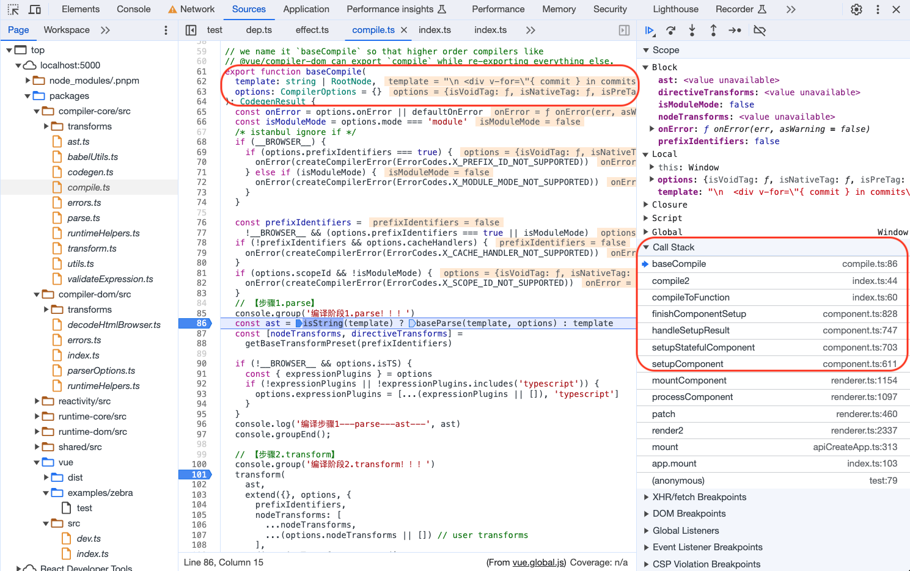
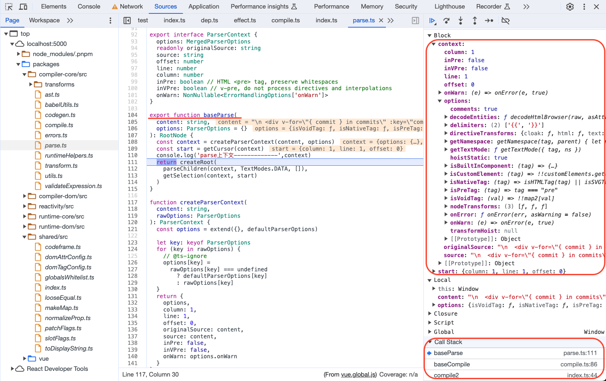
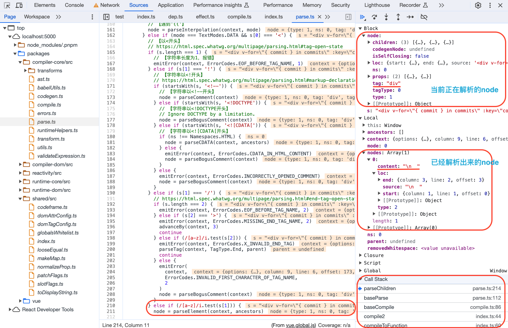

经过第一步parse后用例生成的ast树如下：

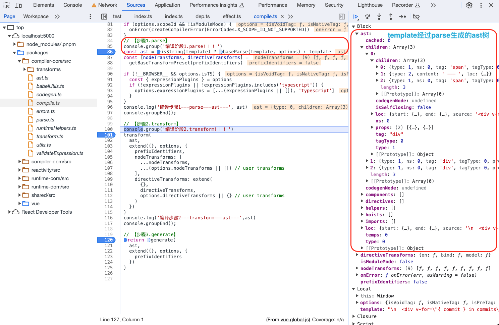

## transform

```ts
// 【packages/compiler-core/src/compile.ts】
transform(
  ast,
  extend({}, options, {
    prefixIdentifiers,
    nodeTransforms: [
      ...nodeTransforms,
      ...(options.nodeTransforms || []) // user transforms
    ],
    directiveTransforms: extend(
      {},
      directiveTransforms,
      options.directiveTransforms || {} // user transforms
    )
  })
)

// nodeTransforms
[
  transformOnce,
  transformIf,
  transformMemo,
  transformFor,
  ...(__COMPAT__ ? [transformFilter] : []),
  ...(!__BROWSER__ && prefixIdentifiers
    ? [
        // order is important
        trackVForSlotScopes,
        transformExpression
      ]
    : __BROWSER__ && __DEV__
    ? [transformExpression]
    : []),
  transformSlotOutlet,
  transformElement,
  trackSlotScopes,
  transformText
]
// directiveTransforms
{
  on: transformOn,
  bind: transformBind,
  model: transformModel
}
```

- `transform`主要通过`transform`方法将 `AST` 进行优化转换，并确定`patchFlag`用于后续节点变化patch方法中的优化等。其中转化的操作分为两类`nodeTransforms`和`directiveTransforms`。

`transform`中几个关键步骤如下：

1. `createTransformContext`创建`transform`工作的上下文环境，包含当前正在处理的节点`currentNode`、`ast`树信息、一系列处理方法`nodeTransforms`等等
2. `traverseNode`遍历`ast`树的所有节点，然后遍历调用`nodeTransforms`方法优化`ast`节点信息，每一个节点生成`codegenNode`属性
3. `hoistStatic`根据参数是否进行静态变量提升
4. `createRootCodegen`为根节点生成`codegenNode`属性

```ts
// 【packages/compiler-core/src/transform.ts】
export function transform(root: RootNode, options: TransformOptions) {
  //【第一步：创建transform上下文】
  const context = createTransformContext(root, options)
  //【第二步：遍历ast节点】
  traverseNode(root, context)
  //【第三步：静态提升】
  if (options.hoistStatic) {
    hoistStatic(root, context)
  }
  //【第四部：为根节点生成codegenNode属性】
  if (!options.ssr) {
    createRootCodegen(root, context)
  }
  // finalize meta information
  // 【将后续所有会用到的辅助函数、组件、指令、静态内容等等信息放置在root的属性上】
  root.helpers = [...context.helpers.keys()]
  root.components = [...context.components]
  root.directives = [...context.directives]
  root.imports = context.imports
  root.hoists = context.hoists
  root.temps = context.temps
  root.cached = context.cached

  if (__COMPAT__) {
    root.filters = [...context.filters!]
  }
}

// 【遍历ast树，用nodeTransforms方法去改造优化node】
export function traverseNode(
  node: RootNode | TemplateChildNode,
  context: TransformContext
) {
  context.currentNode = node
  // apply transform plugins
  const { nodeTransforms } = context
  const exitFns = []
  for (let i = 0; i < nodeTransforms.length; i++) {
    const onExit = nodeTransforms[i](node, context)
    if (onExit) {
      if (isArray(onExit)) {
        exitFns.push(...onExit)
      } else {
        exitFns.push(onExit)
      }
    }
    if (!context.currentNode) {
      // node was removed
      return
    } else {
      // node may have been replaced
      node = context.currentNode
    }
  }

  switch (node.type) {
    case NodeTypes.COMMENT:
      if (!context.ssr) {
        // inject import for the Comment symbol, which is needed for creating
        // comment nodes with `createVNode`
        context.helper(CREATE_COMMENT)
      }
      break
    case NodeTypes.INTERPOLATION:
      // no need to traverse, but we need to inject toString helper
      if (!context.ssr) {
        context.helper(TO_DISPLAY_STRING)
      }
      break

    // for container types, further traverse downwards
    case NodeTypes.IF:
      for (let i = 0; i < node.branches.length; i++) {
        traverseNode(node.branches[i], context)
      }
      break
    case NodeTypes.IF_BRANCH:
    case NodeTypes.FOR:
    case NodeTypes.ELEMENT:
    case NodeTypes.ROOT:
      traverseChildren(node, context)
      break
  }

  // exit transforms
  context.currentNode = node
  let i = exitFns.length
  while (i--) {
    exitFns[i]()
  }
}

// 【packages/compiler-core/src/compile.ts】
export function getBaseTransformPreset(
  prefixIdentifiers?: boolean
): TransformPreset {
  return [
    [
      transformOnce,
      transformIf,
      transformMemo,
      transformFor,
      ...(__COMPAT__ ? [transformFilter] : []),
      ...(!__BROWSER__ && prefixIdentifiers
        ? [
            // order is important
            trackVForSlotScopes,
            transformExpression
          ]
        : __BROWSER__ && __DEV__
        ? [transformExpression]
        : []),
      transformSlotOutlet,
      transformElement,
      trackSlotScopes,
      transformText
    ],
    {
      on: transformOn,
      bind: transformBind,
      model: transformModel
    }
  ]
}
```

### `createTransformContext`

`createTransformContext`方法创建了一个`transform`过程的上下文对象，会存储`transform`过程中相关的一些状态和操作，比如当前正在处理的节点，也包括`nodeTransforms`和`directiveTransforms`操作方法用于处理节点等等。

```ts
// 【packages/compiler-core/src/transform.ts】
export function createTransformContext(
  root: RootNode,
  {
    filename = '',
    prefixIdentifiers = false,
    hoistStatic = false,
    cacheHandlers = false,
    nodeTransforms = [],
    directiveTransforms = {},
    transformHoist = null,
    isBuiltInComponent = NOOP,
    isCustomElement = NOOP,
    expressionPlugins = [],
    scopeId = null,
    slotted = true,
    ssr = false,
    inSSR = false,
    ssrCssVars = ``,
    bindingMetadata = EMPTY_OBJ,
    inline = false,
    isTS = false,
    onError = defaultOnError,
    onWarn = defaultOnWarn,
    compatConfig
  }: TransformOptions
): TransformContext {
  const nameMatch = filename.replace(/\?.*$/, '').match(/([^/\\]+)\.\w+$/)
  const context: TransformContext = {
    // options
    selfName: nameMatch && capitalize(camelize(nameMatch[1])),
    prefixIdentifiers,
    hoistStatic,
    cacheHandlers,
    nodeTransforms,
    directiveTransforms,
    transformHoist,
    isBuiltInComponent,
    isCustomElement,
    expressionPlugins,
    scopeId,
    slotted,
    ssr,
    inSSR,
    ssrCssVars,
    bindingMetadata,
    inline,
    isTS,
    onError,
    onWarn,
    compatConfig,

    // state
    root,
    helpers: new Map(),
    components: new Set(),
    directives: new Set(),
    hoists: [],
    imports: [],
    constantCache: new Map(),
    temps: 0,
    cached: 0,
    identifiers: Object.create(null),
    scopes: {
      vFor: 0,
      vSlot: 0,
      vPre: 0,
      vOnce: 0
    },
    parent: null,
    currentNode: root,
    childIndex: 0,
    inVOnce: false,

    // methods
    helper(name) {
      const count = context.helpers.get(name) || 0
      context.helpers.set(name, count + 1)
      return name
    },
    removeHelper(name) {
      const count = context.helpers.get(name)
      if (count) {
        const currentCount = count - 1
        if (!currentCount) {
          context.helpers.delete(name)
        } else {
          context.helpers.set(name, currentCount)
        }
      }
    },
    helperString(name) {
      return `_${helperNameMap[context.helper(name)]}`
    },
    replaceNode(node) {
      /* istanbul ignore if */
      if (__DEV__) {
        if (!context.currentNode) {
          throw new Error(`Node being replaced is already removed.`)
        }
        if (!context.parent) {
          throw new Error(`Cannot replace root node.`)
        }
      }
      context.parent!.children[context.childIndex] = context.currentNode = node
    },
    removeNode(node) {
      if (__DEV__ && !context.parent) {
        throw new Error(`Cannot remove root node.`)
      }
      const list = context.parent!.children
      const removalIndex = node
        ? list.indexOf(node)
        : context.currentNode
        ? context.childIndex
        : -1
      /* istanbul ignore if */
      if (__DEV__ && removalIndex < 0) {
        throw new Error(`node being removed is not a child of current parent`)
      }
      if (!node || node === context.currentNode) {
        // current node removed
        context.currentNode = null
        context.onNodeRemoved()
      } else {
        // sibling node removed
        if (context.childIndex > removalIndex) {
          context.childIndex--
          context.onNodeRemoved()
        }
      }
      context.parent!.children.splice(removalIndex, 1)
    },
    onNodeRemoved: () => {},
    addIdentifiers(exp) {
      // identifier tracking only happens in non-browser builds.
      if (!__BROWSER__) {
        if (isString(exp)) {
          addId(exp)
        } else if (exp.identifiers) {
          exp.identifiers.forEach(addId)
        } else if (exp.type === NodeTypes.SIMPLE_EXPRESSION) {
          addId(exp.content)
        }
      }
    },
    removeIdentifiers(exp) {
      if (!__BROWSER__) {
        if (isString(exp)) {
          removeId(exp)
        } else if (exp.identifiers) {
          exp.identifiers.forEach(removeId)
        } else if (exp.type === NodeTypes.SIMPLE_EXPRESSION) {
          removeId(exp.content)
        }
      }
    },
    hoist(exp) {
      if (isString(exp)) exp = createSimpleExpression(exp)
      context.hoists.push(exp)
      const identifier = createSimpleExpression(
        `_hoisted_${context.hoists.length}`,
        false,
        exp.loc,
        ConstantTypes.CAN_HOIST
      )
      identifier.hoisted = exp
      return identifier
    },
    cache(exp, isVNode = false) {
      return createCacheExpression(context.cached++, exp, isVNode)
    }
  }

  if (__COMPAT__) {
    context.filters = new Set()
  }

  function addId(id: string) {
    const { identifiers } = context
    if (identifiers[id] === undefined) {
      identifiers[id] = 0
    }
    identifiers[id]!++
  }

  function removeId(id: string) {
    context.identifiers[id]!--
  }

  return context
}
```

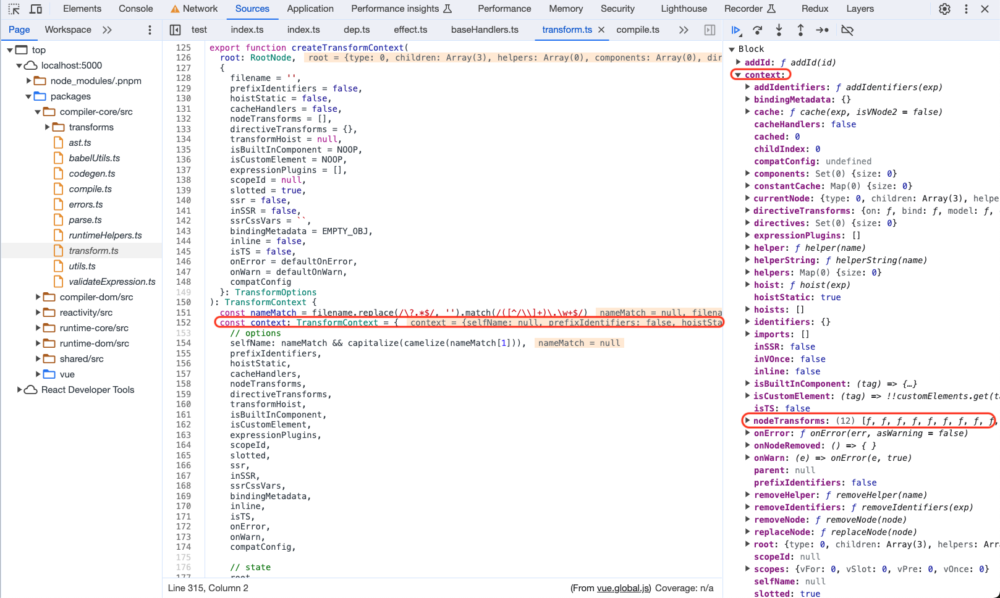

### `traverseNode`

`traverseNode`方法遍历`ast`树的节点，用`nodeTransforms`的方法去转化每一个节点，并且确定生成代码需要的辅助函数。

```ts
// 【packages/compiler-core/src/transform.ts】
export function traverseNode(
  node: RootNode | TemplateChildNode,
  context: TransformContext
) {
  context.currentNode = node
  // apply transform plugins
  const { nodeTransforms } = context
  const exitFns = []
  //【对节点进行transform工作，有的节点可能需要等待子节点处理完毕以后再操作一些内容，所以有exitFns用于存储处理完子节点以后继续处理当前节点的操作】
  for (let i = 0; i < nodeTransforms.length; i++) {
    const onExit = nodeTransforms[i](node, context)
    if (onExit) {
      if (isArray(onExit)) {
        exitFns.push(...onExit)
      } else {
        exitFns.push(onExit)
      }
    }
    if (!context.currentNode) {
      // node was removed
      return
    } else {
      // node may have been replaced
      node = context.currentNode
    }
  }

  // 【根据节点类型把辅助函数导入上下文，这些辅助函数就是最终生成代码里的_createElementVNode/_createElementBlock/_createVNode/_renderList等等】
  switch (node.type) {
    case NodeTypes.COMMENT:
      if (!context.ssr) {
        // inject import for the Comment symbol, which is needed for creating
        // comment nodes with `createVNode`
        context.helper(CREATE_COMMENT)
      }
      break
    case NodeTypes.INTERPOLATION:
      // no need to traverse, but we need to inject toString helper
      if (!context.ssr) {
        context.helper(TO_DISPLAY_STRING)
      }
      break

    // for container types, further traverse downwards
    case NodeTypes.IF:
      // 【if标签按分支数量继续traverse子节点】
      for (let i = 0; i < node.branches.length; i++) {
        traverseNode(node.branches[i], context)
      }
      break
    case NodeTypes.IF_BRANCH:
    case NodeTypes.FOR:
    case NodeTypes.ELEMENT:
    case NodeTypes.ROOT:
      // 【ast的根节点，需要继续traverse子节点】
      traverseChildren(node, context)
      break
  }

  // exit transforms
  context.currentNode = node
  let i = exitFns.length
  // 【把所有需要执行的nodeTransforms方法执行掉】
  while (i--) {
    exitFns[i]()
  }
}
```

`nodeTransforms`包括`transformElement`、`transformText`、`transformIf`等等转换函数。下面来研究`transformElement`方法如何对节点进行`transform`：

1. `shouldUseBlock` 用于判断是否在当前层级划为一个`block`，以下几种是会成为`block`的情况
    1. `props`处理过程遇到用户自定义指令且有子节点
    2. 动态绑定`key`的元素
    3. `keep-alive`组件
2. 处理`props`
3. 处理`children`
4. 确定`patchFlag`
5. 调用`createVNodeCall`方法为节点生成`codegenNode`属性并返回，这个属性用于后续生成可执行代码，包含`tag`/`children`/`patchFlag`/`props`等等属性

```ts
// 【packages/compiler-core/src/transforms/transformElement.ts】
export const transformElement: NodeTransform = (node, context) => {
  // perform the work on exit, after all child expressions have been
  // processed and merged.
  // 【可以看到返回了一个exit函数，也就是说需要先等子节点处理完再处理元素节点的内容】
  return function postTransformElement() {
    node = context.currentNode!

    if (
      !(
        node.type === NodeTypes.ELEMENT &&
        (node.tagType === ElementTypes.ELEMENT ||
          node.tagType === ElementTypes.COMPONENT)
      )
    ) {
      return
    }

    const { tag, props } = node
    const isComponent = node.tagType === ElementTypes.COMPONENT

    // The goal of the transform is to create a codegenNode implementing the
    // VNodeCall interface.
    let vnodeTag = isComponent
      ? resolveComponentType(node as ComponentNode, context)
      : `"${tag}"`

    const isDynamicComponent =
      isObject(vnodeTag) && vnodeTag.callee === RESOLVE_DYNAMIC_COMPONENT

    let vnodeProps: VNodeCall['props']
    let vnodeChildren: VNodeCall['children']
    let vnodePatchFlag: VNodeCall['patchFlag']
    let patchFlag: number = 0
    let vnodeDynamicProps: VNodeCall['dynamicProps']
    let dynamicPropNames: string[] | undefined
    let vnodeDirectives: VNodeCall['directives']

    // 【shouldUseBlock判断是否在当前节点层级形成一个block】
    let shouldUseBlock =
      // dynamic component may resolve to plain elements
      isDynamicComponent ||
      vnodeTag === TELEPORT ||
      vnodeTag === SUSPENSE ||
      (!isComponent &&
        // <svg> and <foreignObject> must be forced into blocks so that block
        // updates inside get proper isSVG flag at runtime. (#639, #643)
        // This is technically web-specific, but splitting the logic out of core
        // leads to too much unnecessary complexity.
        (tag === 'svg' || tag === 'foreignObject'))

    // 【处理props】
    // props
    if (props.length > 0) {
      const propsBuildResult = buildProps(
        node,
        context,
        undefined,
        isComponent,
        isDynamicComponent
      )
      vnodeProps = propsBuildResult.props
      // 【根据属性的情况确定属性相关的patchFlag】
      patchFlag = propsBuildResult.patchFlag
      dynamicPropNames = propsBuildResult.dynamicPropNames
      const directives = propsBuildResult.directives
      vnodeDirectives =
        directives && directives.length
          ? (createArrayExpression(
              directives.map(dir => buildDirectiveArgs(dir, context))
            ) as DirectiveArguments)
          : undefined

      if (propsBuildResult.shouldUseBlock) {
        shouldUseBlock = true
      }
    }

    // 【处理子节点】
    // children
    if (node.children.length > 0) {
      if (vnodeTag === KEEP_ALIVE) {
        // Although a built-in component, we compile KeepAlive with raw children
        // instead of slot functions so that it can be used inside Transition
        // or other Transition-wrapping HOCs.
        // To ensure correct updates with block optimizations, we need to:
        // 1. Force keep-alive into a block. This avoids its children being
        //    collected by a parent block.
        shouldUseBlock = true
        // 2. Force keep-alive to always be updated, since it uses raw children.
        // 【keep-alive组件确定patchFlag有DYNAMIC_SLOTS】
        patchFlag |= PatchFlags.DYNAMIC_SLOTS
        if (__DEV__ && node.children.length > 1) {
          context.onError(
            createCompilerError(ErrorCodes.X_KEEP_ALIVE_INVALID_CHILDREN, {
              start: node.children[0].loc.start,
              end: node.children[node.children.length - 1].loc.end,
              source: ''
            })
          )
        }
      }
      // 【如果是组件的子节点说明是插槽内容】
      const shouldBuildAsSlots =
        isComponent &&
        // Teleport is not a real component and has dedicated runtime handling
        vnodeTag !== TELEPORT &&
        // explained above.
        vnodeTag !== KEEP_ALIVE

      if (shouldBuildAsSlots) {
        const { slots, hasDynamicSlots } = buildSlots(node, context)
        vnodeChildren = slots
        if (hasDynamicSlots) {
          // 【组件且有子节且可变的确定patchFlag有DYNAMIC_SLOTS】
          patchFlag |= PatchFlags.DYNAMIC_SLOTS
        }
      } else if (node.children.length === 1 && vnodeTag !== TELEPORT) {
        const child = node.children[0]
        const type = child.type
        // check for dynamic text children
        const hasDynamicTextChild =
          type === NodeTypes.INTERPOLATION ||
          type === NodeTypes.COMPOUND_EXPRESSION
        if (
          hasDynamicTextChild &&
          getConstantType(child, context) === ConstantTypes.NOT_CONSTANT
        ) {
          // 【子节点仅一个且非插值节点，说明是文本确定patchFlag有TEXT】
          patchFlag |= PatchFlags.TEXT
        }
        // pass directly if the only child is a text node
        // (plain / interpolation / expression)
        if (hasDynamicTextChild || type === NodeTypes.TEXT) {
          vnodeChildren = child as TemplateTextChildNode
        } else {
          vnodeChildren = node.children
        }
      } else {
        vnodeChildren = node.children
      }
    }

    // 【根据patchFlag确定codegennode需要的patchFlag格式，除了patchFlag还有备注】
    // patchFlag & dynamicPropNames
    if (patchFlag !== 0) {
      if (__DEV__) {
        if (patchFlag < 0) {
          // special flags (negative and mutually exclusive)
          vnodePatchFlag = patchFlag + ` /* ${PatchFlagNames[patchFlag]} */`
        } else {
          // bitwise flags
          const flagNames = Object.keys(PatchFlagNames)
            .map(Number)
            .filter(n => n > 0 && patchFlag & n)
            .map(n => PatchFlagNames[n])
            .join(`, `)
          vnodePatchFlag = patchFlag + ` /* ${flagNames} */`
        }
      } else {
        vnodePatchFlag = String(patchFlag)
      }
      if (dynamicPropNames && dynamicPropNames.length) {
        vnodeDynamicProps = stringifyDynamicPropNames(dynamicPropNames)
      }
    }

    // 【生成codegenNode为第三步生成代码做准备】
    node.codegenNode = createVNodeCall(
      context,
      vnodeTag,
      vnodeProps,
      vnodeChildren,
      vnodePatchFlag,
      vnodeDynamicProps,
      vnodeDirectives,
      !!shouldUseBlock,
      false /* disableTracking */,
      isComponent,
      node.loc
    )
  }
}

// 【最后返回的节点包含了patchFlag等等很多用于生成code以及后续优化需要的属性】
export function createVNodeCall(
  context: TransformContext | null,
  tag: VNodeCall['tag'],
  props?: VNodeCall['props'],
  children?: VNodeCall['children'],
  patchFlag?: VNodeCall['patchFlag'],
  dynamicProps?: VNodeCall['dynamicProps'],
  directives?: VNodeCall['directives'],
  isBlock: VNodeCall['isBlock'] = false,
  disableTracking: VNodeCall['disableTracking'] = false,
  isComponent: VNodeCall['isComponent'] = false,
  loc = locStub
): VNodeCall {
  if (context) {
    if (isBlock) {
      context.helper(OPEN_BLOCK)
      context.helper(getVNodeBlockHelper(context.inSSR, isComponent))
    } else {
      context.helper(getVNodeHelper(context.inSSR, isComponent))
    }
    if (directives) {
      context.helper(WITH_DIRECTIVES)
    }
  }

  return {
    type: NodeTypes.VNODE_CALL,
    tag,
    props,
    children,
    patchFlag,
    dynamicProps,
    directives,
    isBlock,
    disableTracking,
    isComponent,
    loc
  }
}
```

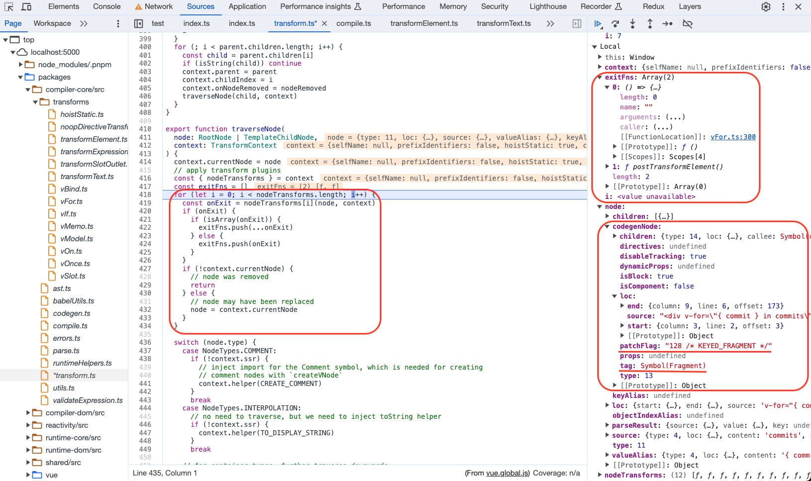
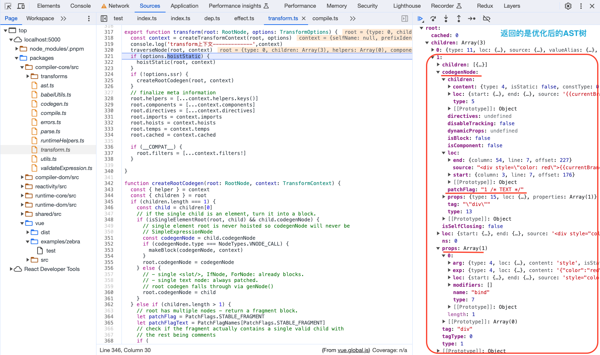

### `hoistStatic`

`hoistStatic`方法根据编译参数里`hoistStatic`是否需要静态提升进行操作，将可以静态提升的内容都提升作为静态变量存在。

```ts
// 【packages/compiler-core/src/transforms/hoistStatic.ts】
export function hoistStatic(root: RootNode, context: TransformContext) {
  walk(
    root,
    context,
    // Root node is unfortunately non-hoistable due to potential parent
    // fallthrough attributes.
    isSingleElementRoot(root, root.children[0])
  )
}

export function isSingleElementRoot(
  root: RootNode,
  child: TemplateChildNode
): child is PlainElementNode | ComponentNode | TemplateNode {
  const { children } = root
  return (
    children.length === 1 &&
    child.type === NodeTypes.ELEMENT &&
    !isSlotOutlet(child)
  )
}

function walk(
  node: ParentNode,
  context: TransformContext,
  doNotHoistNode: boolean = false
) {
  const { children } = node
  const originalCount = children.length
  let hoistedCount = 0

  for (let i = 0; i < children.length; i++) {
    const child = children[i]
    // only plain elements & text calls are eligible for hoisting.
    // 【普通元素节点&文本节点可以被静态提升】
    if (
      child.type === NodeTypes.ELEMENT &&
      child.tagType === ElementTypes.ELEMENT
    ) {
      const constantType = doNotHoistNode
        ? ConstantTypes.NOT_CONSTANT
        : getConstantType(child, context)
      if (constantType > ConstantTypes.NOT_CONSTANT) {
        if (constantType >= ConstantTypes.CAN_HOIST) {
          ;(child.codegenNode as VNodeCall).patchFlag =
            PatchFlags.HOISTED + (__DEV__ ? ` /* HOISTED */` : ``)
          child.codegenNode = context.hoist(child.codegenNode!)
          hoistedCount++
          continue
        }
      } else {
        // node may contain dynamic children, but its props may be eligible for hoisting.
        // 【动态节点的静态属性可以被静态提升】
        const codegenNode = child.codegenNode!
        if (codegenNode.type === NodeTypes.VNODE_CALL) {
          const flag = getPatchFlag(codegenNode)
          if (
            (!flag ||
              flag === PatchFlags.NEED_PATCH ||
              flag === PatchFlags.TEXT) &&
            getGeneratedPropsConstantType(child, context) >=
              ConstantTypes.CAN_HOIST
          ) {
            const props = getNodeProps(child)
            if (props) {
              codegenNode.props = context.hoist(props)
            }
          }
          if (codegenNode.dynamicProps) {
            codegenNode.dynamicProps = context.hoist(codegenNode.dynamicProps)
          }
        }
      }
    }

    // 【进一步遍历元素节点、v-for节点、v-if节点的子节点，可能存在静态节点】
    // walk further
    if (child.type === NodeTypes.ELEMENT) {
      const isComponent = child.tagType === ElementTypes.COMPONENT
      if (isComponent) {
        context.scopes.vSlot++
      }
      walk(child, context)
      if (isComponent) {
        context.scopes.vSlot--
      }
    } else if (child.type === NodeTypes.FOR) {
      // Do not hoist v-for single child because it has to be a block
      walk(child, context, child.children.length === 1)
    } else if (child.type === NodeTypes.IF) {
      for (let i = 0; i < child.branches.length; i++) {
        // Do not hoist v-if single child because it has to be a block
        walk(
          child.branches[i],
          context,
          child.branches[i].children.length === 1
        )
      }
    }
  }

  if (hoistedCount && context.transformHoist) {
    context.transformHoist(children, context, node)
  }

  // all children were hoisted - the entire children array is hoistable.
  if (
    hoistedCount &&
    hoistedCount === originalCount &&
    node.type === NodeTypes.ELEMENT &&
    node.tagType === ElementTypes.ELEMENT &&
    node.codegenNode &&
    node.codegenNode.type === NodeTypes.VNODE_CALL &&
    isArray(node.codegenNode.children)
  ) {
    node.codegenNode.children = context.hoist(
      createArrayExpression(node.codegenNode.children)
    )
  }
}
```

### `createRootCodegen`

接下来来到`transform`的最后一步，此时`ast`树的所有子节点对应`codegenNode`已经准备完毕，`createRootCodegen`方法为根节点创建对应`codegenNode`。

1. 子节点是单个元素节点转换成`block`作为根节点的`codegenNode`，否则直接用作根节点的`codegenNode`
2. 子节点是多节点转换成`fragment block`作为根节点的`codegenNode`

```ts
// 【packages/compiler-core/src/transform.ts】
// 【给根节点生成codegenNode属性】
function createRootCodegen(root: RootNode, context: TransformContext) {
  const { helper } = context
  const { children } = root
  // 【子节点就一个】
  if (children.length === 1) {
    const child = children[0]
    // if the single child is an element, turn it into a block.
    if (isSingleElementRoot(root, child) && child.codegenNode) {
      // single element root is never hoisted so codegenNode will never be
      // SimpleExpressionNode
      const codegenNode = child.codegenNode
      if (codegenNode.type === NodeTypes.VNODE_CALL) {
        makeBlock(codegenNode, context)
      }
      root.codegenNode = codegenNode
    } else {
      // - single <slot/>, IfNode, ForNode: already blocks.
      // - single text node: always patched.
      // root codegen falls through via genNode()
      root.codegenNode = child
    }
  } else if (children.length > 1) {
    // 【多个子节点，patchFlag设置为STABLE_FRAGMENT】
    // root has multiple nodes - return a fragment block.
    let patchFlag = PatchFlags.STABLE_FRAGMENT
    let patchFlagText = PatchFlagNames[PatchFlags.STABLE_FRAGMENT]
    // check if the fragment actually contains a single valid child with
    // the rest being comments
    if (
      __DEV__ &&
      children.filter(c => c.type !== NodeTypes.COMMENT).length === 1
    ) {
      patchFlag |= PatchFlags.DEV_ROOT_FRAGMENT
      patchFlagText += `, ${PatchFlagNames[PatchFlags.DEV_ROOT_FRAGMENT]}`
    }
    root.codegenNode = createVNodeCall(
      context,
      helper(FRAGMENT),
      undefined,
      root.children,
      patchFlag + (__DEV__ ? ` /* ${patchFlagText} */` : ``),
      undefined,
      undefined,
      true,
      undefined,
      false /* isComponent */
    )
  } else {
    // no children = noop. codegen will return null.
  }
}
```


到此，根节点的`codegenNode`也已生成，经过改造的`ast`树已经形成，下一步就是`generate`方法将这棵`ast`树转化成可执行代码串。

## generate

- `generate`方法将 `AST` 树转换成可执行的代码也就是在运行时执行的代码的字符串。

`generate`中几个关键步骤如下：

1. `createCodegenContext`创建`generate`工作的上下文环境，包含一些标志变量和用于代码生成的方法等，例如`push`往后加入代码、`indent`缩进、`deindent`减少缩进、`newline`换行等等。
2. `genFunctionPreamble`生成需要导入的辅助函数的代码等
3. 最终生成完整的`render`函数代码串，处理断行等等，然后调用`genNode`方法遍历生成代码片段并拼接，`genNode`方法内部遍历node根据不同node类型调用不同生成代码串的方法

```ts
// 【packages/compiler-core/src/codegen.ts】
export function generate(
  ast: RootNode,
  options: CodegenOptions & {
    onContextCreated?: (context: CodegenContext) => void
  } = {}
): CodegenResult {
  // 【1.创建generate上下文】
  const context = createCodegenContext(ast, options)
  if (options.onContextCreated) options.onContextCreated(context)
  const {
    mode,
    push,
    prefixIdentifiers,
    indent,
    deindent,
    newline,
    scopeId,
    ssr
  } = context

  // 【变量判断，如是否inline、是否浏览器环境、是否ssr用不同函数名称等等】
  const hasHelpers = ast.helpers.length > 0
  const useWithBlock = !prefixIdentifiers && mode !== 'module'
  const genScopeId = !__BROWSER__ && scopeId != null && mode === 'module'
  const isSetupInlined = !__BROWSER__ && !!options.inline

  // 【生成预设代码】
  // preambles
  // in setup() inline mode, the preamble is generated in a sub context
  // and returned separately.
  const preambleContext = isSetupInlined
    ? createCodegenContext(ast, options)
    : context
  if (!__BROWSER__ && mode === 'module') {
    genModulePreamble(ast, preambleContext, genScopeId, isSetupInlined)
  } else {
    genFunctionPreamble(ast, preambleContext)
  }

  // 【生成render函数】
  // enter render function
  const functionName = ssr ? `ssrRender` : `render`
  const args = ssr ? ['_ctx', '_push', '_parent', '_attrs'] : ['_ctx', '_cache']
  if (!__BROWSER__ && options.bindingMetadata && !options.inline) {
    // binding optimization args
    args.push('$props', '$setup', '$data', '$options')
  }
  const signature =
    !__BROWSER__ && options.isTS
      ? args.map(arg => `${arg}: any`).join(',')
      : args.join(', ')
  // 【代码开头，根据是否inline，写成箭头函数或者function xxx】
  if (isSetupInlined) {
    push(`(${signature}) => {`)
  } else {
    push(`function ${functionName}(${signature}) {`)
  }
  // 【代码缩进】
  indent()

  // 【是否使用with语法】
  if (useWithBlock) {
    push(`with (_ctx) {`)
    indent()
    // function mode const declarations should be inside with block
    // also they should be renamed to avoid collision with user properties
    if (hasHelpers) {
      push(`const { ${ast.helpers.map(aliasHelper).join(', ')} } = _Vue`)
      push(`\n`)
      newline()
    }
  }

  // 【自定义组件】
  // generate asset resolution statements
  if (ast.components.length) {
    genAssets(ast.components, 'component', context)
    if (ast.directives.length || ast.temps > 0) {
      newline()
    }
  }
  // 【自定义指令】
  if (ast.directives.length) {
    genAssets(ast.directives, 'directive', context)
    if (ast.temps > 0) {
      newline()
    }
  }
  if (__COMPAT__ && ast.filters && ast.filters.length) {
    newline()
    genAssets(ast.filters, 'filter', context)
    newline()
  }
  // 【临时变量】
  if (ast.temps > 0) {
    push(`let `)
    for (let i = 0; i < ast.temps; i++) {
      push(`${i > 0 ? `, ` : ``}_temp${i}`)
    }
  }
  if (ast.components.length || ast.directives.length || ast.temps) {
    push(`\n`)
    newline()
  }

  // generate the VNode tree expression
  if (!ssr) {
    push(`return `)
  }
  // 【根据上一步transform过后的ast的节点的codegenNode生成对应内容】
  if (ast.codegenNode) {
    genNode(ast.codegenNode, context)
  } else {
    push(`null`)
  }

  if (useWithBlock) {
    deindent()
    push(`}`)
  }

  deindent()
  push(`}`)

  return {
    ast,
    code: context.code,
    preamble: isSetupInlined ? preambleContext.code : ``,
    // SourceMapGenerator does have toJSON() method but it's not in the types
    map: context.map ? (context.map as any).toJSON() : undefined
  }
}
```

### createCodegenContext

`createCodegenContext`方法创建了`generate`过程的上下文，包含一些标志变量和用于代码生成的方法等，例如`push`往`context.code`加代码、`indent`缩进、`deindent`减少缩进、`newline`换行等等。

```ts
// 【packages/compiler-core/src/codegen.ts】
function createCodegenContext(
  ast: RootNode,
  {
    mode = 'function',
    prefixIdentifiers = mode === 'module',
    sourceMap = false,
    filename = `template.vue.html`,
    scopeId = null,
    optimizeImports = false,
    runtimeGlobalName = `Vue`,
    runtimeModuleName = `vue`,
    ssrRuntimeModuleName = 'vue/server-renderer',
    ssr = false,
    isTS = false,
    inSSR = false
  }: CodegenOptions
): CodegenContext {
  const context: CodegenContext = {
    mode,
    prefixIdentifiers,
    sourceMap,
    filename,
    scopeId,
    optimizeImports,
    runtimeGlobalName,
    runtimeModuleName,
    ssrRuntimeModuleName,
    ssr,
    isTS,
    inSSR,
    source: ast.loc.source,
    code: ``,
    column: 1,
    line: 1,
    offset: 0,
    indentLevel: 0,
    pure: false,
    map: undefined,
    helper(key) {
      return `_${helperNameMap[key]}`
    },
    push(code, node) {
      context.code += code
      if (!__BROWSER__ && context.map) {
        if (node) {
          let name
          if (node.type === NodeTypes.SIMPLE_EXPRESSION && !node.isStatic) {
            const content = node.content.replace(/^_ctx\./, '')
            if (content !== node.content && isSimpleIdentifier(content)) {
              name = content
            }
          }
          addMapping(node.loc.start, name)
        }
        advancePositionWithMutation(context, code)
        if (node && node.loc !== locStub) {
          addMapping(node.loc.end)
        }
      }
    },
    indent() {
      newline(++context.indentLevel)
    },
    deindent(withoutNewLine = false) {
      if (withoutNewLine) {
        --context.indentLevel
      } else {
        newline(--context.indentLevel)
      }
    },
    newline() {
      newline(context.indentLevel)
    }
  }

  function newline(n: number) {
    context.push('\n' + `  `.repeat(n))
  }

  function addMapping(loc: Position, name?: string) {
    context.map!.addMapping({
      name,
      source: context.filename,
      original: {
        line: loc.line,
        column: loc.column - 1 // source-map column is 0 based
      },
      generated: {
        line: context.line,
        column: context.column - 1
      }
    })
  }

  if (!__BROWSER__ && sourceMap) {
    // lazy require source-map implementation, only in non-browser builds
    context.map = new SourceMapGenerator()
    context.map!.setSourceContent(filename, context.source)
  }

  return context
}
```

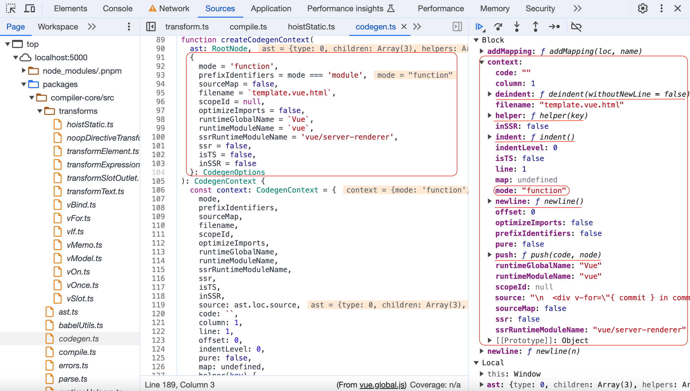

### genFunctionPreamble

`genFunctionPreamble`方法主要是生成需要导入的辅助函数的代码等

```ts
// 【packages/compiler-core/src/codegen.ts】
function genFunctionPreamble(ast: RootNode, context: CodegenContext) {
  const {
    ssr,
    prefixIdentifiers,
    push,
    newline,
    runtimeModuleName,
    runtimeGlobalName,
    ssrRuntimeModuleName
  } = context
  const VueBinding =
    !__BROWSER__ && ssr
      ? `require(${JSON.stringify(runtimeModuleName)})`
      : runtimeGlobalName
  // Generate const declaration for helpers
  // In prefix mode, we place the const declaration at top so it's done
  // only once; But if we not prefixing, we place the declaration inside the
  // with block so it doesn't incur the `in` check cost for every helper access.
  if (ast.helpers.length > 0) {
    if (!__BROWSER__ && prefixIdentifiers) {
      push(
        `const { ${ast.helpers.map(aliasHelper).join(', ')} } = ${VueBinding}\n`
      )
    } else {
      // "with" mode.
      // save Vue in a separate variable to avoid collision
      push(`const _Vue = ${VueBinding}\n`)
      // in "with" mode, helpers are declared inside the with block to avoid
      // has check cost, but hoists are lifted out of the function - we need
      // to provide the helper here.
      if (ast.hoists.length) {
        const staticHelpers = [
          CREATE_VNODE,
          CREATE_ELEMENT_VNODE,
          CREATE_COMMENT,
          CREATE_TEXT,
          CREATE_STATIC
        ]
          .filter(helper => ast.helpers.includes(helper))
          .map(aliasHelper)
          .join(', ')
        push(`const { ${staticHelpers} } = _Vue\n`)
      }
    }
  }
  // generate variables for ssr helpers
  if (!__BROWSER__ && ast.ssrHelpers && ast.ssrHelpers.length) {
    // ssr guarantees prefixIdentifier: true
    push(
      `const { ${ast.ssrHelpers
        .map(aliasHelper)
        .join(', ')} } = require("${ssrRuntimeModuleName}")\n`
    )
  }
  genHoists(ast.hoists, context)
  newline()
  push(`return `)
}
```

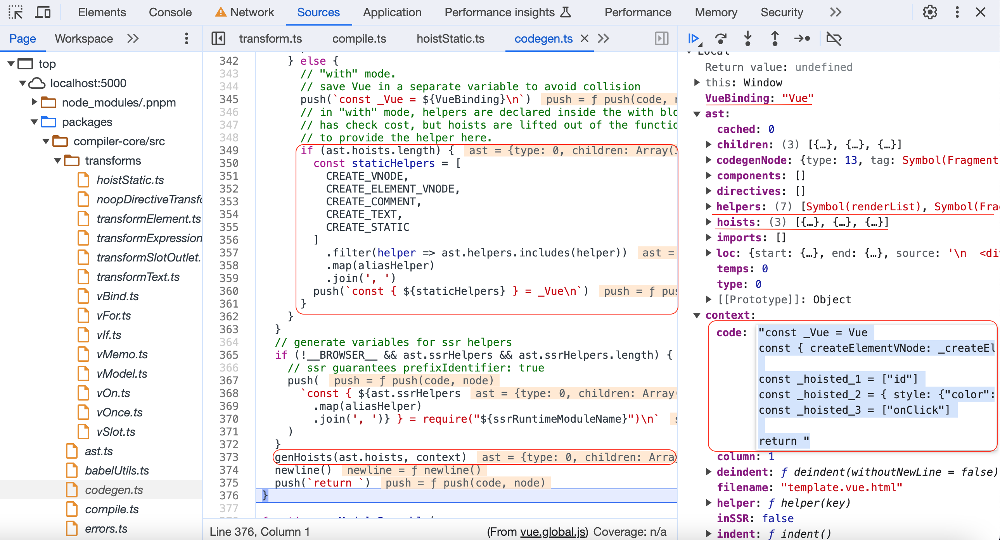

### genNode

`genNode`遍历节点生成对应的代码，根据节点类型不同调用不同方法生成例如：`genComment`、`genText`等等，此时会用到之前存储的辅助函数生成代码串，节点所有相关的信息都存储在对应的`codegenNode`中。

```ts
// 【packages/compiler-core/src/codegen.ts】
function genNode(node: CodegenNode | symbol | string, context: CodegenContext) {
  if (isString(node)) {
    context.push(node)
    return
  }
  if (isSymbol(node)) {
    context.push(context.helper(node))
    return
  }
  switch (node.type) {
    case NodeTypes.ELEMENT:
    case NodeTypes.IF:
    case NodeTypes.FOR:
      __DEV__ &&
        assert(
          node.codegenNode != null,
          `Codegen node is missing for element/if/for node. ` +
            `Apply appropriate transforms first.`
        )
      genNode(node.codegenNode!, context)
      break
    case NodeTypes.TEXT:
      genText(node, context)
      break
    case NodeTypes.SIMPLE_EXPRESSION:
      genExpression(node, context)
      break
    case NodeTypes.INTERPOLATION:
      genInterpolation(node, context)
      break
    case NodeTypes.TEXT_CALL:
      genNode(node.codegenNode, context)
      break
    case NodeTypes.COMPOUND_EXPRESSION:
      genCompoundExpression(node, context)
      break
    case NodeTypes.COMMENT:
      genComment(node, context)
      break
    case NodeTypes.VNODE_CALL:
      genVNodeCall(node, context)
      break

    case NodeTypes.JS_CALL_EXPRESSION:
      genCallExpression(node, context)
      break
    case NodeTypes.JS_OBJECT_EXPRESSION:
      genObjectExpression(node, context)
      break
    case NodeTypes.JS_ARRAY_EXPRESSION:
      genArrayExpression(node, context)
      break
    case NodeTypes.JS_FUNCTION_EXPRESSION:
      genFunctionExpression(node, context)
      break
    case NodeTypes.JS_CONDITIONAL_EXPRESSION:
      genConditionalExpression(node, context)
      break
    case NodeTypes.JS_CACHE_EXPRESSION:
      genCacheExpression(node, context)
      break
    case NodeTypes.JS_BLOCK_STATEMENT:
      genNodeList(node.body, context, true, false)
      break

    // SSR only types
    case NodeTypes.JS_TEMPLATE_LITERAL:
      !__BROWSER__ && genTemplateLiteral(node, context)
      break
    case NodeTypes.JS_IF_STATEMENT:
      !__BROWSER__ && genIfStatement(node, context)
      break
    case NodeTypes.JS_ASSIGNMENT_EXPRESSION:
      !__BROWSER__ && genAssignmentExpression(node, context)
      break
    case NodeTypes.JS_SEQUENCE_EXPRESSION:
      !__BROWSER__ && genSequenceExpression(node, context)
      break
    case NodeTypes.JS_RETURN_STATEMENT:
      !__BROWSER__ && genReturnStatement(node, context)
      break

    /* istanbul ignore next */
    case NodeTypes.IF_BRANCH:
      // noop
      break
    default:
      if (__DEV__) {
        assert(false, `unhandled codegen node type: ${(node as any).type}`)
        // make sure we exhaust all possible types
        const exhaustiveCheck: never = node
        return exhaustiveCheck
      }
  }
}

function genComment(node: CommentNode, context: CodegenContext) {
  const { push, helper, pure } = context
  if (pure) {
    push(PURE_ANNOTATION)
  }
  push(`${helper(CREATE_COMMENT)}(${JSON.stringify(node.content)})`, node)
}

function genText(
  node: TextNode | SimpleExpressionNode,
  context: CodegenContext
) {
  context.push(JSON.stringify(node.content), node)
}
```

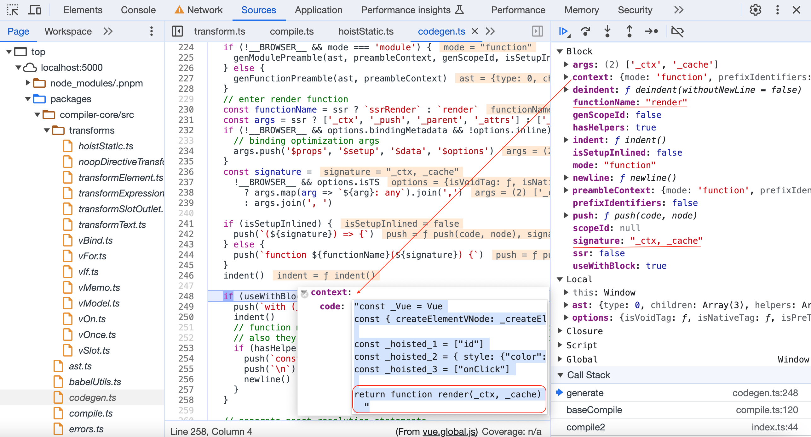
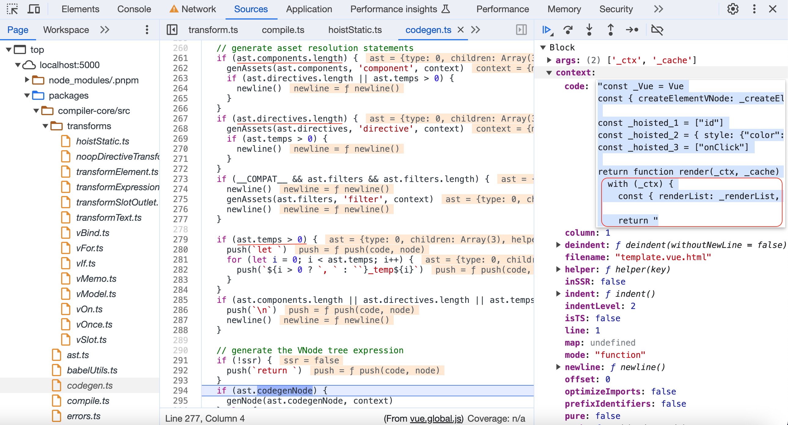
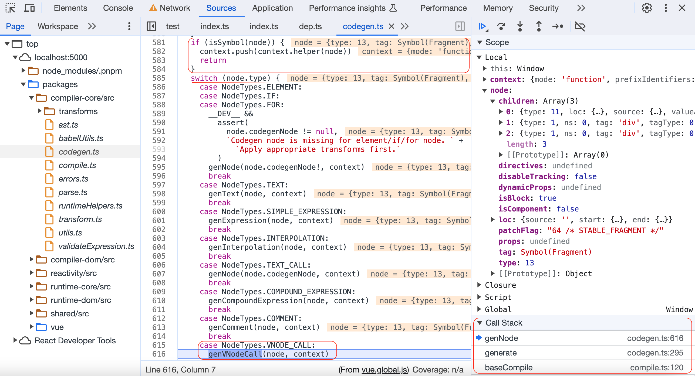
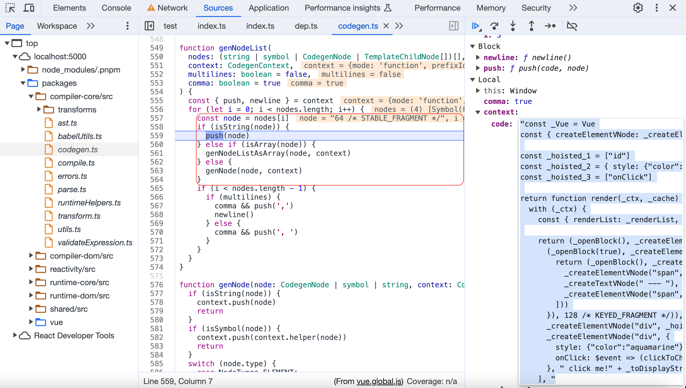

生成`render`函数的辅助函数有如下：

```ts
export const helperNameMap: Record<symbol, string> = {
  [FRAGMENT]: `Fragment`,
  [TELEPORT]: `Teleport`,
  [SUSPENSE]: `Suspense`,
  [KEEP_ALIVE]: `KeepAlive`,
  [BASE_TRANSITION]: `BaseTransition`,
  [OPEN_BLOCK]: `openBlock`,
  [CREATE_BLOCK]: `createBlock`,
  [CREATE_ELEMENT_BLOCK]: `createElementBlock`,
  [CREATE_VNODE]: `createVNode`,
  [CREATE_ELEMENT_VNODE]: `createElementVNode`,
  [CREATE_COMMENT]: `createCommentVNode`,
  [CREATE_TEXT]: `createTextVNode`,
  [CREATE_STATIC]: `createStaticVNode`,
  [RESOLVE_COMPONENT]: `resolveComponent`,
  [RESOLVE_DYNAMIC_COMPONENT]: `resolveDynamicComponent`,
  [RESOLVE_DIRECTIVE]: `resolveDirective`,
  [RESOLVE_FILTER]: `resolveFilter`,
  [WITH_DIRECTIVES]: `withDirectives`,
  [RENDER_LIST]: `renderList`,
  [RENDER_SLOT]: `renderSlot`,
  [CREATE_SLOTS]: `createSlots`,
  [TO_DISPLAY_STRING]: `toDisplayString`,
  [MERGE_PROPS]: `mergeProps`,
  [NORMALIZE_CLASS]: `normalizeClass`,
  [NORMALIZE_STYLE]: `normalizeStyle`,
  [NORMALIZE_PROPS]: `normalizeProps`,
  [GUARD_REACTIVE_PROPS]: `guardReactiveProps`,
  [TO_HANDLERS]: `toHandlers`,
  [CAMELIZE]: `camelize`,
  [CAPITALIZE]: `capitalize`,
  [TO_HANDLER_KEY]: `toHandlerKey`,
  [SET_BLOCK_TRACKING]: `setBlockTracking`,
  [PUSH_SCOPE_ID]: `pushScopeId`,
  [POP_SCOPE_ID]: `popScopeId`,
  [WITH_CTX]: `withCtx`,
  [UNREF]: `unref`,
  [IS_REF]: `isRef`,
  [WITH_MEMO]: `withMemo`,
  [IS_MEMO_SAME]: `isMemoSame`
}
```

## 总结

根据之前的用例，经历三个步骤生成内容分别如下，可以看到编译出的`code`，可以看到需要`patch`的几个地方都有对应的`patchFlag`，在后续`patch`过程中是非常重要的优化前置条件，还有绑定的事件会进行缓存，不会每次重新声明一个函数引起子组件更新等问题。

- 第一步`parse`生成ast树

```json
{"type":0,"children":[{"type":1,"ns":0,"tag":"div","tagType":0,"props":[{"type":7,"name":"for","exp":{"type":4,"content":"{ commit } in commits","isStatic":false,"constType":0,"loc":{"start":{"column":15,"line":2,"offset":15},"end":{"column":36,"line":2,"offset":36},"source":"{ commit } in commits"}},"modifiers":[],"loc":{"start":{"column":8,"line":2,"offset":8},"end":{"column":37,"line":2,"offset":37},"source":"v-for=\"{ commit } in commits\""}},{"type":7,"name":"bind","exp":{"type":4,"content":"commit","isStatic":false,"constType":0,"loc":{"start":{"column":44,"line":2,"offset":44},"end":{"column":50,"line":2,"offset":50},"source":"commit"}},"arg":{"type":4,"content":"key","isStatic":true,"constType":3,"loc":{"start":{"column":39,"line":2,"offset":39},"end":{"column":42,"line":2,"offset":42},"source":"key"}},"modifiers":[],"loc":{"start":{"column":38,"line":2,"offset":38},"end":{"column":51,"line":2,"offset":51},"source":":key=\"commit\""}}],"isSelfClosing":false,"children":[{"type":1,"ns":0,"tag":"span","tagType":0,"props":[{"type":7,"name":"bind","exp":{"type":4,"content":"commit.author","isStatic":false,"constType":0,"loc":{"start":{"column":16,"line":3,"offset":68},"end":{"column":29,"line":3,"offset":81},"source":"commit.author"}},"arg":{"type":4,"content":"id","isStatic":true,"constType":3,"loc":{"start":{"column":12,"line":3,"offset":64},"end":{"column":14,"line":3,"offset":66},"source":"id"}},"modifiers":[],"loc":{"start":{"column":11,"line":3,"offset":63},"end":{"column":30,"line":3,"offset":82},"source":":id=\"commit.author\""}}],"isSelfClosing":false,"children":[{"type":5,"content":{"type":4,"isStatic":false,"constType":0,"content":"commit.author.name","loc":{"start":{"column":34,"line":3,"offset":86},"end":{"column":52,"line":3,"offset":104},"source":"commit.author.name"}},"loc":{"start":{"column":31,"line":3,"offset":83},"end":{"column":55,"line":3,"offset":107},"source":"{{ commit.author.name }}"}}],"loc":{"start":{"column":5,"line":3,"offset":57},"end":{"column":62,"line":3,"offset":114},"source":"<span :id=\"commit.author\">{{ commit.author.name }}</span>"}},{"type":2,"content":" --- ","loc":{"start":{"column":62,"line":3,"offset":114},"end":{"column":5,"line":5,"offset":127},"source":"\n    ---\n    "}},{"type":1,"ns":0,"tag":"span","tagType":0,"props":[],"isSelfClosing":false,"children":[{"type":5,"content":{"type":4,"isStatic":false,"constType":0,"content":"commit.author.date","loc":{"start":{"column":14,"line":5,"offset":136},"end":{"column":32,"line":5,"offset":154},"source":"commit.author.date"}},"loc":{"start":{"column":11,"line":5,"offset":133},"end":{"column":35,"line":5,"offset":157},"source":"{{ commit.author.date }}"}}],"loc":{"start":{"column":5,"line":5,"offset":127},"end":{"column":42,"line":5,"offset":164},"source":"<span>{{ commit.author.date }}</span>"}}],"loc":{"start":{"column":3,"line":2,"offset":3},"end":{"column":9,"line":6,"offset":173},"source":"<div v-for=\"{ commit } in commits\" :key=\"commit\">\n    <span :id=\"commit.author\">{{ commit.author.name }}</span>\n    ---\n    <span>{{ commit.author.date }}</span>\n  </div>"}},{"type":1,"ns":0,"tag":"div","tagType":0,"props":[{"type":6,"name":"style","value":{"type":2,"content":"color: red","loc":{"start":{"column":14,"line":7,"offset":187},"end":{"column":26,"line":7,"offset":199},"source":"\"color: red\""}},"loc":{"start":{"column":8,"line":7,"offset":181},"end":{"column":26,"line":7,"offset":199},"source":"style=\"color: red\""}}],"isSelfClosing":false,"children":[{"type":5,"content":{"type":4,"isStatic":false,"constType":0,"content":"currentBranchPlus","loc":{"start":{"column":29,"line":7,"offset":202},"end":{"column":46,"line":7,"offset":219},"source":"currentBranchPlus"}},"loc":{"start":{"column":27,"line":7,"offset":200},"end":{"column":48,"line":7,"offset":221},"source":"{{currentBranchPlus}}"}}],"loc":{"start":{"column":3,"line":7,"offset":176},"end":{"column":54,"line":7,"offset":227},"source":"<div style=\"color: red\">{{currentBranchPlus}}</div>"}},{"type":1,"ns":0,"tag":"div","tagType":0,"props":[{"type":6,"name":"style","value":{"type":2,"content":"color: aquamarine","loc":{"start":{"column":14,"line":8,"offset":241},"end":{"column":33,"line":8,"offset":260},"source":"\"color: aquamarine\""}},"loc":{"start":{"column":8,"line":8,"offset":235},"end":{"column":33,"line":8,"offset":260},"source":"style=\"color: aquamarine\""}},{"type":7,"name":"on","exp":{"type":4,"content":"clickToChangeBranch()","isStatic":false,"constType":0,"loc":{"start":{"column":42,"line":8,"offset":269},"end":{"column":63,"line":8,"offset":290},"source":"clickToChangeBranch()"}},"arg":{"type":4,"content":"click","isStatic":true,"constType":3,"loc":{"start":{"column":35,"line":8,"offset":262},"end":{"column":40,"line":8,"offset":267},"source":"click"}},"modifiers":[],"loc":{"start":{"column":34,"line":8,"offset":261},"end":{"column":64,"line":8,"offset":291},"source":"@click=\"clickToChangeBranch()\""}}],"isSelfClosing":false,"children":[{"type":2,"content":" click me!","loc":{"start":{"column":65,"line":8,"offset":292},"end":{"column":14,"line":9,"offset":306},"source":"\n    click me!"}},{"type":5,"content":{"type":4,"isStatic":false,"constType":0,"content":"reactiveObj.name","loc":{"start":{"column":16,"line":9,"offset":308},"end":{"column":32,"line":9,"offset":324},"source":"reactiveObj.name"}},"loc":{"start":{"column":14,"line":9,"offset":306},"end":{"column":34,"line":9,"offset":326},"source":"{{reactiveObj.name}}"}}],"loc":{"start":{"column":3,"line":8,"offset":230},"end":{"column":9,"line":10,"offset":335},"source":"<div style=\"color: aquamarine\" @click=\"clickToChangeBranch()\">\n    click me!{{reactiveObj.name}}\n  </div>"}}],"helpers":[],"components":[],"directives":[],"hoists":[],"imports":[],"cached":0,"temps":0,"loc":{"start":{"column":1,"line":1,"offset":0},"end":{"column":1,"line":11,"offset":336},"source":"\n  <div v-for=\"{ commit } in commits\" :key=\"commit\">\n    <span :id=\"commit.author\">{{ commit.author.name }}</span>\n    ---\n    <span>{{ commit.author.date }}</span>\n  </div>\n  <div style=\"color: red\">{{currentBranchPlus}}</div>\n  <div style=\"color: aquamarine\" @click=\"clickToChangeBranch()\">\n    click me!{{reactiveObj.name}}\n  </div>\n"}}
```

- 第二步`transform`优化ast树，为后续生成代码做准备

```json
{"type":0,"children":[{"type":11,"loc":{"start":{"column":8,"line":2,"offset":8},"end":{"column":37,"line":2,"offset":37},"source":"v-for=\"{ commit } in commits\""},"source":{"type":4,"loc":{"source":"commits","start":{"column":29,"line":2,"offset":29},"end":{"column":36,"line":2,"offset":36}},"content":"commits","isStatic":false,"constType":0},"valueAlias":{"type":4,"loc":{"source":"{ commit }","start":{"column":15,"line":2,"offset":15},"end":{"column":25,"line":2,"offset":25}},"content":"{ commit }","isStatic":false,"constType":0},"parseResult":{"source":{"type":4,"loc":{"source":"commits","start":{"column":29,"line":2,"offset":29},"end":{"column":36,"line":2,"offset":36}},"content":"commits","isStatic":false,"constType":0},"value":{"type":4,"loc":{"source":"{ commit }","start":{"column":15,"line":2,"offset":15},"end":{"column":25,"line":2,"offset":25}},"content":"{ commit }","isStatic":false,"constType":0}},"children":[{"type":1,"ns":0,"tag":"div","tagType":0,"props":[{"type":7,"name":"bind","exp":{"type":4,"content":"commit","isStatic":false,"constType":0,"loc":{"start":{"column":44,"line":2,"offset":44},"end":{"column":50,"line":2,"offset":50},"source":"commit"}},"arg":{"type":4,"content":"key","isStatic":true,"constType":3,"loc":{"start":{"column":39,"line":2,"offset":39},"end":{"column":42,"line":2,"offset":42},"source":"key"}},"modifiers":[],"loc":{"start":{"column":38,"line":2,"offset":38},"end":{"column":51,"line":2,"offset":51},"source":":key=\"commit\""}}],"isSelfClosing":false,"children":[{"type":1,"ns":0,"tag":"span","tagType":0,"props":[{"type":7,"name":"bind","exp":{"type":4,"content":"commit.author","isStatic":false,"constType":0,"loc":{"start":{"column":16,"line":3,"offset":68},"end":{"column":29,"line":3,"offset":81},"source":"commit.author"}},"arg":{"type":4,"content":"id","isStatic":true,"constType":3,"loc":{"start":{"column":12,"line":3,"offset":64},"end":{"column":14,"line":3,"offset":66},"source":"id"}},"modifiers":[],"loc":{"start":{"column":11,"line":3,"offset":63},"end":{"column":30,"line":3,"offset":82},"source":":id=\"commit.author\""}}],"isSelfClosing":false,"children":[{"type":5,"content":{"type":4,"isStatic":false,"constType":0,"content":"commit.author.name","loc":{"start":{"column":34,"line":3,"offset":86},"end":{"column":52,"line":3,"offset":104},"source":"commit.author.name"}},"loc":{"start":{"column":31,"line":3,"offset":83},"end":{"column":55,"line":3,"offset":107},"source":"{{ commit.author.name }}"}}],"loc":{"start":{"column":5,"line":3,"offset":57},"end":{"column":62,"line":3,"offset":114},"source":"<span :id=\"commit.author\">{{ commit.author.name }}</span>"},"codegenNode":{"type":13,"tag":"\"span\"","props":{"type":15,"loc":{"start":{"column":5,"line":3,"offset":57},"end":{"column":62,"line":3,"offset":114},"source":"<span :id=\"commit.author\">{{ commit.author.name }}</span>"},"properties":[{"type":16,"loc":{"source":"","start":{"line":1,"column":1,"offset":0},"end":{"line":1,"column":1,"offset":0}},"key":{"type":4,"content":"id","isStatic":true,"constType":3,"loc":{"start":{"column":12,"line":3,"offset":64},"end":{"column":14,"line":3,"offset":66},"source":"id"}},"value":{"type":4,"content":"commit.author","isStatic":false,"constType":0,"loc":{"start":{"column":16,"line":3,"offset":68},"end":{"column":29,"line":3,"offset":81},"source":"commit.author"}}}]},"children":{"type":5,"content":{"type":4,"isStatic":false,"constType":0,"content":"commit.author.name","loc":{"start":{"column":34,"line":3,"offset":86},"end":{"column":52,"line":3,"offset":104},"source":"commit.author.name"}},"loc":{"start":{"column":31,"line":3,"offset":83},"end":{"column":55,"line":3,"offset":107},"source":"{{ commit.author.name }}"}},"patchFlag":"9 /* TEXT, PROPS */","dynamicProps":{"type":4,"loc":{"source":"","start":{"line":1,"column":1,"offset":0},"end":{"line":1,"column":1,"offset":0}},"content":"_hoisted_1","isStatic":false,"constType":2,"hoisted":{"type":4,"loc":{"source":"","start":{"line":1,"column":1,"offset":0},"end":{"line":1,"column":1,"offset":0}},"content":"[\"id\"]","isStatic":false,"constType":0}},"isBlock":false,"disableTracking":false,"isComponent":false,"loc":{"start":{"column":5,"line":3,"offset":57},"end":{"column":62,"line":3,"offset":114},"source":"<span :id=\"commit.author\">{{ commit.author.name }}</span>"}}},{"type":12,"content":{"type":2,"content":" --- ","loc":{"start":{"column":62,"line":3,"offset":114},"end":{"column":5,"line":5,"offset":127},"source":"\n    ---\n    "}},"loc":{"start":{"column":62,"line":3,"offset":114},"end":{"column":5,"line":5,"offset":127},"source":"\n    ---\n    "},"codegenNode":{"type":14,"loc":{"source":"","start":{"line":1,"column":1,"offset":0},"end":{"line":1,"column":1,"offset":0}},"arguments":[{"type":2,"content":" --- ","loc":{"start":{"column":62,"line":3,"offset":114},"end":{"column":5,"line":5,"offset":127},"source":"\n    ---\n    "}}]}},{"type":1,"ns":0,"tag":"span","tagType":0,"props":[],"isSelfClosing":false,"children":[{"type":5,"content":{"type":4,"isStatic":false,"constType":0,"content":"commit.author.date","loc":{"start":{"column":14,"line":5,"offset":136},"end":{"column":32,"line":5,"offset":154},"source":"commit.author.date"}},"loc":{"start":{"column":11,"line":5,"offset":133},"end":{"column":35,"line":5,"offset":157},"source":"{{ commit.author.date }}"}}],"loc":{"start":{"column":5,"line":5,"offset":127},"end":{"column":42,"line":5,"offset":164},"source":"<span>{{ commit.author.date }}</span>"},"codegenNode":{"type":13,"tag":"\"span\"","children":{"type":5,"content":{"type":4,"isStatic":false,"constType":0,"content":"commit.author.date","loc":{"start":{"column":14,"line":5,"offset":136},"end":{"column":32,"line":5,"offset":154},"source":"commit.author.date"}},"loc":{"start":{"column":11,"line":5,"offset":133},"end":{"column":35,"line":5,"offset":157},"source":"{{ commit.author.date }}"}},"patchFlag":"1 /* TEXT */","isBlock":false,"disableTracking":false,"isComponent":false,"loc":{"start":{"column":5,"line":5,"offset":127},"end":{"column":42,"line":5,"offset":164},"source":"<span>{{ commit.author.date }}</span>"}}}],"loc":{"start":{"column":3,"line":2,"offset":3},"end":{"column":9,"line":6,"offset":173},"source":"<div v-for=\"{ commit } in commits\" :key=\"commit\">\n    <span :id=\"commit.author\">{{ commit.author.name }}</span>\n    ---\n    <span>{{ commit.author.date }}</span>\n  </div>"},"codegenNode":{"type":13,"tag":"\"div\"","props":{"type":15,"loc":{"start":{"column":3,"line":2,"offset":3},"end":{"column":9,"line":6,"offset":173},"source":"<div v-for=\"{ commit } in commits\" :key=\"commit\">\n    <span :id=\"commit.author\">{{ commit.author.name }}</span>\n    ---\n    <span>{{ commit.author.date }}</span>\n  </div>"},"properties":[{"type":16,"loc":{"source":"","start":{"line":1,"column":1,"offset":0},"end":{"line":1,"column":1,"offset":0}},"key":{"type":4,"content":"key","isStatic":true,"constType":3,"loc":{"start":{"column":39,"line":2,"offset":39},"end":{"column":42,"line":2,"offset":42},"source":"key"}},"value":{"type":4,"content":"commit","isStatic":false,"constType":0,"loc":{"start":{"column":44,"line":2,"offset":44},"end":{"column":50,"line":2,"offset":50},"source":"commit"}}}]},"children":[{"type":1,"ns":0,"tag":"span","tagType":0,"props":[{"type":7,"name":"bind","exp":{"type":4,"content":"commit.author","isStatic":false,"constType":0,"loc":{"start":{"column":16,"line":3,"offset":68},"end":{"column":29,"line":3,"offset":81},"source":"commit.author"}},"arg":{"type":4,"content":"id","isStatic":true,"constType":3,"loc":{"start":{"column":12,"line":3,"offset":64},"end":{"column":14,"line":3,"offset":66},"source":"id"}},"modifiers":[],"loc":{"start":{"column":11,"line":3,"offset":63},"end":{"column":30,"line":3,"offset":82},"source":":id=\"commit.author\""}}],"isSelfClosing":false,"children":[{"type":5,"content":{"type":4,"isStatic":false,"constType":0,"content":"commit.author.name","loc":{"start":{"column":34,"line":3,"offset":86},"end":{"column":52,"line":3,"offset":104},"source":"commit.author.name"}},"loc":{"start":{"column":31,"line":3,"offset":83},"end":{"column":55,"line":3,"offset":107},"source":"{{ commit.author.name }}"}}],"loc":{"start":{"column":5,"line":3,"offset":57},"end":{"column":62,"line":3,"offset":114},"source":"<span :id=\"commit.author\">{{ commit.author.name }}</span>"},"codegenNode":{"type":13,"tag":"\"span\"","props":{"type":15,"loc":{"start":{"column":5,"line":3,"offset":57},"end":{"column":62,"line":3,"offset":114},"source":"<span :id=\"commit.author\">{{ commit.author.name }}</span>"},"properties":[{"type":16,"loc":{"source":"","start":{"line":1,"column":1,"offset":0},"end":{"line":1,"column":1,"offset":0}},"key":{"type":4,"content":"id","isStatic":true,"constType":3,"loc":{"start":{"column":12,"line":3,"offset":64},"end":{"column":14,"line":3,"offset":66},"source":"id"}},"value":{"type":4,"content":"commit.author","isStatic":false,"constType":0,"loc":{"start":{"column":16,"line":3,"offset":68},"end":{"column":29,"line":3,"offset":81},"source":"commit.author"}}}]},"children":{"type":5,"content":{"type":4,"isStatic":false,"constType":0,"content":"commit.author.name","loc":{"start":{"column":34,"line":3,"offset":86},"end":{"column":52,"line":3,"offset":104},"source":"commit.author.name"}},"loc":{"start":{"column":31,"line":3,"offset":83},"end":{"column":55,"line":3,"offset":107},"source":"{{ commit.author.name }}"}},"patchFlag":"9 /* TEXT, PROPS */","dynamicProps":{"type":4,"loc":{"source":"","start":{"line":1,"column":1,"offset":0},"end":{"line":1,"column":1,"offset":0}},"content":"_hoisted_1","isStatic":false,"constType":2,"hoisted":{"type":4,"loc":{"source":"","start":{"line":1,"column":1,"offset":0},"end":{"line":1,"column":1,"offset":0}},"content":"[\"id\"]","isStatic":false,"constType":0}},"isBlock":false,"disableTracking":false,"isComponent":false,"loc":{"start":{"column":5,"line":3,"offset":57},"end":{"column":62,"line":3,"offset":114},"source":"<span :id=\"commit.author\">{{ commit.author.name }}</span>"}}},{"type":12,"content":{"type":2,"content":" --- ","loc":{"start":{"column":62,"line":3,"offset":114},"end":{"column":5,"line":5,"offset":127},"source":"\n    ---\n    "}},"loc":{"start":{"column":62,"line":3,"offset":114},"end":{"column":5,"line":5,"offset":127},"source":"\n    ---\n    "},"codegenNode":{"type":14,"loc":{"source":"","start":{"line":1,"column":1,"offset":0},"end":{"line":1,"column":1,"offset":0}},"arguments":[{"type":2,"content":" --- ","loc":{"start":{"column":62,"line":3,"offset":114},"end":{"column":5,"line":5,"offset":127},"source":"\n    ---\n    "}}]}},{"type":1,"ns":0,"tag":"span","tagType":0,"props":[],"isSelfClosing":false,"children":[{"type":5,"content":{"type":4,"isStatic":false,"constType":0,"content":"commit.author.date","loc":{"start":{"column":14,"line":5,"offset":136},"end":{"column":32,"line":5,"offset":154},"source":"commit.author.date"}},"loc":{"start":{"column":11,"line":5,"offset":133},"end":{"column":35,"line":5,"offset":157},"source":"{{ commit.author.date }}"}}],"loc":{"start":{"column":5,"line":5,"offset":127},"end":{"column":42,"line":5,"offset":164},"source":"<span>{{ commit.author.date }}</span>"},"codegenNode":{"type":13,"tag":"\"span\"","children":{"type":5,"content":{"type":4,"isStatic":false,"constType":0,"content":"commit.author.date","loc":{"start":{"column":14,"line":5,"offset":136},"end":{"column":32,"line":5,"offset":154},"source":"commit.author.date"}},"loc":{"start":{"column":11,"line":5,"offset":133},"end":{"column":35,"line":5,"offset":157},"source":"{{ commit.author.date }}"}},"patchFlag":"1 /* TEXT */","isBlock":false,"disableTracking":false,"isComponent":false,"loc":{"start":{"column":5,"line":5,"offset":127},"end":{"column":42,"line":5,"offset":164},"source":"<span>{{ commit.author.date }}</span>"}}}],"isBlock":true,"disableTracking":false,"isComponent":false,"loc":{"start":{"column":3,"line":2,"offset":3},"end":{"column":9,"line":6,"offset":173},"source":"<div v-for=\"{ commit } in commits\" :key=\"commit\">\n    <span :id=\"commit.author\">{{ commit.author.name }}</span>\n    ---\n    <span>{{ commit.author.date }}</span>\n  </div>"}}}],"codegenNode":{"type":13,"children":{"type":14,"loc":{"source":"","start":{"line":1,"column":1,"offset":0},"end":{"line":1,"column":1,"offset":0}},"arguments":[{"type":4,"loc":{"source":"commits","start":{"column":29,"line":2,"offset":29},"end":{"column":36,"line":2,"offset":36}},"content":"commits","isStatic":false,"constType":0},{"type":18,"params":[{"type":4,"loc":{"source":"{ commit }","start":{"column":15,"line":2,"offset":15},"end":{"column":25,"line":2,"offset":25}},"content":"{ commit }","isStatic":false,"constType":0}],"returns":{"type":13,"tag":"\"div\"","props":{"type":15,"loc":{"start":{"column":3,"line":2,"offset":3},"end":{"column":9,"line":6,"offset":173},"source":"<div v-for=\"{ commit } in commits\" :key=\"commit\">\n    <span :id=\"commit.author\">{{ commit.author.name }}</span>\n    ---\n    <span>{{ commit.author.date }}</span>\n  </div>"},"properties":[{"type":16,"loc":{"source":"","start":{"line":1,"column":1,"offset":0},"end":{"line":1,"column":1,"offset":0}},"key":{"type":4,"content":"key","isStatic":true,"constType":3,"loc":{"start":{"column":39,"line":2,"offset":39},"end":{"column":42,"line":2,"offset":42},"source":"key"}},"value":{"type":4,"content":"commit","isStatic":false,"constType":0,"loc":{"start":{"column":44,"line":2,"offset":44},"end":{"column":50,"line":2,"offset":50},"source":"commit"}}}]},"children":[{"type":1,"ns":0,"tag":"span","tagType":0,"props":[{"type":7,"name":"bind","exp":{"type":4,"content":"commit.author","isStatic":false,"constType":0,"loc":{"start":{"column":16,"line":3,"offset":68},"end":{"column":29,"line":3,"offset":81},"source":"commit.author"}},"arg":{"type":4,"content":"id","isStatic":true,"constType":3,"loc":{"start":{"column":12,"line":3,"offset":64},"end":{"column":14,"line":3,"offset":66},"source":"id"}},"modifiers":[],"loc":{"start":{"column":11,"line":3,"offset":63},"end":{"column":30,"line":3,"offset":82},"source":":id=\"commit.author\""}}],"isSelfClosing":false,"children":[{"type":5,"content":{"type":4,"isStatic":false,"constType":0,"content":"commit.author.name","loc":{"start":{"column":34,"line":3,"offset":86},"end":{"column":52,"line":3,"offset":104},"source":"commit.author.name"}},"loc":{"start":{"column":31,"line":3,"offset":83},"end":{"column":55,"line":3,"offset":107},"source":"{{ commit.author.name }}"}}],"loc":{"start":{"column":5,"line":3,"offset":57},"end":{"column":62,"line":3,"offset":114},"source":"<span :id=\"commit.author\">{{ commit.author.name }}</span>"},"codegenNode":{"type":13,"tag":"\"span\"","props":{"type":15,"loc":{"start":{"column":5,"line":3,"offset":57},"end":{"column":62,"line":3,"offset":114},"source":"<span :id=\"commit.author\">{{ commit.author.name }}</span>"},"properties":[{"type":16,"loc":{"source":"","start":{"line":1,"column":1,"offset":0},"end":{"line":1,"column":1,"offset":0}},"key":{"type":4,"content":"id","isStatic":true,"constType":3,"loc":{"start":{"column":12,"line":3,"offset":64},"end":{"column":14,"line":3,"offset":66},"source":"id"}},"value":{"type":4,"content":"commit.author","isStatic":false,"constType":0,"loc":{"start":{"column":16,"line":3,"offset":68},"end":{"column":29,"line":3,"offset":81},"source":"commit.author"}}}]},"children":{"type":5,"content":{"type":4,"isStatic":false,"constType":0,"content":"commit.author.name","loc":{"start":{"column":34,"line":3,"offset":86},"end":{"column":52,"line":3,"offset":104},"source":"commit.author.name"}},"loc":{"start":{"column":31,"line":3,"offset":83},"end":{"column":55,"line":3,"offset":107},"source":"{{ commit.author.name }}"}},"patchFlag":"9 /* TEXT, PROPS */","dynamicProps":{"type":4,"loc":{"source":"","start":{"line":1,"column":1,"offset":0},"end":{"line":1,"column":1,"offset":0}},"content":"_hoisted_1","isStatic":false,"constType":2,"hoisted":{"type":4,"loc":{"source":"","start":{"line":1,"column":1,"offset":0},"end":{"line":1,"column":1,"offset":0}},"content":"[\"id\"]","isStatic":false,"constType":0}},"isBlock":false,"disableTracking":false,"isComponent":false,"loc":{"start":{"column":5,"line":3,"offset":57},"end":{"column":62,"line":3,"offset":114},"source":"<span :id=\"commit.author\">{{ commit.author.name }}</span>"}}},{"type":12,"content":{"type":2,"content":" --- ","loc":{"start":{"column":62,"line":3,"offset":114},"end":{"column":5,"line":5,"offset":127},"source":"\n    ---\n    "}},"loc":{"start":{"column":62,"line":3,"offset":114},"end":{"column":5,"line":5,"offset":127},"source":"\n    ---\n    "},"codegenNode":{"type":14,"loc":{"source":"","start":{"line":1,"column":1,"offset":0},"end":{"line":1,"column":1,"offset":0}},"arguments":[{"type":2,"content":" --- ","loc":{"start":{"column":62,"line":3,"offset":114},"end":{"column":5,"line":5,"offset":127},"source":"\n    ---\n    "}}]}},{"type":1,"ns":0,"tag":"span","tagType":0,"props":[],"isSelfClosing":false,"children":[{"type":5,"content":{"type":4,"isStatic":false,"constType":0,"content":"commit.author.date","loc":{"start":{"column":14,"line":5,"offset":136},"end":{"column":32,"line":5,"offset":154},"source":"commit.author.date"}},"loc":{"start":{"column":11,"line":5,"offset":133},"end":{"column":35,"line":5,"offset":157},"source":"{{ commit.author.date }}"}}],"loc":{"start":{"column":5,"line":5,"offset":127},"end":{"column":42,"line":5,"offset":164},"source":"<span>{{ commit.author.date }}</span>"},"codegenNode":{"type":13,"tag":"\"span\"","children":{"type":5,"content":{"type":4,"isStatic":false,"constType":0,"content":"commit.author.date","loc":{"start":{"column":14,"line":5,"offset":136},"end":{"column":32,"line":5,"offset":154},"source":"commit.author.date"}},"loc":{"start":{"column":11,"line":5,"offset":133},"end":{"column":35,"line":5,"offset":157},"source":"{{ commit.author.date }}"}},"patchFlag":"1 /* TEXT */","isBlock":false,"disableTracking":false,"isComponent":false,"loc":{"start":{"column":5,"line":5,"offset":127},"end":{"column":42,"line":5,"offset":164},"source":"<span>{{ commit.author.date }}</span>"}}}],"isBlock":true,"disableTracking":false,"isComponent":false,"loc":{"start":{"column":3,"line":2,"offset":3},"end":{"column":9,"line":6,"offset":173},"source":"<div v-for=\"{ commit } in commits\" :key=\"commit\">\n    <span :id=\"commit.author\">{{ commit.author.name }}</span>\n    ---\n    <span>{{ commit.author.date }}</span>\n  </div>"}},"newline":true,"isSlot":false,"loc":{"source":"","start":{"line":1,"column":1,"offset":0},"end":{"line":1,"column":1,"offset":0}}}]},"patchFlag":"128 /* KEYED_FRAGMENT */","isBlock":true,"disableTracking":true,"isComponent":false,"loc":{"start":{"column":3,"line":2,"offset":3},"end":{"column":9,"line":6,"offset":173},"source":"<div v-for=\"{ commit } in commits\" :key=\"commit\">\n    <span :id=\"commit.author\">{{ commit.author.name }}</span>\n    ---\n    <span>{{ commit.author.date }}</span>\n  </div>"}}},{"type":1,"ns":0,"tag":"div","tagType":0,"props":[{"type":7,"name":"bind","arg":{"type":4,"loc":{"start":{"column":8,"line":7,"offset":181},"end":{"column":26,"line":7,"offset":199},"source":"style=\"color: red\""},"content":"style","isStatic":true,"constType":3},"exp":{"type":4,"loc":{"start":{"column":8,"line":7,"offset":181},"end":{"column":26,"line":7,"offset":199},"source":"style=\"color: red\""},"content":"{\"color\":\"red\"}","isStatic":false,"constType":3},"modifiers":[],"loc":{"start":{"column":8,"line":7,"offset":181},"end":{"column":26,"line":7,"offset":199},"source":"style=\"color: red\""}}],"isSelfClosing":false,"children":[{"type":5,"content":{"type":4,"isStatic":false,"constType":0,"content":"currentBranchPlus","loc":{"start":{"column":29,"line":7,"offset":202},"end":{"column":46,"line":7,"offset":219},"source":"currentBranchPlus"}},"loc":{"start":{"column":27,"line":7,"offset":200},"end":{"column":48,"line":7,"offset":221},"source":"{{currentBranchPlus}}"}}],"loc":{"start":{"column":3,"line":7,"offset":176},"end":{"column":54,"line":7,"offset":227},"source":"<div style=\"color: red\">{{currentBranchPlus}}</div>"},"codegenNode":{"type":13,"tag":"\"div\"","props":{"type":4,"loc":{"start":{"column":3,"line":7,"offset":176},"end":{"column":54,"line":7,"offset":227},"source":"<div style=\"color: red\">{{currentBranchPlus}}</div>"},"content":"_hoisted_2","isStatic":false,"constType":2,"hoisted":{"type":15,"loc":{"start":{"column":3,"line":7,"offset":176},"end":{"column":54,"line":7,"offset":227},"source":"<div style=\"color: red\">{{currentBranchPlus}}</div>"},"properties":[{"type":16,"loc":{"source":"","start":{"line":1,"column":1,"offset":0},"end":{"line":1,"column":1,"offset":0}},"key":{"type":4,"loc":{"start":{"column":8,"line":7,"offset":181},"end":{"column":26,"line":7,"offset":199},"source":"style=\"color: red\""},"content":"style","isStatic":true,"constType":3},"value":{"type":4,"loc":{"start":{"column":8,"line":7,"offset":181},"end":{"column":26,"line":7,"offset":199},"source":"style=\"color: red\""},"content":"{\"color\":\"red\"}","isStatic":false,"constType":3}}]}},"children":{"type":5,"content":{"type":4,"isStatic":false,"constType":0,"content":"currentBranchPlus","loc":{"start":{"column":29,"line":7,"offset":202},"end":{"column":46,"line":7,"offset":219},"source":"currentBranchPlus"}},"loc":{"start":{"column":27,"line":7,"offset":200},"end":{"column":48,"line":7,"offset":221},"source":"{{currentBranchPlus}}"}},"patchFlag":"1 /* TEXT */","isBlock":false,"disableTracking":false,"isComponent":false,"loc":{"start":{"column":3,"line":7,"offset":176},"end":{"column":54,"line":7,"offset":227},"source":"<div style=\"color: red\">{{currentBranchPlus}}</div>"}}},{"type":1,"ns":0,"tag":"div","tagType":0,"props":[{"type":7,"name":"bind","arg":{"type":4,"loc":{"start":{"column":8,"line":8,"offset":235},"end":{"column":33,"line":8,"offset":260},"source":"style=\"color: aquamarine\""},"content":"style","isStatic":true,"constType":3},"exp":{"type":4,"loc":{"start":{"column":8,"line":8,"offset":235},"end":{"column":33,"line":8,"offset":260},"source":"style=\"color: aquamarine\""},"content":"{\"color\":\"aquamarine\"}","isStatic":false,"constType":3},"modifiers":[],"loc":{"start":{"column":8,"line":8,"offset":235},"end":{"column":33,"line":8,"offset":260},"source":"style=\"color: aquamarine\""}},{"type":7,"name":"on","exp":{"type":4,"content":"clickToChangeBranch()","isStatic":false,"constType":0,"loc":{"start":{"column":42,"line":8,"offset":269},"end":{"column":63,"line":8,"offset":290},"source":"clickToChangeBranch()"}},"arg":{"type":4,"content":"click","isStatic":true,"constType":3,"loc":{"start":{"column":35,"line":8,"offset":262},"end":{"column":40,"line":8,"offset":267},"source":"click"}},"modifiers":[],"loc":{"start":{"column":34,"line":8,"offset":261},"end":{"column":64,"line":8,"offset":291},"source":"@click=\"clickToChangeBranch()\""}}],"isSelfClosing":false,"children":[{"type":8,"loc":{"start":{"column":65,"line":8,"offset":292},"end":{"column":14,"line":9,"offset":306},"source":"\n    click me!"},"children":[{"type":2,"content":" click me!","loc":{"start":{"column":65,"line":8,"offset":292},"end":{"column":14,"line":9,"offset":306},"source":"\n    click me!"}}," + ",{"type":5,"content":{"type":4,"isStatic":false,"constType":0,"content":"reactiveObj.name","loc":{"start":{"column":16,"line":9,"offset":308},"end":{"column":32,"line":9,"offset":324},"source":"reactiveObj.name"}},"loc":{"start":{"column":14,"line":9,"offset":306},"end":{"column":34,"line":9,"offset":326},"source":"{{reactiveObj.name}}"}}]}],"loc":{"start":{"column":3,"line":8,"offset":230},"end":{"column":9,"line":10,"offset":335},"source":"<div style=\"color: aquamarine\" @click=\"clickToChangeBranch()\">\n    click me!{{reactiveObj.name}}\n  </div>"},"codegenNode":{"type":13,"tag":"\"div\"","props":{"type":15,"loc":{"start":{"column":3,"line":8,"offset":230},"end":{"column":9,"line":10,"offset":335},"source":"<div style=\"color: aquamarine\" @click=\"clickToChangeBranch()\">\n    click me!{{reactiveObj.name}}\n  </div>"},"properties":[{"type":16,"loc":{"source":"","start":{"line":1,"column":1,"offset":0},"end":{"line":1,"column":1,"offset":0}},"key":{"type":4,"loc":{"start":{"column":8,"line":8,"offset":235},"end":{"column":33,"line":8,"offset":260},"source":"style=\"color: aquamarine\""},"content":"style","isStatic":true,"constType":3},"value":{"type":4,"loc":{"start":{"column":8,"line":8,"offset":235},"end":{"column":33,"line":8,"offset":260},"source":"style=\"color: aquamarine\""},"content":"{\"color\":\"aquamarine\"}","isStatic":false,"constType":3}},{"type":16,"loc":{"source":"","start":{"line":1,"column":1,"offset":0},"end":{"line":1,"column":1,"offset":0}},"key":{"type":4,"loc":{"start":{"column":35,"line":8,"offset":262},"end":{"column":40,"line":8,"offset":267},"source":"click"},"content":"onClick","isStatic":true,"constType":3,"isHandlerKey":true},"value":{"type":8,"loc":{"source":"","start":{"line":1,"column":1,"offset":0},"end":{"line":1,"column":1,"offset":0}},"children":["$event => (",{"type":4,"content":"clickToChangeBranch()","isStatic":false,"constType":0,"loc":{"start":{"column":42,"line":8,"offset":269},"end":{"column":63,"line":8,"offset":290},"source":"clickToChangeBranch()"}},")"]}}]},"children":{"type":8,"loc":{"start":{"column":65,"line":8,"offset":292},"end":{"column":14,"line":9,"offset":306},"source":"\n    click me!"},"children":[{"type":2,"content":" click me!","loc":{"start":{"column":65,"line":8,"offset":292},"end":{"column":14,"line":9,"offset":306},"source":"\n    click me!"}}," + ",{"type":5,"content":{"type":4,"isStatic":false,"constType":0,"content":"reactiveObj.name","loc":{"start":{"column":16,"line":9,"offset":308},"end":{"column":32,"line":9,"offset":324},"source":"reactiveObj.name"}},"loc":{"start":{"column":14,"line":9,"offset":306},"end":{"column":34,"line":9,"offset":326},"source":"{{reactiveObj.name}}"}}]},"patchFlag":"9 /* TEXT, PROPS */","dynamicProps":{"type":4,"loc":{"source":"","start":{"line":1,"column":1,"offset":0},"end":{"line":1,"column":1,"offset":0}},"content":"_hoisted_3","isStatic":false,"constType":2,"hoisted":{"type":4,"loc":{"source":"","start":{"line":1,"column":1,"offset":0},"end":{"line":1,"column":1,"offset":0}},"content":"[\"onClick\"]","isStatic":false,"constType":0}},"isBlock":false,"disableTracking":false,"isComponent":false,"loc":{"start":{"column":3,"line":8,"offset":230},"end":{"column":9,"line":10,"offset":335},"source":"<div style=\"color: aquamarine\" @click=\"clickToChangeBranch()\">\n    click me!{{reactiveObj.name}}\n  </div>"}}}],"helpers":[null,null,null,null,null,null,null],"components":[],"directives":[],"hoists":[{"type":4,"loc":{"source":"","start":{"line":1,"column":1,"offset":0},"end":{"line":1,"column":1,"offset":0}},"content":"[\"id\"]","isStatic":false,"constType":0},{"type":15,"loc":{"start":{"column":3,"line":7,"offset":176},"end":{"column":54,"line":7,"offset":227},"source":"<div style=\"color: red\">{{currentBranchPlus}}</div>"},"properties":[{"type":16,"loc":{"source":"","start":{"line":1,"column":1,"offset":0},"end":{"line":1,"column":1,"offset":0}},"key":{"type":4,"loc":{"start":{"column":8,"line":7,"offset":181},"end":{"column":26,"line":7,"offset":199},"source":"style=\"color: red\""},"content":"style","isStatic":true,"constType":3},"value":{"type":4,"loc":{"start":{"column":8,"line":7,"offset":181},"end":{"column":26,"line":7,"offset":199},"source":"style=\"color: red\""},"content":"{\"color\":\"red\"}","isStatic":false,"constType":3}}]},{"type":4,"loc":{"source":"","start":{"line":1,"column":1,"offset":0},"end":{"line":1,"column":1,"offset":0}},"content":"[\"onClick\"]","isStatic":false,"constType":0}],"imports":[],"cached":0,"temps":0,"codegenNode":{"type":13,"children":[{"type":11,"loc":{"start":{"column":8,"line":2,"offset":8},"end":{"column":37,"line":2,"offset":37},"source":"v-for=\"{ commit } in commits\""},"source":{"type":4,"loc":{"source":"commits","start":{"column":29,"line":2,"offset":29},"end":{"column":36,"line":2,"offset":36}},"content":"commits","isStatic":false,"constType":0},"valueAlias":{"type":4,"loc":{"source":"{ commit }","start":{"column":15,"line":2,"offset":15},"end":{"column":25,"line":2,"offset":25}},"content":"{ commit }","isStatic":false,"constType":0},"parseResult":{"source":{"type":4,"loc":{"source":"commits","start":{"column":29,"line":2,"offset":29},"end":{"column":36,"line":2,"offset":36}},"content":"commits","isStatic":false,"constType":0},"value":{"type":4,"loc":{"source":"{ commit }","start":{"column":15,"line":2,"offset":15},"end":{"column":25,"line":2,"offset":25}},"content":"{ commit }","isStatic":false,"constType":0}},"children":[{"type":1,"ns":0,"tag":"div","tagType":0,"props":[{"type":7,"name":"bind","exp":{"type":4,"content":"commit","isStatic":false,"constType":0,"loc":{"start":{"column":44,"line":2,"offset":44},"end":{"column":50,"line":2,"offset":50},"source":"commit"}},"arg":{"type":4,"content":"key","isStatic":true,"constType":3,"loc":{"start":{"column":39,"line":2,"offset":39},"end":{"column":42,"line":2,"offset":42},"source":"key"}},"modifiers":[],"loc":{"start":{"column":38,"line":2,"offset":38},"end":{"column":51,"line":2,"offset":51},"source":":key=\"commit\""}}],"isSelfClosing":false,"children":[{"type":1,"ns":0,"tag":"span","tagType":0,"props":[{"type":7,"name":"bind","exp":{"type":4,"content":"commit.author","isStatic":false,"constType":0,"loc":{"start":{"column":16,"line":3,"offset":68},"end":{"column":29,"line":3,"offset":81},"source":"commit.author"}},"arg":{"type":4,"content":"id","isStatic":true,"constType":3,"loc":{"start":{"column":12,"line":3,"offset":64},"end":{"column":14,"line":3,"offset":66},"source":"id"}},"modifiers":[],"loc":{"start":{"column":11,"line":3,"offset":63},"end":{"column":30,"line":3,"offset":82},"source":":id=\"commit.author\""}}],"isSelfClosing":false,"children":[{"type":5,"content":{"type":4,"isStatic":false,"constType":0,"content":"commit.author.name","loc":{"start":{"column":34,"line":3,"offset":86},"end":{"column":52,"line":3,"offset":104},"source":"commit.author.name"}},"loc":{"start":{"column":31,"line":3,"offset":83},"end":{"column":55,"line":3,"offset":107},"source":"{{ commit.author.name }}"}}],"loc":{"start":{"column":5,"line":3,"offset":57},"end":{"column":62,"line":3,"offset":114},"source":"<span :id=\"commit.author\">{{ commit.author.name }}</span>"},"codegenNode":{"type":13,"tag":"\"span\"","props":{"type":15,"loc":{"start":{"column":5,"line":3,"offset":57},"end":{"column":62,"line":3,"offset":114},"source":"<span :id=\"commit.author\">{{ commit.author.name }}</span>"},"properties":[{"type":16,"loc":{"source":"","start":{"line":1,"column":1,"offset":0},"end":{"line":1,"column":1,"offset":0}},"key":{"type":4,"content":"id","isStatic":true,"constType":3,"loc":{"start":{"column":12,"line":3,"offset":64},"end":{"column":14,"line":3,"offset":66},"source":"id"}},"value":{"type":4,"content":"commit.author","isStatic":false,"constType":0,"loc":{"start":{"column":16,"line":3,"offset":68},"end":{"column":29,"line":3,"offset":81},"source":"commit.author"}}}]},"children":{"type":5,"content":{"type":4,"isStatic":false,"constType":0,"content":"commit.author.name","loc":{"start":{"column":34,"line":3,"offset":86},"end":{"column":52,"line":3,"offset":104},"source":"commit.author.name"}},"loc":{"start":{"column":31,"line":3,"offset":83},"end":{"column":55,"line":3,"offset":107},"source":"{{ commit.author.name }}"}},"patchFlag":"9 /* TEXT, PROPS */","dynamicProps":{"type":4,"loc":{"source":"","start":{"line":1,"column":1,"offset":0},"end":{"line":1,"column":1,"offset":0}},"content":"_hoisted_1","isStatic":false,"constType":2,"hoisted":{"type":4,"loc":{"source":"","start":{"line":1,"column":1,"offset":0},"end":{"line":1,"column":1,"offset":0}},"content":"[\"id\"]","isStatic":false,"constType":0}},"isBlock":false,"disableTracking":false,"isComponent":false,"loc":{"start":{"column":5,"line":3,"offset":57},"end":{"column":62,"line":3,"offset":114},"source":"<span :id=\"commit.author\">{{ commit.author.name }}</span>"}}},{"type":12,"content":{"type":2,"content":" --- ","loc":{"start":{"column":62,"line":3,"offset":114},"end":{"column":5,"line":5,"offset":127},"source":"\n    ---\n    "}},"loc":{"start":{"column":62,"line":3,"offset":114},"end":{"column":5,"line":5,"offset":127},"source":"\n    ---\n    "},"codegenNode":{"type":14,"loc":{"source":"","start":{"line":1,"column":1,"offset":0},"end":{"line":1,"column":1,"offset":0}},"arguments":[{"type":2,"content":" --- ","loc":{"start":{"column":62,"line":3,"offset":114},"end":{"column":5,"line":5,"offset":127},"source":"\n    ---\n    "}}]}},{"type":1,"ns":0,"tag":"span","tagType":0,"props":[],"isSelfClosing":false,"children":[{"type":5,"content":{"type":4,"isStatic":false,"constType":0,"content":"commit.author.date","loc":{"start":{"column":14,"line":5,"offset":136},"end":{"column":32,"line":5,"offset":154},"source":"commit.author.date"}},"loc":{"start":{"column":11,"line":5,"offset":133},"end":{"column":35,"line":5,"offset":157},"source":"{{ commit.author.date }}"}}],"loc":{"start":{"column":5,"line":5,"offset":127},"end":{"column":42,"line":5,"offset":164},"source":"<span>{{ commit.author.date }}</span>"},"codegenNode":{"type":13,"tag":"\"span\"","children":{"type":5,"content":{"type":4,"isStatic":false,"constType":0,"content":"commit.author.date","loc":{"start":{"column":14,"line":5,"offset":136},"end":{"column":32,"line":5,"offset":154},"source":"commit.author.date"}},"loc":{"start":{"column":11,"line":5,"offset":133},"end":{"column":35,"line":5,"offset":157},"source":"{{ commit.author.date }}"}},"patchFlag":"1 /* TEXT */","isBlock":false,"disableTracking":false,"isComponent":false,"loc":{"start":{"column":5,"line":5,"offset":127},"end":{"column":42,"line":5,"offset":164},"source":"<span>{{ commit.author.date }}</span>"}}}],"loc":{"start":{"column":3,"line":2,"offset":3},"end":{"column":9,"line":6,"offset":173},"source":"<div v-for=\"{ commit } in commits\" :key=\"commit\">\n    <span :id=\"commit.author\">{{ commit.author.name }}</span>\n    ---\n    <span>{{ commit.author.date }}</span>\n  </div>"},"codegenNode":{"type":13,"tag":"\"div\"","props":{"type":15,"loc":{"start":{"column":3,"line":2,"offset":3},"end":{"column":9,"line":6,"offset":173},"source":"<div v-for=\"{ commit } in commits\" :key=\"commit\">\n    <span :id=\"commit.author\">{{ commit.author.name }}</span>\n    ---\n    <span>{{ commit.author.date }}</span>\n  </div>"},"properties":[{"type":16,"loc":{"source":"","start":{"line":1,"column":1,"offset":0},"end":{"line":1,"column":1,"offset":0}},"key":{"type":4,"content":"key","isStatic":true,"constType":3,"loc":{"start":{"column":39,"line":2,"offset":39},"end":{"column":42,"line":2,"offset":42},"source":"key"}},"value":{"type":4,"content":"commit","isStatic":false,"constType":0,"loc":{"start":{"column":44,"line":2,"offset":44},"end":{"column":50,"line":2,"offset":50},"source":"commit"}}}]},"children":[{"type":1,"ns":0,"tag":"span","tagType":0,"props":[{"type":7,"name":"bind","exp":{"type":4,"content":"commit.author","isStatic":false,"constType":0,"loc":{"start":{"column":16,"line":3,"offset":68},"end":{"column":29,"line":3,"offset":81},"source":"commit.author"}},"arg":{"type":4,"content":"id","isStatic":true,"constType":3,"loc":{"start":{"column":12,"line":3,"offset":64},"end":{"column":14,"line":3,"offset":66},"source":"id"}},"modifiers":[],"loc":{"start":{"column":11,"line":3,"offset":63},"end":{"column":30,"line":3,"offset":82},"source":":id=\"commit.author\""}}],"isSelfClosing":false,"children":[{"type":5,"content":{"type":4,"isStatic":false,"constType":0,"content":"commit.author.name","loc":{"start":{"column":34,"line":3,"offset":86},"end":{"column":52,"line":3,"offset":104},"source":"commit.author.name"}},"loc":{"start":{"column":31,"line":3,"offset":83},"end":{"column":55,"line":3,"offset":107},"source":"{{ commit.author.name }}"}}],"loc":{"start":{"column":5,"line":3,"offset":57},"end":{"column":62,"line":3,"offset":114},"source":"<span :id=\"commit.author\">{{ commit.author.name }}</span>"},"codegenNode":{"type":13,"tag":"\"span\"","props":{"type":15,"loc":{"start":{"column":5,"line":3,"offset":57},"end":{"column":62,"line":3,"offset":114},"source":"<span :id=\"commit.author\">{{ commit.author.name }}</span>"},"properties":[{"type":16,"loc":{"source":"","start":{"line":1,"column":1,"offset":0},"end":{"line":1,"column":1,"offset":0}},"key":{"type":4,"content":"id","isStatic":true,"constType":3,"loc":{"start":{"column":12,"line":3,"offset":64},"end":{"column":14,"line":3,"offset":66},"source":"id"}},"value":{"type":4,"content":"commit.author","isStatic":false,"constType":0,"loc":{"start":{"column":16,"line":3,"offset":68},"end":{"column":29,"line":3,"offset":81},"source":"commit.author"}}}]},"children":{"type":5,"content":{"type":4,"isStatic":false,"constType":0,"content":"commit.author.name","loc":{"start":{"column":34,"line":3,"offset":86},"end":{"column":52,"line":3,"offset":104},"source":"commit.author.name"}},"loc":{"start":{"column":31,"line":3,"offset":83},"end":{"column":55,"line":3,"offset":107},"source":"{{ commit.author.name }}"}},"patchFlag":"9 /* TEXT, PROPS */","dynamicProps":{"type":4,"loc":{"source":"","start":{"line":1,"column":1,"offset":0},"end":{"line":1,"column":1,"offset":0}},"content":"_hoisted_1","isStatic":false,"constType":2,"hoisted":{"type":4,"loc":{"source":"","start":{"line":1,"column":1,"offset":0},"end":{"line":1,"column":1,"offset":0}},"content":"[\"id\"]","isStatic":false,"constType":0}},"isBlock":false,"disableTracking":false,"isComponent":false,"loc":{"start":{"column":5,"line":3,"offset":57},"end":{"column":62,"line":3,"offset":114},"source":"<span :id=\"commit.author\">{{ commit.author.name }}</span>"}}},{"type":12,"content":{"type":2,"content":" --- ","loc":{"start":{"column":62,"line":3,"offset":114},"end":{"column":5,"line":5,"offset":127},"source":"\n    ---\n    "}},"loc":{"start":{"column":62,"line":3,"offset":114},"end":{"column":5,"line":5,"offset":127},"source":"\n    ---\n    "},"codegenNode":{"type":14,"loc":{"source":"","start":{"line":1,"column":1,"offset":0},"end":{"line":1,"column":1,"offset":0}},"arguments":[{"type":2,"content":" --- ","loc":{"start":{"column":62,"line":3,"offset":114},"end":{"column":5,"line":5,"offset":127},"source":"\n    ---\n    "}}]}},{"type":1,"ns":0,"tag":"span","tagType":0,"props":[],"isSelfClosing":false,"children":[{"type":5,"content":{"type":4,"isStatic":false,"constType":0,"content":"commit.author.date","loc":{"start":{"column":14,"line":5,"offset":136},"end":{"column":32,"line":5,"offset":154},"source":"commit.author.date"}},"loc":{"start":{"column":11,"line":5,"offset":133},"end":{"column":35,"line":5,"offset":157},"source":"{{ commit.author.date }}"}}],"loc":{"start":{"column":5,"line":5,"offset":127},"end":{"column":42,"line":5,"offset":164},"source":"<span>{{ commit.author.date }}</span>"},"codegenNode":{"type":13,"tag":"\"span\"","children":{"type":5,"content":{"type":4,"isStatic":false,"constType":0,"content":"commit.author.date","loc":{"start":{"column":14,"line":5,"offset":136},"end":{"column":32,"line":5,"offset":154},"source":"commit.author.date"}},"loc":{"start":{"column":11,"line":5,"offset":133},"end":{"column":35,"line":5,"offset":157},"source":"{{ commit.author.date }}"}},"patchFlag":"1 /* TEXT */","isBlock":false,"disableTracking":false,"isComponent":false,"loc":{"start":{"column":5,"line":5,"offset":127},"end":{"column":42,"line":5,"offset":164},"source":"<span>{{ commit.author.date }}</span>"}}}],"isBlock":true,"disableTracking":false,"isComponent":false,"loc":{"start":{"column":3,"line":2,"offset":3},"end":{"column":9,"line":6,"offset":173},"source":"<div v-for=\"{ commit } in commits\" :key=\"commit\">\n    <span :id=\"commit.author\">{{ commit.author.name }}</span>\n    ---\n    <span>{{ commit.author.date }}</span>\n  </div>"}}}],"codegenNode":{"type":13,"children":{"type":14,"loc":{"source":"","start":{"line":1,"column":1,"offset":0},"end":{"line":1,"column":1,"offset":0}},"arguments":[{"type":4,"loc":{"source":"commits","start":{"column":29,"line":2,"offset":29},"end":{"column":36,"line":2,"offset":36}},"content":"commits","isStatic":false,"constType":0},{"type":18,"params":[{"type":4,"loc":{"source":"{ commit }","start":{"column":15,"line":2,"offset":15},"end":{"column":25,"line":2,"offset":25}},"content":"{ commit }","isStatic":false,"constType":0}],"returns":{"type":13,"tag":"\"div\"","props":{"type":15,"loc":{"start":{"column":3,"line":2,"offset":3},"end":{"column":9,"line":6,"offset":173},"source":"<div v-for=\"{ commit } in commits\" :key=\"commit\">\n    <span :id=\"commit.author\">{{ commit.author.name }}</span>\n    ---\n    <span>{{ commit.author.date }}</span>\n  </div>"},"properties":[{"type":16,"loc":{"source":"","start":{"line":1,"column":1,"offset":0},"end":{"line":1,"column":1,"offset":0}},"key":{"type":4,"content":"key","isStatic":true,"constType":3,"loc":{"start":{"column":39,"line":2,"offset":39},"end":{"column":42,"line":2,"offset":42},"source":"key"}},"value":{"type":4,"content":"commit","isStatic":false,"constType":0,"loc":{"start":{"column":44,"line":2,"offset":44},"end":{"column":50,"line":2,"offset":50},"source":"commit"}}}]},"children":[{"type":1,"ns":0,"tag":"span","tagType":0,"props":[{"type":7,"name":"bind","exp":{"type":4,"content":"commit.author","isStatic":false,"constType":0,"loc":{"start":{"column":16,"line":3,"offset":68},"end":{"column":29,"line":3,"offset":81},"source":"commit.author"}},"arg":{"type":4,"content":"id","isStatic":true,"constType":3,"loc":{"start":{"column":12,"line":3,"offset":64},"end":{"column":14,"line":3,"offset":66},"source":"id"}},"modifiers":[],"loc":{"start":{"column":11,"line":3,"offset":63},"end":{"column":30,"line":3,"offset":82},"source":":id=\"commit.author\""}}],"isSelfClosing":false,"children":[{"type":5,"content":{"type":4,"isStatic":false,"constType":0,"content":"commit.author.name","loc":{"start":{"column":34,"line":3,"offset":86},"end":{"column":52,"line":3,"offset":104},"source":"commit.author.name"}},"loc":{"start":{"column":31,"line":3,"offset":83},"end":{"column":55,"line":3,"offset":107},"source":"{{ commit.author.name }}"}}],"loc":{"start":{"column":5,"line":3,"offset":57},"end":{"column":62,"line":3,"offset":114},"source":"<span :id=\"commit.author\">{{ commit.author.name }}</span>"},"codegenNode":{"type":13,"tag":"\"span\"","props":{"type":15,"loc":{"start":{"column":5,"line":3,"offset":57},"end":{"column":62,"line":3,"offset":114},"source":"<span :id=\"commit.author\">{{ commit.author.name }}</span>"},"properties":[{"type":16,"loc":{"source":"","start":{"line":1,"column":1,"offset":0},"end":{"line":1,"column":1,"offset":0}},"key":{"type":4,"content":"id","isStatic":true,"constType":3,"loc":{"start":{"column":12,"line":3,"offset":64},"end":{"column":14,"line":3,"offset":66},"source":"id"}},"value":{"type":4,"content":"commit.author","isStatic":false,"constType":0,"loc":{"start":{"column":16,"line":3,"offset":68},"end":{"column":29,"line":3,"offset":81},"source":"commit.author"}}}]},"children":{"type":5,"content":{"type":4,"isStatic":false,"constType":0,"content":"commit.author.name","loc":{"start":{"column":34,"line":3,"offset":86},"end":{"column":52,"line":3,"offset":104},"source":"commit.author.name"}},"loc":{"start":{"column":31,"line":3,"offset":83},"end":{"column":55,"line":3,"offset":107},"source":"{{ commit.author.name }}"}},"patchFlag":"9 /* TEXT, PROPS */","dynamicProps":{"type":4,"loc":{"source":"","start":{"line":1,"column":1,"offset":0},"end":{"line":1,"column":1,"offset":0}},"content":"_hoisted_1","isStatic":false,"constType":2,"hoisted":{"type":4,"loc":{"source":"","start":{"line":1,"column":1,"offset":0},"end":{"line":1,"column":1,"offset":0}},"content":"[\"id\"]","isStatic":false,"constType":0}},"isBlock":false,"disableTracking":false,"isComponent":false,"loc":{"start":{"column":5,"line":3,"offset":57},"end":{"column":62,"line":3,"offset":114},"source":"<span :id=\"commit.author\">{{ commit.author.name }}</span>"}}},{"type":12,"content":{"type":2,"content":" --- ","loc":{"start":{"column":62,"line":3,"offset":114},"end":{"column":5,"line":5,"offset":127},"source":"\n    ---\n    "}},"loc":{"start":{"column":62,"line":3,"offset":114},"end":{"column":5,"line":5,"offset":127},"source":"\n    ---\n    "},"codegenNode":{"type":14,"loc":{"source":"","start":{"line":1,"column":1,"offset":0},"end":{"line":1,"column":1,"offset":0}},"arguments":[{"type":2,"content":" --- ","loc":{"start":{"column":62,"line":3,"offset":114},"end":{"column":5,"line":5,"offset":127},"source":"\n    ---\n    "}}]}},{"type":1,"ns":0,"tag":"span","tagType":0,"props":[],"isSelfClosing":false,"children":[{"type":5,"content":{"type":4,"isStatic":false,"constType":0,"content":"commit.author.date","loc":{"start":{"column":14,"line":5,"offset":136},"end":{"column":32,"line":5,"offset":154},"source":"commit.author.date"}},"loc":{"start":{"column":11,"line":5,"offset":133},"end":{"column":35,"line":5,"offset":157},"source":"{{ commit.author.date }}"}}],"loc":{"start":{"column":5,"line":5,"offset":127},"end":{"column":42,"line":5,"offset":164},"source":"<span>{{ commit.author.date }}</span>"},"codegenNode":{"type":13,"tag":"\"span\"","children":{"type":5,"content":{"type":4,"isStatic":false,"constType":0,"content":"commit.author.date","loc":{"start":{"column":14,"line":5,"offset":136},"end":{"column":32,"line":5,"offset":154},"source":"commit.author.date"}},"loc":{"start":{"column":11,"line":5,"offset":133},"end":{"column":35,"line":5,"offset":157},"source":"{{ commit.author.date }}"}},"patchFlag":"1 /* TEXT */","isBlock":false,"disableTracking":false,"isComponent":false,"loc":{"start":{"column":5,"line":5,"offset":127},"end":{"column":42,"line":5,"offset":164},"source":"<span>{{ commit.author.date }}</span>"}}}],"isBlock":true,"disableTracking":false,"isComponent":false,"loc":{"start":{"column":3,"line":2,"offset":3},"end":{"column":9,"line":6,"offset":173},"source":"<div v-for=\"{ commit } in commits\" :key=\"commit\">\n    <span :id=\"commit.author\">{{ commit.author.name }}</span>\n    ---\n    <span>{{ commit.author.date }}</span>\n  </div>"}},"newline":true,"isSlot":false,"loc":{"source":"","start":{"line":1,"column":1,"offset":0},"end":{"line":1,"column":1,"offset":0}}}]},"patchFlag":"128 /* KEYED_FRAGMENT */","isBlock":true,"disableTracking":true,"isComponent":false,"loc":{"start":{"column":3,"line":2,"offset":3},"end":{"column":9,"line":6,"offset":173},"source":"<div v-for=\"{ commit } in commits\" :key=\"commit\">\n    <span :id=\"commit.author\">{{ commit.author.name }}</span>\n    ---\n    <span>{{ commit.author.date }}</span>\n  </div>"}}},{"type":1,"ns":0,"tag":"div","tagType":0,"props":[{"type":7,"name":"bind","arg":{"type":4,"loc":{"start":{"column":8,"line":7,"offset":181},"end":{"column":26,"line":7,"offset":199},"source":"style=\"color: red\""},"content":"style","isStatic":true,"constType":3},"exp":{"type":4,"loc":{"start":{"column":8,"line":7,"offset":181},"end":{"column":26,"line":7,"offset":199},"source":"style=\"color: red\""},"content":"{\"color\":\"red\"}","isStatic":false,"constType":3},"modifiers":[],"loc":{"start":{"column":8,"line":7,"offset":181},"end":{"column":26,"line":7,"offset":199},"source":"style=\"color: red\""}}],"isSelfClosing":false,"children":[{"type":5,"content":{"type":4,"isStatic":false,"constType":0,"content":"currentBranchPlus","loc":{"start":{"column":29,"line":7,"offset":202},"end":{"column":46,"line":7,"offset":219},"source":"currentBranchPlus"}},"loc":{"start":{"column":27,"line":7,"offset":200},"end":{"column":48,"line":7,"offset":221},"source":"{{currentBranchPlus}}"}}],"loc":{"start":{"column":3,"line":7,"offset":176},"end":{"column":54,"line":7,"offset":227},"source":"<div style=\"color: red\">{{currentBranchPlus}}</div>"},"codegenNode":{"type":13,"tag":"\"div\"","props":{"type":4,"loc":{"start":{"column":3,"line":7,"offset":176},"end":{"column":54,"line":7,"offset":227},"source":"<div style=\"color: red\">{{currentBranchPlus}}</div>"},"content":"_hoisted_2","isStatic":false,"constType":2,"hoisted":{"type":15,"loc":{"start":{"column":3,"line":7,"offset":176},"end":{"column":54,"line":7,"offset":227},"source":"<div style=\"color: red\">{{currentBranchPlus}}</div>"},"properties":[{"type":16,"loc":{"source":"","start":{"line":1,"column":1,"offset":0},"end":{"line":1,"column":1,"offset":0}},"key":{"type":4,"loc":{"start":{"column":8,"line":7,"offset":181},"end":{"column":26,"line":7,"offset":199},"source":"style=\"color: red\""},"content":"style","isStatic":true,"constType":3},"value":{"type":4,"loc":{"start":{"column":8,"line":7,"offset":181},"end":{"column":26,"line":7,"offset":199},"source":"style=\"color: red\""},"content":"{\"color\":\"red\"}","isStatic":false,"constType":3}}]}},"children":{"type":5,"content":{"type":4,"isStatic":false,"constType":0,"content":"currentBranchPlus","loc":{"start":{"column":29,"line":7,"offset":202},"end":{"column":46,"line":7,"offset":219},"source":"currentBranchPlus"}},"loc":{"start":{"column":27,"line":7,"offset":200},"end":{"column":48,"line":7,"offset":221},"source":"{{currentBranchPlus}}"}},"patchFlag":"1 /* TEXT */","isBlock":false,"disableTracking":false,"isComponent":false,"loc":{"start":{"column":3,"line":7,"offset":176},"end":{"column":54,"line":7,"offset":227},"source":"<div style=\"color: red\">{{currentBranchPlus}}</div>"}}},{"type":1,"ns":0,"tag":"div","tagType":0,"props":[{"type":7,"name":"bind","arg":{"type":4,"loc":{"start":{"column":8,"line":8,"offset":235},"end":{"column":33,"line":8,"offset":260},"source":"style=\"color: aquamarine\""},"content":"style","isStatic":true,"constType":3},"exp":{"type":4,"loc":{"start":{"column":8,"line":8,"offset":235},"end":{"column":33,"line":8,"offset":260},"source":"style=\"color: aquamarine\""},"content":"{\"color\":\"aquamarine\"}","isStatic":false,"constType":3},"modifiers":[],"loc":{"start":{"column":8,"line":8,"offset":235},"end":{"column":33,"line":8,"offset":260},"source":"style=\"color: aquamarine\""}},{"type":7,"name":"on","exp":{"type":4,"content":"clickToChangeBranch()","isStatic":false,"constType":0,"loc":{"start":{"column":42,"line":8,"offset":269},"end":{"column":63,"line":8,"offset":290},"source":"clickToChangeBranch()"}},"arg":{"type":4,"content":"click","isStatic":true,"constType":3,"loc":{"start":{"column":35,"line":8,"offset":262},"end":{"column":40,"line":8,"offset":267},"source":"click"}},"modifiers":[],"loc":{"start":{"column":34,"line":8,"offset":261},"end":{"column":64,"line":8,"offset":291},"source":"@click=\"clickToChangeBranch()\""}}],"isSelfClosing":false,"children":[{"type":8,"loc":{"start":{"column":65,"line":8,"offset":292},"end":{"column":14,"line":9,"offset":306},"source":"\n    click me!"},"children":[{"type":2,"content":" click me!","loc":{"start":{"column":65,"line":8,"offset":292},"end":{"column":14,"line":9,"offset":306},"source":"\n    click me!"}}," + ",{"type":5,"content":{"type":4,"isStatic":false,"constType":0,"content":"reactiveObj.name","loc":{"start":{"column":16,"line":9,"offset":308},"end":{"column":32,"line":9,"offset":324},"source":"reactiveObj.name"}},"loc":{"start":{"column":14,"line":9,"offset":306},"end":{"column":34,"line":9,"offset":326},"source":"{{reactiveObj.name}}"}}]}],"loc":{"start":{"column":3,"line":8,"offset":230},"end":{"column":9,"line":10,"offset":335},"source":"<div style=\"color: aquamarine\" @click=\"clickToChangeBranch()\">\n    click me!{{reactiveObj.name}}\n  </div>"},"codegenNode":{"type":13,"tag":"\"div\"","props":{"type":15,"loc":{"start":{"column":3,"line":8,"offset":230},"end":{"column":9,"line":10,"offset":335},"source":"<div style=\"color: aquamarine\" @click=\"clickToChangeBranch()\">\n    click me!{{reactiveObj.name}}\n  </div>"},"properties":[{"type":16,"loc":{"source":"","start":{"line":1,"column":1,"offset":0},"end":{"line":1,"column":1,"offset":0}},"key":{"type":4,"loc":{"start":{"column":8,"line":8,"offset":235},"end":{"column":33,"line":8,"offset":260},"source":"style=\"color: aquamarine\""},"content":"style","isStatic":true,"constType":3},"value":{"type":4,"loc":{"start":{"column":8,"line":8,"offset":235},"end":{"column":33,"line":8,"offset":260},"source":"style=\"color: aquamarine\""},"content":"{\"color\":\"aquamarine\"}","isStatic":false,"constType":3}},{"type":16,"loc":{"source":"","start":{"line":1,"column":1,"offset":0},"end":{"line":1,"column":1,"offset":0}},"key":{"type":4,"loc":{"start":{"column":35,"line":8,"offset":262},"end":{"column":40,"line":8,"offset":267},"source":"click"},"content":"onClick","isStatic":true,"constType":3,"isHandlerKey":true},"value":{"type":8,"loc":{"source":"","start":{"line":1,"column":1,"offset":0},"end":{"line":1,"column":1,"offset":0}},"children":["$event => (",{"type":4,"content":"clickToChangeBranch()","isStatic":false,"constType":0,"loc":{"start":{"column":42,"line":8,"offset":269},"end":{"column":63,"line":8,"offset":290},"source":"clickToChangeBranch()"}},")"]}}]},"children":{"type":8,"loc":{"start":{"column":65,"line":8,"offset":292},"end":{"column":14,"line":9,"offset":306},"source":"\n    click me!"},"children":[{"type":2,"content":" click me!","loc":{"start":{"column":65,"line":8,"offset":292},"end":{"column":14,"line":9,"offset":306},"source":"\n    click me!"}}," + ",{"type":5,"content":{"type":4,"isStatic":false,"constType":0,"content":"reactiveObj.name","loc":{"start":{"column":16,"line":9,"offset":308},"end":{"column":32,"line":9,"offset":324},"source":"reactiveObj.name"}},"loc":{"start":{"column":14,"line":9,"offset":306},"end":{"column":34,"line":9,"offset":326},"source":"{{reactiveObj.name}}"}}]},"patchFlag":"9 /* TEXT, PROPS */","dynamicProps":{"type":4,"loc":{"source":"","start":{"line":1,"column":1,"offset":0},"end":{"line":1,"column":1,"offset":0}},"content":"_hoisted_3","isStatic":false,"constType":2,"hoisted":{"type":4,"loc":{"source":"","start":{"line":1,"column":1,"offset":0},"end":{"line":1,"column":1,"offset":0}},"content":"[\"onClick\"]","isStatic":false,"constType":0}},"isBlock":false,"disableTracking":false,"isComponent":false,"loc":{"start":{"column":3,"line":8,"offset":230},"end":{"column":9,"line":10,"offset":335},"source":"<div style=\"color: aquamarine\" @click=\"clickToChangeBranch()\">\n    click me!{{reactiveObj.name}}\n  </div>"}}}],"patchFlag":"64 /* STABLE_FRAGMENT */","isBlock":true,"disableTracking":false,"isComponent":false,"loc":{"source":"","start":{"line":1,"column":1,"offset":0},"end":{"line":1,"column":1,"offset":0}}},"loc":{"start":{"column":1,"line":1,"offset":0},"end":{"column":1,"line":11,"offset":336},"source":"\n  <div v-for=\"{ commit } in commits\" :key=\"commit\">\n    <span :id=\"commit.author\">{{ commit.author.name }}</span>\n    ---\n    <span>{{ commit.author.date }}</span>\n  </div>\n  <div style=\"color: red\">{{currentBranchPlus}}</div>\n  <div style=\"color: aquamarine\" @click=\"clickToChangeBranch()\">\n    click me!{{reactiveObj.name}}\n  </div>\n"}}
```

- 第三步`generate`生成代码串

```ts
const _Vue = Vue
const { createElementVNode: _createElementVNode, createTextVNode: _createTextVNode } = _Vue

const _hoisted_1 = ["id"]
const _hoisted_2 = { style: {"color":"red"} }
const _hoisted_3 = ["onClick"]

return function render(_ctx, _cache) {
  with (_ctx) {
    const { renderList: _renderList, Fragment: _Fragment, openBlock: _openBlock, createElementBlock: _createElementBlock, toDisplayString: _toDisplayString, createElementVNode: _createElementVNode, createTextVNode: _createTextVNode } = _Vue

    return (_openBlock(), _createElementBlock(_Fragment, null, [
      (_openBlock(true), _createElementBlock(_Fragment, null, _renderList(commits, ({ commit }) => {
        return (_openBlock(), _createElementBlock("div", { key: commit }, [
          _createElementVNode("span", { id: commit.author }, _toDisplayString(commit.author.name), 9 /* TEXT, PROPS */, _hoisted_1),
          _createTextVNode(" --- "),
          _createElementVNode("span", null, _toDisplayString(commit.author.date), 1 /* TEXT */)
        ]))
      }), 128 /* KEYED_FRAGMENT */)),
      _createElementVNode("div", _hoisted_2, _toDisplayString(currentBranchPlus), 1 /* TEXT */),
      _createElementVNode("div", {
        style: {"color":"aquamarine"},
        onClick: $event => (clickToChangeBranch())
      }, " click me!" + _toDisplayString(reactiveObj.name), 9 /* TEXT, PROPS */, _hoisted_3)
    ], 64 /* STABLE_FRAGMENT */))
  }
}
```

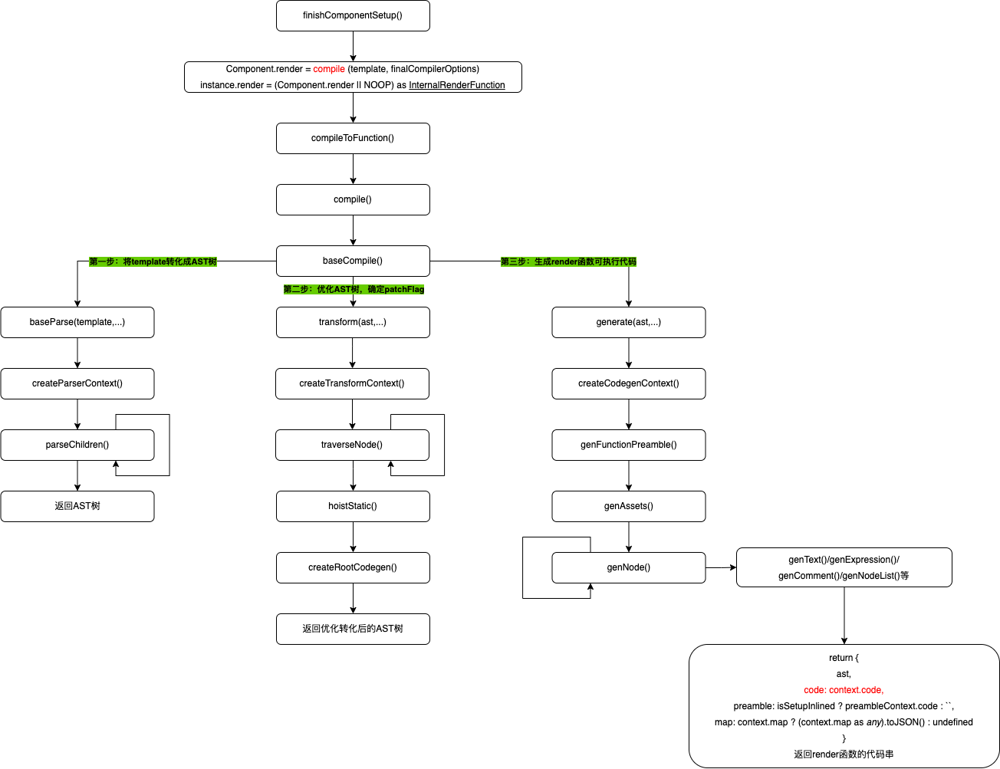
