# Vue3 中的内置组件

## KeepAlive

```ts
interface KeepAliveProps {
  /**
   * 如果指定，则只有与 `include` 名称
   * 匹配的组件才会被缓存。
   */
  include?: MatchPattern
  /**
   * 任何名称与 `exclude`
   * 匹配的组件都不会被缓存。
   */
  exclude?: MatchPattern
  /**
   * 最多可以缓存多少组件实例。
   */
  max?: number | string
}

type MatchPattern = string | RegExp | (string | RegExp)[]
```

和 Vue2 中的`<keep-alive>`组件一样， 定义了 `cache Map` 和 `keys Set`，本质上它就是去缓存已经创建过的组件 `VNode`。同样它的 `props` 定义了 `include`，`exclude`，它们可以字符串或者表达式，`include` 表示只有匹配的组件会被缓存，而 `exclude` 表示任何匹配的组件都不会被缓存，`props` 还定义了 `max`，它表示缓存的大小，因为我们是缓存的 `VNode` 对象，它也会持有 `DOM`，当我们缓存很多的时候，会比较占用内存，所以该配置允许我们指定缓存大小。

- `include: [String, RegExp, Array]`
- `exclude: [String, RegExp, Array]`
- `max: [String, Number]`
- `const cache: Cache = new Map()`
- `const keys: Keys = new Set()`

可以看到在`<keep-alive>`组件中主要做了以下几件事：

1. 获取当前`<keep-alive>`组件实例，渲染方法，创建一个`storageContainer`用来放缓存的子组件；
2. 在当前`<keep-alive>`组件实例上注册`activated`/`deactivated`方法；
3. 调用`watch`方法监听`include`/`exclude`参数，动态调整是否缓存子组件；
4. 在`onMounted`/`onUpdated`生命周期缓存子组件的`VNode`，在`onBeforeUnmount`生命周期卸载除子组件；
5. `setup`返回`render`方法，`<keep-alive>`组件本身是不会生成实际的`DOM`内容，而是获取包裹的第一个子组件，根据`include`/`exclude`匹配情况，检查是否在缓存中，在缓存中直接取用并刷新在`keys Set`中为最新的，不在缓存中则添加，最后返回子组件`VNode`；
6. 在两个组件间切换时，旧组件就会进入`deactivate`、新组件进入`activate`，旧组件会把当前组件`DOM`移动到提前创建好的，新组件把当前组件`DOM`插入到正确的`container`中，然后在新组件的`onUpdated`生命周期会调用`cacheSubtree`更新缓存；

```ts
// 【packages/runtime-core/src/components/KeepAlive.ts】
const KeepAliveImpl: ComponentOptions = {
  name: `KeepAlive`,
  // Marker for special handling inside the renderer. We are not using a ===
  // check directly on KeepAlive in the renderer, because importing it directly
  // would prevent it from being tree-shaken.
  __isKeepAlive: true,
  //【keep-alive的props】
  props: {
    include: [String, RegExp, Array],
    exclude: [String, RegExp, Array],
    max: [String, Number],
  },

  setup(props: KeepAliveProps, { slots }: SetupContext) {
    //【获取当前keep-alive组件实例】
    const instance = getCurrentInstance()!
    // KeepAlive communicates with the instantiated renderer via the
    // ctx where the renderer passes in its internals,
    // and the KeepAlive instance exposes activate/deactivate implementations.
    // The whole point of this is to avoid importing KeepAlive directly in the
    // renderer to facilitate tree-shaking.
    const sharedContext = instance.ctx as KeepAliveContext

    // if the internal renderer is not registered, it indicates that this is server-side rendering,
    // for KeepAlive, we just need to render its children
    if (__SSR__ && !sharedContext.renderer) {
      return () => {
        const children = slots.default && slots.default()
        return children && children.length === 1 ? children[0] : children
      }
    }

    //【两个关键数据：cache和keys，cache用来存储需要缓存的组件【key，子组件】，keys用来存储已经被缓存的所有组件name按照LRU顺序，最近使用的放在最后】
    const cache: Cache = new Map()
    const keys: Keys = new Set()
    let current: VNode | null = null

    if (__DEV__ || __FEATURE_PROD_DEVTOOLS__) {
      ;(instance as any).__v_cache = cache
    }

    const parentSuspense = instance.suspense

    //【获取组件实例上ctx挂在的renderer方法】
    const {
      renderer: {
        p: patch,
        m: move,
        um: _unmount,
        o: { createElement },
      },
    } = sharedContext

    //【创建一个div，后续作为container包裹需要缓存的子组件】
    const storageContainer = createElement("div")

    //【组件激活activate需要将缓存的组件移动到容器中】
    sharedContext.activate = (vnode, container, anchor, isSVG, optimized) => {
      const instance = vnode.component!
      move(vnode, container, anchor, MoveType.ENTER, parentSuspense)
      //【props可能改变】
      // in case props have changed
      patch(
        instance.vnode,
        vnode,
        container,
        anchor,
        instance,
        parentSuspense,
        isSVG,
        vnode.slotScopeIds,
        optimized
      )
      //【创建一个后置任务去回调用户activated生命周期回调】
      queuePostRenderEffect(() => {
        instance.isDeactivated = false
        if (instance.a) {
          invokeArrayFns(instance.a)
        }
        const vnodeHook = vnode.props && vnode.props.onVnodeMounted
        if (vnodeHook) {
          invokeVNodeHook(vnodeHook, instance.parent, vnode)
        }
      }, parentSuspense)

      if (__DEV__ || __FEATURE_PROD_DEVTOOLS__) {
        // Update components tree
        devtoolsComponentAdded(instance)
      }
    }
    //【组件失活deactivate需要将缓存的组件移动到之前建storageContainer的中】
    sharedContext.deactivate = (vnode: VNode) => {
      const instance = vnode.component!
      move(vnode, storageContainer, null, MoveType.LEAVE, parentSuspense)
      //【创建一个后置任务去回调用户deactivated生命周期回调】
      queuePostRenderEffect(() => {
        if (instance.da) {
          invokeArrayFns(instance.da)
        }
        const vnodeHook = vnode.props && vnode.props.onVnodeUnmounted
        if (vnodeHook) {
          invokeVNodeHook(vnodeHook, instance.parent, vnode)
        }
        instance.isDeactivated = true
      }, parentSuspense)

      if (__DEV__ || __FEATURE_PROD_DEVTOOLS__) {
        // Update components tree
        devtoolsComponentAdded(instance)
      }
    }

    //【遍历cache，超容量时剔除的组件调佣pruneCacheEntry剔除】
    function pruneCache(filter?: (name: string) => boolean) {
      cache.forEach((vnode, key) => {
        const name = getComponentName(vnode.type as ConcreteComponent)
        if (name && (!filter || !filter(name))) {
          pruneCacheEntry(key)
        }
      })
    }
    //【具体的剔除某组件操作】
    function pruneCacheEntry(key: CacheKey) {
      const cached = cache.get(key) as VNode
      if (!current || cached.type !== current.type) {
        unmount(cached)
      } else if (current) {
        // current active instance should no longer be kept-alive.
        // we can't unmount it now but it might be later, so reset its flag now.
        resetShapeFlag(current)
      }
      cache.delete(key)
      keys.delete(key)
    }

    //【监听include, exclude，在current vnode处理完之后回调】
    // prune cache on include/exclude prop change
    watch(
      () => [props.include, props.exclude],
      ([include, exclude]) => {
        include && pruneCache((name) => matches(include, name))
        exclude && pruneCache((name) => !matches(exclude, name))
      },
      // prune post-render after `current` has been updated
      { flush: "post", deep: true }
    )

    // 【缓存组件内容的具体操作】
    // cache sub tree after render
    let pendingCacheKey: CacheKey | null = null
    const cacheSubtree = () => {
      // fix #1621, the pendingCacheKey could be 0
      if (pendingCacheKey != null) {
        cache.set(pendingCacheKey, getInnerChild(instance.subTree))
      }
    }
    //【onMounted和onUpdated进行缓存当前子组件】
    onMounted(cacheSubtree)
    onUpdated(cacheSubtree)
    //【ononBeforeUnmount卸载当前子组件】
    function unmount(vnode: VNode) {
      // reset the shapeFlag so it can be properly unmounted
      resetShapeFlag(vnode)
      _unmount(vnode, instance, parentSuspense, true)
    }
    onBeforeUnmount(() => {
      cache.forEach((cached) => {
        const { subTree, suspense } = instance
        const vnode = getInnerChild(subTree)
        if (cached.type === vnode.type) {
          // current instance will be unmounted as part of keep-alive's unmount
          resetShapeFlag(vnode)
          // but invoke its deactivated hook here
          const da = vnode.component!.da
          da && queuePostRenderEffect(da, suspense)
          return
        }
        unmount(cached)
      })
    })

    //【return一个函数作为render函数】
    return () => {
      pendingCacheKey = null

      if (!slots.default) {
        return null
      }

      //【拿到keep-alive包裹的第一个子组件，所以通常和router-view组合使用】
      const children = slots.default()
      const rawVNode = children[0]
      if (children.length > 1) {
        if (__DEV__) {
          warn(`KeepAlive should contain exactly one component child.`)
        }
        current = null
        return children
      } else if (
        !isVNode(rawVNode) ||
        (!(rawVNode.shapeFlag & ShapeFlags.STATEFUL_COMPONENT) &&
          !(rawVNode.shapeFlag & ShapeFlags.SUSPENSE))
      ) {
        current = null
        return rawVNode
      }

      //【获取子组件VNode、type以及name】
      let vnode = getInnerChild(rawVNode)
      const comp = vnode.type as ConcreteComponent

      // for async components, name check should be based in its loaded
      // inner component if available
      const name = getComponentName(
        isAsyncWrapper(vnode)
          ? (vnode.type as ComponentOptions).__asyncResolved || {}
          : comp
      )

      //【获取传入的参数props包括include, exclude, max】
      const { include, exclude, max } = props

      //【如果不在include之内或在exclude之内，也就是匹配不上，那就直接返回】
      if (
        (include && (!name || !matches(include, name))) ||
        (exclude && name && matches(exclude, name))
      ) {
        current = vnode
        return rawVNode
      }

      //【获取子组件VNode的key，查看cache缓存是否有当前子组件，并且复制一个当前子组件VNode副本】
      const key = vnode.key == null ? comp : vnode.key
      const cachedVNode = cache.get(key)

      // clone vnode if it's reused because we are going to mutate it
      if (vnode.el) {
        vnode = cloneVNode(vnode)
        if (rawVNode.shapeFlag & ShapeFlags.SUSPENSE) {
          rawVNode.ssContent = vnode
        }
      }
      // #1513 it's possible for the returned vnode to be cloned due to attr
      // fallthrough or scopeId, so the vnode here may not be the final vnode
      // that is mounted. Instead of caching it directly, we store the pending
      // key and cache `instance.subTree` (the normalized vnode) in
      // beforeMount/beforeUpdate hooks.
      // 【关键：每次组件patch到keep-alive组件确定内部内容到底激活的是哪个，在子组件激活mount时更新cache（因为可能有状态变化）】
      pendingCacheKey = key

      //【如果缓存中已经存在该组件】
      if (cachedVNode) {
        // copy over mounted state
        vnode.el = cachedVNode.el
        vnode.component = cachedVNode.component
        if (vnode.transition) {
          // recursively update transition hooks on subTree
          setTransitionHooks(vnode, vnode.transition!)
        }
        // avoid vnode being mounted as fresh
        //【添加COMPONENT_KEPT_ALIVE这个shapeFlag，说明当前是个已被缓存的组件，防止被当成新组件进行mount】
        vnode.shapeFlag |= ShapeFlags.COMPONENT_KEPT_ALIVE
        // make this key the freshest
        //【使得当前被唤醒的子组件变成在Set最新的那个并保持最新】
        keys.delete(key)
        keys.add(key)
      } else {
        //【如果keys缓存中不存在该组件，则添加该组件，且缓存数量如果超出max，删除最久还没用的缓存】
        //【具体的cache缓存组件内容的操作在onMounted(cacheSubtree)或者onUpdated(cacheSubtree)生命周期中操作】
        keys.add(key)
        // prune oldest entry
        if (max && keys.size > parseInt(max as string, 10)) {
          pruneCacheEntry(keys.values().next().value)
        }
      }
      //【添加COMPONENT_SHOULD_KEEP_ALIVE这个shapeFlag，说明当前是个需要被缓存的组件，防止触发unmount】
      // avoid vnode being unmounted
      vnode.shapeFlag |= ShapeFlags.COMPONENT_SHOULD_KEEP_ALIVE

      //【最后返回组件VNode】
      current = vnode
      return isSuspense(rawVNode.type) ? rawVNode : vnode
    }
  },
}

function matches(pattern: MatchPattern, name: string): boolean {
  if (isArray(pattern)) {
    return pattern.some((p: string | RegExp) => matches(p, name))
  } else if (isString(pattern)) {
    return pattern.split(",").includes(name)
  } else if (pattern.test) {
    return pattern.test(name)
  }
  /* istanbul ignore next */
  return false
}
```

调试用例如下：

[KeepAlive 示例](https://play.vuejs.org/#eNqtU01v1DAQ/SuWL1u0ZYMEpyiN2FQ9AOJDhaMvaTKbunVsyx9hUZT/ztjOpruFUoG4xTPPz+/Nm4x0q/Vm8EBzWtjGcO2IBed1ySTvtTKOjMTe1kKo79ewIxPZGdWTFd5YLYhL1evt3Nhk8RQoTwHVCaCaAUw2SlpHGm8MSEcujh47i0wvmCyypAw14cFBr0XtAE+EFC0fSCNqay8YbaFXjMY6dkR9A6IsuNTeEfdDAyJM3XKEkOFlr1oQWJkfxlo+1MIHUHwWC1lJtkWWaP4HZ5U4q0ecHwD0VvAhGYqlBtFKhnnkPBhbCMsiW3qH+9kpQZHhSPCryI4GRc+Tq+eSNr9EvASkfIwHEWevnslEl5dznIvYPIwyPIVtq2tZRr6cjOPMPE3IGBoRcuOdU5K8bQRv7sMAAma9xgGsiyw1n7AYF+vvLCaDve1me6vVv/jDWI/9fQRr6w4It9FkYD+1mHboYWkQEXf3sSlnUd+Od5s7qyQaG8PtMJFecwHms3Yc9TOKz6SFYDT+QO9jzRkP54d6cwvN/W/qd3Yfaox+MWDBDMDo0nO16QA3L7Svvn6CPX4vTdTuBaL/0LwGq4QPGhOs8rJF2Ue4qPZdjIfL7pu92juQ9mAqCA3IKeIZxchCzE9Zf5D7evMm3mNyotNPPoanKQ==)

### `onMounted`/`onUpdated`

可以看到`<keep-alive>`组件首次挂载的时候定义了 `onMounted` 和 `onUpdated` 两个生命周期去执行 `cacheSubtree` 方法进行缓存，在`onBeforeUnmount`生命周期进行缓存清除和`unmount`子组件，所以组件真正的加入缓存、剔除缓存过程发生在`onMounted`、`onUpdated`和`onBeforeUnmount`中：

```ts
// cache sub tree after render
let pendingCacheKey: CacheKey | null = null
const cacheSubtree = () => {
  // fix #1621, the pendingCacheKey could be 0
  if (pendingCacheKey != null) {
    cache.set(pendingCacheKey, getInnerChild(instance.subTree))
  }
}
onMounted(cacheSubtree)
onUpdated(cacheSubtree)
onBeforeUnmount(() => {
  cache.forEach((cached) => {
    const { subTree, suspense } = instance
    const vnode = getInnerChild(subTree)
    if (cached.type === vnode.type) {
      // current instance will be unmounted as part of keep-alive's unmount
      resetShapeFlag(vnode)
      // but invoke its deactivated hook here
      const da = vnode.component!.da
      da && queuePostRenderEffect(da, suspense)
      return
    }
    unmount(cached)
  })
})

function resetShapeFlag(vnode: VNode) {
  let shapeFlag = vnode.shapeFlag
  if (shapeFlag & ShapeFlags.COMPONENT_SHOULD_KEEP_ALIVE) {
    shapeFlag -= ShapeFlags.COMPONENT_SHOULD_KEEP_ALIVE
  }
  if (shapeFlag & ShapeFlags.COMPONENT_KEPT_ALIVE) {
    shapeFlag -= ShapeFlags.COMPONENT_KEPT_ALIVE
  }
  vnode.shapeFlag = shapeFlag
}
```

### `activated`/`deactivated`

经过`<keep-alive>`包裹的组件，在切换时，它的生命周期钩子`mounted`和`unmouned`生命周期钩子不会被调用，而是被缓存组件独有的两个生命周期钩子所代替：`activated`激活状态和`deactivated`停用状态。这两个钩子会被用于`<keep-alive>`的直接子节点和所有子孙节点。

1. `activated`方法主要负责移动节点、调用`patch`方法，`patch` 更新节点过程中，如果节点类型中存在`COMPONENT_KEPT_ALIVE`标识，则渲染器不会重新挂载它，而是调用`activate`来激活它本身
2. `deactivated`方法会通过`move`方法移除`VNode`，向任务调度器中的后置任务池中 `push` 卸载相关的`VNode`钩子，会将被缓存的组件节点从父容器`parentSuspense`的位置移动到提前创建好的容器`storageContainer`中去，并将组件实例的`isDeactivated`标记为 `true`。

在`mountComponent`方法，会将操作方法给`<keep-alive>`的组件实例的`ctx`属性，以供`activated`和`deactivated`生命周期调用操作 VNode，并且还会根据`shapeFlags`是否为`COMPONENT_KEPT_ALIVE`调用组件的`activate`方法：

```ts
//【mountComponent方法中】
// inject renderer internals for keepAlive
if (isKeepAlive(initialVNode)) {
  ;(instance.ctx as KeepAliveContext).renderer = internals
}
if (n2.shapeFlag & ShapeFlags.COMPONENT_KEPT_ALIVE) {
  ;(parentComponent!.ctx as KeepAliveContext).activate(
    n2,
    container,
    anchor,
    isSVG,
    optimized
  )
}
//【注册ACTIVATED和DEACTIVATED生命周期】
export function onActivated(
  hook: Function,
  target?: ComponentInternalInstance | null
) {
  registerKeepAliveHook(hook, LifecycleHooks.ACTIVATED, target)
}

export function onDeactivated(
  hook: Function,
  target?: ComponentInternalInstance | null
) {
  registerKeepAliveHook(hook, LifecycleHooks.DEACTIVATED, target)
}

const {
  renderer: {
    p: patch,
    m: move,
    um: _unmount,
    o: { createElement },
  },
} = sharedContext
//【创建一个div，后续作为container包裹需要缓存的子组件】
const storageContainer = createElement("div")

//【组件激活activate需要将缓存的组件移动到容器中】
sharedContext.activate = (vnode, container, anchor, isSVG, optimized) => {
  const instance = vnode.component!
  move(vnode, container, anchor, MoveType.ENTER, parentSuspense)
  //【props可能改变】
  // in case props have changed
  patch(
    instance.vnode,
    vnode,
    container,
    anchor,
    instance,
    parentSuspense,
    isSVG,
    vnode.slotScopeIds,
    optimized
  )
  queuePostRenderEffect(() => {
    instance.isDeactivated = false
    if (instance.a) {
      invokeArrayFns(instance.a)
    }
    const vnodeHook = vnode.props && vnode.props.onVnodeMounted
    if (vnodeHook) {
      invokeVNodeHook(vnodeHook, instance.parent, vnode)
    }
  }, parentSuspense)

  if (__DEV__ || __FEATURE_PROD_DEVTOOLS__) {
    // Update components tree
    devtoolsComponentAdded(instance)
  }
}
//【组件失活deactivate需要将缓存的组件移动到之前建storageContainer的中】
sharedContext.deactivate = (vnode: VNode) => {
  const instance = vnode.component!
  move(vnode, storageContainer, null, MoveType.LEAVE, parentSuspense)
  queuePostRenderEffect(() => {
    if (instance.da) {
      invokeArrayFns(instance.da)
    }
    const vnodeHook = vnode.props && vnode.props.onVnodeUnmounted
    if (vnodeHook) {
      invokeVNodeHook(vnodeHook, instance.parent, vnode)
    }
    instance.isDeactivated = true
  }, parentSuspense)

  if (__DEV__ || __FEATURE_PROD_DEVTOOLS__) {
    // Update components tree
    devtoolsComponentAdded(instance)
  }
}
```

### 与 Vue2 中的实现异同

在与 Vue2 实现的区别上，比较大的区别点在于这个`const storageContainer = createElement('div')`，用一个容器将缓存的`VNode`隐藏起来，后续使用的时候直接从`storageContainer`中取用 DOM。

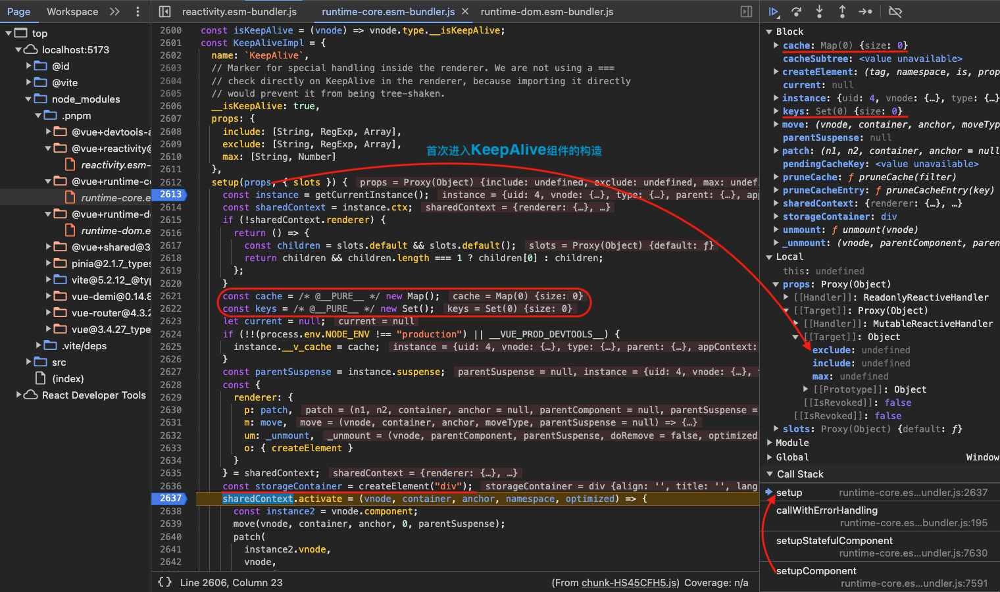
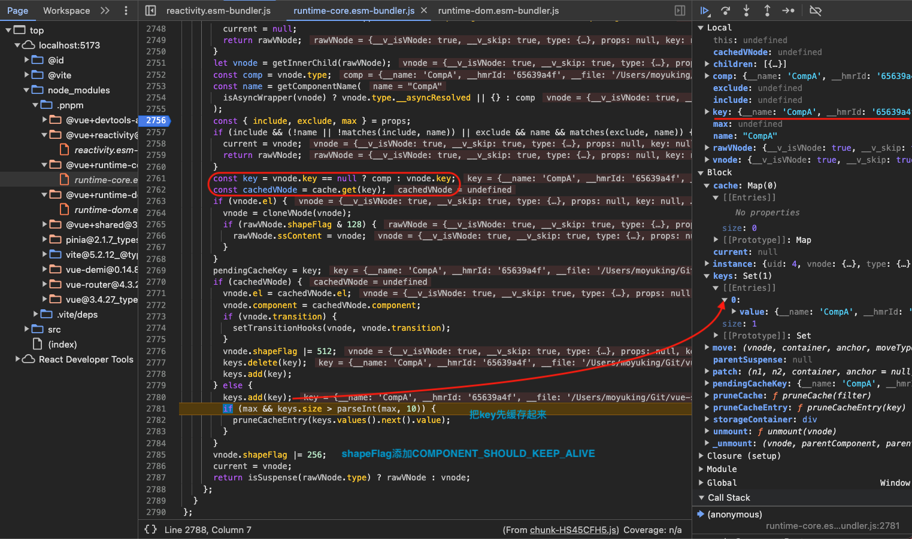
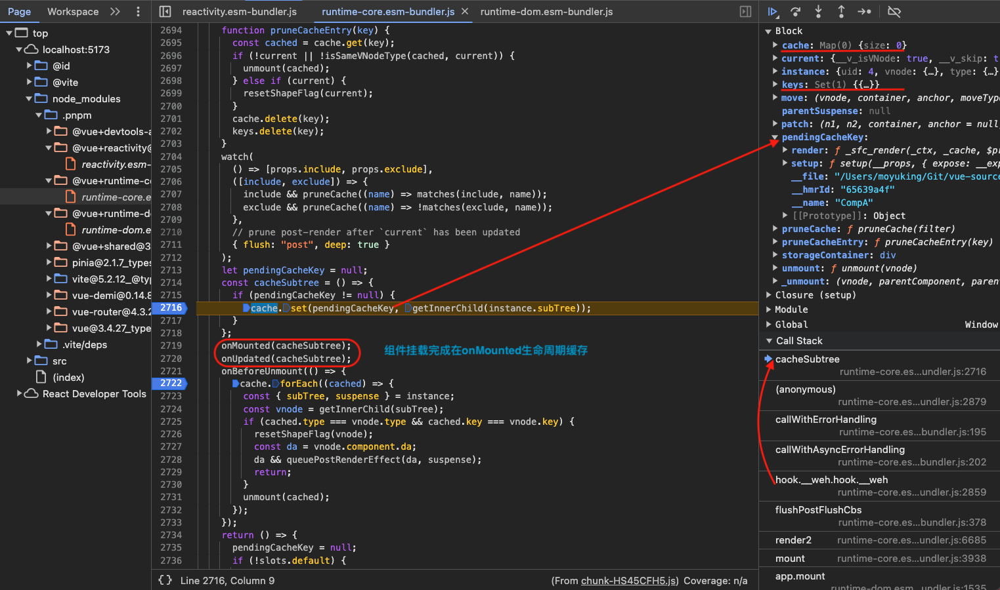
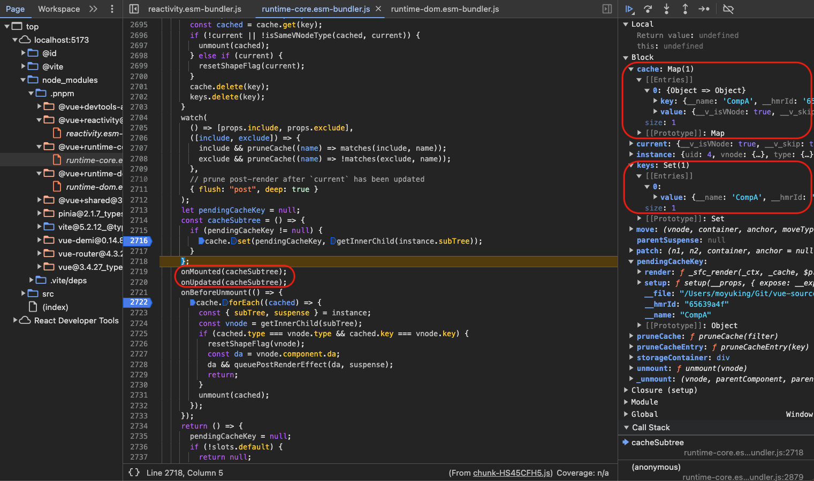
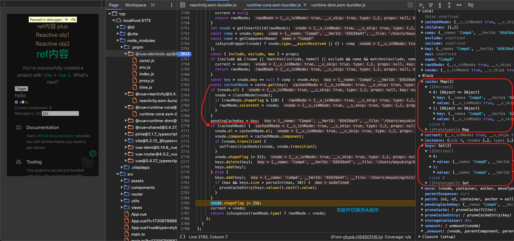
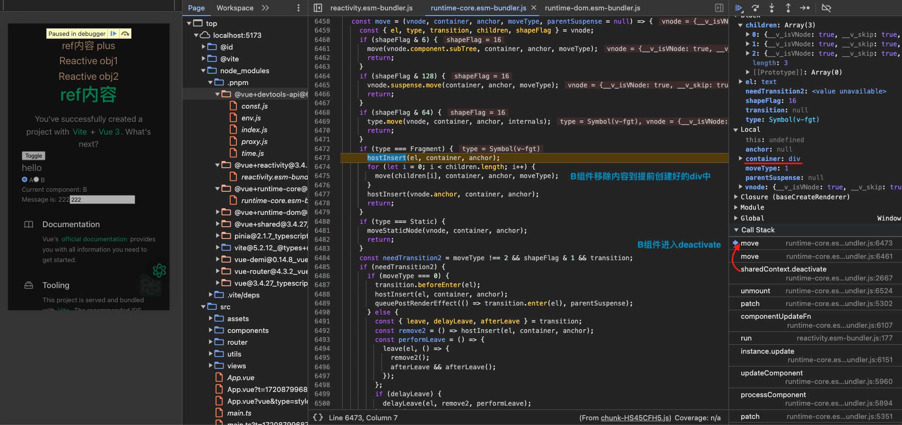
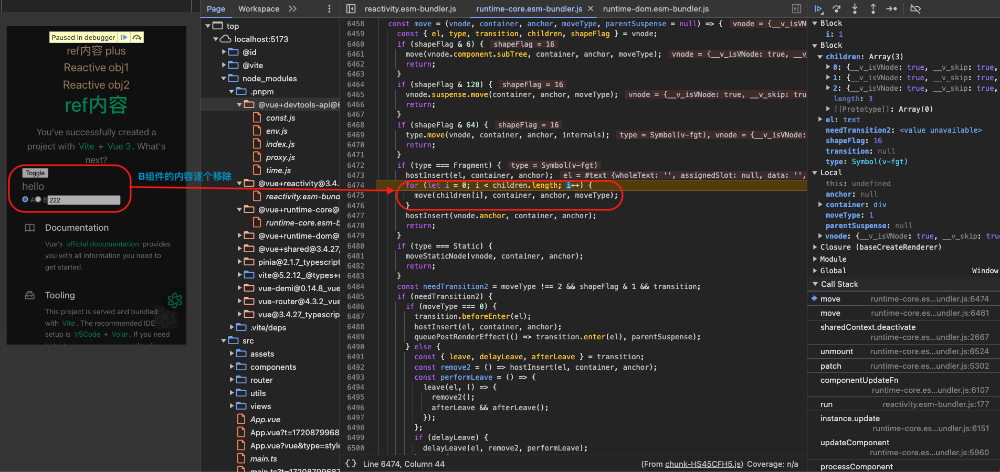
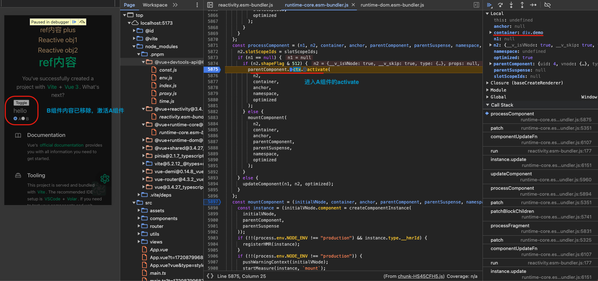
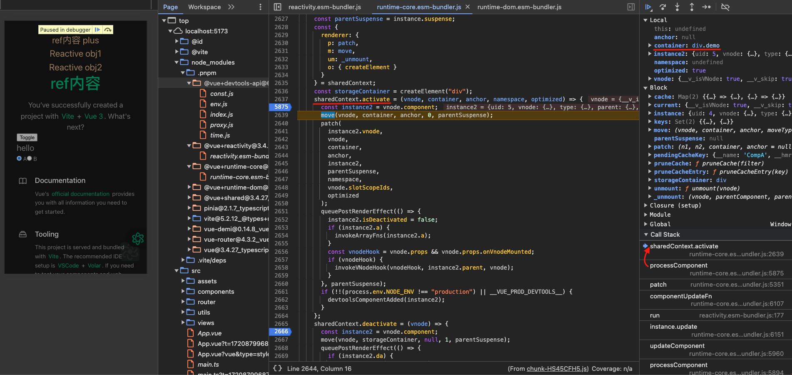
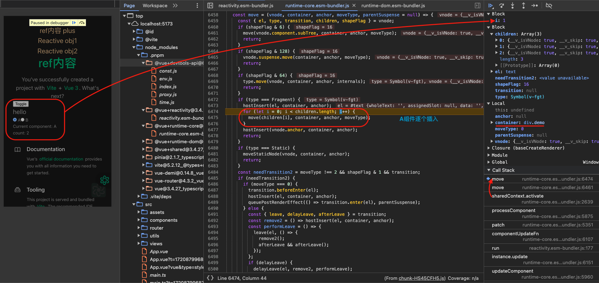
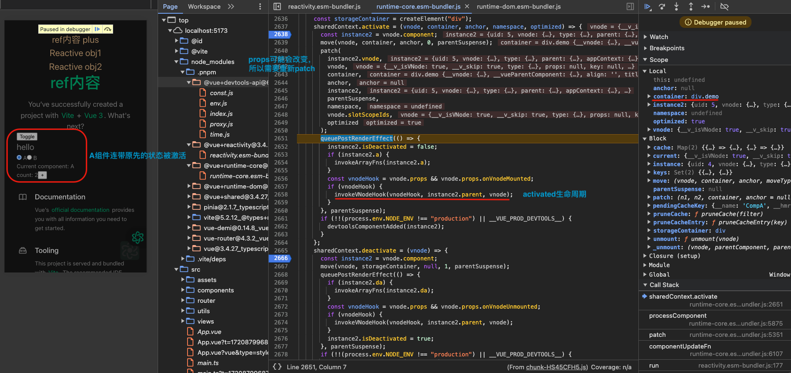
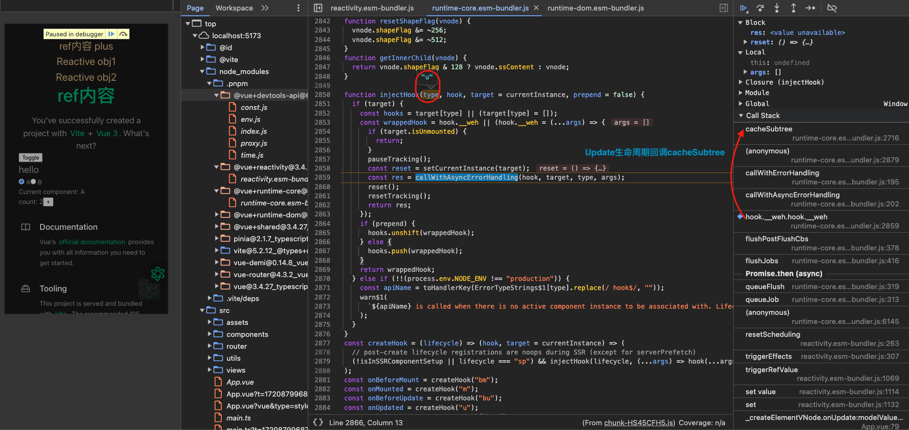
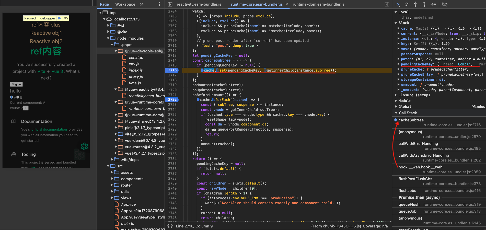

## Suspense

<!-- TODO -->

## Teleport

<!-- TODO -->

## Transition

```ts
interface TransitionProps {
  /**
   * 用于自动生成过渡 CSS class 名。
   * 例如 `name: 'fade'` 将自动扩展为 `.fade-enter`、
   * `.fade-enter-active` 等。
   */
  name?: string
  /**
   * 是否应用 CSS 过渡 class。
   * 默认：true
   */
  css?: boolean
  /**
   * 指定要等待的过渡事件类型
   * 来确定过渡结束的时间。
   * 默认情况下会自动检测
   * 持续时间较长的类型。
   */
  type?: "transition" | "animation"
  /**
   * 显式指定过渡的持续时间。
   * 默认情况下是等待过渡效果的根元素的第一个 `transitionend`
   * 或`animationend`事件。
   */
  duration?: number | { enter: number; leave: number }
  /**
   * 控制离开/进入过渡的时序。
   * 默认情况下是同时的。
   */
  mode?: "in-out" | "out-in" | "default"
  /**
   * 是否对初始渲染使用过渡。
   * 默认：false
   */
  appear?: boolean

  /**
   * 用于自定义过渡 class 的 prop。
   * 在模板中使用短横线命名，例如：enter-from-class="xxx"
   */
  enterFromClass?: string
  enterActiveClass?: string
  enterToClass?: string
  appearFromClass?: string
  appearActiveClass?: string
  appearToClass?: string
  leaveFromClass?: string
  leaveActiveClass?: string
  leaveToClass?: string
}
```

当一个 `<Transition>` 组件中的元素被插入或移除时，会发生下面这些事情：

Vue 会自动检测目标元素是否应用了 CSS 过渡或动画。如果是，则一些 CSS 过渡 class 会在适当的时机被添加和移除。

如果有作为监听器的 JavaScript 钩子，这些钩子函数会在适当时机被调用。

如果没有探测到 CSS 过渡或动画、也没有提供 JavaScript 钩子，那么 DOM 的插入、删除操作将在浏览器的下一个动画帧后执行。

- `v-enter-from`：进入动画的起始状态。在元素插入之前添加，在元素插入完成后的下一帧移除。
- `v-enter-active`：进入动画的生效状态。应用于整个进入动画阶段。在元素被插入之前添加，在过渡或动画完成之后移除。这个 class 可以被用来定义进入动画的持续时间、延迟与速度曲线类型。
- `v-enter-to`：进入动画的结束状态。在元素插入完成后的下一帧被添加 (也就是 v-enter-from 被移除的同时)，在过渡或动画完成之后移除。
- `v-leave-from`：离开动画的起始状态。在离开过渡效果被触发时立即添加，在一帧后被移除。
- `v-leave-active`：离开动画的生效状态。应用于整个离开动画阶段。在离开过渡效果被触发时立即添加，在过渡或动画完成之后移除。这个 class 可以被用来定义离开动画的持续时间、延迟与速度曲线类型。
- `v-leave-to`：离开动画的结束状态。在一个离开动画被触发后的下一帧被添加 (也就是 v-leave-from 被移除的同时)，在过渡或动画完成之后移除。

你也可以向 `<Transition>` 传递以下的 props 来指定自定义的过渡 class：

- `enter-from-class`
- `enter-active-class`
- `enter-to-class`
- `leave-from-class`
- `leave-active-class`
- `leave-to-class`

```ts
// 【packages/runtime-dom/src/components/Transition.ts】
// DOM Transition is a higher-order-component based on the platform-agnostic
// base Transition component, with DOM-specific logic.
export const Transition: FunctionalComponent<TransitionProps> = (
  props,
  { slots }
) => h(BaseTransition, resolveTransitionProps(props), slots)

Transition.displayName = "Transition"

// 【packages/runtime-core/src/components/BaseTransition.ts】
export const BaseTransitionPropsValidators = {
  mode: String,
  appear: Boolean,
  persisted: Boolean,
  // enter
  onBeforeEnter: TransitionHookValidator,
  onEnter: TransitionHookValidator,
  onAfterEnter: TransitionHookValidator,
  onEnterCancelled: TransitionHookValidator,
  // leave
  onBeforeLeave: TransitionHookValidator,
  onLeave: TransitionHookValidator,
  onAfterLeave: TransitionHookValidator,
  onLeaveCancelled: TransitionHookValidator,
  // appear
  onBeforeAppear: TransitionHookValidator,
  onAppear: TransitionHookValidator,
  onAfterAppear: TransitionHookValidator,
  onAppearCancelled: TransitionHookValidator,
}

const BaseTransitionImpl: ComponentOptions = {
  name: `BaseTransition`,

  props: BaseTransitionPropsValidators,

  setup(props: BaseTransitionProps, { slots }: SetupContext) {
    // 【获取组件实例】
    const instance = getCurrentInstance()!
    // 【获取组件状态】
    const state = useTransitionState()

    // 【返回render函数，构造transition组件的vnode时将对应的hook加入vnode.transition】
    return () => {
      const children =
        slots.default && getTransitionRawChildren(slots.default(), true)
      if (!children || !children.length) {
        return
      }

      // 【获取新节点】
      let child: VNode = children[0]
      // 【transition组件包裹的内容必须仅有一个根节点】
      if (children.length > 1) {
        let hasFound = false
        // locate first non-comment child
        for (const c of children) {
          if (c.type !== Comment) {
            if (__DEV__ && hasFound) {
              // warn more than one non-comment child
              warn(
                "<transition> can only be used on a single element or component. " +
                  "Use <transition-group> for lists."
              )
              break
            }
            child = c
            hasFound = true
            if (!__DEV__) break
          }
        }
      }

      // there's no need to track reactivity for these props so use the raw
      // props for a bit better perf
      const rawProps = toRaw(props)
      const { mode } = rawProps
      // check mode
      if (
        __DEV__ &&
        mode &&
        mode !== "in-out" &&
        mode !== "out-in" &&
        mode !== "default"
      ) {
        warn(`invalid <transition> mode: ${mode}`)
      }

      if (state.isLeaving) {
        return emptyPlaceholder(child)
      }

      // in the case of <transition><keep-alive/></transition>, we need to
      // compare the type of the kept-alive children.
      // 【获取child，处理包括如果是keep-alive组件的特殊情况】
      const innerChild = getKeepAliveChild(child)
      if (!innerChild) {
        return emptyPlaceholder(child)
      }

      // 【vnode加入enter相关hook】
      const enterHooks = resolveTransitionHooks(
        innerChild,
        rawProps,
        state,
        instance
      )
      setTransitionHooks(innerChild, enterHooks)

      // 【获取旧节点】
      const oldChild = instance.subTree
      const oldInnerChild = oldChild && getKeepAliveChild(oldChild)

      // 【新旧节点内容不同的情况，不严谨说法，通过isSameVNodeType方法判断新旧节点，key改变也会影响】
      // handle mode
      if (
        oldInnerChild &&
        oldInnerChild.type !== Comment &&
        !isSameVNodeType(innerChild, oldInnerChild)
      ) {
        // 【vnode加入leave相关hook】
        const leavingHooks = resolveTransitionHooks(
          oldInnerChild,
          rawProps,
          state,
          instance
        )
        // update old tree's hooks in case of dynamic transition
        setTransitionHooks(oldInnerChild, leavingHooks)

        // 【根据mode给leavingHooks进行改造】
        // switching between different views
        if (mode === "out-in" && innerChild.type !== Comment) {
          state.isLeaving = true
          // return placeholder node and queue update when leave finishes
          leavingHooks.afterLeave = () => {
            state.isLeaving = false
            // #6835
            // it also needs to be updated when active is undefined
            if (instance.update.active !== false) {
              instance.effect.dirty = true
              instance.update()
            }
          }
          return emptyPlaceholder(child)
        } else if (mode === "in-out" && innerChild.type !== Comment) {
          leavingHooks.delayLeave = (
            el: TransitionElement,
            earlyRemove,
            delayedLeave
          ) => {
            const leavingVNodesCache = getLeavingNodesForType(
              state,
              oldInnerChild
            )
            leavingVNodesCache[String(oldInnerChild.key)] = oldInnerChild
            // early removal callback
            el[leaveCbKey] = () => {
              earlyRemove()
              el[leaveCbKey] = undefined
              delete enterHooks.delayedLeave
            }
            enterHooks.delayedLeave = delayedLeave
          }
        }
      }

      return child
    }
  },
}

export function useTransitionState(): TransitionState {
  const state: TransitionState = {
    isMounted: false,
    isLeaving: false,
    isUnmounting: false,
    leavingVNodes: new Map(),
  }
  onMounted(() => {
    state.isMounted = true
  })
  onBeforeUnmount(() => {
    state.isUnmounting = true
  })
  return state
}
```

其中有两个核心方法

- `resolveTransitionProps`：实例化`transition`组件时处理`props`
- `resolveTransitionHooks`：根据`props`等属性确定到底使用哪些`transition`相关的`hook`

```ts
// 【packages/runtime-dom/src/components/Transition.ts】
export function resolveTransitionProps(
  rawProps: TransitionProps
): BaseTransitionProps<Element> {
  const baseProps: BaseTransitionProps<Element> = {}
  for (const key in rawProps) {
    if (!(key in DOMTransitionPropsValidators)) {
      ;(baseProps as any)[key] = (rawProps as any)[key]
    }
  }

  if (rawProps.css === false) {
    return baseProps
  }

  const {
    name = "v",
    type,
    duration,
    enterFromClass = `${name}-enter-from`,
    enterActiveClass = `${name}-enter-active`,
    enterToClass = `${name}-enter-to`,
    appearFromClass = enterFromClass,
    appearActiveClass = enterActiveClass,
    appearToClass = enterToClass,
    leaveFromClass = `${name}-leave-from`,
    leaveActiveClass = `${name}-leave-active`,
    leaveToClass = `${name}-leave-to`,
  } = rawProps

  // legacy transition class compat
  const legacyClassEnabled =
    __COMPAT__ &&
    compatUtils.isCompatEnabled(DeprecationTypes.TRANSITION_CLASSES, null)
  let legacyEnterFromClass: string
  let legacyAppearFromClass: string
  let legacyLeaveFromClass: string
  if (__COMPAT__ && legacyClassEnabled) {
    const toLegacyClass = (cls: string) => cls.replace(/-from$/, "")
    if (!rawProps.enterFromClass) {
      legacyEnterFromClass = toLegacyClass(enterFromClass)
    }
    if (!rawProps.appearFromClass) {
      legacyAppearFromClass = toLegacyClass(appearFromClass)
    }
    if (!rawProps.leaveFromClass) {
      legacyLeaveFromClass = toLegacyClass(leaveFromClass)
    }
  }

  const durations = normalizeDuration(duration)
  const enterDuration = durations && durations[0]
  const leaveDuration = durations && durations[1]
  const {
    onBeforeEnter,
    onEnter,
    onEnterCancelled,
    onLeave,
    onLeaveCancelled,
    onBeforeAppear = onBeforeEnter,
    onAppear = onEnter,
    onAppearCancelled = onEnterCancelled,
  } = baseProps

  const finishEnter = (el: Element, isAppear: boolean, done?: () => void) => {
    removeTransitionClass(el, isAppear ? appearToClass : enterToClass)
    removeTransitionClass(el, isAppear ? appearActiveClass : enterActiveClass)
    done && done()
  }

  const finishLeave = (
    el: Element & { _isLeaving?: boolean },
    done?: () => void
  ) => {
    el._isLeaving = false
    removeTransitionClass(el, leaveFromClass)
    removeTransitionClass(el, leaveToClass)
    removeTransitionClass(el, leaveActiveClass)
    done && done()
  }

  const makeEnterHook = (isAppear: boolean) => {
    return (el: Element, done: () => void) => {
      const hook = isAppear ? onAppear : onEnter
      const resolve = () => finishEnter(el, isAppear, done)
      callHook(hook, [el, resolve])
      // 【使用requestAnimationFrame】
      nextFrame(() => {
        removeTransitionClass(el, isAppear ? appearFromClass : enterFromClass)
        if (__COMPAT__ && legacyClassEnabled) {
          const legacyClass = isAppear
            ? legacyAppearFromClass
            : legacyEnterFromClass
          if (legacyClass) {
            removeTransitionClass(el, legacyClass)
          }
        }
        addTransitionClass(el, isAppear ? appearToClass : enterToClass)
        if (!hasExplicitCallback(hook)) {
          whenTransitionEnds(el, type, enterDuration, resolve)
        }
      })
    }
  }

  return extend(baseProps, {
    onBeforeEnter(el) {
      callHook(onBeforeEnter, [el])
      addTransitionClass(el, enterFromClass)
      if (__COMPAT__ && legacyClassEnabled && legacyEnterFromClass) {
        addTransitionClass(el, legacyEnterFromClass)
      }
      addTransitionClass(el, enterActiveClass)
    },
    onBeforeAppear(el) {
      callHook(onBeforeAppear, [el])
      addTransitionClass(el, appearFromClass)
      if (__COMPAT__ && legacyClassEnabled && legacyAppearFromClass) {
        addTransitionClass(el, legacyAppearFromClass)
      }
      addTransitionClass(el, appearActiveClass)
    },
    onEnter: makeEnterHook(false),
    onAppear: makeEnterHook(true),
    onLeave(el: Element & { _isLeaving?: boolean }, done) {
      el._isLeaving = true
      const resolve = () => finishLeave(el, done)
      addTransitionClass(el, leaveFromClass)
      if (__COMPAT__ && legacyClassEnabled && legacyLeaveFromClass) {
        addTransitionClass(el, legacyLeaveFromClass)
      }
      // add *-leave-active class before reflow so in the case of a cancelled enter transition
      // the css will not get the final state (#10677)
      addTransitionClass(el, leaveActiveClass)
      // force reflow so *-leave-from classes immediately take effect (#2593)
      forceReflow()
      nextFrame(() => {
        if (!el._isLeaving) {
          // cancelled
          return
        }
        removeTransitionClass(el, leaveFromClass)
        if (__COMPAT__ && legacyClassEnabled && legacyLeaveFromClass) {
          removeTransitionClass(el, legacyLeaveFromClass)
        }
        addTransitionClass(el, leaveToClass)
        if (!hasExplicitCallback(onLeave)) {
          whenTransitionEnds(el, type, leaveDuration, resolve)
        }
      })
      callHook(onLeave, [el, resolve])
    },
    onEnterCancelled(el) {
      finishEnter(el, false)
      callHook(onEnterCancelled, [el])
    },
    onAppearCancelled(el) {
      finishEnter(el, true)
      callHook(onAppearCancelled, [el])
    },
    onLeaveCancelled(el) {
      finishLeave(el)
      callHook(onLeaveCancelled, [el])
    },
  } as BaseTransitionProps<Element>)
}
```

```ts
// 【packages/runtime-dom/src/components/Transition.ts】
// The transition hooks are attached to the vnode as vnode.transition
// and will be called at appropriate timing in the renderer.
export function resolveTransitionHooks(
  vnode: VNode,
  props: BaseTransitionProps<any>,
  state: TransitionState,
  instance: ComponentInternalInstance
): TransitionHooks {
  const {
    appear,
    mode,
    persisted = false,
    onBeforeEnter,
    onEnter,
    onAfterEnter,
    onEnterCancelled,
    onBeforeLeave,
    onLeave,
    onAfterLeave,
    onLeaveCancelled,
    onBeforeAppear,
    onAppear,
    onAfterAppear,
    onAppearCancelled,
  } = props
  const key = String(vnode.key)
  const leavingVNodesCache = getLeavingNodesForType(state, vnode)

  const callHook: TransitionHookCaller = (hook, args) => {
    hook &&
      callWithAsyncErrorHandling(
        hook,
        instance,
        ErrorCodes.TRANSITION_HOOK,
        args
      )
  }

  const callAsyncHook = (
    hook: Hook<(el: any, done: () => void) => void>,
    args: [TransitionElement, () => void]
  ) => {
    const done = args[1]
    callHook(hook, args)
    if (isArray(hook)) {
      if (hook.every((hook) => hook.length <= 1)) done()
    } else if (hook.length <= 1) {
      done()
    }
  }

  // 【VNode节点上挂载的各种transition相关hooks】
  const hooks: TransitionHooks<TransitionElement> = {
    mode,
    persisted,
    beforeEnter(el) {
      let hook = onBeforeEnter
      if (!state.isMounted) {
        if (appear) {
          hook = onBeforeAppear || onBeforeEnter
        } else {
          return
        }
      }
      // for same element (v-show)
      if (el[leaveCbKey]) {
        el[leaveCbKey](true /* cancelled */)
      }
      // for toggled element with same key (v-if)
      const leavingVNode = leavingVNodesCache[key]
      if (
        leavingVNode &&
        isSameVNodeType(vnode, leavingVNode) &&
        (leavingVNode.el as TransitionElement)[leaveCbKey]
      ) {
        // force early removal (not cancelled)
        ;(leavingVNode.el as TransitionElement)[leaveCbKey]!()
      }
      callHook(hook, [el])
    },

    enter(el) {
      let hook = onEnter
      let afterHook = onAfterEnter
      let cancelHook = onEnterCancelled
      if (!state.isMounted) {
        if (appear) {
          hook = onAppear || onEnter
          afterHook = onAfterAppear || onAfterEnter
          cancelHook = onAppearCancelled || onEnterCancelled
        } else {
          return
        }
      }
      let called = false
      const done = (el[enterCbKey] = (cancelled?) => {
        if (called) return
        called = true
        if (cancelled) {
          callHook(cancelHook, [el])
        } else {
          callHook(afterHook, [el])
        }
        if (hooks.delayedLeave) {
          hooks.delayedLeave()
        }
        el[enterCbKey] = undefined
      })
      if (hook) {
        callAsyncHook(hook, [el, done])
      } else {
        done()
      }
    },

    leave(el, remove) {
      const key = String(vnode.key)
      if (el[enterCbKey]) {
        el[enterCbKey](true /* cancelled */)
      }
      if (state.isUnmounting) {
        return remove()
      }
      callHook(onBeforeLeave, [el])
      let called = false
      const done = (el[leaveCbKey] = (cancelled?) => {
        if (called) return
        called = true
        remove()
        if (cancelled) {
          callHook(onLeaveCancelled, [el])
        } else {
          callHook(onAfterLeave, [el])
        }
        el[leaveCbKey] = undefined
        if (leavingVNodesCache[key] === vnode) {
          delete leavingVNodesCache[key]
        }
      })
      leavingVNodesCache[key] = vnode
      if (onLeave) {
        callAsyncHook(onLeave, [el, done])
      } else {
        done()
      }
    },

    clone(vnode) {
      return resolveTransitionHooks(vnode, props, state, instance)
    },
  }

  return hooks
}
```

那么确定了哪些`transition hook`之后什么时候触发呢？可以看`patch`中的`mountElement`如下：

```ts
// 【packages/runtime-core/src/renderer.ts】
const mountElement = (
  vnode: VNode,
  container: RendererElement,
  anchor: RendererNode | null,
  parentComponent: ComponentInternalInstance | null,
  parentSuspense: SuspenseBoundary | null,
  namespace: ElementNamespace,
  slotScopeIds: string[] | null,
  optimized: boolean
) => {
  let el: RendererElement
  let vnodeHook: VNodeHook | undefined | null
  const { props, shapeFlag, transition, dirs } = vnode

  el = vnode.el = hostCreateElement(
    vnode.type as string,
    namespace,
    props && props.is,
    props
  )

  // 【省略...】

  // #1583 For inside suspense + suspense not resolved case, enter hook should call when suspense resolved
  // #1689 For inside suspense + suspense resolved case, just call it
  // 【是否存在transition过渡】
  const needCallTransitionHooks = needTransition(parentSuspense, transition)
  // 【DOM元素插入之前，调度transition!.beforeEnter(el)】
  if (needCallTransitionHooks) {
    transition!.beforeEnter(el)
  }
  // 【DOM操作】
  hostInsert(el, container, anchor)
  // 【DOM元素插入之后，调度transition!.enter(el)】
  if (
    (vnodeHook = props && props.onVnodeMounted) ||
    needCallTransitionHooks ||
    dirs
  ) {
    queuePostRenderEffect(() => {
      vnodeHook && invokeVNodeHook(vnodeHook, parentComponent, vnode)
      needCallTransitionHooks && transition!.enter(el)
      dirs && invokeDirectiveHook(vnode, null, parentComponent, "mounted")
    }, parentSuspense)
  }
}
```

- `patch`遇到`Transition`组件的`mountComponent`进入组件构建的过程，然后就会进入`BaseTransitionImpl`实例的`setup`方法，这个方法中根据具体的`props`等确定具体的`enter hooks`和`leave hooks`加入的`child`对应`VNode`的`transition`属性上，`enter hooks`加到新节点上而`leave hooks`加到旧节点上；
- 接下来在`patch`到`Transition`组件内部具体的 html 元素节点时`mountElement`方法内部会根据`needCallTransitionHooks`判断是否需要调度节点上的`transition.beforeEnter(el)`，此时会进入`beforeEnter`；
- 节点上的`transition`属性包含的`beforeEnter(el)`/`enter(el)`/`leave(el,remove)`方法再进行进一步判断确定具体的`hook`并调用`callHook`进入具体的`hook`；
- 举例`appear`属性为`true`的情况下进入`onBeforeAppear`这个`hook`，除了调用`onBeforeAppear`事件回调还会给这个元素添加对应的`css class`方法如`addTransitionClass(el, appearFromClass);addTransitionClass(el, appearActiveClass);`；

[Transition 示例](https://play.vuejs.org/#eNp9UstOwzAQ/BXjCyDRBAm4lLTioR7gAAh69CW429StY1v2Jm1V9d9Zx1EpEuop3tmZ8ezGO/7oXNY2wIe8CNIrhywANm4sjKqd9ch2zMOc7dnc25qdE/VcGGGkNYGoC7tmo0i4QN/ApTBFnlxITwVC7XSJQBVjxXeDaA17kFrJ1UjwXn0Wv4KPp7aqNBR5oiXJ1JcmKFR9TYhj7UDNezWpFqC1LfIYmLr5H0GRHwWgMuBWx2PWDsAg+EEpUbVw1SEayhZ6hO2iGx68hsy6UircsuvsLjAoA9wLs4+mB6+4n2MntMmlVw7ZdZLQhroY/IpjoDXOVZUtgzX0Bzq+4NLWTmnw7y7eHQQfJqfYK2na9WuHxY3ThQmXC5Crf/Bl2ERM8A8PAXwLgh96WPoKMLUnX2+wofOhWdtZo4l9ovkJweomZky0p8bMKPYRr0v70r0jZappmGwQaKX9UDFoZO47vuD0tp5PjP4b9ya77XS0T77/AbB370o=)

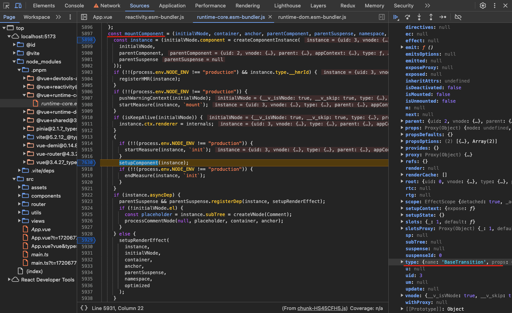
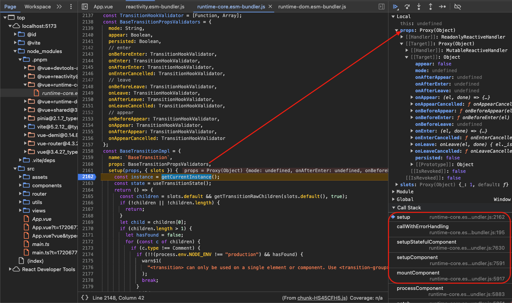
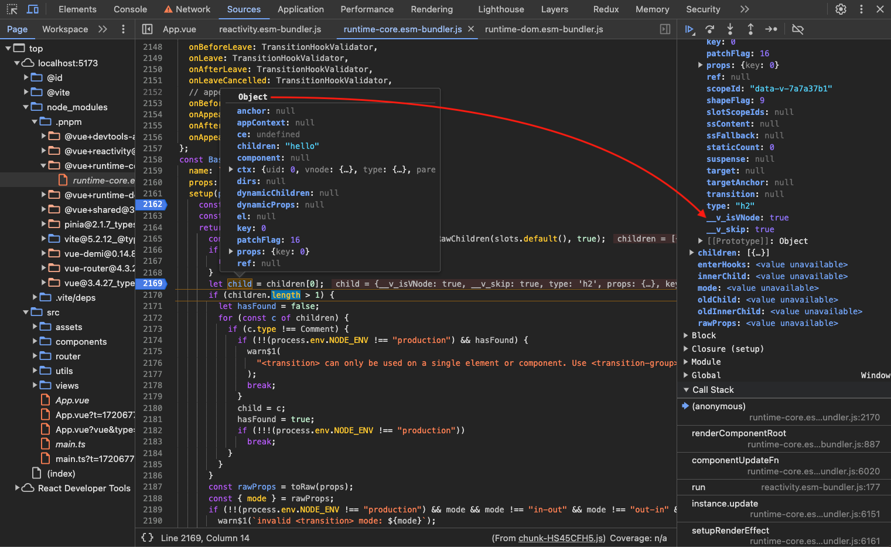
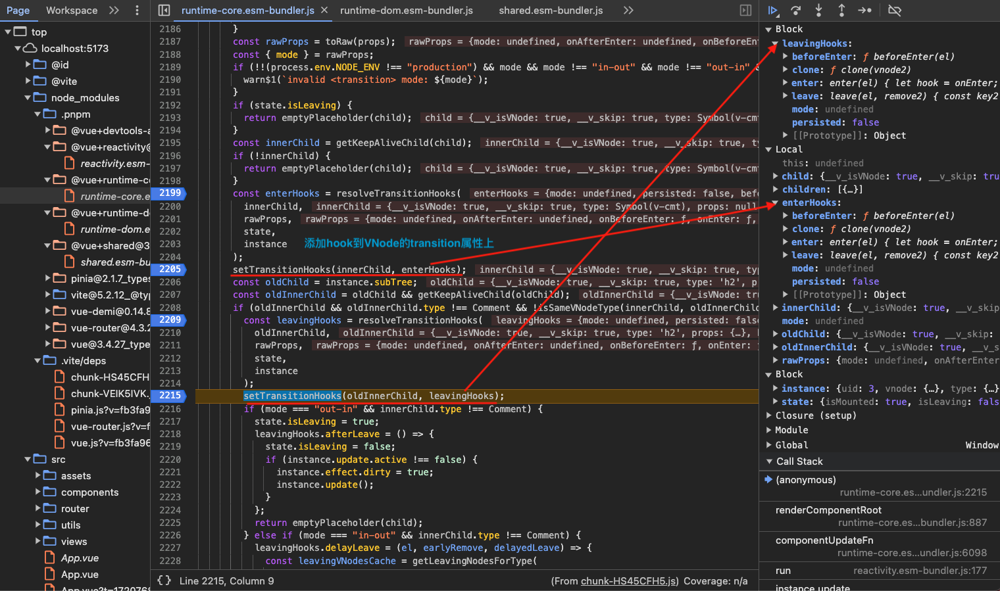
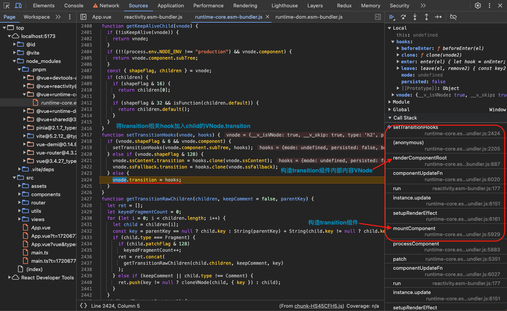


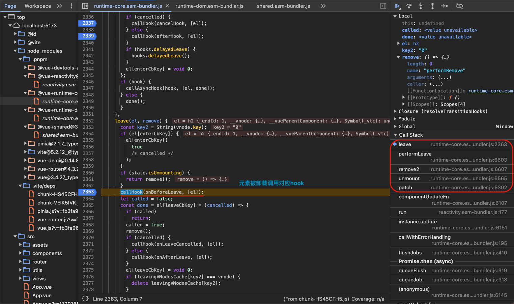

## 参考资料

[KeepAlive](https://cn.vuejs.org/guide/built-ins/keep-alive.html)

[Suspense](https://cn.vuejs.org/guide/built-ins/suspense.html)

[Teleport](https://cn.vuejs.org/guide/built-ins/teleport.html)

[Transition](https://cn.vuejs.org/guide/built-ins/transition.html)
