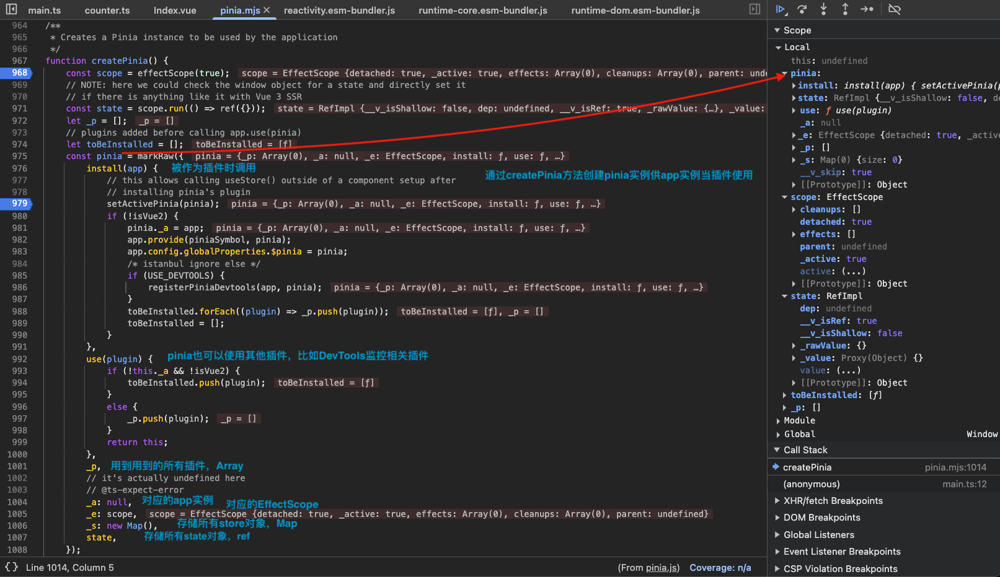
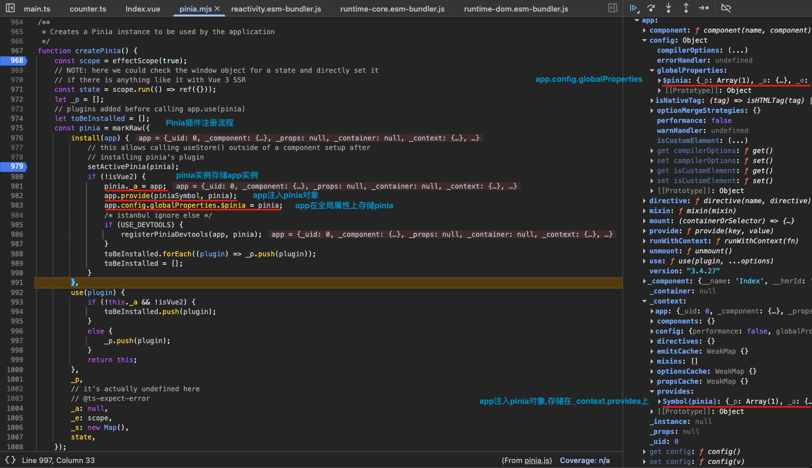
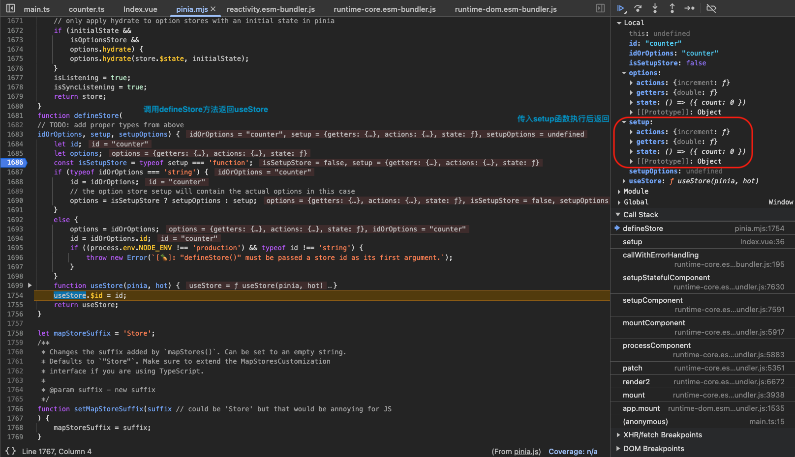
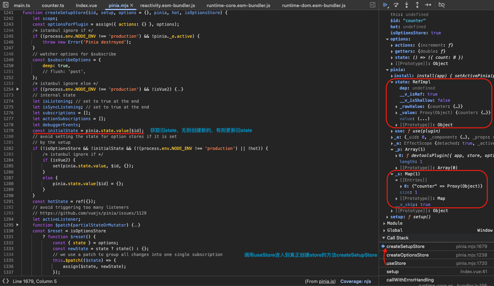
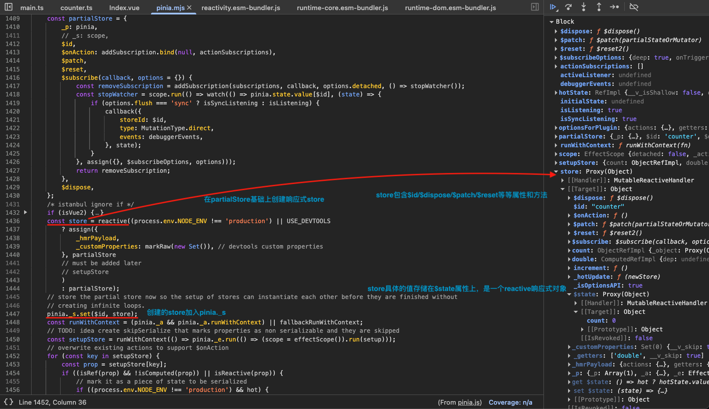
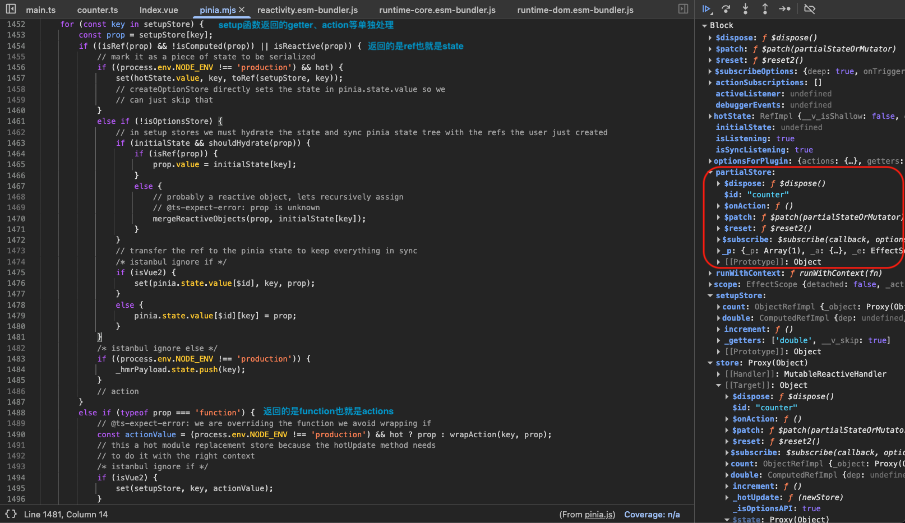
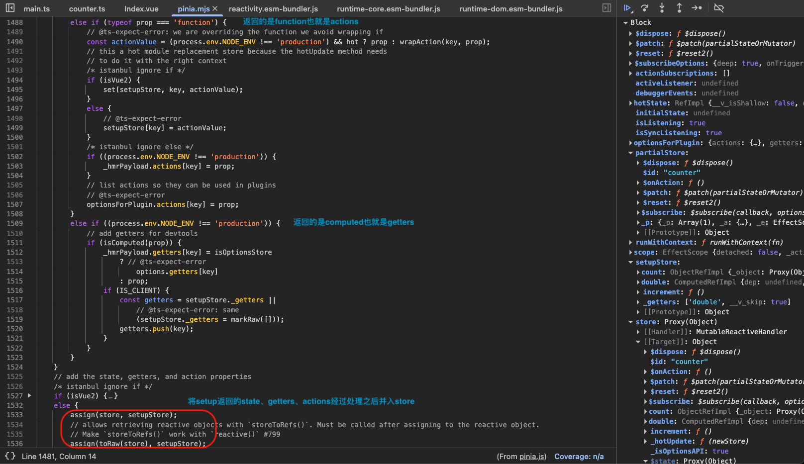
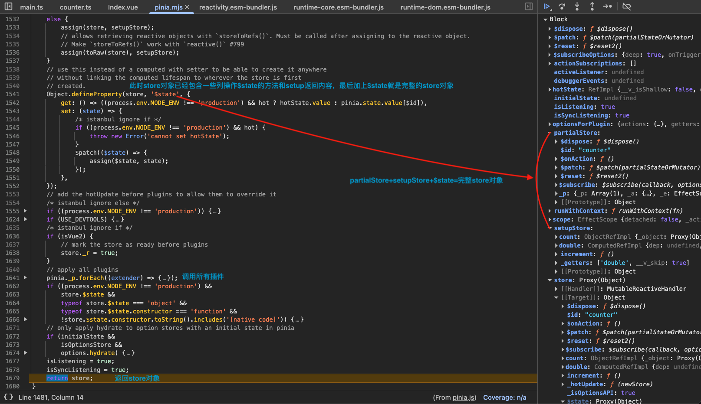

# Pinia

## Pinia 的使用

调用 `createPinia` 创建 `Pinia` 插件供 `app` 实例使用：

```ts
import { createApp } from "vue"
import { createPinia } from "pinia"

import App from "./App.vue"
import router from "./router"

const app = createApp(App)

app.use(createPinia())
app.use(router)

app.mount("#app")
```

创建 `Pinia` 实例使用 `createPinia` 方法，在我们的应用使用 `Pinia` 插件之后会调 `Pinia` 实例的 `install` 方法：

1. 在 `pinia` 对象上存储对应的 `app` 实例；
2. 全局依赖注入 `piniaSymbol` 作为后续的数据来源；
3. 全局属性添加 `$pinia`；

```ts
// 【packages/pinia/src/createPinia.ts】
/**
 * Creates a Pinia instance to be used by the application
 */
export function createPinia(): Pinia {
  const scope = effectScope(true)
  // NOTE: here we could check the window object for a state and directly set it
  // if there is anything like it with Vue 3 SSR
  const state = scope.run<Ref<Record<string, StateTree>>>(() =>
    ref<Record<string, StateTree>>({})
  )!

  let _p: Pinia["_p"] = []
  // plugins added before calling app.use(pinia)
  let toBeInstalled: PiniaPlugin[] = []

  const pinia: Pinia = markRaw({
    install(app: App) {
      // this allows calling useStore() outside of a component setup after
      // installing pinia's plugin
      setActivePinia(pinia)
      // 【存储pinia对应的app实例】
      pinia._a = app
      // 【全局依赖注入piniaSymbol】
      app.provide(piniaSymbol, pinia)
      // 【全局属性添加$pinia】
      app.config.globalProperties.$pinia = pinia
      /* istanbul ignore else */
      if (__USE_DEVTOOLS__ && IS_CLIENT) {
        registerPiniaDevtools(app, pinia)
      }
      toBeInstalled.forEach((plugin) => _p.push(plugin))
      toBeInstalled = []
    },

    use(plugin) {
      if (!this._a) {
        toBeInstalled.push(plugin)
      } else {
        _p.push(plugin)
      }
      return this
    },

    _p,
    // it's actually undefined here
    // @ts-expect-error
    _a: null,
    _e: scope,
    _s: new Map<string, StoreGeneric>(),
    state,
  })

  // pinia devtools rely on dev only features so they cannot be forced unless
  // the dev build of Vue is used. Avoid old browsers like IE11.
  if (__USE_DEVTOOLS__ && IS_CLIENT && typeof Proxy !== "undefined") {
    pinia.use(devtoolsPlugin)
  }

  return pinia
}
```




首先通常我们会去调用 `defineStore` 创建一个 `store` 对象，上面包含 `state` 和一系列方法。要让 `pinia` 正确识别 `state`，你必须在 `setup` 中返回 `state` 的所有属性，最终 `defineStore` 返回 `useStore` 函数，供组件调用：

- `ref()` 就是 `state`
- `computed()` 就是 `getters`
- `function()` 就是 `actions`

```ts
import { ref, computed } from "vue"
import { defineStore } from "pinia"

export const useCounterStore = defineStore("counter", () => {
  // state
  const count = ref(0)
  // getters
  const doubleCount = computed(() => count.value * 2)
  // actions
  function increment() {
    count.value++
  }

  return { count, doubleCount, increment }
})
```

`Pinia` 对象的数据结构如下：

- `install` 在 `pinia` 作为插件使用时调用
- `use` 使用相关插件，如 `DevTools`
- `state` 一个 `ref` 对象，会存储所有创建的 `state` 对象，`<id,state对象>`
- `_p` 存储用到的相关插件
- `_a` 对应的 `app` 实例
- `_e` 对应的 `EffectScope`
- `_s` 一个 `map`，存储所有创建的所有 `store` 对象，`<id,store对象>`

```ts
/**
 * Every application must own its own pinia to be able to create stores
 */
export interface Pinia {
  // 【注册Pinia时调用】
  install: (app: App) => void

  // 【根state对象，是一个响应式数据】
  /**
   * root state
   */
  state: Ref<Record<string, StateTree>>

  /**
   * Adds a store plugin to extend every store
   *
   * @param plugin - store plugin to add
   */
  use(plugin: PiniaPlugin): Pinia

  /**
   * Installed store plugins
   *
   * @internal
   */
  _p: PiniaPlugin[]

  // 【和当前pinia实例关联的app实例】
  /**
   * App linked to this Pinia instance
   *
   * @internal
   */
  _a: App

  /**
   * Effect scope the pinia is attached to
   *
   * @internal
   */
  _e: EffectScope

  // 【存储所有创建的store】
  /**
   * Registry of stores used by this pinia.
   *
   * @internal
   */
  _s: Map<string, StoreGeneric>

  /**
   * Added by `createTestingPinia()` to bypass `useStore(pinia)`.
   *
   * @internal
   */
  _testing?: boolean
}
```

## store

定义 `store` 的 `defineStore` 如下，入参是`id`、`setup`(可选)、`setupOptions`(可选)，返回 `useStore` 函数：

1. `inject` 依赖注入 `piniaSymbol` 对象找到 `pinia` 实例；
2. 在 `pinia._s` 上寻找对应 `id` 的 `store`，没有的话就根据是 `setup` 还是 `setupOptions` 类型去创建 `store` 对象；
3. 返回 `useStore` 方法，`useStore` 方法会返回创建（找到）的 `store` 对象；

```ts
// 【packages/pinia/src/store.ts】
// allows unused stores to be tree shaken
/*! #__NO_SIDE_EFFECTS__ */
export function defineStore(
  // TODO: add proper types from above
  id: any,
  setup?: any,
  setupOptions?: any
): StoreDefinition {
  let options:
    | DefineStoreOptions<
        string,
        StateTree,
        _GettersTree<StateTree>,
        _ActionsTree
      >
    | DefineSetupStoreOptions<
        string,
        StateTree,
        _GettersTree<StateTree>,
        _ActionsTree
      >

  const isSetupStore = typeof setup === "function"
  // the option store setup will contain the actual options in this case
  options = isSetupStore ? setupOptions : setup

  function useStore(pinia?: Pinia | null, hot?: StoreGeneric): StoreGeneric {
    const hasContext = hasInjectionContext()
    // 【获取到创建的pinia实例】
    pinia =
      // in test mode, ignore the argument provided as we can always retrieve a
      // pinia instance with getActivePinia()
      (__TEST__ && activePinia && activePinia._testing ? null : pinia) ||
      (hasContext ? inject(piniaSymbol, null) : null)
    if (pinia) setActivePinia(pinia)

    if (__DEV__ && !activePinia) {
      throw new Error(
        `[🍍]: "getActivePinia()" was called but there was no active Pinia. Are you trying to use a store before calling "app.use(pinia)"?\n` +
          `See https://pinia.vuejs.org/core-concepts/outside-component-usage.html for help.\n` +
          `This will fail in production.`
      )
    }

    pinia = activePinia!
    // 【查找pinia._s是否有相应的store】
    if (!pinia._s.has(id)) {
      // creating the store registers it in `pinia._s`
      if (isSetupStore) {
        createSetupStore(id, setup, options, pinia)
      } else {
        createOptionsStore(id, options as any, pinia)
      }

      /* istanbul ignore else */
      if (__DEV__) {
        // @ts-expect-error: not the right inferred type
        useStore._pinia = pinia
      }
    }
    // 【找到对应id的store】
    const store: StoreGeneric = pinia._s.get(id)!

    if (__DEV__ && hot) {
      const hotId = "__hot:" + id
      const newStore = isSetupStore
        ? createSetupStore(hotId, setup, options, pinia, true)
        : createOptionsStore(hotId, assign({}, options) as any, pinia, true)

      hot._hotUpdate(newStore)

      // cleanup the state properties and the store from the cache
      delete pinia.state.value[hotId]
      pinia._s.delete(hotId)
    }

    if (__DEV__ && IS_CLIENT) {
      const currentInstance = getCurrentInstance()
      // save stores in instances to access them devtools
      if (
        currentInstance &&
        currentInstance.proxy &&
        // avoid adding stores that are just built for hot module replacement
        !hot
      ) {
        const vm = currentInstance.proxy
        const cache = "_pStores" in vm ? vm._pStores! : (vm._pStores = {})
        cache[id] = store
      }
    }

    // StoreGeneric cannot be casted towards Store
    return store as any
  }

  useStore.$id = id

  return useStore
}
```



然后用户在组件中调用 `useStore` 函数使用 `store` 时就会进入 `createSetupStore` 创建（或寻找） `store` 对象的逻辑如下：

1. 先由 `reactive` 创建一个基础的 `store` 对象然后和 `partialSore` 合并，包含了 `$id`、`$patch`、`$reset`、`$subscribe` 等属性和方法；
2. 执行 `setup` 函数得到 `setupStore` 对象包含了 `setup` 函数返回的所有内容，并且遍历返回内容，针对 `state`、`getters`、`actions` 分别进行处理；
3. 将基础 `store` 对象和 `setupStore` 对象结合形成完整的 `store` 对象，最后为其加入 `$state` 属性并返回这个完整的 `store` 对象；

`partialSore` + `setupStore` + `$state` = 完整的 `store` 对象

```ts
// 【packages/pinia/src/store.ts】
function createSetupStore<
  Id extends string,
  SS extends Record<any, unknown>,
  S extends StateTree,
  G extends Record<string, _Method>,
  A extends _ActionsTree
>(
  $id: Id,
  setup: (helpers: SetupStoreHelpers) => SS,
  options:
    | DefineSetupStoreOptions<Id, S, G, A>
    | DefineStoreOptions<Id, S, G, A> = {},
  pinia: Pinia,
  hot?: boolean,
  isOptionsStore?: boolean
): Store<Id, S, G, A> {
  let scope!: EffectScope

  const optionsForPlugin: DefineStoreOptionsInPlugin<Id, S, G, A> = assign(
    { actions: {} as A },
    options
  )

  //【...省略】

  // watcher options for $subscribe
  const $subscribeOptions: WatchOptions = { deep: true }

  //【...省略】

  // internal state
  let isListening: boolean // set to true at the end
  let isSyncListening: boolean // set to true at the end
  let subscriptions: SubscriptionCallback<S>[] = []
  let actionSubscriptions: StoreOnActionListener<Id, S, G, A>[] = []
  let debuggerEvents: DebuggerEvent[] | DebuggerEvent
  const initialState = pinia.state.value[$id] as UnwrapRef<S> | undefined

  // avoid setting the state for option stores if it is set
  // by the setup
  if (!isOptionsStore && !initialState && (!__DEV__ || !hot)) {
    /* istanbul ignore if */
    pinia.state.value[$id] = {}
  }

  const hotState = ref({} as S)

  // avoid triggering too many listeners
  // https://github.com/vuejs/pinia/issues/1129
  let activeListener: Symbol | undefined
  function $patch(stateMutation: (state: UnwrapRef<S>) => void): void
  function $patch(partialState: _DeepPartial<UnwrapRef<S>>): void
  function $patch(
    partialStateOrMutator:
      | _DeepPartial<UnwrapRef<S>>
      | ((state: UnwrapRef<S>) => void)
  ): void {
    //【...省略】
  }

  const $reset = isOptionsStore
    ? function $reset(this: _StoreWithState<Id, S, G, A>) {
        //【...省略】
      }
    : /* istanbul ignore next */
    __DEV__
    ? () => {
        throw new Error(
          `🍍: Store "${$id}" is built using the setup syntax and does not implement $reset().`
        )
      }
    : noop

  function $dispose() {
    scope.stop()
    subscriptions = []
    actionSubscriptions = []
    pinia._s.delete($id)
  }

  /**
   * Helper that wraps function so it can be tracked with $onAction
   * @param fn - action to wrap
   * @param name - name of the action
   */
  const action = <Fn extends _Method>(fn: Fn, name: string = ""): Fn => {
    //【...省略】
  }

  const _hmrPayload = /*#__PURE__*/ markRaw({
    actions: {} as Record<string, any>,
    getters: {} as Record<string, Ref>,
    state: [] as string[],
    hotState,
  })

  // 【创建初始的store，可以看到包含$patch、$reset、$subscribe()等方法】
  const partialStore = {
    _p: pinia,
    // _s: scope,
    $id,
    $onAction: addSubscription.bind(null, actionSubscriptions),
    $patch,
    $reset,
    $subscribe(callback, options = {}) {
      //【...省略】
    },
    $dispose,
  } as _StoreWithState<Id, S, G, A>

  // 【-----再结合其他几个options，store实质由reactive创建------】
  const store: Store<Id, S, G, A> = reactive(
    __DEV__ || (__USE_DEVTOOLS__ && IS_CLIENT)
      ? assign(
          {
            _hmrPayload,
            _customProperties: markRaw(new Set<string>()), // devtools custom properties
          },
          partialStore
          // must be added later
          // setupStore
        )
      : partialStore
  ) as unknown as Store<Id, S, G, A>

  // 【存储到pinia实例的_s这个map中和id一一对应】
  // store the partial store now so the setup of stores can instantiate each other before they are finished without
  // creating infinite loops.
  pinia._s.set($id, store as Store)

  const runWithContext =
    (pinia._a && pinia._a.runWithContext) || fallbackRunWithContext

  // 【执行store的setup获取返回具体的内容】
  // TODO: idea create skipSerialize that marks properties as non serializable and they are skipped
  const setupStore = runWithContext(() =>
    pinia._e.run(() => (scope = effectScope()).run(() => setup({ action }))!)
  )!

  // 【遍历setup返回内容，一一处理，store值存储到pinia.state上，action和getter分别进行处理，包装action然后暴露给插件等】
  // overwrite existing actions to support $onAction
  for (const key in setupStore) {
    const prop = setupStore[key]

    if ((isRef(prop) && !isComputed(prop)) || isReactive(prop)) {
      // mark it as a piece of state to be serialized
      if (__DEV__ && hot) {
        hotState.value[key] = toRef(setupStore, key)
        // createOptionStore directly sets the state in pinia.state.value so we
        // can just skip that
      } else if (!isOptionsStore) {
        // in setup stores we must hydrate the state and sync pinia state tree with the refs the user just created
        if (initialState && shouldHydrate(prop)) {
          if (isRef(prop)) {
            prop.value = initialState[key as keyof UnwrapRef<S>]
          } else {
            // probably a reactive object, lets recursively assign
            // @ts-expect-error: prop is unknown
            mergeReactiveObjects(prop, initialState[key])
          }
        }
        // transfer the ref to the pinia state to keep everything in sync
        pinia.state.value[$id][key] = prop
      }

      /* istanbul ignore else */
      if (__DEV__) {
        _hmrPayload.state.push(key)
      }
      // action
    } else if (typeof prop === "function") {
      const actionValue = __DEV__ && hot ? prop : action(prop as _Method, key)
      // this a hot module replacement store because the hotUpdate method needs
      // to do it with the right context
      // @ts-expect-error
      setupStore[key] = actionValue

      /* istanbul ignore else */
      if (__DEV__) {
        _hmrPayload.actions[key] = prop
      }

      // list actions so they can be used in plugins
      // @ts-expect-error
      optionsForPlugin.actions[key] = prop
    } else if (__DEV__) {
      // add getters for devtools
      if (isComputed(prop)) {
        _hmrPayload.getters[key] = isOptionsStore
          ? // @ts-expect-error
            options.getters[key]
          : prop
        if (IS_CLIENT) {
          const getters: string[] =
            (setupStore._getters as string[]) ||
            // @ts-expect-error: same
            ((setupStore._getters = markRaw([])) as string[])
          getters.push(key)
        }
      }
    }
  }

  // 【把setup返回结果和构建的store对象结合形成完整的store对象】
  // add the state, getters, and action properties
  /* istanbul ignore if */
  assign(store, setupStore)
  // allows retrieving reactive objects with `storeToRefs()`. Must be called after assigning to the reactive object.
  // Make `storeToRefs()` work with `reactive()` #799
  assign(toRaw(store), setupStore)

  // use this instead of a computed with setter to be able to create it anywhere
  // without linking the computed lifespan to wherever the store is first
  // created.
  Object.defineProperty(store, "$state", {
    get: () => (__DEV__ && hot ? hotState.value : pinia.state.value[$id]),
    set: (state) => {
      /* istanbul ignore if */
      if (__DEV__ && hot) {
        throw new Error("cannot set hotState")
      }
      $patch(($state) => {
        // @ts-expect-error: FIXME: shouldn't error?
        assign($state, state)
      })
    },
  })

  //【...省略】

  // apply all plugins
  pinia._p.forEach((extender) => {
    //【...省略】
  })

  //【...省略】

  isListening = true
  isSyncListening = true
  return store
}
```

总结来说，最后返回的完整 `store` 对象是一个 `reactive` 响应式对象，包含了 `$state`、`getters`、`actions` 以及 `$id`、`$patch`、`$dispose`、`$reset`、`$subscribe` 等属性和方法。







### state

在大多数情况下，`state` 都是你的 `store` 的核心。人们通常会先定义能代表他们 APP 的 `state`。在 `Pinia` 中，`state` 被定义为一个返回初始状态的函数。

```js
import { useCounterStore } from "../stores/counterStore"

export default {
  setup() {
    const counterStore = useCounterStore()

    return { counterStore }
  },
  computed: {
    tripleCounter() {
      return counterStore.counter * 3
    },
  },
}
```

### getter

`Getter` 完全等同于 `store` 的 `state` 的计算值。

```js
import { defineStore } from 'pinia',

const useCounterStore = defineStore('counterStore', {
  state: () => ({
    counter: 0
  }),
  getters: {
    doubleCounter() {
      return this.counter * 2
    }
  }
})

import { useCounterStore } from "../stores/counterStore"

export default {
  setup() {
    const counterStore = useCounterStore()

    return { counterStore }
  },
  computed: {
    quadrupleCounter() {
      return counterStore.doubleCounter * 2
    },
  },
}
```

### action

`Action` 相当于组件中的 `method`。

```js
import { defineStore } from 'pinia',

const useCounterStore = defineStore('counterStore', {
  state: () => ({
    counter: 0
  }),
  actions: {
    increment() {
      this.counter++
    }
  }
})

import { useCounterStore } from "../stores/counterStore"

export default {
  setup() {
    const counterStore = useCounterStore()

    return { counterStore }
  },
  methods: {
    incrementAndPrint() {
      counterStore.increment()
      console.log("New Count:", counterStore.count)
    },
  },
}
```

### store.$patch

```ts
// 【packages/pinia/src/store.ts】
function createSetupStore<
  Id extends string,
  SS extends Record<any, unknown>,
  S extends StateTree,
  G extends Record<string, _Method>,
  A extends _ActionsTree
>(
  $id: Id,
  setup: (helpers: SetupStoreHelpers) => SS,
  options:
    | DefineSetupStoreOptions<Id, S, G, A>
    | DefineStoreOptions<Id, S, G, A> = {},
  pinia: Pinia,
  hot?: boolean,
  isOptionsStore?: boolean
): Store<Id, S, G, A> {
  //【...省略】

  function $patch(
    partialStateOrMutator:
      | _DeepPartial<UnwrapRef<S>>
      | ((state: UnwrapRef<S>) => void)
  ): void {
    let subscriptionMutation: SubscriptionCallbackMutation<S>
    isListening = isSyncListening = false
    // reset the debugger events since patches are sync
    /* istanbul ignore else */
    if (__DEV__) {
      debuggerEvents = []
    }
    // 【直接改造pinia.state.value，这是一个reactive响应式对象】
    // 【以函数的形式打补丁】
    if (typeof partialStateOrMutator === "function") {
      partialStateOrMutator(pinia.state.value[$id] as UnwrapRef<S>)
      subscriptionMutation = {
        type: MutationType.patchFunction, // 【区分打补丁方式，subscribe中可能会用到】
        storeId: $id,
        events: debuggerEvents as DebuggerEvent[],
      }
    } else {
      // 【直接以对象打补丁】
      mergeReactiveObjects(pinia.state.value[$id], partialStateOrMutator)
      subscriptionMutation = {
        type: MutationType.patchObject, // 【区分打补丁方式，subscribe中可能会用到】
        payload: partialStateOrMutator,
        storeId: $id,
        events: debuggerEvents as DebuggerEvent[],
      }
    }
    const myListenerId = (activeListener = Symbol())
    nextTick().then(() => {
      if (activeListener === myListenerId) {
        isListening = true
      }
    })
    isSyncListening = true
    // because we paused the watcher, we need to manually call the subscriptions
    triggerSubscriptions(
      subscriptions,
      subscriptionMutation,
      pinia.state.value[$id] as UnwrapRef<S>
    )
  }

  //【...省略】

  return store
}
```

## 参考资料

[Pinia](https://pinia.vuejs.org/zh/core-concepts/)
