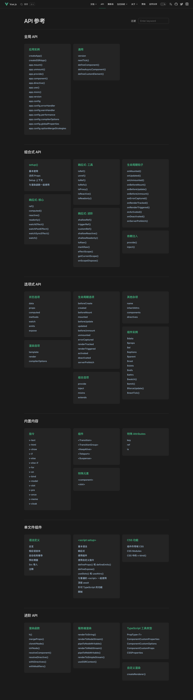

# Vue3 概览

该系列内容都基于Vue的3.2.41版本。

## Vue3 项目结构

```js
core-main
├──packages
    ├── compiler-core          # 平台无关的编译核心
    ├── compiler-dom           # 编译-浏览器环境dom相关
    ├── compiler-sfc           # 编译-单文件Vue相关
    ├── compiler-ssr           # 编译-服务器端ssr相关
    ├── reactivity             # 响应式核心
    ├── reactivity-transform   # 实验模块
    ├── runtime-core           # 渲染-平台无关的运行时render相关核心
    ├── runtime-dom            # 渲染-浏览器环境运行时dom render相关
    ├── runtime-test           # 渲染-Vue内部测试用
    ├── server-renderer        # 渲染-用于 SSR 服务端渲染的逻辑
    ├── sfc-playground         # playground
    ├── shared                 # 公用方法等
    ├── size-check             # 用于观测tree-shaking后的大小
    ├── template-explorer      # 用于检查模板编译后的输出，主要用于开发调试
    ├── vue                    # vue实际用例 & vue3 的主要入口，包括运行时和编译器，包括几个不同的入口（开发版本、runtime 版本、full 版本） 
```

- **`compiler`** 模块负责 Vue 模板的解析、生成 render 方法
- **`runtime`** 模块负责调用 render 方法生成虚拟 DOM 并渲染，同时处理用户交互、更新应用状态等等
- **`vue`** 作为入口，分别依赖 compiler 和 runtime 2 个大模块。这两个大模块内部又将核心剥离出去，然后将浏览器环境相关的部分再放到一个单独的包中
  
`Vue3` 整个源码是通过 `monorepo` 的项目架构去维护的，根据功能将不同的模块拆分到 `packages` 目录下面不同的子目录中。这样使得模块拆分更细化，职责划分更明确，模块之间的依赖关系也更加明确，开发人员也更容易阅读、理解和更改所有模块源码，提高代码的可维护性。

另外一些 package（比如 `reactivity` 响应式库）是可以独立于 `Vue` 使用的，这样用户如果只想使用 `Vue3` 的响应式能力，可以单独依赖这个响应式库而不用去依赖整个 `Vue`。

另外从语法方面，`Vue3`支持了 `Typescript` 还有ES6中很多重要的API等。

## Vue3 Web端入口runtime+compile

```ts
// 【../packages/vue/src/index.ts】
//【依赖两个核心模块@vue/compiler-dom和@vue/runtime-dom】
// This entry is the "full-build" that includes both the runtime
// and the compiler, and supports on-the-fly compilation of the template option.
import { initDev } from './dev'
import { compile, CompilerOptions, CompilerError } from '@vue/compiler-dom'
import { registerRuntimeCompiler, RenderFunction, warn } from '@vue/runtime-dom'
import * as runtimeDom from '@vue/runtime-dom'
import { isString, NOOP, generateCodeFrame, extend } from '@vue/shared'
import { InternalRenderFunction } from 'packages/runtime-core/src/component'

if (__DEV__) {
  initDev()
}
//【编译过的template会进行缓存】
const compileCache: Record<string, RenderFunction> = Object.create(null)

function compileToFunction(
  template: string | HTMLElement,
  options?: CompilerOptions
): RenderFunction {
  //【template不是string则获取innerHTML内容】
  if (!isString(template)) {
    if (template.nodeType) {
      template = template.innerHTML
    } else {
      __DEV__ && warn(`invalid template option: `, template)
      return NOOP
    }
  }
  //【检查缓存看是否已经编译过】
  const key = template
  const cached = compileCache[key]
  if (cached) {
    return cached
  }
  //【template首字符是'#'时，当成DOM选择器获取DOM内容】
  if (template[0] === '#') {
    const el = document.querySelector(template)
    if (__DEV__ && !el) {
      warn(`Template element not found or is empty: ${template}`)
    }
    // __UNSAFE__
    // Reason: potential execution of JS expressions in in-DOM template.
    // The user must make sure the in-DOM template is trusted. If it's rendered
    // by the server, the template should not contain any user data.
    template = el ? el.innerHTML : ``
  }
  //【合并编译的选项】
  const opts = extend(
    {
      hoistStatic: true,
      onError: __DEV__ ? onError : undefined,
      onWarn: __DEV__ ? e => onError(e, true) : NOOP
    } as CompilerOptions,
    options
  )

  if (!opts.isCustomElement && typeof customElements !== 'undefined') {
    opts.isCustomElement = tag => !!customElements.get(tag)
  }

  //【通过compile方法获取code】
  const { code } = compile(template, opts)

  function onError(err: CompilerError, asWarning = false) {
    const message = asWarning
      ? err.message
      : `Template compilation error: ${err.message}`
    const codeFrame =
      err.loc &&
      generateCodeFrame(
        template as string,
        err.loc.start.offset,
        err.loc.end.offset
      )
    warn(codeFrame ? `${message}\n${codeFrame}` : message)
  }

  //【code生成render方法】
  // The wildcard import results in a huge object with every export
  // with keys that cannot be mangled, and can be quite heavy size-wise.
  // In the global build we know `Vue` is available globally so we can avoid
  // the wildcard object.
  const render = (
    __GLOBAL__ ? new Function(code)() : new Function('Vue', code)(runtimeDom)
  ) as RenderFunction

  // mark the function as runtime compiled
  ;(render as InternalRenderFunction)._rc = true

  //【编译完成后将render方法缓存下来并返回】
  return (compileCache[key] = render)
}
//【注册compile方法】

export { compileToFunction as compile }
export * from '@vue/runtime-dom'
```

## Vue3 全局变量

```ts
// Global compile-time constants
declare var __DEV__: boolean    // 开发环境
declare var __TEST__: boolean
declare var __BROWSER__: boolean
declare var __GLOBAL__: boolean
declare var __ESM_BUNDLER__: boolean
declare var __ESM_BROWSER__: boolean
declare var __NODE_JS__: boolean
declare var __SSR__: boolean
declare var __COMMIT__: string
declare var __VERSION__: string
declare var __COMPAT__: boolean  // 兼容Vue2

// Feature flags
declare var __FEATURE_OPTIONS_API__: boolean
declare var __FEATURE_PROD_DEVTOOLS__: boolean
declare var __FEATURE_SUSPENSE__: boolean
```

## Vue3 API一览



- 全局API

列出了 `createApp()` 方法会返回的实例，此实例上所有的方法。以及 `version` 、 `nextTick()` 等全局方法。

- 组合式API

列出了响应式相关的API包括 `ref()`、 `reactive()`、 `computed()`、 `watchEffect()` 等。生命周期相关API。以及`setup`使用方法。

- 选项式API

列出了状态 `data`、 `props`、`computed`、`watch`、`methods`、`emits`、`expose` 等选项。渲染选项有 `template`、 `render`、 `compileOptions`。生命周期相关选项。组件实例上的带$符号的属性和方法。以及注册组件、注册指令、`provide`、`inject`等等。这块主要是兼容Vue2的写法。

- 内置内容

列出了`v-if`等等一系列指令。内置组件`<Transition>`、`<TransitionGroup>`、`<KeepAlive>`，Vue3新增了`<Teleport>`、`<Fragment>`组件。以及`key`、 `ref`、 `is`三个特殊属性。

- 单文件组件

列出了语法指导以及`setup`的用法和css相关的一些内容。

- 进阶API

列出了`h`、 `cloneVnodes`、 `isVnode`等渲染虚拟Node相关的高阶API。服务端渲染相关的API。`Typescript`工具箱。以及自定义渲染方法 `createRenderer()`。

## 参考资料

[vue3 源码解析](https://zhuanlan.zhihu.com/p/362700214)