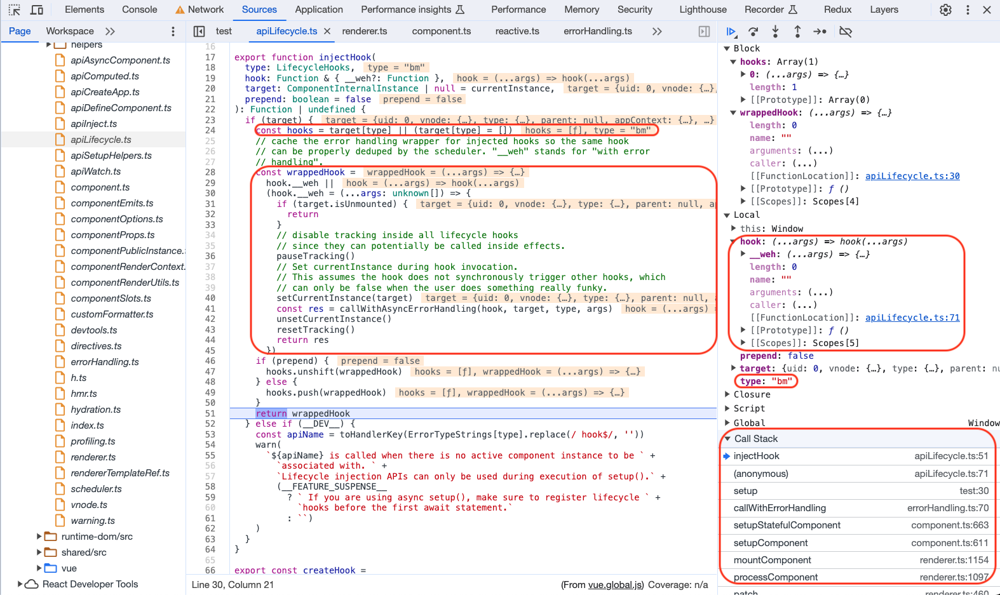

# Vue3 生命周期

每个 `Vue` 组件实例在创建时都需要经历一系列的初始化步骤，比如设置好数据侦听，编译模板，挂载实例到 `DOM`，以及在数据改变时更新 `DOM`。在此过程中，它也会运行被称为生命周期钩子的函数，让开发者有机会在特定阶段运行自己的代码。

## 关键方法

- `createHook`
- `injectHook`

## 生命周期概览

`Vue3` 对生命周期的命名进行了改变，并且增加了错误处理和渲染完成等生命周期，生命周期一览如下：

```ts
export const enum LifecycleHooks {
  BEFORE_CREATE = 'bc',
  CREATED = 'c',
  BEFORE_MOUNT = 'bm',
  MOUNTED = 'm',
  BEFORE_UPDATE = 'bu',
  UPDATED = 'u',
  BEFORE_UNMOUNT = 'bum',
  UNMOUNTED = 'um',
  DEACTIVATED = 'da',
  ACTIVATED = 'a',
  RENDER_TRIGGERED = 'rtg',
  RENDER_TRACKED = 'rtc',
  ERROR_CAPTURED = 'ec',
  SERVER_PREFETCH = 'sp'
}
```


## 生命周期调用

Each Vue component instance goes through a series of initialization steps when it's created - for example, it needs to set up data observation, compile the template, mount the instance to the DOM, and update the DOM when data changes. Along the way, it also runs functions called lifecycle hooks, giving users the opportunity to add their own code at specific stages.

引入生命周期钩子函数然后把一个函数传入生命周期钩子，这个函数会在特定的时机进行调用：

```js
<script setup>
import { onMounted } from 'vue'

onMounted(() => {
  console.log(`the component is now mounted.`)
})
</script>
```

## 生命周期创建

生命周期钩子函数由 `createHook` 方法生成，`createHook` 入参传入不同的的生命周期名称，并返回一个匿名函数，这个匿名函数的第一个参数 `hook` 要求类型是一个函数，就是用户定义在当前生命周期要执行的代码，最终会执行注入钩子函数 `injectHook`。这里用到一个函数柯理化技巧，`createHook` 将入参锁定为生命周期名字，返回了用户调用的生命周期钩子函数。

根据前文在组件化的第二步`setupComponent`方法中会进行`setup`方法的调用，此时若用户有调用生命周期钩子函数就会进入`createHook`方法生成的匿名函数中，继而将对应的回调函数注入组件实例的对应生命周期中。

```ts
// 【`runtime-core/src/apiLifecycle.ts`】
//【非SSR情况下执行用户回调】
export const createHook =
  <T extends Function = () => any>(lifecycle: LifecycleHooks) =>
  (hook: T, target: ComponentInternalInstance | null = currentInstance) =>
    // post-create lifecycle registrations are noops during SSR (except for serverPrefetch)
    (!isInSSRComponentSetup || lifecycle === LifecycleHooks.SERVER_PREFETCH) &&
    injectHook(lifecycle, (...args: unknown[]) => hook(...args), target)

export const onBeforeMount = createHook(LifecycleHooks.BEFORE_MOUNT)
export const onMounted = createHook(LifecycleHooks.MOUNTED)
export const onBeforeUpdate = createHook(LifecycleHooks.BEFORE_UPDATE)
export const onUpdated = createHook(LifecycleHooks.UPDATED)
export const onBeforeUnmount = createHook(LifecycleHooks.BEFORE_UNMOUNT)
export const onUnmounted = createHook(LifecycleHooks.UNMOUNTED)
export const onServerPrefetch = createHook(LifecycleHooks.SERVER_PREFETCH)

export type DebuggerHook = (e: DebuggerEvent) => void
export const onRenderTriggered = createHook<DebuggerHook>(
  LifecycleHooks.RENDER_TRIGGERED
)
export const onRenderTracked = createHook<DebuggerHook>(
  LifecycleHooks.RENDER_TRACKED
)

export type ErrorCapturedHook<TError = unknown> = (
  err: TError,
  instance: ComponentPublicInstance | null,
  info: string
) => boolean | void

export function onErrorCaptured<TError = Error>(
  hook: ErrorCapturedHook<TError>,
  target: ComponentInternalInstance | null = currentInstance
) {
  injectHook(LifecycleHooks.ERROR_CAPTURED, hook, target)
}
```

## 生命周期回调注入

再来看 `injectHook` 方法，`injectHook` 接受的三个参数分别是

- `type` 就是生命周期名字
- `hook` 就是用户传入的回调函数
- `target` 就是当前组件的实例

最终会在用户传入的 `hook` 函数上包裹一层，在执行到对应的生命周期的时候进行调用，所有生命周期相关的用户回调都会挂载到当前实例上，生命周期缩写为属性，用户回调函数包装后的数组为值：

```ts
export function injectHook(
  type: LifecycleHooks,
  hook: Function & { __weh?: Function },
  target: ComponentInternalInstance | null = currentInstance,
  prepend: boolean = false
): Function | undefined {
  if (target) {
    //【用户传入的hook回调函数可能是多个】
    const hooks = target[type] || (target[type] = [])
    // cache the error handling wrapper for injected hooks so the same hook
    // can be properly deduped by the scheduler. "__weh" stands for "with error
    // handling".
    const wrappedHook =
      hook.__weh ||
      (hook.__weh = (...args: unknown[]) => {
        if (target.isUnmounted) {
          return
        }
        // disable tracking inside all lifecycle hooks
        // since they can potentially be called inside effects.
        pauseTracking()
        // Set currentInstance during hook invocation.
        // This assumes the hook does not synchronously trigger other hooks, which
        // can only be false when the user does something really funky.
        setCurrentInstance(target)
        //【生命周期回调函数经过错误处理包裹】
        const res = callWithAsyncErrorHandling(hook, target, type, args)
        unsetCurrentInstance()
        resetTracking()
        return res
      })
    if (prepend) {
      hooks.unshift(wrappedHook)
    } else {
      hooks.push(wrappedHook)
    }
    return wrappedHook
  } else if (__DEV__) {
    const apiName = toHandlerKey(ErrorTypeStrings[type].replace(/ hook$/, ''))
    warn(
      `${apiName} is called when there is no active component instance to be ` +
        `associated with. ` +
        `Lifecycle injection APIs can only be used during execution of setup().` +
        (__FEATURE_SUSPENSE__
          ? ` If you are using async setup(), make sure to register lifecycle ` +
            `hooks before the first await statement.`
          : ``)
    )
  }
}
```




## 总结


