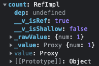
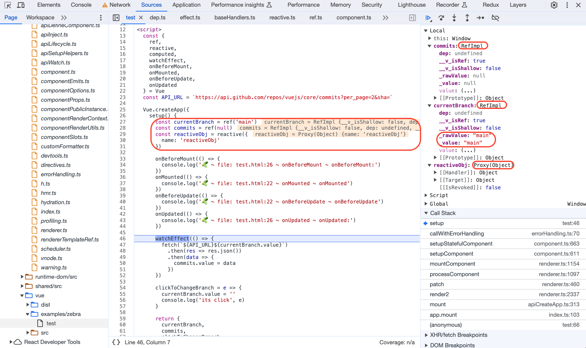
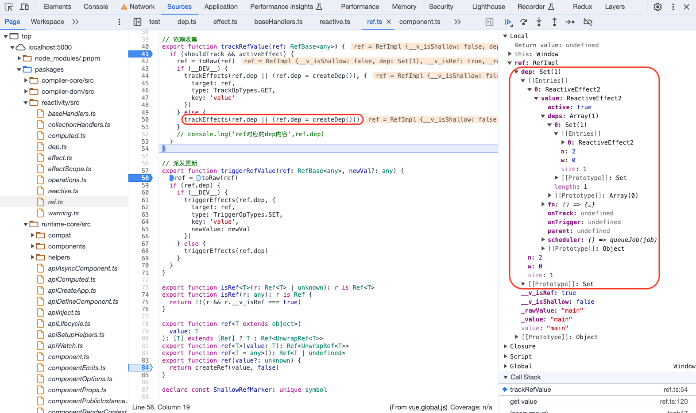
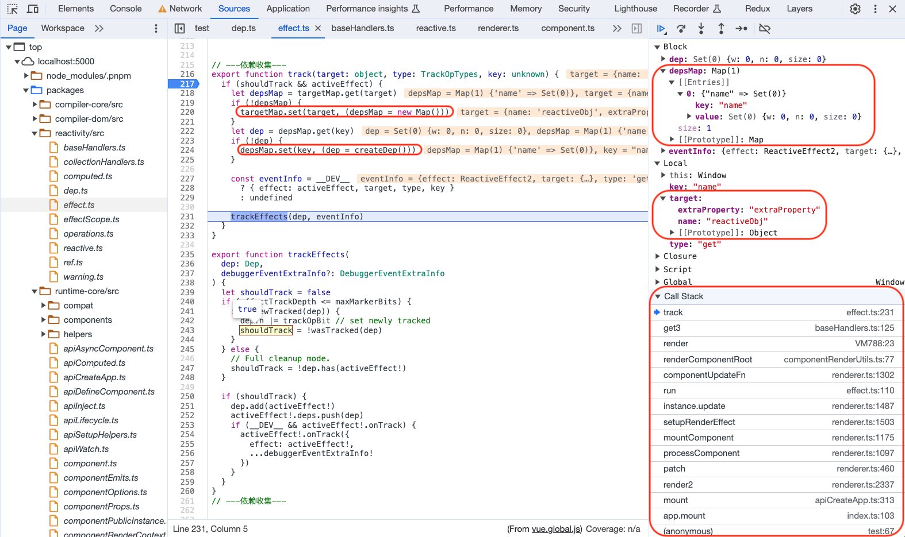
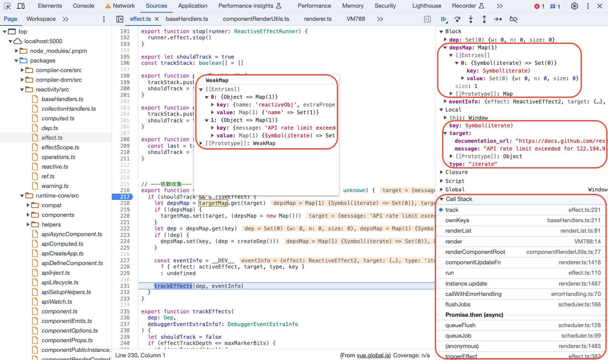
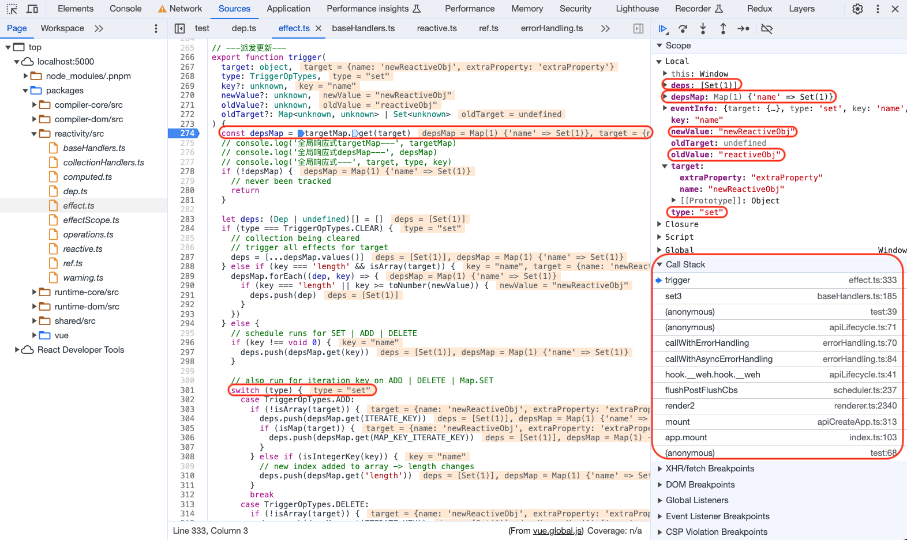
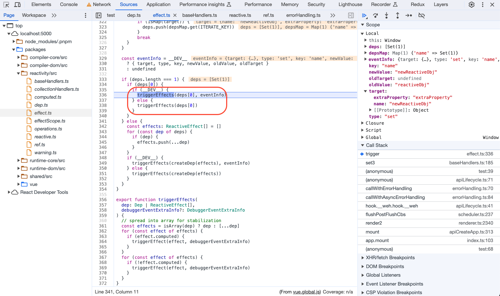
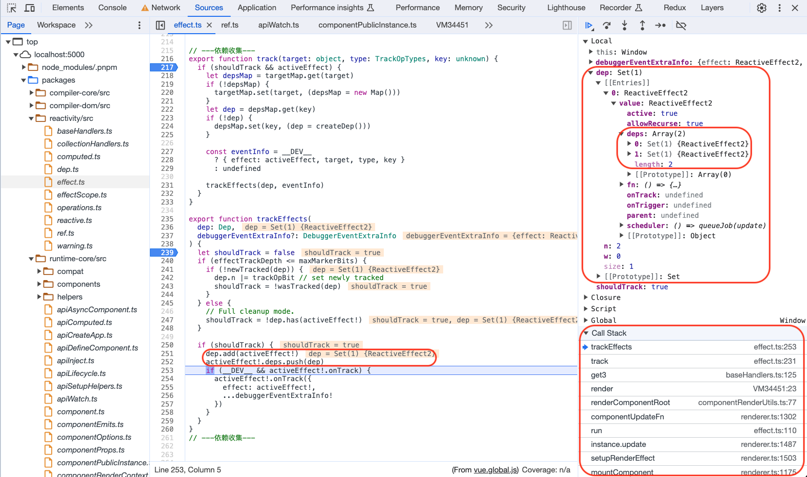
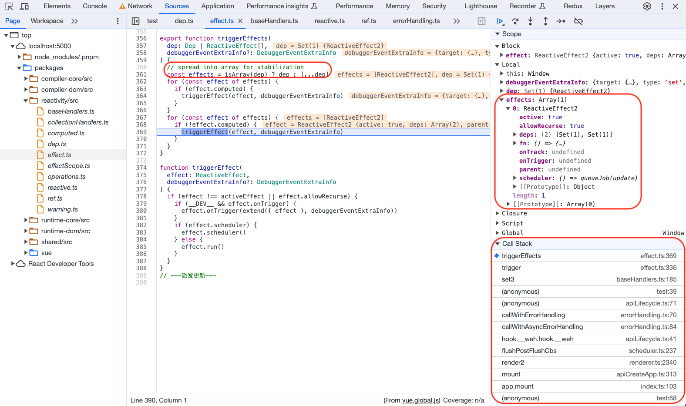

# Vue3的响应式原理

在分析Vue2的响应式的时候我们经常接触的几个概念：`render watcher`、 `user watcher`、 `computed watcher`等，在Vue3中使用副作用`effect`的概念同样监测响应式对象并进行相应的操作或更新。

- 在Vue2中的响应式关键：`Observer`、`Dep`、`Watcher`。
- 在Vue3中的响应式关键：`Dep`、`ReactiveEffect`。

响应式核心的API有：

- `ref()`
- `reactive()`
- `readonly()`
- `computed()`
- `watchEffect()`
- `watchPostEffect()`
- `watchSyncEffect()`
- `watch()`

## 关键方法

- `createRef`
- `RefImpl`
- `createReactiveObject`
- `Dep`
- `ReactiveEffect`
- `trackRefValue`
- `triggerRefValue`
- `trackEffects`
- `triggerEffects`
- `triggerEffect`

## ref()

**new RefImpl() -> new Dep() -> trackRefValue()/triggerRefValue() -> trackEffects()/triggerEffects()**

- 关键词`<RefImpl>`、`<Dep>`、`<ReactiveEffect>`

官方文档提供的关于响应式API包含`ref()`函数，定义如下：接受一个**内部值**，返回一个响应式的、可更改的 `ref` 对象，此对象只有一个指向其内部值的属性 `.value`。

可以先来看一下`ref()`函数的实现，首先调用`createRef()`传入两个参数，第一个是值，第二个根据是`ref`还是`shallowRef`传入boolean值，然后实例化一个`RefImpl`对象，`<RefImpl>`类的实现如下：

```ts
// 【packages/reactivity/src/ref.ts】
// 【深度响应式】
export function ref(value?: unknown) {
  return createRef(value, false)
}
// 【浅响应式】
export function shallowRef(value?: unknown) {
  return createRef(value, true)
}

//【入参：原始值，是否浅作用】
function createRef(rawValue: unknown, shallow: boolean) {
  // 【已经是ref响应式值直接返回】
  if (isRef(rawValue)) {
    return rawValue
  }
  // 【实例化一个RefImpl对象】
  return new RefImpl(rawValue, shallow)
}

class RefImpl<T> {
  private _value: T
  private _rawValue: T

  public dep?: Dep = undefined
  public readonly __v_isRef = true

  constructor(value: T, public readonly __v_isShallow: boolean) {
    this._rawValue = __v_isShallow ? value : toRaw(value)
    this._value = __v_isShallow ? value : toReactive(value)
  }
  
  // 【value属性的读取和改写】
  get value() {
    // 【依赖收集trackRefValue】
    trackRefValue(this)
    return this._value
  }

  set value(newVal) {
    // 【旧值是浅响应的、新值只读、新值是浅响应的那么value直接赋值为新值即可，否则调用toReactive处理新值再复制给value】
    // 【和 ref() 不同，shallowRef 的内部值将会原样存储和暴露，并且不会被深层递归地转为响应式。只有对 .value 的访问是响应式的。】
    const useDirectValue =
      this.__v_isShallow || isShallow(newVal) || isReadonly(newVal)
    newVal = useDirectValue ? newVal : toRaw(newVal)

    //【使用Object.is判断断新值是否变化】
    if (hasChanged(newVal, this._rawValue)) {
      this._rawValue = newVal
      this._value = useDirectValue ? newVal : toReactive(newVal)
      // 【派发更新triggerRefValue】
      triggerRefValue(this, newVal)
    }
  }
}

// 【根据一个Vue创建的代理返回其原始对象。】
export function toRaw<T>(observed: T): T {
  const raw = observed && (observed as Target)[ReactiveFlags.RAW]
  return raw ? toRaw(raw) : observed
}
// 【如果是对象调用reactive进行proxy代理】
export const toReactive = <T extends unknown>(value: T): T =>
  isObject(value) ? reactive(value) : value
// 【对比两个值是否变化】
// compare whether a value has changed, accounting for NaN.
export const hasChanged = (value: any, oldValue: any): boolean =>
  !Object.is(value, oldValue)
```

一个`ref`操作过的响应式对象如下，可以看到如果是基础类型值，那么`_rawValue`和`_value`的值是一样的，如果是一个对象，那么`_value`则是通过`proxy`改造后的值(调用`reactive()`)，`_rawValue`是原始值：



然后继续看改写`value`属性的`get`和`set`部分的逻辑，在“类”的内部可以使用`get`和`set`关键字，对某个属性设置存值函数和取值函数，拦截该属性的存取行为。这部分就涉及到**依赖收集**和**派发更新**的内容了，在`get`中调用了`trackRefValue()`函数继而调用`trackEffects`进行依赖收集，在`set`中调用了`triggerRefValue()`函数继而调用`triggerEffects`进行派发更新。

## reactive()

**new Proxy() ->track(target, TrackOpTypes.GET, key)/trigger(target, TriggerOpTypes.ADD, key, value) -> trackEffects()/triggerEffects()**

- 关键词`Proxy()`、`<Dep>`、`<ReactiveEffect>`

官方文档提供的关于响应式API包含`reactive()`函数，定义如下：返回一个**对象**的响应式代理。

`reactive`方法其实是调用`createReactiveObject()`方法，可以看到经过一系列判断，最终会用ES6特性`Proxy`包裹`target`对象，对`target`进行代理，最终返回一个响应式对象，并且用一个名为`reactiveMap`的`WeakMap`来存储`target`和对应的`proxy`用于后续的判断（代理过了也就无需再次处理了）：

- 对象已经是`Proxy`代理对象就直接返回
- `reactiveMap`已经有此`Proxy`代理对象直接返回
- 不符合转换条件的对象不予处理
- 以`target`作为入参实例化一个对应的`Proxy`代理对象
  - `Map`、`Set`、`WeakMap`、`WeakSet`数据类型使用`collectionHandlers`代理，`Object`、`Array`数据类型使用`baseHandlers`代理
- 将当前`Proxy`代理对象加入`reactiveMap`中

```ts
// 【packages/reactivity/src/reactive.ts】
export const reactiveMap = new WeakMap<Target, any>()//【已有的reactive对象】
export const shallowReactiveMap = new WeakMap<Target, any>()
export const readonlyMap = new WeakMap<Target, any>()
export const shallowReadonlyMap = new WeakMap<Target, any>()

export function reactive(target: object) {
  // if trying to observe a readonly proxy, return the readonly version.
  if (isReadonly(target)) {
    return target
  }
  // 【mutableHandlers，mutableCollectionHandlers对target进行代理】
  return createReactiveObject(
    target,
    false,
    mutableHandlers,
    mutableCollectionHandlers,
    reactiveMap
  )
}

function createReactiveObject(
  target: Target,
  isReadonly: boolean,
  baseHandlers: ProxyHandler<any>,
  collectionHandlers: ProxyHandler<any>,
  proxyMap: WeakMap<Target, any>
) {
  //【非对象，warn提示】
  if (!isObject(target)) {
    if (__DEV__) {
      console.warn(`value cannot be made reactive: ${String(target)}`)
    }
    return target
  }

  //【对象已经是Proxy直接返回】
  // target is already a Proxy, return it.
  // exception: calling readonly() on a reactive object
  if (
    target[ReactiveFlags.RAW] &&
    !(isReadonly && target[ReactiveFlags.IS_REACTIVE])
  ) {
    return target
  }

  //【reactiveMap已经有此Proxy对象直接返回】
  //【为保证访问代理的一致性，对同一个原始对象调用 reactive() 会总是返回同样的代理对象，而对一个已存在的代理对象调用 reactive() 会返回其本身】
  // target already has corresponding Proxy
  const existingProxy = proxyMap.get(target)
  if (existingProxy) {
    return existingProxy
  }

  //【不符合转换的对象不予处理】
  // only specific value types can be observed.
  const targetType = getTargetType(target)
  if (targetType === TargetType.INVALID) {
    return target
  }

  //【实例化Proxy对象，'Map'、'Set'、'WeakMap'、'WeakSet'类型使用collectionHandlers->mutableCollectionHandlers代理，'Object'、'Array'类型使用baseHandlers->mutableHandlers代理】
  const proxy = new Proxy(
    target,
    targetType === TargetType.COLLECTION ? collectionHandlers : baseHandlers
  )
  //【将当前Proxy对象加入reactiveMap中】
  proxyMap.set(target, proxy)
  return proxy
}
```

通常`reactive`处理的都是引用类型对象，所以针对不同类型的引用类型也会有不同的处理方式，所以需要进行判断，对`target`的`targetType`的判断内容如下，除列出的几个类型数据可以用`reactive`处理外其余数据均划为`INVALID`类不予处理：

```ts
//【判断target类型】
export interface Target {
  [ReactiveFlags.SKIP]?: boolean
  [ReactiveFlags.IS_REACTIVE]?: boolean
  [ReactiveFlags.IS_READONLY]?: boolean
  [ReactiveFlags.IS_SHALLOW]?: boolean
  [ReactiveFlags.RAW]?: any
}
//【分为三类】
const enum TargetType {
  INVALID = 0,
  COMMON = 1,
  COLLECTION = 2
}
// 【Object、Array是COMMON类型-用baseHandlers代理】
// 【Map、Set、WeakMap、WeakSet是COLLECTION类型-用collectionHandlers代理】
// 【其余是INVALID】不予处理响应式
function targetTypeMap(rawType: string) {
  switch (rawType) {
    case 'Object':
    case 'Array':
      return TargetType.COMMON
    case 'Map':
    case 'Set':
    case 'WeakMap':
    case 'WeakSet':
      return TargetType.COLLECTION
    default:
      return TargetType.INVALID
  }
}
function getTargetType(value: Target) {
  return value[ReactiveFlags.SKIP] || !Object.isExtensible(value)
    ? TargetType.INVALID
    : targetTypeMap(toRawType(value))
}

export const objectToString = Object.prototype.toString
export const toTypeString = (value: unknown): string =>
  objectToString.call(value)

export const toRawType = (value: unknown): string => {
  // extract "RawType" from strings like "[object RawType]"
  return toTypeString(value).slice(8, -1)
}
```

对`target`对象拦截的具体操作分别在`reactivity/src/baseHandlers.ts`和`reactivity/src/collectionHandlers.ts`文件中。

### baseHandlers -> mutableHandlers - 处理Object/Array

我们先来研究常规的处理`Object`和`Array`的`mutableHandlers`，代理了五个方法`get`,`set`,`deleteProperty`,`has`,`ownKeys`具体如下：

```ts
// 【packages/reactivity/src/baseHandlers.ts】
//【不同API的代理handler不同】
import {
  mutableHandlers,
  readonlyHandlers,
  shallowReactiveHandlers,
  shallowReadonlyHandlers
} from './baseHandlers'

// 【数据不同的响应式标志】
export const enum ReactiveFlags {
  SKIP = '__v_skip',
  IS_REACTIVE = '__v_isReactive',
  IS_READONLY = '__v_isReadonly',
  IS_SHALLOW = '__v_isShallow',
  RAW = '__v_raw'
}
// 【mutableHandlers代理了5种方法】
export const mutableHandlers: ProxyHandler<object> = {
  get,
  set,
  deleteProperty,
  has,
  ownKeys
}
const get = /*#__PURE__*/ createGetter()
const shallowGet = /*#__PURE__*/ createGetter(false, true)
const readonlyGet = /*#__PURE__*/ createGetter(true)
const shallowReadonlyGet = /*#__PURE__*/ createGetter(true, true)

const set = /*#__PURE__*/ createSetter()
const shallowSet = /*#__PURE__*/ createSetter(true)

//【代理对象getter的方法，依赖收集操作类型是TrackOpTypes.GET】
function createGetter(isReadonly = false, shallow = false) {
  return function get(target: Target, key: string | symbol, receiver: object) {
    if (key === ReactiveFlags.IS_REACTIVE) {
      return !isReadonly
    } else if (key === ReactiveFlags.IS_READONLY) {
      return isReadonly
    } else if (key === ReactiveFlags.IS_SHALLOW) {
      return shallow
    } else if (
      key === ReactiveFlags.RAW &&
      receiver ===
        (isReadonly
          ? shallow
            ? shallowReadonlyMap
            : readonlyMap
          : shallow
          ? shallowReactiveMap
          : reactiveMap
        ).get(target)
    ) {
      return target
    }

    //【数组单独处理】
    const targetIsArray = isArray(target)

    if (!isReadonly && targetIsArray && hasOwn(arrayInstrumentations, key)) {
      return Reflect.get(arrayInstrumentations, key, receiver)
    }

    const res = Reflect.get(target, key, receiver)

    if (isSymbol(key) ? builtInSymbols.has(key) : isNonTrackableKeys(key)) {
      return res
    }
    //【非只读情况就进行依赖收集，操作类型为TrackOpTypes.GET】
    //【track(target, TrackOpTypes.GET, key)】
    if (!isReadonly) {
      track(target, TrackOpTypes.GET, key)
    }

    if (shallow) {
      return res
    }

    if (isRef(res)) {
      // ref unwrapping - skip unwrap for Array + integer key.
      return targetIsArray && isIntegerKey(key) ? res : res.value
    }

    if (isObject(res)) {
      // Convert returned value into a proxy as well. we do the isObject check
      // here to avoid invalid value warning. Also need to lazy access readonly
      // and reactive here to avoid circular dependency.
      return isReadonly ? readonly(res) : reactive(res)
    }

    return res
  }
}

//【代理对象setter的方法，派发更新操作类型是TriggerOpTypes.ADD或TriggerOpTypes.SET】
function createSetter(shallow = false) {
  return function set(
    target: object,
    key: string | symbol,
    value: unknown,
    receiver: object
  ): boolean {
    let oldValue = (target as any)[key]
    // 【旧值是只读的ref，而新值非ref，直接返回false】
    if (isReadonly(oldValue) && isRef(oldValue) && !isRef(value)) {
      return false
    }
    // 【非浅响应的情况】
    if (!shallow) {
      // 【新值非浅响应，新值非只读，新值和旧值都读取原始值】
      if (!isShallow(value) && !isReadonly(value)) {
        oldValue = toRaw(oldValue)
        value = toRaw(value)
      }
      // 【目标对象是数组的情况，旧值是ref，新值非ref，直接将新值赋值给旧值】
      if (!isArray(target) && isRef(oldValue) && !isRef(value)) {
        oldValue.value = value
        return true
      }
    } else {
      // in shallow mode, objects are set as-is regardless of reactive or not
    }

    //【数组的情况：修改target[key]，若key<target.length，操作类型是TriggerOpTypes.SET；修改target[key]，若key>target.length，操作类型是TriggerOpTypes.ADD】
    //【非数组的情况：判断target是否hasOwnProperty(key)，含有的话操作类型是TriggerOpTypes.SET，不含的话操作类型是TriggerOpTypes.ADD】
    const hadKey =
      isArray(target) && isIntegerKey(key)
        ? Number(key) < target.length
        : hasOwn(target, key)
    const result = Reflect.set(target, key, value, receiver)

    // don't trigger if target is something up in the prototype chain of original
    //【仅在此target上的key才会触发派发更新，原型链上的不会】
    if (target === toRaw(receiver)) {
      if (!hadKey) {
        //【target无此key，操作类型是TriggerOpTypes.ADD】
        //【trigger(target, TriggerOpTypes.ADD, key, value)】
        trigger(target, TriggerOpTypes.ADD, key, value)
      } else if (hasChanged(value, oldValue)) {
        //【target有key，操作类型是TriggerOpTypes.SET】
        //【trigger(target, TriggerOpTypes.SET, key, value, oldValue)】
        trigger(target, TriggerOpTypes.SET, key, value, oldValue)
      }
    }
    return result
  }
}

//【代理对象delete属性的方法，派发更新操作类型是TriggerOpTypes.DELETE】
function deleteProperty(target: object, key: string | symbol): boolean {
  const hadKey = hasOwn(target, key)
  const oldValue = (target as any)[key]
  const result = Reflect.deleteProperty(target, key)
  if (result && hadKey) {
    // 【删除的是目标对象自己本身的属性时】
    trigger(target, TriggerOpTypes.DELETE, key, undefined, oldValue)
  }
  return result
}

//【代理对象的in操作符，依赖收集操作类型是TrackOpTypes.HAS】
function has(target: object, key: string | symbol): boolean {
  const result = Reflect.has(target, key)
  if (!isSymbol(key) || !builtInSymbols.has(key)) {
    track(target, TrackOpTypes.HAS, key)
  }
  return result
}

//【代理对象遍历key的方法，依赖收集操作类型是TrackOpTypes.ITERATE】
function ownKeys(target: object): (string | symbol)[] {
  track(target, TrackOpTypes.ITERATE, isArray(target) ? 'length' : ITERATE_KEY)
  return Reflect.ownKeys(target)
}
```

可以看到在代理对象的`get`、`set`方法中分别调用了`track(target, TrackOpTypes.GET, key)`、`trigger(target, TriggerOpTypes.SET, key, value, oldValue)`进入到**依赖收集**`trackEffects`、**派发更新**`triggerEffects`的过程。

### collectionHandlers -> mutableCollectionHandlers - 处理Map/Set/WeakMap/WeakSet

对于`Map`、`Set`、`WeakMap`、`WeakSet`类型的数据用实则用`mutableCollectionHandlers`代理，代理了五个方法`has`,`add`,`set`,`delete`,`clear`,`forEach`具体如下：

```ts
import {
  mutableCollectionHandlers,
  readonlyCollectionHandlers,
  shallowCollectionHandlers,
  shallowReadonlyCollectionHandlers
} from './collectionHandlers'

export const mutableCollectionHandlers: ProxyHandler<CollectionTypes> = {
  get: /*#__PURE__*/ createInstrumentationGetter(false, false)
}

function createInstrumentationGetter(isReadonly: boolean, shallow: boolean) {
  const instrumentations = shallow
    ? isReadonly
      ? shallowReadonlyInstrumentations
      : shallowInstrumentations
    : isReadonly
    ? readonlyInstrumentations
    : mutableInstrumentations

  return (
    target: CollectionTypes,
    key: string | symbol,
    receiver: CollectionTypes
  ) => {
    if (key === ReactiveFlags.IS_REACTIVE) {
      return !isReadonly
    } else if (key === ReactiveFlags.IS_READONLY) {
      return isReadonly
    } else if (key === ReactiveFlags.RAW) {
      return target
    }

    return Reflect.get(
      hasOwn(instrumentations, key) && key in target
        ? instrumentations
        : target,
      key,
      receiver
    )
  }
}

// 【代理了如下方法】
const mutableInstrumentations: Record<string, Function> = {
  get(this: MapTypes, key: unknown) {
    return get(this, key)
  },
  get size() {
    return size(this as unknown as IterableCollections)
  },
  has,
  add,
  set,
  delete: deleteEntry,
  clear,
  forEach: createForEach(false, false)
}

function get(
  target: MapTypes,
  key: unknown,
  isReadonly = false,
  isShallow = false
) {
  // #1772: readonly(reactive(Map)) should return readonly + reactive version
  // of the value
  target = (target as any)[ReactiveFlags.RAW]
  const rawTarget = toRaw(target)
  const rawKey = toRaw(key)
  if (!isReadonly) {
    if (key !== rawKey) {
      track(rawTarget, TrackOpTypes.GET, key)
    }
    track(rawTarget, TrackOpTypes.GET, rawKey)
  }
  const { has } = getProto(rawTarget)
  const wrap = isShallow ? toShallow : isReadonly ? toReadonly : toReactive
  if (has.call(rawTarget, key)) {
    return wrap(target.get(key))
  } else if (has.call(rawTarget, rawKey)) {
    return wrap(target.get(rawKey))
  } else if (target !== rawTarget) {
    // #3602 readonly(reactive(Map))
    // ensure that the nested reactive `Map` can do tracking for itself
    target.get(key)
  }
}

function has(this: CollectionTypes, key: unknown, isReadonly = false): boolean {
  const target = (this as any)[ReactiveFlags.RAW]
  const rawTarget = toRaw(target)
  const rawKey = toRaw(key)
  if (!isReadonly) {
    if (key !== rawKey) {
      track(rawTarget, TrackOpTypes.HAS, key)
    }
    track(rawTarget, TrackOpTypes.HAS, rawKey)
  }
  return key === rawKey
    ? target.has(key)
    : target.has(key) || target.has(rawKey)
}

function size(target: IterableCollections, isReadonly = false) {
  target = (target as any)[ReactiveFlags.RAW]
  !isReadonly && track(toRaw(target), TrackOpTypes.ITERATE, ITERATE_KEY)
  return Reflect.get(target, 'size', target)
}

function add(this: SetTypes, value: unknown) {
  value = toRaw(value)
  const target = toRaw(this)
  const proto = getProto(target)
  const hadKey = proto.has.call(target, value)
  if (!hadKey) {
    target.add(value)
    trigger(target, TriggerOpTypes.ADD, value, value)
  }
  return this
}

function set(this: MapTypes, key: unknown, value: unknown) {
  value = toRaw(value)
  const target = toRaw(this)
  const { has, get } = getProto(target)

  let hadKey = has.call(target, key)
  if (!hadKey) {
    key = toRaw(key)
    hadKey = has.call(target, key)
  } else if (__DEV__) {
    checkIdentityKeys(target, has, key)
  }

  const oldValue = get.call(target, key)
  target.set(key, value)
  if (!hadKey) {
    trigger(target, TriggerOpTypes.ADD, key, value)
  } else if (hasChanged(value, oldValue)) {
    trigger(target, TriggerOpTypes.SET, key, value, oldValue)
  }
  return this
}

function deleteEntry(this: CollectionTypes, key: unknown) {
  const target = toRaw(this)
  const { has, get } = getProto(target)
  let hadKey = has.call(target, key)
  if (!hadKey) {
    key = toRaw(key)
    hadKey = has.call(target, key)
  } else if (__DEV__) {
    checkIdentityKeys(target, has, key)
  }

  const oldValue = get ? get.call(target, key) : undefined
  // forward the operation before queueing reactions
  const result = target.delete(key)
  if (hadKey) {
    trigger(target, TriggerOpTypes.DELETE, key, undefined, oldValue)
  }
  return result
}

function clear(this: IterableCollections) {
  const target = toRaw(this)
  const hadItems = target.size !== 0
  const oldTarget = __DEV__
    ? isMap(target)
      ? new Map(target)
      : new Set(target)
    : undefined
  // forward the operation before queueing reactions
  const result = target.clear()
  if (hadItems) {
    trigger(target, TriggerOpTypes.CLEAR, undefined, undefined, oldTarget)
  }
  return result
}

function createForEach(isReadonly: boolean, isShallow: boolean) {
  return function forEach(
    this: IterableCollections,
    callback: Function,
    thisArg?: unknown
  ) {
    const observed = this as any
    const target = observed[ReactiveFlags.RAW]
    const rawTarget = toRaw(target)
    const wrap = isShallow ? toShallow : isReadonly ? toReadonly : toReactive
    !isReadonly && track(rawTarget, TrackOpTypes.ITERATE, ITERATE_KEY)
    return target.forEach((value: unknown, key: unknown) => {
      // important: make sure the callback is
      // 1. invoked with the reactive map as `this` and 3rd arg
      // 2. the value received should be a corresponding reactive/readonly.
      return callback.call(thisArg, wrap(value), wrap(key), observed)
    })
  }
}
```

## ref() / reactive()实践

通过上面的研究，可以看出，`ref`通过实例化一个`RefImpl`对象，改写此对象的`value`属性的`get`和`set`去进行响应式改造，而`reactive`通过`Proxy`拦截对象属性的`get`和`set`等方法进行响应式改造，可以看出,`ref`更适合单个的、基本数据类型的，而`reactive`只能定义引用类型的对象。

## Dep / ReactiveEffect

### Dep

在依赖收集的方法`trackRefValue()`、`track()`、`trackEffects()`中我们会调用`createDep()`方法创建`dep`实例（代表当前数据对应的一个“依赖”），它和`ReactiveEffect`实例（代表一个“更新”）是多对多关系。

然后我们再来看`createDep()`函数看一下`dep`的结构，可以看到`dep`是`Set`类型，收集的是`<ReactiveEffect>`实例`effects`，`<Dep>`类的实现如下，`dep`实例其实就是一个`ReactiveEffect`实例数组构造的`Set`，还有`w`、`n`两个属性：

```ts
// 【packages/reactivity/src/dep.ts】
export const createDep = (effects?: ReactiveEffect[]): Dep => {
  const dep = new Set<ReactiveEffect>(effects) as Dep
  //【effect.run执行前收集过-was】
  dep.w = 0
  //【effect.run执行后收集过-new】
  dep.n = 0
  return dep
}
```

### ReactiveEffect

`<ReactiveEffect>`类的实现如下，`ReactiveEffect`实例主要保存有`deps`数组、`parent`父副作用实例、`run()`方法、`stop()`方法等。

那么`<ReactiveEffect>`类型的`effects`会在何时实例化呢，可以看到如下，在`effect`、`watch`、`computed`、`render`等api的实现中会实例化`ReactiveEffect`用于依赖收集和派发更新，并且收集所有用到的数据对应的`dep`实例：


`run()`方法根据`effectTrackDepth <= maxMarkerBits`判断执行`initDepMarkers(this)`和`finalizeDepMarkers(this)`或`cleanupEffect(this)`。根据组件化的特性可以知道，`effect`实例是存在嵌套关系的，所以Vue规定了一个最大的嵌套深度30，通过位运算的每一位去对应当前`effect`实例。最后会执行`fn()`回调进行具体的创建或者更新组件等，前文中提到过组件的构建此时就会调用`componentUpdateFn()`方法。

```ts
// 【packages/reactivity/src/effect.ts】
// 【全局唯一的activeEffect，存储当前创建/运行的组件ReactiveEffect实例】
export let activeEffect: ReactiveEffect | undefined
// 【默认需要依赖收集】
export let shouldTrack = true
/**
JavaScript 将数字存储为 64 位浮点数，但所有按位运算都以 32 位二进制数执行。
在执行位运算之前，JavaScript 将数字转换为 32 位有符号整数。
执行按位操作后，结果将转换回 64 位 JavaScript 数。 
**/
// 【深度最大为30，超过30，则需要降级方案，使用全部清除再全部重新收集依赖的方案】
/**
 * The bitwise track markers support at most 30 levels of recursion.
 * This value is chosen to enable modern JS engines to use a SMI on all platforms.
 * When recursion depth is greater, fall back to using a full cleanup.
 */
const maxMarkerBits = 30
// The number of effects currently being tracked recursively.
// 【依赖收集深度】
let effectTrackDepth = 0
// 【当前操作哪一位对应哪个effect实例】
export let trackOpBit = 1

export class ReactiveEffect<T = any> {
  active = true
  deps: Dep[] = []
  parent: ReactiveEffect | undefined = undefined

  /**
   * Can be attached after creation
   * @internal
   */
  computed?: ComputedRefImpl<T>
  /**
   * @internal
   */
  allowRecurse?: boolean
  /**
   * @internal
   */
  private deferStop?: boolean

  onStop?: () => void
  // dev only
  onTrack?: (event: DebuggerEvent) => void
  // dev only
  onTrigger?: (event: DebuggerEvent) => void

  constructor(
    public fn: () => T,
    public scheduler: EffectScheduler | null = null,
    scope?: EffectScope
  ) {
    recordEffectScope(this, scope)
  }

  run() {
    if (!this.active) {
      return this.fn()
    }
    let parent: ReactiveEffect | undefined = activeEffect
    let lastShouldTrack = shouldTrack
    while (parent) {
      if (parent === this) {
        return
      }
      parent = parent.parent
    }
    try {
      this.parent = activeEffect
      // 【当前正在工作的ReactiveEffect实例赋值给activeEffect，shouldTrack先调整为true】
      activeEffect = this
      shouldTrack = true

      //【trackOpBit 是代表当前操作的位，它是由effect实例已经收集的依赖深度effectTrackDepth决定】
      //【初始值...000010】
      trackOpBit = 1 << ++effectTrackDepth

      //【如果依赖收集嵌套深度比最大限制30还大，就用兜底方案也就是清除所有依赖，否则给当前effect实例对应的所有deps标记w已经收集过】
      if (effectTrackDepth <= maxMarkerBits) {
        initDepMarkers(this)
      } else {
        cleanupEffect(this)
      }
      //【this.fn()调用会进行新的依赖收集过程，fn()是组件化中提到的在组件生成过程中构造的componentUpdateFn方法】
      return this.fn()
    } finally {
      if (effectTrackDepth <= maxMarkerBits) {
        finalizeDepMarkers(this)
      }
      
      trackOpBit = 1 << --effectTrackDepth

      // 【当前组件处理完，正在工作的ReactiveEffect实例交还给父组件】
      activeEffect = this.parent
      shouldTrack = lastShouldTrack
      this.parent = undefined

      if (this.deferStop) {
        this.stop()
      }
    }
  }

  stop() {
    // stopped while running itself - defer the cleanup
    if (activeEffect === this) {
      this.deferStop = true
    } else if (this.active) {
      cleanupEffect(this)
      if (this.onStop) {
        this.onStop()
      }
      this.active = false
    }
  }
}

// 【遍历当前ReactiveEffect实例的deps然后对每一个dep实例w属性进行标记收集过，trackOpBit就是当前effect实例所在位】
export const initDepMarkers = ({ deps }: ReactiveEffect) => {
  if (deps.length) {
    for (let i = 0; i < deps.length; i++) {
      deps[i].w |= trackOpBit // set was tracked
    }
  }
}

// 【遍历当前ReactiveEffect实例的deps根据是否收集过以及是否重新收集的，如果原来收集过但没有被重新收集则当前dep实例删除当前effect实例并且不会再次加入deps，也就是从当前effect实例的deps数组中剔除，相当于解除了这种依赖收集关系】
export const finalizeDepMarkers = (effect: ReactiveEffect) => {
  const { deps } = effect
  if (deps.length) {
    let ptr = 0
    for (let i = 0; i < deps.length; i++) {
      const dep = deps[i]
      // 【遍历deps，如果收集过但最新收集的却没有代表这个effect实例不再依赖这个dep对应的数据了，所以就从dep中删除当前effect实例，这是对依赖收集的优化，因为当派发更新之后依赖的内容可能有变化】
      if (wasTracked(dep) && !newTracked(dep)) {
        dep.delete(effect)
      } else {
        deps[ptr++] = dep
      }
      // 【~反转所有位】
      // clear bits
      dep.w &= ~trackOpBit
      dep.n &= ~trackOpBit
    }
    // 【ptr是进行过删除动作以后最终的索引最大值也就是最终长度】
    deps.length = ptr
  }
}

//【effect深度超限的时候需要清空所有依赖】
function cleanupEffect(effect: ReactiveEffect) {
  const { deps } = effect
  if (deps.length) {
    for (let i = 0; i < deps.length; i++) {
      deps[i].delete(effect)
    }
    deps.length = 0
  }
}
```

## 响应式过程

前文我们讲到在调用`ref()`/`reactive()`等`API`时，在改写对象属性的`get`/`set`时会调用`trackRefValue()`/`triggerRefValue()`/`track()`/`trigger()`方法。而这些响应式对象的属性读取`get`和改写`set`通常是在`watch()`、`computed()`、`template`渲染等时机触发，此时就会调用`trackRefValue()`/`triggerRefValue()`/`track()`/`trigger()`等方法进入依赖收集和派发更新过程，也就是俗称的响应式。在组件的`render`方法生成`VNode`的过程中，我们可以看到对响应式对象的引用，在组件挂载、更新过程中都会依赖收集和派发更新，下面是一个`template`编译成的`render`方法例子：

```js
(function anonymous(
) {
const _Vue = Vue
const { createElementVNode: _createElementVNode, createTextVNode: _createTextVNode } = _Vue

const _hoisted_1 = ["id"]
const _hoisted_2 = { style: {"color":"red"} }
const _hoisted_3 = ["onClick"]

return function render(_ctx, _cache) {
  with (_ctx) {
    const { renderList: _renderList, Fragment: _Fragment, openBlock: _openBlock, createElementBlock: _createElementBlock, toDisplayString: _toDisplayString, createElementVNode: _createElementVNode, createTextVNode: _createTextVNode } = _Vue

    return (_openBlock(), _createElementBlock(_Fragment, null, [
      (_openBlock(true), _createElementBlock(_Fragment, null, _renderList(commits, ({ commit }) => {
        return (_openBlock(), _createElementBlock("div", { key: commit }, [
          _createElementVNode("span", { id: commit.author }, _toDisplayString(commit.author.name), 9 /* TEXT, PROPS */, _hoisted_1),
          _createTextVNode(" --- "),
          _createElementVNode("span", null, _toDisplayString(commit.author.date), 1 /* TEXT */)
        ]))
      }), 128 /* KEYED_FRAGMENT */)),
      _createElementVNode("div", _hoisted_2, _toDisplayString(currentBranchPlus), 1 /* TEXT */),
      _createElementVNode("div", {
        style: {"color":"aquamarine"},
        onClick: $event => (clickToChangeBranch())
      }, " click me!" + _toDisplayString(reactiveObj.name), 9 /* TEXT, PROPS */, _hoisted_3)
    ], 64 /* STABLE_FRAGMENT */))
  }
}
})
```

除此之外`watch()`、`computed()`等API中同样也会进入依赖收集和派发更新过程。

### `trackRefValue()`/`triggerRefValue()`

- 依赖收集`trackRefValue()`/派发更新`triggerRefValue()`
- 在`ref()`实例化`RefImpl`然后改写`value`属性的`getter`/`setter`中使用
- 最终会调用`trackEffects()`/`triggerEffects()`
- 当前`ref`对象有无对应`dep`实例，若无则调用`createDep()`创建一个，并挂在当前`ref`对象的`dep`属性上

`trackRefValue()`过程：

1. 获取`ref`实例的原始对象
2. `ref`实例若不存在就调用`createDep()`创建对应的`dep`实例
3. 调用`trackEffects(dep)`进入依赖收集过程

`triggerRefValue()`过程：

1. 获取`ref`实例的原始对象
2. 此时`ref`实例必然有对应的`dep`实例，直接调用`triggerEffects(dep)`

```ts
// 【packages/reactivity/src/ref.ts】
//【基础ref包含dep（可选）和value属性】
type RefBase<T> = {
  dep?: Dep
  value: T
}

//【依赖收集的操作类型】
export const enum TrackOpTypes {
  GET = 'get',
  HAS = 'has',
  ITERATE = 'iterate'
}

export function trackRefValue(ref: RefBase<any>) {
  if (shouldTrack && activeEffect) {
    // 【获取ref对象的原始对象】
    // 【这是一个可以用于临时读取而不引起代理访问/跟踪开销，或是写入而不触发更改的特殊方法。不建议保存对原始对象的持久引用，请谨慎使用。】
    ref = toRaw(ref)
    // 【ref.dep若不存在，调用createDep()生成对应dep】
    if (__DEV__) {
      trackEffects(ref.dep || (ref.dep = createDep()), {
        target: ref,
        type: TrackOpTypes.GET,
        key: 'value'
      })
    } else {
      trackEffects(ref.dep || (ref.dep = createDep()))
    }
  }
}

//【派发更新的操作类型】
export const enum TriggerOpTypes {
  SET = 'set',
  ADD = 'add',
  DELETE = 'delete',
  CLEAR = 'clear'
}
export function triggerRefValue(ref: RefBase<any>, newVal?: any) {
  // 【获取ref对象的原始值】
  ref = toRaw(ref)
  if (ref.dep) {
    if (__DEV__) {
      triggerEffects(ref.dep, {
        target: ref,
        type: TriggerOpTypes.SET,
        key: 'value',
        newValue: newVal
      })
    } else {
      triggerEffects(ref.dep)
    }
  }
}
```




### `track`/`trigger`

- 依赖收集`track()`/派发更新`trigger()`
- 在`reactive()`的用`Proxy`代理的`get()`/`set()`/`deleteProperty()`/`has()`/`ownKeys()`方法中调用
- 最终会调用`trackEffects()`/`triggerEffects()`
- `targetMap`是一个全局`WeakMap`对象，用来存储`<响应式对象，响应式对象对应的deps map>`，`响应式对象对应的deps map`存储的是`<属性，属性对应的dep map>`，在依赖收集和派发更新的过程中会对这个全局对象进行操作

`track()`过程：

1. 首先在全局对象`targetMap`中查找是否存在`target`对象的`depsMap`，有就获取没有就创建
2. 然后在`target`对象对应的`depsMap`中查找是否存在`key`属性对应的`dep`实例，在对象中每个属性都会有一个对应`dep`实例，有就获取没有就创建
3. 上面两步其实就是找到某个`reactive`对象的某个属性对应的`dep`过程，然后调用`trackEffects(dep)`进入依赖收集过程





`trigger()`过程：

1. 从全局对象`targetMap`中找到`target`对象的`depsMap`，找不到说明根本没经过依赖收集直接退出
2. 然后根据操作类型在`target`对象对应的`depsMap`中找到`key`属性对应的`dep`实例们，比如`clear`操作那就是所有属性对应的`dep`实例，再比如修改数组的length操作那就要判断如果length小于原来长度，那么超出来的部分都是需要去更新的部分等等情况
3. 上面两步其实就是找到某个`reactive`对象改动之后需要去触发更新的所有`dep`实例们，然后调用`triggerEffects(dep)`进入派发更新过程，如果是多个`dep`就需要遍历调用




```ts
// 【packages/reactivity/src/effect.ts】
//【-----依赖收集的操作类型-----】
export const enum TrackOpTypes {
  GET = 'get',
  HAS = 'has',
  ITERATE = 'iterate'
}
export let shouldTrack = true
const trackStack: boolean[] = []
export let activeEffect: ReactiveEffect | undefined
// The main WeakMap that stores {target -> key -> dep} connections.
// Conceptually, it's easier to think of a dependency as a Dep class
// which maintains a Set of subscribers, but we simply store them as
// raw Sets to reduce memory overhead.
type KeyToDepMap = Map<any, Dep>
//【用来存储<reactive对象，该对象的dep Map>，dep Map存储了此reactive对象所有key的dep Set】
const targetMap = new WeakMap<any, KeyToDepMap>()

//【依赖收集-reactive是对象，要对对象里每一个属性进行操作】
export function track(target: object, type: TrackOpTypes, key: unknown) {
  if (shouldTrack && activeEffect) {
    // 【第一步：targetMap：{target -> key -> dep}，首先找到目标对象target对应的map数据，没有就新建一个空map】
    let depsMap = targetMap.get(target)
    if (!depsMap) {
      targetMap.set(target, (depsMap = new Map()))
    }

    // 【第二步：获取目标对象target的key属性对应的dep set，没有获取到就创建一个空dep set并加入】
    let dep = depsMap.get(key)
    if (!dep) {
      depsMap.set(key, (dep = createDep()))
    }

    const eventInfo = __DEV__
      ? { effect: activeEffect, target, type, key }
      : undefined

    // 【第三步：进入真正的依赖收集过程】
    trackEffects(dep, eventInfo)
  }
}

//【-----派发更新的操作类型-----】
export const enum TriggerOpTypes {
  SET = 'set',
  ADD = 'add',
  DELETE = 'delete',
  CLEAR = 'clear'
}
export const ITERATE_KEY = Symbol(__DEV__ ? 'iterate' : '')
export const MAP_KEY_ITERATE_KEY = Symbol(__DEV__ ? 'Map key iterate' : '')

// 派发更新
export function trigger(
  target: object,
  type: TriggerOpTypes,
  key?: unknown,
  newValue?: unknown,
  oldValue?: unknown,
  oldTarget?: Map<unknown, unknown> | Set<unknown>
) {
  //【targetMap：{target -> key -> dep}，首先找到目标对象target对应的map数据，没有说明该目标对象未被依赖收集也就无从派发更新所以返回】
  const depsMap = targetMap.get(target)
  if (!depsMap) {
    // never been tracked
    return
  }

  //【寻找target的某个key属性的deps set，并将deps set转化成数组】
  let deps: (Dep | undefined)[] = []
  if (type === TriggerOpTypes.CLEAR) {
    //【Map/Set的clear方法】
    // collection being cleared
    // trigger all effects for target
    deps = [...depsMap.values()]
  } else if (key === 'length' && isArray(target)) {
    //【数组的length改变或者通过索引改变某一项的情况，length的话相当于数组每一项的dep都要更新，改变某一项就将此项对应的dep加入】
    depsMap.forEach((dep, key) => {
      if (key === 'length' || key >= toNumber(newValue)) {
        deps.push(dep)
      }
    })
  } else {
    // schedule runs for SET | ADD | DELETE
    // 【key存在的情况，从depsMap获取key对应的dep map】
    if (key !== void 0) {
      deps.push(depsMap.get(key))
    }

    // also run for iteration key on ADD | DELETE | Map.SET
    switch (type) {
      //【TriggerOpTypes.ADD】
      case TriggerOpTypes.ADD:
        if (!isArray(target)) {
          //【SET使用了add方法的情况】
          deps.push(depsMap.get(ITERATE_KEY))
          if (isMap(target)) {
            //【Map使用了set方法的情况】
            deps.push(depsMap.get(MAP_KEY_ITERATE_KEY))
          }
        } else if (isIntegerKey(key)) {
          //【数组通过索引新增元素的情况：会触发length属性的变化】
          // new index added to array -> length changes
          deps.push(depsMap.get('length'))
        }
        break

      //【TriggerOpTypes.DELETE】
      case TriggerOpTypes.DELETE:
        if (!isArray(target)) {
          //【SET使用了delete方法的情况】
          deps.push(depsMap.get(ITERATE_KEY))
          if (isMap(target)) {
            //【MAP使用了delete方法的情况】
            deps.push(depsMap.get(MAP_KEY_ITERATE_KEY))
          }
        }
        break
        
      //【TriggerOpTypes.SET】
      case TriggerOpTypes.SET:
        //【MAP使用了set方法的情况】
        if (isMap(target)) {
          deps.push(depsMap.get(ITERATE_KEY))
        }
        break
    }
  }

  const eventInfo = __DEV__
    ? { target, type, key, newValue, oldValue, oldTarget }
    : undefined

  //【循环遍历deps数组的每一个effect并调用triggerEffects去派发更新】
  if (deps.length === 1) {
    if (deps[0]) {
      if (__DEV__) {
        triggerEffects(deps[0], eventInfo)
      } else {
        triggerEffects(deps[0])
      }
    }
  } else {
    const effects: ReactiveEffect[] = []
    for (const dep of deps) {
      if (dep) {
        effects.push(...dep)
      }
    }
    if (__DEV__) {
      triggerEffects(createDep(effects), eventInfo)
    } else {
      triggerEffects(createDep(effects))
    }
  }
}
```

### `trackEffects`/`triggerEffects`

- 依赖收集`trackEffects()`/派发更新`triggerEffects()`
- `effect.run()`方法中确定全局唯一的`activeEffect`是当前正在处理的`effect`实例

我们来分析一下**依赖收集**和**派发更新**的具体过程，`activeEffect`用于收集全局唯一的当前正在收集的这个`effect`实例，`dep`实例有两个属性`w`和`n`用于判断是否需要将当前`effect`加入`dep Set`进行收集，`w`用来表示以前是否被收集过，`n`表示是否是这一轮新收集的，这两标记用二进制表示，用于与`trackOpBit`做位运算，先看`trackEffects()`函数经过一系列判断，最关键的是在`dep.add(activeEffect!);activeEffect!.deps.push(dep);`语句就是完成依赖收集的过程，再看`triggerEffects`函数，将`dep`转化为数组并且遍历调用`triggerEffect`函数，然后调用每一个`effect`实例的`scheduler()`或`run()`方法，进行派发更新。`scheduler()`和`run()`的主要区别是前者可以把任务放在任务队列的队头队中或者队尾由用户自行控制，后者则是默认的方式执行，同样的是两者都是派发更新去执行最终的回调`fn()`(实例化`ReactiveEffect`的第一个参数，比如组件更新是`componentUpdateFn`、侦听器或者计算属性就是一个`getter`)。

`trackEffects()`过程：

1. 判断是否需要进行依赖收集，需要的话进行下一步
2. 把当前`effect`实例加入当前`dep`
3. 把当前`dep`加入当前`effect`实例的`deps`中



`triggerEffects()`过程：

1. 遍历`dep`中收集的所有`effect`实例并调用`triggerEffect()`
2. `triggerEffect()`中去调用`effect`实例的`scheduler()`或`run()`方法，继而真正的去更新视图或者其他回调



```ts
// 【packages/reactivity/src/effect.ts】
//【-----依赖收集嵌套深度-----】
// The number of effects currently being tracked recursively.
let effectTrackDepth = 0
export let trackOpBit = 1
/**
 * The bitwise track markers support at most 30 levels of recursion.
 * This value is chosen to enable modern JS engines to use a SMI on all platforms.
 * When recursion depth is greater, fall back to using a full cleanup.
 */
//【依赖收集的最大数量】
const maxMarkerBits = 30
export let activeEffect: ReactiveEffect | undefined
export type Dep = Set<ReactiveEffect> & TrackedMarkers

export function trackEffects(
  dep: Dep,
  debuggerEventExtraInfo?: DebuggerEventExtraInfo
) {
  let shouldTrack = false
  //【判断是否需要track】
  if (effectTrackDepth <= maxMarkerBits) {
    if (!newTracked(dep)) {
      // 【将当前dep对应的effect实例所在位设置为1，代表是新收集的】
      dep.n |= trackOpBit // set newly tracked
      shouldTrack = !wasTracked(dep)
    }
  } else {
    // Full cleanup mode.
    shouldTrack = !dep.has(activeEffect!)
  }

  // 【需要track的话，将activeEffect加入dep set，将当前dep推入activeEffect对应的deps数组中】
  if (shouldTrack) {
    //【dep收集当前副作用activeEffect，当前副作用activeEffect的deps收集当前dep】
    dep.add(activeEffect!)
    activeEffect!.deps.push(dep)
    if (__DEV__ && activeEffect!.onTrack) {
      activeEffect!.onTrack({
        effect: activeEffect!,
        ...debuggerEventExtraInfo!
      })
    }
  }
}

// 【-----派发更新-----】
export function triggerEffects(
  dep: Dep | ReactiveEffect[],
  debuggerEventExtraInfo?: DebuggerEventExtraInfo
) {
  //【TODO：这块为什么循环两遍】
  // spread into array for stabilization
  const effects = isArray(dep) ? dep : [...dep]
  for (const effect of effects) {
    if (effect.computed) {
      triggerEffect(effect, debuggerEventExtraInfo)
    }
  }
  for (const effect of effects) {
    if (!effect.computed) {
      triggerEffect(effect, debuggerEventExtraInfo)
    }
  }
}

function triggerEffect(
  effect: ReactiveEffect,
  debuggerEventExtraInfo?: DebuggerEventExtraInfo
) {
  if (effect !== activeEffect || effect.allowRecurse) {
    if (__DEV__ && effect.onTrigger) {
      effect.onTrigger(extend({ effect }, debuggerEventExtraInfo))
    }
    //【执行scheduler或run方法】
    if (effect.scheduler) {
      effect.scheduler()
    } else {
      effect.run()
    }
  }
}

// 【按位&大于0说明是wasTracked或newTracked】
export const wasTracked = (dep: Dep): boolean => (dep.w & trackOpBit) > 0
export const newTracked = (dep: Dep): boolean => (dep.n & trackOpBit) > 0
```

## 响应式的辅助方法

响应式除了`ref()`/`reactive()`以外，还暴露了一些辅助的API如下：

```ts
// 【检查某个值是否为 ref】
export function isRef(r: any): r is Ref {
  return !!(r && r.__v_isRef === true)
}
// 【如果参数是 ref，则返回内部值，否则返回参数本身。这是 val = isRef(val) ? val.value : val 计算的一个语法糖。】
export function unref<T>(ref: T | Ref<T>): T {
  return isRef(ref) ? (ref.value as any) : ref
}
// 【基于响应式对象上的一个属性，创建一个对应的 ref。这样创建的 ref 与其源属性保持同步：改变源属性的值将更新 ref 的值，反之亦然。】
export function toRef<T extends object, K extends keyof T>(
  object: T,
  key: K,
  defaultValue?: T[K]
): ToRef<T[K]> {
  const val = object[key]
  return isRef(val)
    ? val
    : (new ObjectRefImpl(object, key, defaultValue) as any)
}
// 【将一个响应式对象转换为一个普通对象，这个普通对象的每个属性都是指向源对象相应属性的 ref。每个单独的 ref 都是使用 toRef() 创建的。】
export function toRefs<T extends object>(object: T): ToRefs<T> {
  if (__DEV__ && !isProxy(object)) {
    console.warn(`toRefs() expects a reactive object but received a plain one.`)
  }
  const ret: any = isArray(object) ? new Array(object.length) : {}
  for (const key in object) {
    ret[key] = toRef(object, key)
  }
  return ret
}
// 【检查一个对象是否是由 reactive()、readonly()、shallowReactive() 或 shallowReadonly() 创建的代理。】
export function isProxy(value: unknown): boolean {
  return isReactive(value) || isReadonly(value)
}
// 【检查一个对象是否是由 reactive() 或 shallowReactive() 创建的代理。】
export function isReactive(value: unknown): boolean {
  if (isReadonly(value)) {
    return isReactive((value as Target)[ReactiveFlags.RAW])
  }
  return !!(value && (value as Target)[ReactiveFlags.IS_REACTIVE])
}
// 【检查传入的值是否为只读对象。只读对象的属性可以更改，但他们不能通过传入的对象直接赋值。通过 readonly() 和 shallowReadonly() 创建的代理都是只读的，因为他们是没有 set 函数的 computed() ref。】
export function isReadonly(value: unknown): boolean {
  return !!(value && (value as Target)[ReactiveFlags.IS_READONLY])
}
// 【ref() 的浅层作用形式。】
export function shallowRef(value?: unknown) {
  return createRef(value, true)
}
// 【强制触发依赖于一个浅层 ref 的副作用，这通常在对浅引用的内部值进行深度变更后使用。】
export function triggerRef(ref: Ref) {
  triggerRefValue(ref, __DEV__ ? ref.value : void 0)
}
// 【创建一个自定义的 ref，显式声明对其依赖追踪和更新触发的控制方式。】
export function customRef<T>(factory: CustomRefFactory<T>): Ref<T> {
  return new CustomRefImpl(factory) as any
}
// 【reactive() 的浅层作用形式。】
export function shallowReactive<T extends object>(
  target: T
): ShallowReactive<T> {
  return createReactiveObject(
    target,
    false,
    shallowReactiveHandlers,
    shallowCollectionHandlers,
    shallowReactiveMap
  )
}
// 【readonly() 的浅层作用形式】
export function shallowReadonly<T extends object>(target: T): Readonly<T> {
  return createReactiveObject(
    target,
    true,
    shallowReadonlyHandlers,
    shallowReadonlyCollectionHandlers,
    shallowReadonlyMap
  )
}
// 【根据一个 Vue 创建的代理返回其原始对象。】
export function toRaw<T>(observed: T): T {
  const raw = observed && (observed as Target)[ReactiveFlags.RAW]
  return raw ? toRaw(raw) : observed
}
// 【将一个对象标记为不可被转为代理。返回该对象本身。】
export function markRaw<T extends object>(
  value: T
): T & { [RawSymbol]?: true } {
  def(value, ReactiveFlags.SKIP, true)
  return value
}
// 【创建一个 effect 作用域，可以捕获其中所创建的响应式副作用 (即计算属性和侦听器)，这样捕获到的副作用可以一起处理。】
export function effectScope(detached?: boolean) {
  return new EffectScope(detached)
}
// 【如果有的话，返回当前活跃的 effect 作用域。】
export function getCurrentScope() {
  return activeEffectScope
}
// 【在当前活跃的 effect 作用域上注册一个处理回调函数。当相关的 effect 作用域停止时会调用这个回调函数。这个方法可以作为可复用的组合式函数中 onUnmounted 的替代品，它并不与组件耦合，因为每一个 Vue 组件的 setup() 函数也是在一个 effect 作用域中调用的。】
export function onScopeDispose(fn: () => void) {
  if (activeEffectScope) {
    activeEffectScope.cleanups.push(fn)
  } else if (__DEV__) {
    warn(
      `onScopeDispose() is called when there is no active effect scope` +
        ` to be associated with.`
    )
  }
}


export function isShallow(value: unknown): boolean {
  return !!(value && (value as Target)[ReactiveFlags.IS_SHALLOW])
}

export const toReactive = <T extends unknown>(value: T): T =>
  isObject(value) ? reactive(value) : value

export const toReadonly = <T extends unknown>(value: T): T =>
  isObject(value) ? readonly(value as Record<any, any>) : value
```

## 总结

响应式的核心思想还是**依赖收集**和**派发更新**，但和Vue2的实现方式大不相同。Vue2中核心方法是`Object.defineProperty()`，因此只能做到监听对象的已有属性，还有对数组要进行特殊处理，针对数组的一部分方法进行改写，手动去监听，因此Vue2中的响应式有一定的局限性。而在Vue3中应用ES6的`Proxy`进行响应式改造使得`Array`、`Map`、`Set`都能变成响应式对象，并且将响应式的内容进行单独模块划分。


